### 图像分割方法的分类和发展

1 ）**分类**

<div align="left" style="margin-left:50px;">
    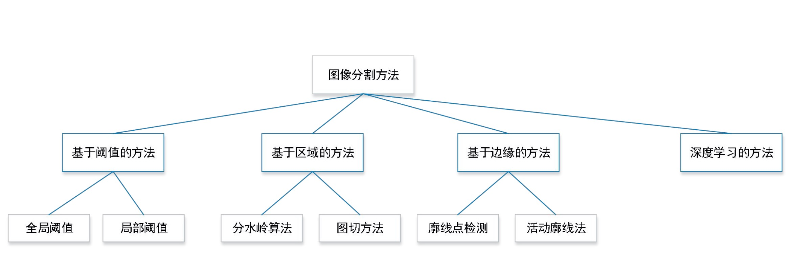
</div>

2 ）**发展**

- 图像分割是计算机视觉中非常重要的研究子领域
- 从计算机视觉和图像处理最开始发展的时候，图像分割方法就一直是探索的方法之一
- 经过长时间的发展，图像分割已经发展出了多类方法：基于阈值的方法，基于区域的方法，基于边缘的方法，基于深度学习的方法
- 基于阈值的方法是最基本也是历史比较长的方法，虽然简单直接，但在一些特殊领域中：光学字符识别应用非常广泛, 得到的效果也非常好
- 基于区域的方法又分为分水岭算法和图切方法
- 基于边缘的方法包括廓线点检测和活动廓线法：在检测行人的时候非常的有效
- 基于深度学习的方法

### 局部阈值法分割的基本思想

1 ） **全局阈值法的问题**

<div align="left" style="margin-left:50px;">
    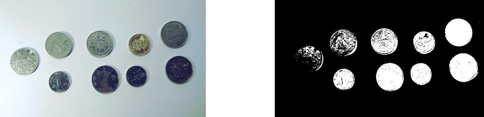
</div>

- 大津算法对应全局阈值法存在很多问题
- 左侧图是一些硬币放在光滑的表面上，由于环境光照的不均匀和硬币种类不同的影响，直接使用二值化方法进行分割，得到的图像又黑又白，而且有些有炫光
- 为了得到更好的效果，我们可以使用局部阈值法

<div align="left" style="margin-left:50px;">
    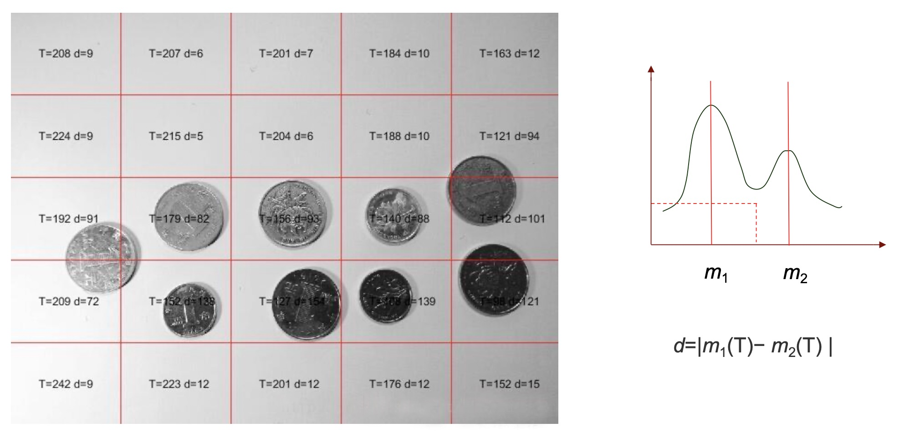
</div>

- 局部阈值法的基本思想是把多个图像分成若干个不同的区域, 如上图分成小一些的格子
- 在每个小格子中，我们认为它满足大津算法的条件，使用大津算法进行分割
- 在实际中我们要考虑一个问题，就是在格子中就没有我们要分割的目标
- 我们通常使用的方法是不仅仅计算阈值梯，还要计算对应的前景和背景它们的均值
- m1,m2如果它俩距离过近，那么它们分割并不明显, 如果图像没有前景，对应的是一个单峰的分布，就不用再做进一步的分割了
- 我们对每个格子，计算最优的阈值和均值之间的距离，如果均值之间的距离d小于一个指定的值，我们就认为这个格子里没有目标，反之，如果有目标，那么d就很大
- 进一步我们把对应每个格子局部阈值分割的结果放到一起，最终做一个二值化处理，就得到了我们最后的分割结果，明显效果要好得多, 如下图所示

<div align="left" style="margin-left:50px;">
    
</div>

2 ） **OpenCV对局域阈值法提供的实现**

- 自适应阈值分割
    * c++版本
        ```cpp
        void adaptiveThreshold( InputArray src, OutputArray dst, double maxValue, int adaptiveMethod, int thresholdType, int blockSize, double C );
        ```
      * `maxValue` : 阈值化后的最大值;
      * `adaptiveMethod` :计算阈值所采用的算法，有两个取值，分别为 `ADAPTIVE_THRESH_MEAN_C` 和 `ADAPTIVE_THRESH_GAUSSIAN_C`;
      * `blockSize` : 邻域块大小;
    * python版本
        ```python
        dst = cv.adaptiveThreshold( src, maxValue, adaptiveMethod, thresholdType, blockSize, C[, dst] )
        ```

### 分水岭算法

1 ）**基本思想**

- 是对区域生长算法的改进
- 左边的图，白色的地方灰度值明显要高，黑色的地方灰度值明显要低
- 右侧的图，是一个立体的图，白的地方(山脉和山脊)灰度值高，黑的地方(山谷)灰度值低
- 如果从山谷开始放水，比如从第一个山谷里放水，只要它不超过周围的山脊，它就会一点儿一点儿网上涨，涨到充分高的时候，开始漫过去到另一个山谷
- 在模拟中，我们设定一个涨水的边界条件, 我们就能区分它在不同的区域，这个也就是我们分水岭分割的一个基本思想

<div align="left" style="margin-left:50px;">
    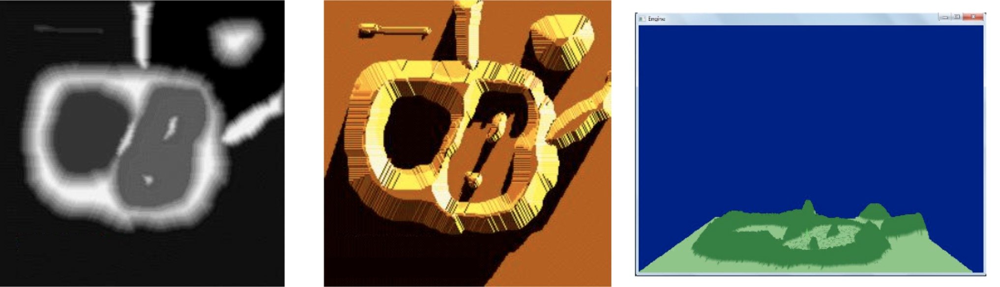
</div>

2 ）**对应灰度图的几何解释**

<div align="left" style="margin-left:50px;">
    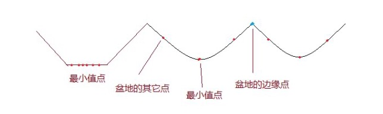
</div>

- **局部最小值点**，也就是漫水的初始点, 该点对应一个盆地的最低点(不仅仅是个点，还可能是个平面)，当我们在盆地里滴一滴水的时候，由于重力作用， 水最终会汇聚到该点。注意:可能存在一个最小值面，该平面内的都是最小值点。
- **盆地的其它位置点**，该位置滴的水滴会汇聚到局部最小点。
- **盆地的边缘点**，是该盆地和其它盆地交接点，在该点滴一滴水，会等概率的流向任何一个盆地。可以从改点做一个上下方向的线，分割两个盆地，我们形象称为分水岭
- 分水岭算法的执行过程是：我首先指定一系列的种子点，这些种子点是对应盆地的随机位置的点，采用类似区域生长的算法，将种子点不断向周围扩散, 模拟水不断浸入的过程
- 直到两片水合成一个的时候，我们对应的交线就是我们区域的边界

3 ）**分水岭算法的过分割问题**

<div align="left" style="margin-left:50px;">
    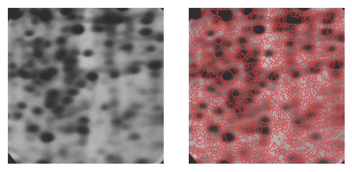
</div>

- 左侧是原始图像，右侧是分割结果，就像是马赛克片一样
- 由于噪声点或者其它干扰因素的存在，使用分水岭算法常常存在过度分割的现象，这是因为很多很小的局部极值点的存在

4 ）**解决过分割问题**

<div align="left" style="margin-left:50px;">
    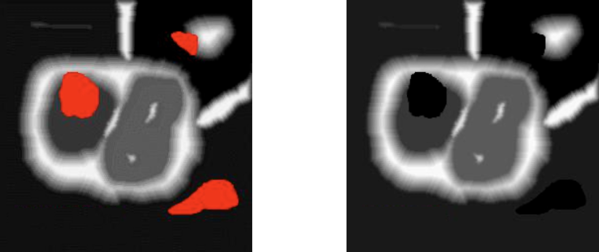
</div>

- 初始的时候种子点不是从一个点开始，而是从一堆点开始，这些点不仅位于谷底，而且位于谷底和盆地中间
- 为了解决过度分割的问题，可以使用基于标记(mark)图像的分水岭算法，就是指定mark图像(左侧图像)
- 在这个区域的洪水淹没过程中，水平面都是从定义的marker开始的，这样可以避免一些很小的噪声极值区域的分割。

5 ) **具体的动画图解**

<div align="left" style="margin-left:50px;">
    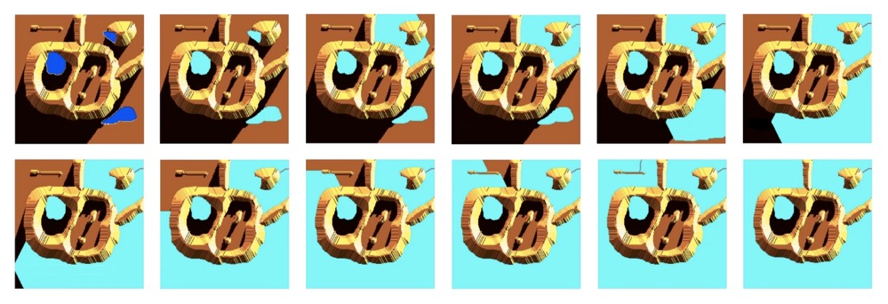
</div>

- 在我们做marker的时候，实际上就隐含着把多个过于细碎的分割认为是一个区域，并且把这些信息传递给了分割算法

6 ) **使用marker改善分割结果**

<div align="left" style="margin-left:50px;">
    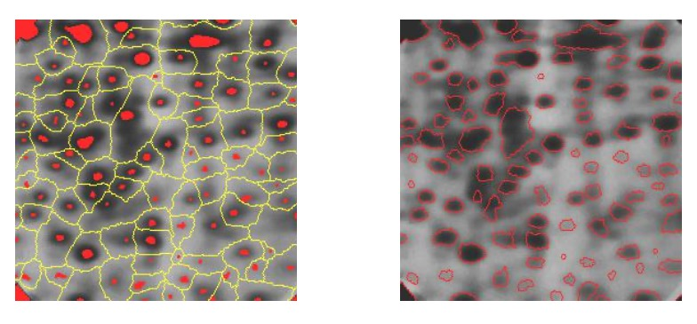
</div>

- 有效解决了过分割问题

7 ) **OpenCV实现**

- 分水岭图像分割
    * cpp版本
        ```cpp
        void watershed( InputArray image, InputOutputArray markers );
        ```
        * `image` : 三通道彩色图像;
        * `markers` :记号点(种子点)，每一个记号需要有不同的编号;

    * python版本
        ```python
        markers = cv.watershed( image, markers )
        ```

### 基于边缘轮廓的分割

1 ) **基本思想**

- 可以在边缘检测的基础上，基于闭合边缘构建分割后的结果
- 在分割前需要进行边缘检测, 很多时候还要使用其他方法得到二值化的分割结果
- OpenCV提供几种基于边缘轮廓的分割方法，包括简单的基于封闭曲线的方法，以及基于活动廓线(active contour的方法)
- 边缘轮廓搜索的方法，该算法基于Suzuki, S. 1985的方法，相对古老，但OpenCV基于此提供了关于图像描述的支持，比较好用
- 换句话说当我们得到搜索完的边缘以后，进一步我们可以计算对一个图像区域，它的各个描述的特征

<div align="left" style="margin-left:50px;">
    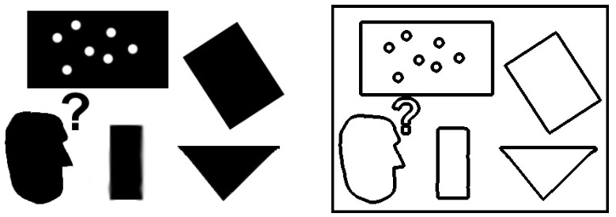
</div>

2 ） **OpenCV的支持**

- 画出目标轮廓
    * cpp版本
        ```cpp
        void findContours( InputOutputArray image, OutputArrayOfArrays contours, OutputArray hierarchy, int mode, int method, Point offset=Point());
        ```
        * `image` : 单通道图像矩阵，可以是灰度图，但更常用的是经过边缘检测算子处理后的二值图像; 
        * `contours` :定义为“vector<vector<Point>> contours”，是一个轮廓列表;
        * `hierarchy` : 存在嵌套轮廓时，分别为第i个轮廓的后一个轮廓、前一个轮廓、父轮廓、内嵌轮廓的索引编号;
        * `mode` : 定义轮廓的检索模式, 包括CV_RETR_EXTERNAL只检测最外围轮廓， CV_RETR_LIST检测所有轮廓，但不建立等级关系等;
        * `method` : 包括CV_CHAIN_APPROX_SIMPLE 仅保存轮廓的拐点信息，把所有轮廓拐点处的点保存入contours等;
        * `offset` : 所有的轮廓信息相对于原始图像对应点的偏移量, 缺省不设置。
    * python版本
        ```python
        image, contours, hierarchy = cv.findContours( image, mode, method[, contours[, hierarchy[, offset]]] )
        ```

3 ) **搜索轮廓组成轮廓树**

<div align="left" style="margin-left:50px;">
    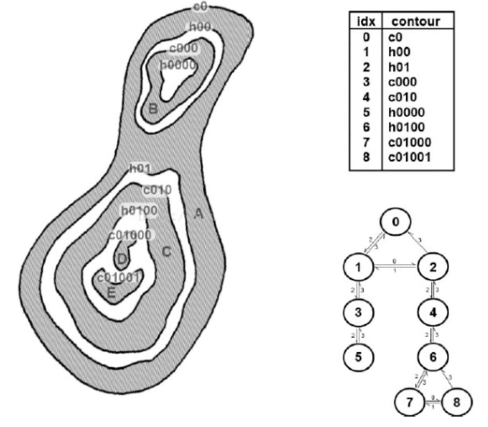
</div>

- 这个轮廓可以分为多层，最外层的轮廓给个索引是0， 
- 轮廓之间的关系可以用数来展开，顶层是0，下面的叶子节点是1，2
- 类似的可以把轮廓的结构来进一步描述
- 通用的描述是：一个轮廓和它的子轮廓可以构成一个轮廓树

4 ）**OpenCV提供了轮廓的不同表达方式**

<div align="left" style="margin-left:50px;">
    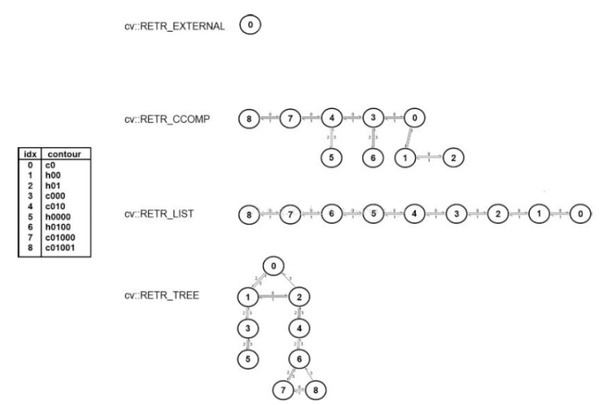
</div>

5 ) **OpenCV的相关函数实现**

- 画出目标轮廓
    * cpp版本
        ```cpp
        void drawCoutours(InputOutputArray image, // 用于绘制的输入图像 InputArrayOfArrays contours, // 点的vectors的vector int contourIdx, // 需要绘制的轮廓的指数 (-1 表示 "all")
        const Scalar& color, // 轮廓的颜色
        int thickness = 1, // 轮廓线的宽度
        int lineType = 8, // 轮廓线的邻域模式('4'邻域 或 '8'邻域) InputArray hierarchy = noArray(), // 可选 (从 findContours得到) int maxLevel = INT_MAX, // 轮廓中的最大下降
        Point offset = cv::Point() // (可选) 所有点的偏移
        )
        ```
    * python版本
        ```python
        image = cv.drawContours( image, contours, contourIdx, color[, thickness[, lineType[, hierarchy[, maxLevel[, offset]]]]] )
        ```

### 总结

- 局部阈值法的图像分割基于图像局部的自动阈值化，在每一个局部区域中应用二值化图像分割方法进行检测，避免光照不均导致的问题
- 分水岭算法是一类基于区域分割的改进算法，思想可以形象的由漫水上山头来描述
- 基于边缘的图像分割由闭合曲线描述区域，OpenCV中通过findContours函数支持，通过drawCoutours画出轮廓
