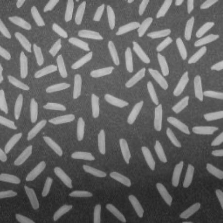

### 视觉算法开发的基本步骤

**任务**

<div align="left" style="margin-left:50px;">
    
</div>

**要求**

1. 检测图中所有米粒
2. 计算米粒面积、直径的直方图和方差

**解决思路**

1. 图像采集(取到图像)
    * 在示例只需要读一幅图片
    * 对于笔记本自带的摄像头，opencv提供支持，得到当前视频，返回当前帧
    * 工业摄像机比较麻烦, 通常不支持windows自带的支持流媒体的摄像头, 需要摄像头本身提供的sdk单独做一个程序, 采集图像
2. 图像预处理
    * 滤波，缩放，增强等操作
3. 基于灰度的阈值分割
    * 为了得到我们的目标
4. 图像特征描述及目标分析
    * 为了计算所有米粒的面积和直径，得到方差和均值
5. 得到最终结果
    * 用某种方式标记出米粒

**具体实现**

1. findContours函数通常在图像阈值化分割之后使用，能够提取出图像所有的轮廓
2. 得到轮廓后可以进一步通过下面的函数来得到区域对应的描述
    * D-P法多边形拟合 
        ```cpp
        // c++版本
        void approxPolyDP( InputArray curve, OutputArray approxCurve, double epsilon, bool closed );
        ```

        ```python
        # python 版本
        approxCurve = cv.approxPolyDP( curve, epsilon, closed[, approxCurve] )
        ```
    * 计算轮廓线长度
        ```cpp
        // c++版本
        double arcLength(InputArray curve, bool closed );
        ```

        ```python
        # python 版本
        retval = cv.arcLength( curve, closed )
        ```
    * 计算轮廓面积
        ```cpp
        // c++版本
        double contourArea( InputArray contour, bool oriented=false );
        ```

        ```python
        # python 版本
        retval = cv.contourArea( contour[, oriented] )
        ```
    * 计算轮廓包围矩形(水平的)
        ```cpp
        // c++版本
        Rect boundingRect( InputArray points );
        ```

        ```python
        # python 版本
        retval = cv.boundingRect( array )
        ```
    * 计算轮廓包围矩形(斜的)
        ```cpp
        // c++版本
        RotatedRect minAreaRect ( InputArray points );
        ```

        ```python
        # python 版本
        retval = cv.minAreaRect( points )
        ```
    * 计算轮廓拟合椭圆
        ```cpp
        // c++版本
        RotatedRect fitEllipse( InputArray points );
        ```

        ```python
        # python 版本
        retval = cv.fitElllipse( points )
        ```

### 使用OpenCV完成图像分割具体实现

**c++版本**

关键代码

```cpp
void main() {
    char *fn = "rice.jpg";
    Mat image = imread(fn);

    Mat gray, bw; // 二值化后的图像

    // 因为threshold只支持灰度图像，所以先转换之
    cvtColor(image, gray, COLOR_BGR2GRAY);
    // 指定大津算法作为参数来完成全局阈值化
    threshold(gray, bw, 0, 0xff, CV_THRESH_OTSU);
    // 形态学处理，使用开运算来去除噪声，开运算可把两个区域之间虚假的噪声连线分隔开
    Mat element = getStructuringElement(MORPH_CROSS, Size(3, 3));
    morphologyEx(bw, bw, MORPH_OPEN, element);
    // morphologyEx(bw, bw, MORPH_CLOSE, element);

    // 以下是图像分割
    Mat seg = bw.clone();
    // 这里是二维vector的一系列的点
    vector<vector<Point>> cnts;
    // 通过findCoutours函数得到二值化以后的边缘
    findCoutours(seg, cnts, RETR_EXTERNAL, CHAIN_APPROX_SIMPLE);

    // 以下进行筛选 进一步对每个区域进行处理，换句话说有多少粒米，循环执行多少次
    for(int i = cnts.size() - 1; i >= 0; i--) {
        vector<Point> c = cnts[i];
        // 计算当前目标的面积
        area = contourArea(c);
        // 滤除面积小于10的分割结果：可能是噪声
        if(area < 10) {
            continue;
        }
        count++; // 统计米粒数量
        cout << "blob " << i << " : " << area <<endl;
        // 合理的目标 使用boundingRect得到外接矩形
        rect = boundingRect(c);
        // 在原始图像上画出包围矩形，并给出每个矩形标号 这样可以从图像中看出我们比较明显的分割结果
        rectangle(image, rect, Scalar(0, 0, 0xff), 1);

        stringstream ss;
        ss << count;
        ss >> strCount;
        // putText函数在每个米粒上做一个标号，表示我们已经成功分离出来了
        putText(image, strCount, Point(rect.x, rect.y), CV_FONT_HERSHEY_PLAIN, 0.5, Scalar(0, 0xff, 0))
    }
}

```

**python版本**

```python
import cv2 as cv
import copy

filename = 'rice.jpg'
image = cv.imread(filename)
# 彩色转换灰度，因为我们看到的图像在windows下的表示通常是彩色的
# 在windows下，不管我们看到的是灰度还是彩色的，大多数下它本质是一个三通道的彩色图
gray = cv.cvtColor(image, cv.COLOR_BGR2GRAY)
# 使用大津算法对灰度图像进行自动阈值化，图像中可能会存在一些噪声，同时有一些米粒可能粘贴在一起
_, bw = cv.threshold(gray, 0, 0xff, cv.THRESH_OTSU)
element = cv.getStructuringElement(cv.MORPH_CROSS, (3,3))
# 使用数学形态学的开运算，减少噪声和米粒的粘连
bw = cv.morphologyEx(bw, cv.MORPH_OPEN, element)

# 为了对图像进行分割，首先对结果进行一次拷贝
seg = copy.deepcopy(bw)
# 使用findContours得到分割后各个区域对应的轮廓集合 cnts
bin, cnts, hier = cv.findContours(seg, cv.RETR_EXTERNAL, cv.CHAIN_APPROX_SIMPLE)
count = 0

# 对所有轮廓进行循环
for i in range(len(cnts), 0, -1):
    # 得到当前轮廓
    c = cnts[i-1]
    # 计算轮廓对应的面积
    area = cv.contourArea(c)
    # 小于10的当做噪声，不去记入最终米粒，可能是噪声，不满足我们的条件，10这个参数可在实际中根据米粒的大小来调节
    if area > 10:
        continue
    count = count + 1
    # 打印出这个区域对应的面积
    print("blob", i, " : ", area)
    # 得到区域轮廓对应的包围矩形
    x, y, w, h = cv.boundingRect(c)
    # 在原始图像上用带颜色的方框画出包围矩形
    cv.rectangle(image, (x,y), (x+w, y+h), (0, 0, 0xff), 1)
    cv.putText(image, str(count), (x, y), cv.FONT_HERSHEY_PLAIN, 0.5, (0, 0xff, 0))

print("米粒数量：", count)
cv.imshow("原图"， image)
cv.imshow("阈值化图", bw)

cv.waitKey()
cv.destroyAllWindows()
```