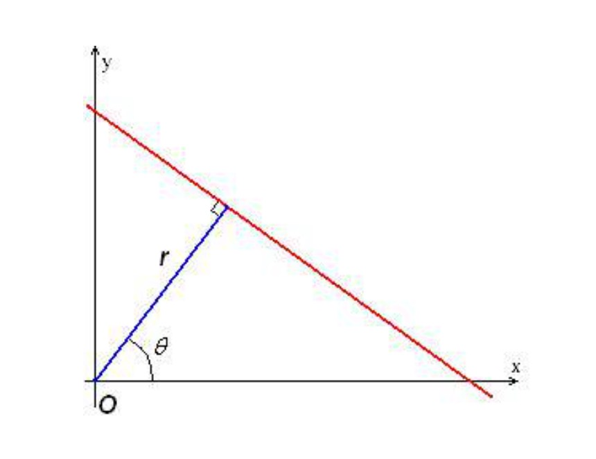
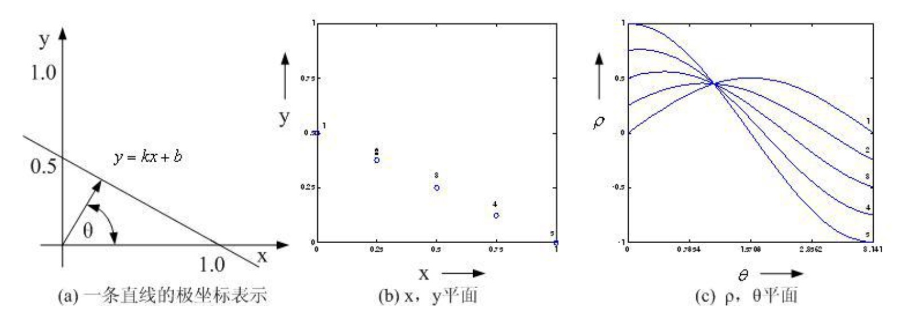
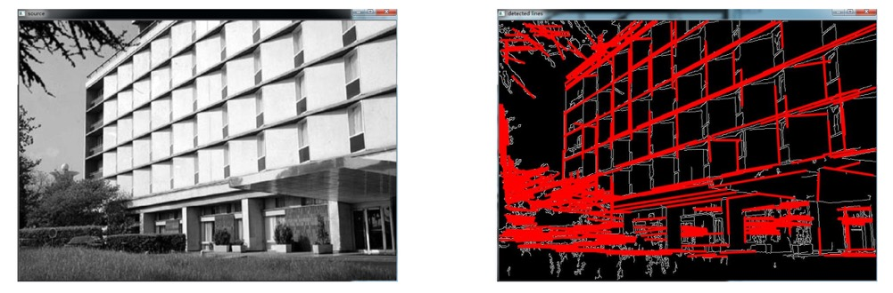

### 为什么要检测直线

- 直线是非常重要的几类图像特征
- 人眼可以识别，计算机并不知道
- 我们的任务是让计算机算出来这是一条直线：检测图像中的直线并输出对应的方程

###  Hough变换

- 采用参数空间变换的方法，对噪声和不间断直线的检测具有鲁棒性
- 核心思想：直线 $y = kx + b$, 每一条直线对应一个k,b, 极坐标下对应一个点$(\rho, \theta)$
- 注：$\rho$是直线距离原点的距离(直线的过原点的垂线), $\theta$是这条垂线与x轴的夹角

<div align="center">
    
</div>

- 换句话说，直角坐标系下的每一条直线在极坐标(参数空间)下对应一个点, $(\rho, \theta)$
- 直角坐标系的一点(x,y), 对应极坐标系下的一条正弦曲线 $\rho = xcos \theta + ysin \theta$
- 因为$\rho = xcos \theta + ysin \theta = \sqrt{x^2 + y^2} cos(\theta + \psi)$
    * $\psi$ 是初始的向角
- 同一条直线上的多个点, 在极坐标系下必相交于一点，如图所示：

<div align="center">
    
</div>

- 极坐标系下越多的曲线交于一点，说明对应的曲线在直角坐标系下它的像素就越多，极坐标下的这个交点一定对应原始图像(直角坐标系)中的一条直线
- 相反，极坐标系下只有一两个曲线对应的交点，我们可以认为是孤立的点或噪声，我们就不用考虑了
- 将$(\rho, \theta)$ 空间(实际上一个平面)量化成许多小格
- 根据$x-y$平面(直角坐标系下的)每一个直线点带入$\theta$的量化值，算出各个$\rho$，将对应格计数累加
- 换句话说，在原始的图像中，经过边缘提取可以得到一系列的边缘点，进一步我们把每个边缘点都转换成$(\rho, \theta)$参数空间下的余弦曲线方程，将余弦曲线带入到$(\rho, \theta)$平面后，得到一个对应的曲线。也就是说，如果我们有100个边缘点，那么对应$(\rho, \theta)$空间中我们就有100个余弦曲线
- 在$(\rho, \theta)$空间中的小格中可能有多个余弦曲线相交，有多少条曲线相交，我们就在这个格子里做一个计数
- 当所有直角坐标系下的边缘点完成变换以后, 我们对$(\rho, \theta)$平面下的小格进行检验
- 设置累计阈值T,计数器大于T的小格，那么这个小格，对应于共线点，它的中心点对应的参数，在原始图像中对应一条直线，这个参数可以用作直线拟合。小于T的小格反映了非共线点，丢弃不用
- 而合格的每条线段对应的长度，就是我们格子中的计数值记录的像素数
- 为什么我们要在极坐标系下的$(\rho, \theta)$空间做这件事呢? 直接在直角坐标系下的k,b两个参数进行离散化, 比如以k作为横坐标,b作为纵坐标，化成很多格子进行统计不行么？在这里使用k,b进行统计，k和b的变化范围都是$(-∞, ∞)$, 变换到$(\rho, \theta)$空间后, $\theta$的取值是$(0,2π)$, 而$\rho$ 不会超过原始图像对角线的长度。这样，我们就非常容易做格子的划分，更合理
- Hough变换把原始图像中具有参数的形状转换到对应的参数空间中, 进行个数的累积, 还可用于检测圆、椭圆和其他参数形状
- Hough变换在参数空间中，使用了划分格子，以及对每个格子中出现的个数进行统计的方式叫做**投票**

### OpenCV实现

- 标准Hough变换
    ```cpp
    void HoughLines( InputArray image, OutputArray lines, double rho, double theta, int threshold,
    double srn = 0, double stn = 0, double min_theta = 0, double max_theta = CV_PI );
    ```

- 累计概率Hough变换(效果更好)
    ```cpp
    void HoughLinesP( InputArray image, OutputArray lines, double rho, double theta, int threshold,
    double minLineLength = 0, double maxLineGap = 0 );
    ```

检测示例

<div align="center">
    
</div>

- 从结果来看，水平边缘检测都比较好, 垂直的边缘效果一般, 同时在树这里出现了大量的误点
- 楼上的垂直边缘灰度有一个渐变, 灰度变化不明显, 在边缘检测的基础上进行的Hough变换其效果也不好
- 树这里纹理比较杂乱, 有大量的细碎的横竖边缘, 造成了大量的误检
- 在实际中使用Hough变换往往需要在事先和事后进行预处理和后处理才能得到我们比较满意的结果