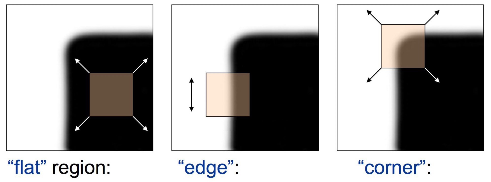
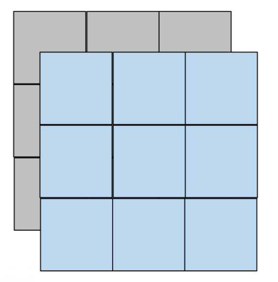
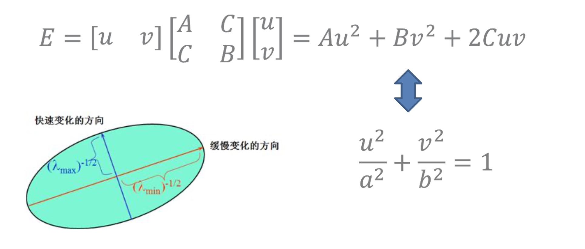
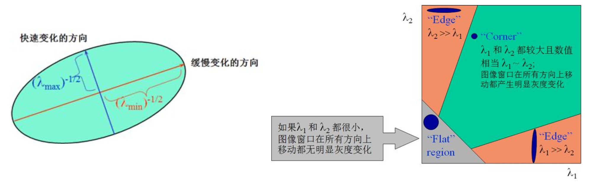
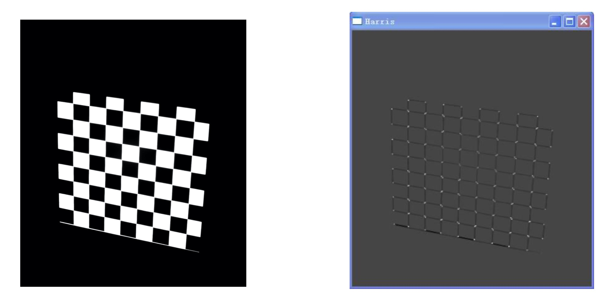
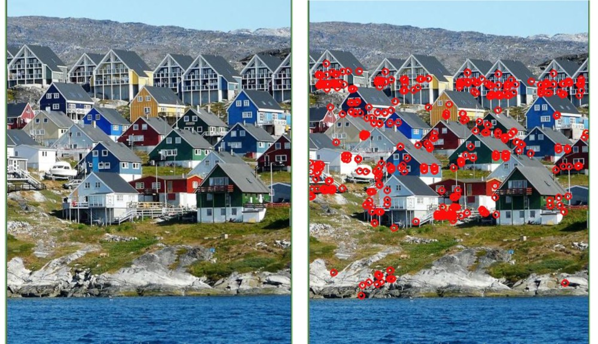

### 角点检测概述

- 角点和直线一样，在自然中重要的一类特征，角点的应用比直线要多一些
- 在2.5维视觉和三维视觉中广泛应用，包括日常中的全景拼接都是以角点检测作为基础的

### Harris算子原理

- 通过小方块的所在区域和移动来描述
- 在灰度变化平缓区域，窗口内像素**灰度积分**(灰度累加值)近似保持不变 
- 在边缘区域，上下移动(边缘方向移动)灰度积分近似不变，其余任意方向剧烈变化
- 在角点处，任意方向移动，灰度积分值均剧烈变化

<div align="center">
    
</div>

- 定义灰度积分变化
    * $I(x,y)$ 对应灰色图像
    * $I(x+u,y+v)$ 对应蓝色图像
    * u,v对应在x,y方向上平移的分量
    * 将蓝色和灰色图像示例代表的灰度值相减
    * 加个平方是为了不区分正负, 便于计算
    * 然后对这些差值进行累加计算
    * w(x,y)是权值
$$
E(u,v) = \sum_{x,y} w(x,y)[I(x+u,y+v) - I(x,y)]^2
$$

<div align="center">
    
</div>

- 进一步我们使用数学中的泰勒展开, 先不考虑权值

$$
\sum [I(x+u,y+v) - I(x,y)]^2
$$

$$
\approx \sum [I(x,y) + uI_x + vI_y - I(x,y)]^2
$$

$$
= \sum u^2I_x^2 + 2uvI_xI_y + v^2I_y^2
$$

$$
= \sum \begin{bmatrix} u & v \end{bmatrix} \begin{bmatrix} I_x^2 & I_xI_y \\ I_xI_y & I_y^2 \end{bmatrix} \begin{bmatrix} u \\ v \end{bmatrix}
$$

$$
= \begin{bmatrix} u & v \end{bmatrix} (\sum \begin{bmatrix} I_x^2 & I_xI_y \\ I_xI_y & I_y^2 \end{bmatrix}) \begin{bmatrix} u \\ v \end{bmatrix}
$$

- 如果u, v很小, 则有

$$
E(u,v) \cong [u,v] M \begin{bmatrix} u \\ v \end{bmatrix}
$$

$$
M = \sum_{x,y} w(x,y) \begin{bmatrix} I_x^2 & I_xI_y \\ I_xI_y & I_y^2 \end{bmatrix}
$$

- 权值的作用：在前面举例用到的窗口是3 * 3规格的，在计算角点的时候，我们往往考虑3 * 3窗口的中心点是不是我们最终要检测的角点, 这样越往边上对我们中心点的影响就越小, 这里$w(x,y)$是权重的系数，它标志着我们检测角点时，计算的方格内的灰度累加值，越往边上它的贡献值越小

- 只有灰度积分在任意方向变化比较剧烈时，我们才认为它是一个角点，我们接下来要度量，怎么知道$E(u,v)$沿着任意的方向变化都比较剧烈

- E是一个二次型，即

<div align="center">
    
</div>

- 上图$Au^2 + Bv^2 + 2Cuv$是一个对应椭圆的方程, 忽略参数$2Cuv$和下面的方程可以相互转换
- A越大, a越小，形成反比例的关系
- 椭圆图上的橙色和蓝色的两个轴对应的是a和b, 比如轴a越短，对应的A越大，说明E变化的越快速, 所以蓝色轴短代表它对应快速变化的方向
- $2Cuv$是u和v的耦合项，对应了坐标旋转，导致了椭圆的歪
- 从2 * 2的矩阵M中分离出A和B, 分离的方式是采用特征值分解, 进一步可以证明对应2 * 2的矩阵M 有两个特征值$\lambda_1$、$\lambda_2$
- $\lambda_1^{-1/2}$ 和 $\lambda_2^{-1/2}$ 是椭圆的长短轴
    * 当$\lambda_1, \lambda_2$都比较小时, 点$(x,y)$ 处于灰度变化平缓区域
    * 当$\lambda_1 >> \lambda_2$ 或者 $\lambda_1 << \lambda_2$时，说明一个方向变化剧烈，点$(x,y)$为边界像素
    * 当$\lambda_1, \lambda_2$都比较大，且近似相等时，有个比较小的u,v, E值就会产生比较大的变化, 点$(x,y)$为角点

- 在实际应用中$\lambda_1$ 和 $\lambda_2$ 的小和大比较抽象, 在实际计算时，就会出现问题, 不同场景中有不同的结果, 我们希望一个智能自动的算法，Harris提出了一个角点响应函数的概念

<div align="center">
    
</div>

- 使用角点响应函数

$$
R = detM - k(traceM)^2
$$

$$
traceM = \lambda_1 + \lambda_2
$$

$$
detM = \lambda_1 \lambda_2
$$

- 当R接近于零时，处于灰度变化平缓区域
- 当R<0时，点为边界像素
- 当R>0时，点为角点
- k是一个经验性的系数，通常取值0.04~0.45

### OpenCV实现

- c++版本
    ```cpp
    void cornerHarris(InputArray src, OutputArray dst,
    int blockSize, int ksize, double k, int borderType=BORDER_DEFAULT );
    ```
    * `src`，输入图像，即源图像，填Mat类的对象即可，且需为单通道8位或者浮点型图像
    * `dst`，函数调用后的运算结果存在这里，即这个参数用于存放Harris角点检测的输出结果，和源图片有一样的尺寸和类型
    * `blockSize`，表示邻域的大小，更多的详细信息在cornerEigenValsAndVecs中有讲到
    * `ksize`，表示Sobel()算子的孔径大小
    * k，Harris参数
    * `borderType`，图像像素的边界模式，注意它有默认值BORDER_DEFAULT。更详细的解释，参考borderInterpolate函数

- python版本
    ```python
    dst = cv.cornerHarris( src, blockSize, ksize, k[, dst[, borderType]] )
    ```

### 示例

1 ） 棋盘格

<div align="center">
    
</div>

- 棋盘格是一类比较好的测试角点检测的测试图像
- 它的角点是非常的清晰，角点检测算子应该对棋盘格得到一个比较准确的结果
- 在右边每个对应的白点就是检测的结果，没有漏检和误检

2 ） 房屋

<div align="center">
    
</div>

- 右图每个红圈对应我们的角点检测结果
- 左侧图的角点在右边基本都能够检测出来
- 在石头的位置出现了误检
- 在窗户上有一些漏检
- 所以对于真实场景，Harris角点检测有进一步提高的地方

### 总结

- Harris角点检测算子的角点定义是在角点位置通过一个小窗口，在小窗口内部的灰度积分在任意方向的变化都比较剧烈
- 进一步检测灰度变化是否剧烈, 采用了对矩阵M计算特征值的方法
- 使用角点响应函数计算当前点是否是角点
