### SIFT概述

- SIFT的全称是Scale Invariant Feature Transform(尺度不变特征变换)，是由加拿大教授David G.Lowe在1999年在 会议文章中提出，2004年发表在IJCV上
- 是计算机视觉界近二十年来引用率最高的文章之一
- SIFT特征对旋转、尺度缩放、亮度变化等保持不变性，是一种稳定的局部特征
- SIFT的特征提取方面对计算机视觉近年来的发展影响深远，特别是几乎影响到了后续所有的角点提取和匹配算法
- 图像的局部特征，对旋转、尺度缩放、亮度变化保持不变，对视角变化、仿射变换、噪声也保持一定程度的稳定性
- SIFT变换最后提取出来的不仅仅是一个角点，实际上是一个特征描述子，是一个高维的向量
- 独特性好，信息量丰富，适用于海量特征库进行快速、准确的匹配
- 改进后的SIFT算法可以达到时时计算的速度
- 多量性:即使是很少几个物体也可以产生大量的SIFT特征 
- 高速性:改进的SIFT匹配算法甚至可以达到实时性
- 扩展性:可以很方便的与其他的特征向量进行联合，形成一个新的特征描述

### 尺度空间

- 人眼可自动调节尺度，完成对物体的检测和识别，我们看一个图片时会看图片的整体，进一步我们会看我们感兴趣的局部，人眼会自动调整看到的尺度
- 模仿人的视觉认知，把物体不同尺度下的图像(多个不同分辨率的图像)都提供给机器，让机器能够对物体在不同的尺度下综合信息识别
- 因此，首先需要建立尺度空间
- 通过高斯函数与原图像卷积，并经过下采样，可建立原始图像的尺度空间模型

### 二维高斯函数

- 我们使用的是图像，因此我们考虑二维高斯函数
- 高斯模糊是一种图像滤波器，它使用高斯函数计算模糊模板，并使用该模板与原图像做卷积运算，达到模糊图像的目的。
- 如二维模板大小为m * n(实际中会使用方形，n * n)，则模板上的元素(x, y)对应的高斯计算公式为:

$$
G(x,y) = \frac{1}{2π\sigma^2} e^{-\frac{(x-m/2)^2 + (y-n/2)^2}{2\sigma^2}}
$$

- 其中，$\sigma$是正态分布的标准差，$\sigma$值越大，图像越模糊(平滑)。r为模糊半径，模糊半径是指模板元素到模板中心的距离。
- 在正态分布，通常考虑的是$2.5 ~ 3\sigma$之外的数就可以忽视，对于$\sigma = 1$时，r通常为 2.5 ~ 3，实际中，图像里r取整数像素

### 二维高斯函数

- 在二维空间中，这个公式生成的曲面的等高线是从中心开始呈正态分布的同心圆。
- 在实际应用中，在计算高斯函数的离散近似时，在大概3σ距离之外的像素都可以看作不起作用，这些像素的计算也就可以忽略。
- 对应σ参数的高斯函数，图像处理程序只需要计算$(6σ+1)×(6σ+1)$的矩阵(滤波器的大小)就可以保证相关像素影响，这个滤波器的半径就是3σ

    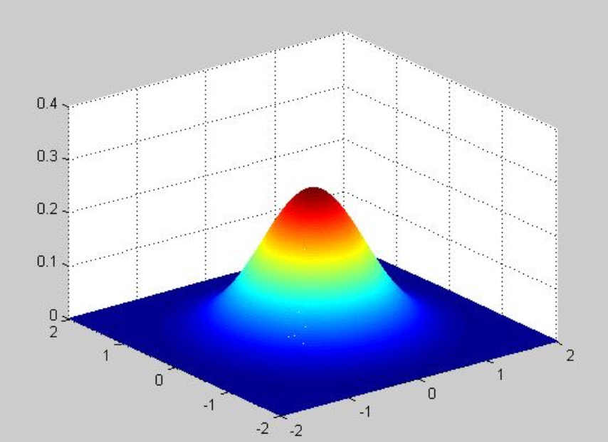

- 根据σ的值，计算出高斯模板矩阵的大小, $(6σ+1)*(6σ+1)$，使用公式$G(x,y) = \frac{1}{2π\sigma^2} e^{-\frac{(x-m/2)^2 + (y-n/2)^2}{2\sigma^2}}$
- 计算高斯模板矩阵的值，与原图像做卷积，即可获得原图像的高斯模糊图像。为了确保模板矩阵 中的元素在[0,1]之间，需将模板矩阵归一化。
- 下图是5 * 5的高斯模板卷积计算示意图，高斯模板是中心对称的。在5 * 5的高斯滤波器上, 它的半径是2
- 当高斯滤波器作用到图像的边缘时，如图所示，左上角滤波器的中点作用于图像的第一个像素，其中一部分滤波器已经出到图像的外面了, 没法算, 有一种方式是我们对图像进行扩展
- 为了使滤完波以后的图像和原始图像大小一致，我们必须对原始图像进行扩展，假设滤波器的半径是r, 那么扩展后对应的图像应该是(n+2r)(n+2r)

    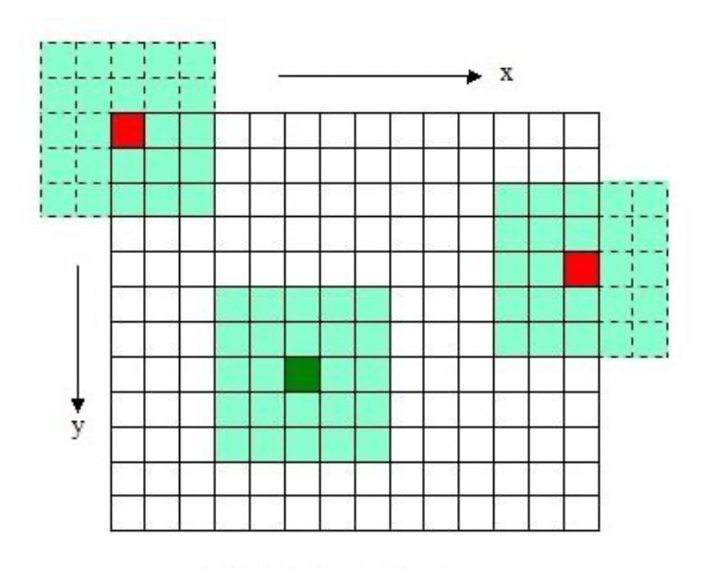

### 二维高斯模糊效果图

    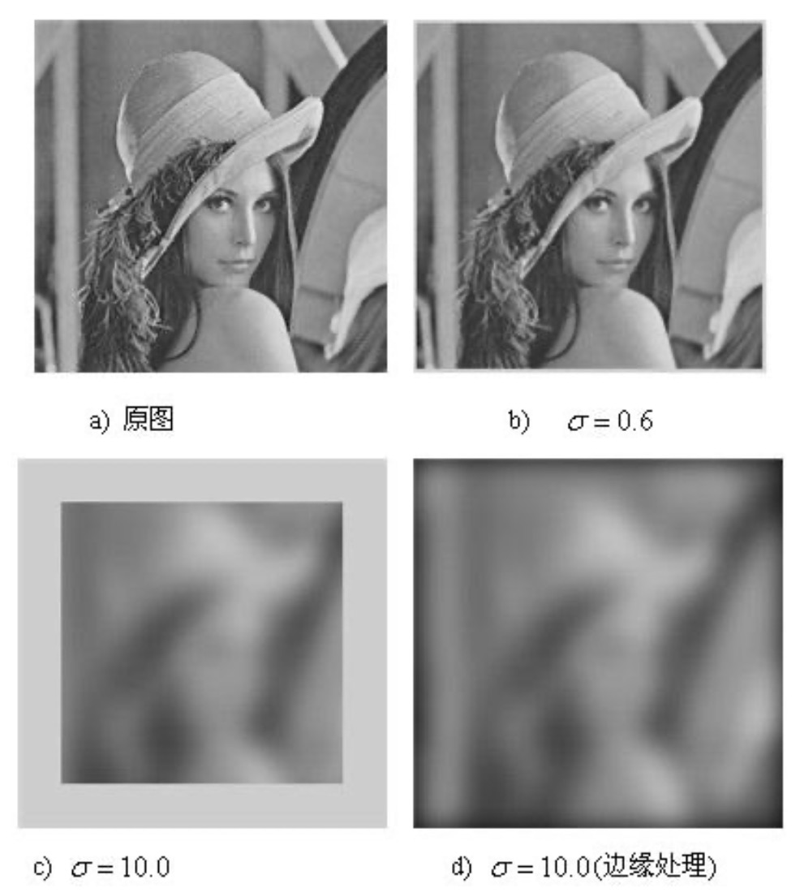

- 当σ比较小,处理后和处理前变化几乎不大，当σ=10时, 高斯模糊的图像已经偏离原始图像很大了, 同时边上一圈灰色是因为我们没有使用图像的扩展，导致了缺少像素
- 进一步采用边缘扩展，处理后的结果和原始图像是一样大小的
- 使用二维的高斯模板达到了模糊图像的目的，但是会因模板矩阵的关系而造成 边缘图像缺失(b,c)。σ越大，缺失像素越多, 丢弃模板会造成黑边(d)
- 更重要的是当图片变大时，高斯模板(高斯核)和卷积运算量将大幅度提高。根据高斯函数的可分离性，可对二维高斯模糊函数进行改进

### 分离高斯模糊

- 高斯函数的可分离性是指使用二维矩阵变换得到的效果也可以通过在水平方向进行一维高斯矩阵变换加上竖直方向的一维高斯矩阵变换得到
- 两次一维的高斯卷积将消除二维高斯矩阵所产生的边缘
- 其中$e^{-\frac{(x-m/2)^2 + (y-n/2)^2}{2\sigma^2}}$ 可分解为 $e^{-\frac{(x-m/2)^2}{2\sigma^2}} e^{-\frac{(y-n/2)^2}{2\sigma^2}}$
- 也就是说，在实际操作时，可以首先使用一个只有水平的高斯滤波器对原始图像进行处理，进一步再使用只有垂直方向的高斯滤波器对图像进行处理
- 比如采用5 * 5的高斯模糊函数, 如果采用二维的处理方式，每个卷积要做$5 * 5 = 25$次乘和加；如果采用先水平后垂直的方式，合起来只需要做10次了

    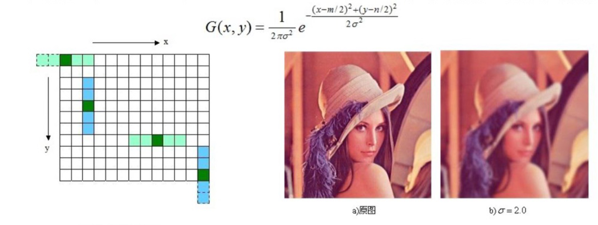

### 尺度空间理论

- 在引入尺度空间的概念后，一个图像不止是二维的，而且拥有尺度的维度, 尺度空间是在传统的图像信息处理模型中，引入一个新的参数：尺度

- 在图像信息处理模型中引入一个被视为尺度的参数，通过连续变化尺度参数获得多尺度下的尺度空间表示序列，进一步对这些序列进行尺度空间主轮廓的提取(轮廓的提取，极值的提取)，并以该主轮廓作为一种特征向量，实现边缘、角点检测和不同分辨率上的特征提取等。它模拟了人在不同距离看目标这种方式，它模拟了人在不同距离看目标的方式，也就是从近到远，这个目标在视网膜上整体的形成过程

- 尺度空间方法将传统的单尺度图像信息处理技术纳入尺度不断变化的动态分析框架中，更容易获取图像的本质特征。尺度空间中各尺度图像的模糊程度逐渐变大，能够模拟人在距离目标由近到远时目标在视网膜上的形成过程。

### 高斯金字塔的构建

- 是一类特殊的视图空间的构建：高斯金字塔

- 高斯金字塔的构建是不断的采用高斯模糊函数，它整个构建的结果像一个金字塔的形状

- 尺度空间在实现时使用高斯金字塔表示，高斯金字塔的构建分为两部分
    * 对图像做不同尺度的高斯模糊
    * 对图像做降采样(隔点采样)

- 图像的金字塔模型是指，将原始图像不断降阶采样，得到一系列大小不一的图像，由大到小，从下到上构成的塔状模型

- 通常进行下采样(降采样)的时候，采样间隔是2
- 在第一行中，第一点采一次，第三点采一次...
- 在第三行, 第一点采一次，第三点采一次...
- ...
- 采完全部的图像形成了一个下采样之后的图像，行和列都是隔一个采一个，所以我们得到的图像是原始图像长和宽的一半
- 所以在金字塔上每一层都是下一层的一半大小

    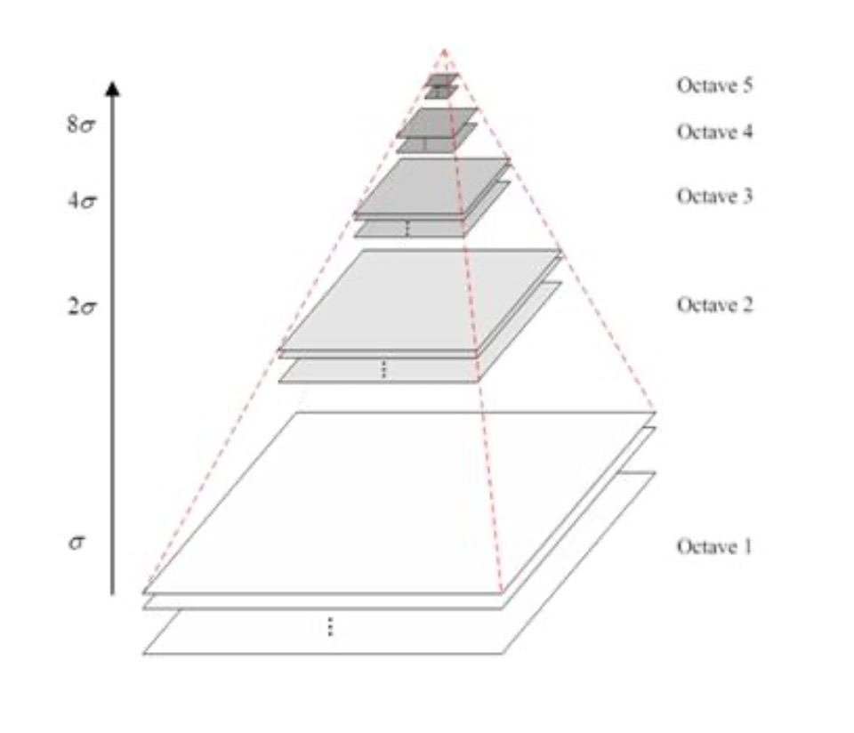

- 原图像为金子塔的第一层，每次降采样所得到的新图像为金字塔的一层(每层一张图像)，每个金字塔共n层。金字塔的层数根据图像的原始大小和塔顶图像的大小共同决定
- 我们取原始图像宽和高最小的那个, 然后把它对2去对数，最后算出来的n就是金字塔最多能够到达的层数，通常M和N是相等的
- 其计算公式如下: $n = log_2\{ min(M,N) - t, t \in [0, log_2\{ min(M,N) \}] \}$
- 其中M，N为原图像的大小, t为塔顶图像的最小维数的对数值。如，对于大小为512 * 512的图像，当塔顶图像为4 * 4时，n=7，当塔顶图像为2 * 2时，n=8
- 采用这种特定方式，每一层都是下一层的一半，也就是二分这种方式建立的图像金字塔, 因为每一层金字塔相差2倍, 所以这个金字塔不是很连续, 进一步我们可以建立一个更连续的金字塔

### 尺度空间的形象描述

    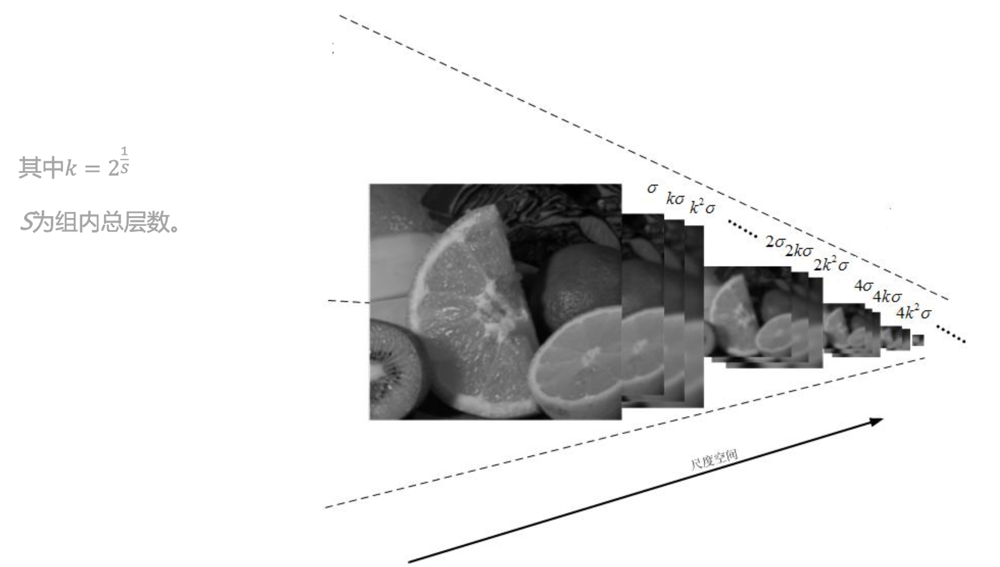

- 一个图像的尺度空间L(x,y,σ), 注意这里, 原始图像是(x,y), 这里我们加入了第三个参数σ, 对应我们的尺度参数, 定义为一个变化尺度的高斯函数G(x,y,σ)与原图像l(x,y)的卷积
- L(x,y,σ) = G(x,y,σ) * I(x,y), 其中*表示卷积运算

$$
G(x,y,s) = \frac{1}{2πσ^2} e^{\frac{(x-\frac{m}{2})^2 + (y-\frac{n}{2})^2}{2σ^2}}
$$

- σ是尺度空间因子，值越小表示图像被平滑的越少, 相应的尺度也就越小。大尺度对于图像的概貌特征, 小尺度对应于图像的细节特征

- 为了让尺度体现其连续性，高斯金字塔在简单降采样的基础上加上了高斯滤波。如下图所示，将图像金字塔每层的一张图像使用不同参数做高斯模糊，使得金字塔的每层含有多张高斯模糊图像，将金字塔每层多张图像合称为一组(Octave)，金字塔每层只有一组图像，组数和金字塔层数相等，使用公式 $n = log_2\{ min(M,N) - t, t \in [0, log_2\{ min(M,N) \}] \}$ 计算，每组含有多层(Interval)图像

    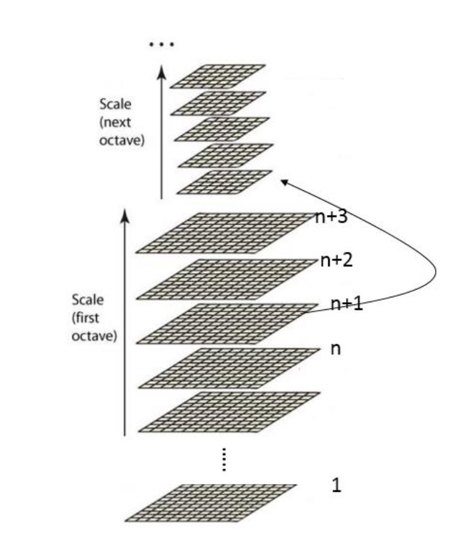

- 在一组的图像内，每一层之间的高斯模糊的尺度因子的比值为 $k = 2^{\frac{1}{S}}$，其中S为每组尺度数
- 于是同一组的第s层高斯模糊尺度$σ(s)$就变成了$σ(s) = σ_0 * k^{(s-1)}$
- 这里$σ_0$是这一组的第一层图像的高斯模糊尺度。第n+1组的图像，它的高斯模糊尺度是$2σ_0$，这个图像的高斯模糊带到了下一组的第一层图像中去，于是不同组相同层的高斯模糊尺度是2倍关系。如图所示

    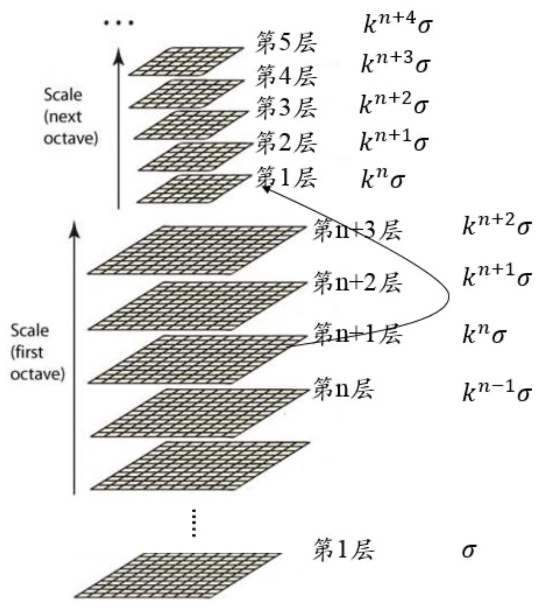

### 高斯差分金字塔

- 2002年Mikolajczyk在详细的实验比较中发现尺度归一化的高斯拉普拉斯函数(LoG算子$▽^2G$), 经过尺度归一化后, 也就是前面乘上$σ^2$: $σ^2▽^2G$的极大值和极小值与其它特征提取函数如Hessian或Harris角特征相比，能够产生最稳定的图像特征。其中D(x,y,σ)(尺度差分算子)和$σ^2▽^2G$(归一化的LoG算子)的关系可以从如下公式推导得到:

$$
\frac{\partial G}{\partial\sigma} = \sigma▽^2G
$$

- 利用差分近似代替微分，则有

$$
\sigma▽^2G = \frac{\partial G}{\partial \sigma} \approx \frac{G(x,y,k\sigma) - G(x,y,\sigma)}{k\sigma - \sigma}
$$

- 因此, $G(x,y,k\sigma) - G(x,y,\sigma) \approx (k-1) \sigma^2▽^2G$
- 在尺度乘上一个系数后, $G(x,y,k\sigma) - G(x,y,\sigma)$ 也就是相邻两个尺度之间的图像的差分近似等于LoG算子前面乘上一个系数k-1
- 换句话来说，我们可以在尺度空间中计算差分, 也就是计算D(x,y,σ) 近似的替代归一化的LoG的结果
- 其中k-1是个常数，并不影响极值点位置的求取

    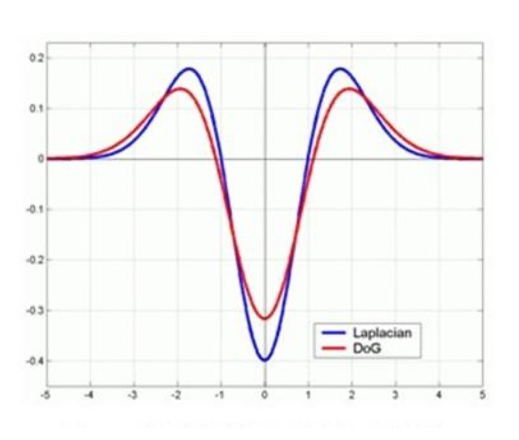

- 如图所示，红色曲线表示的是高斯差分算子(Difference of Gaussian，简称DoG)， 而蓝色曲线表示的是高斯拉普拉斯(LoG)算子。
- 从形状上来说两个形状非常类似, 这也意味着我们前面的近似是有效的
- 用DoG代替LoG是因为LoG对应的滤波器的半径比较大, 在计算时效率比较低, 用DoG算的时候, 本质上它用高斯模糊来计算, 采用高斯滤波器计算效率比较高, 所以采用DoG的方式更高效
- 使用更高效的高斯差分算子代替拉普拉斯算子进行极值检测，如下

$$
D(x,y,\sigma) = (G(x,y,k\sigma) - G(x,y,\sigma)) * I(x,y)
$$

$$
= L(x,y,k\sigma) - L(x,y,\sigma)
$$

    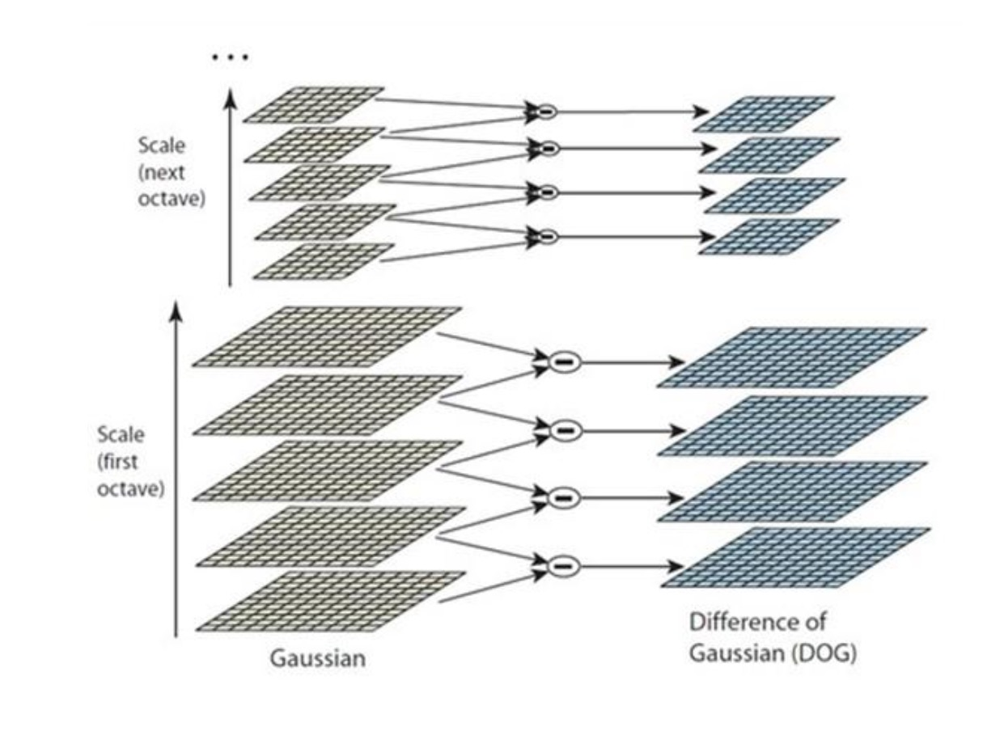

- 上面画出在尺度空间中怎样计算DoG和怎样利用DoG来做极值检测
- 在最左侧是我们建立的金字塔, 其中下面的5个形成了一组图像, 这是原始的采用高斯模糊得到的结果, 为了计算我们的DoG, 根据前面的表达式, 我们需要对相邻两层的高斯模糊结果相减, 假设这组里有n个图像, 这里n = 5, 因为需要两两相减得到DoG的结果，我们对应DoG的数量应该是这组的层数5减1，也就是4
- 在实际计算时，使用高斯金字塔每组中相邻上下两层图像相减，得到高斯差分图像， 如图所示，进行极值检测。这样就能得到候选的sift特征点。
- 进一步我们计算DoG函数的极值点, 在我们计算的时候，我们是在尺度空间计算的极值，这意味着我们有三个方向：x,y,σ, 所以我们在计算极值的时候，不仅要用到上下左右，它周围临域的信息, 而且要用到不同层, 上下层像素的信息, 这就意味着我们要计算一个点位置的极值, 就需要和26个点进行比较, 如图所示，本层有8个,上下层有9个，合起来26个
- 关键点是由DoG空间的局部极值点组成的，关键点的初步探查是通过同一组内各DoG相邻两层图像之间比较完成的。为了寻找DoG函数的极值点，每一个像素点要和它所有的相邻点比较，看其是否比它的图像域和尺度域的相邻点大或者小。如图所示，中间的检测点和它同尺度的8个相邻点和上下相邻尺度对应的9×2个点共26个点比较，以确保在尺度空间和二维图像空间都检测到极值点
- 所以我们为了计算DoG函数的极值， 还需要利用上下层之间的信息

    

- 上图左下角一共有5层, 计算完DoG以后还剩4层, 为了能从DoG计算极值, 上下两层用不了, 最后我们对应的极值图像只有2层
- 由于要在相邻尺度进行比较，如下图左侧每组含4层的高斯差分金子塔，只能在中间两层中进行两个尺度的极值点检测，其它尺度则只能在不同组中进行。
- 为了在每组中检测S个尺度的极值点，则DOG金字塔每组需S+2层图像，而DOG金字塔由高斯金字塔相邻两层相减得到，而对应的高斯金字塔每组需S+3层图像，实际计算时S在3到5之间。这意味着在原始的高斯金字塔中，每组就要有6~8层图像。
- 取S=3时，假定高斯金字塔存储索引如下:
    * 第0组(即第-1组):0 1 2 3 4 5
    * 第1组: 6 7 8 9 10 11
    * 第2组: ?
    * 从第0组合第1组可以看出它们的关系是：上一组的第一层是下一组倒数第三层经过降采样得到的
    * 则第2组第一张图片根据第一组中索引为9的图片降采样得到，其它类似

    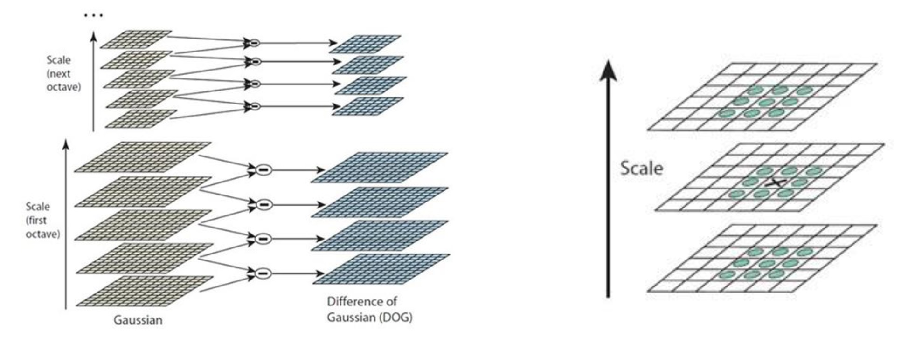

- 我们将这个关系直观的画出来，下图为构建DOG金字塔的示意图，原图采用128*128大小图像，扩大一倍后构建金字塔

    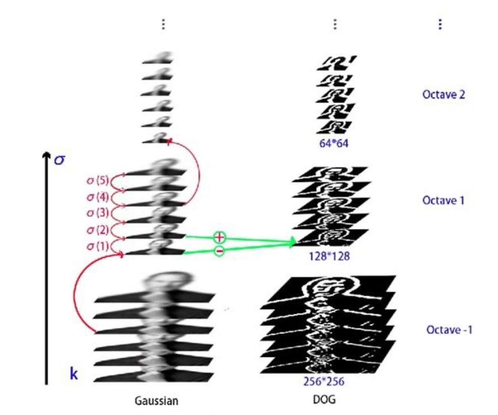

- 我们注意上图在高斯金字塔中左下角有6个图像, 下一组的第一个是这一组的倒数第三个形成的，同样再下一组的第一个也是前一组的倒数第三个形成的
- 在高斯金字塔中相邻的两层相减得到了DoG金字塔，DoG金字塔有5层, 在计算极值的时候，就可以计算3层的极值图像

### 构建尺度空间需确定的参数

- σ: 尺度空间坐标
- O: 组(octave)数
- S: 组内层数
- s: 层的坐标
- 在上述尺度空间中σ，O和S的关系如下:

$$
\sigma(o,s) = \sigma_0 2^{o + \frac{s}{S}} o \in [0, ..., O - 1], s \in [0, ..., S+2]
$$

- 假如这一组高斯金字塔图像有6层, 对应的S是3, 这里的S是计算极值图像的层数, s代表我在当前这组内层的索引，同样o代表组的索引
- 其中$σ_0$是基准层尺度(预先设定的一个参数)，o为组(octave)的索引，s为组内层的索引。
- 关键点的尺度坐标就是按关键点所在的组和组内的层，利用上述公式计算而来
- 在最开始建立高斯金字塔时，要预先模糊输入图像来作为第0个组的第0层的图像，这时相当于丢弃了最高的空域的采样率。因此通常的做法是先将图像的尺度扩大一倍来生成第-1组。我们假定初始的输入图像为了抗击混淆现象，已经对其进行$σ_{-1}=0.5$的高斯模糊，如果输入图像的尺寸用双线性插值扩大一倍，那么相当于$σ_{-1}=1$

$$
D(x,y,\sigma) = (G(x,y,k\sigma) - G(x,y,\sigma)) * I(x,y)
$$

$$
= L(x,y,k\sigma) - L(x,y,\sigma)
$$

- 上式又可记作

$$
D(x,y,\sigma) = (G(x,y,\sigma(s+1)) - G(x,y,\sigma(s))) * I(x,y)
$$

$$
= L(x,y,\sigma(s+1)) - L(x,y,\sigma(s))
$$

- 取上述式中的k为$k=2^{\frac{1}{S}}$
- 在构建高斯金字塔时，组内每层的尺度坐标按如下公式计算：

$$
\sigma(s) = \sqrt{(k^s\sigma_0)^2 - (k^{s-1} \sigma_0)^2}
$$

- 其中$σ_0$为初始尺度，lowe取$σ_0=1.6，s=3$;s为组内的层索引，不同组相同层的组内尺度坐标σ(s)相同。组内下一层图像是由前一层图像按σ(s)进行高斯模糊所得。上式用于一次生成组内不同尺度的高斯图像，而 在计算组内某一层图像的尺度时，直接使用如下公式进行计算:

$$
\sigma\_oct(s) = \sigma_0 2^\frac{s}{S} s\in [0,..., S+2]
$$
