### 关键点定位

- 之前的方法检测到的极值点是离散空间的极值点，下面通过拟合三维二次函数来精确确定关键点的位置和尺度，同时去除低对比度的关键点和不稳定的边缘响应点(因为DoG算子会产生较强的边缘响应)， 以增强匹配稳定性、提高抗噪声能力。
- 离散空间的极值点并不是真正的极值点，下图显示了二维函数离散空间得到的极值点与连续空间极值点的差别。利用已知的离散空间点插值得到的连续空间极值点的方法叫做子像素插值(Sub-pixel Interpolation)。

    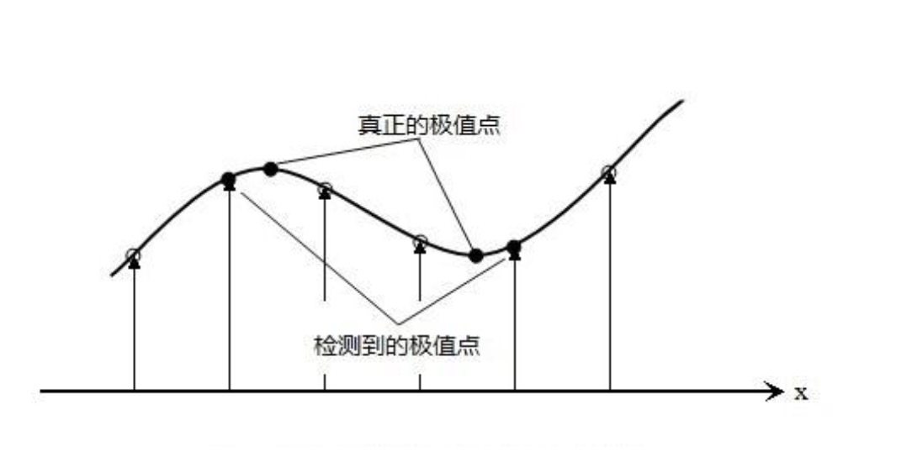

- 候选特征点x, 其偏移量定义为$\Delta$x，其对比度为D(x)的绝对值|D(x)|, 对D(x) 在特征点x应用泰勒公式展开

$$
D(x) = D + \frac{\partial D^T}{\partial x} \Delta x + \frac{1}{2} \Delta x^T \frac{\partial^2 D}{\partial x^2} \Delta x
$$

- 由于x是D(x)的极值点，所以对上式求导并令其为0, 得到极值点偏移量为：

$$
\Delta x = - \frac{\partial^2 D^{-1}}{\partial x^2} \frac{\partial D(x)}{\partial x}
$$

- 对应极值点，方程的值为：

$$
D(\hat{x}) = D + \frac{1}{2} \frac{\partial D^T}{\partial x} \hat{x}
$$

- 其中$\hat{x} = (x,y,\sigma)^T$ 代表相对差值中心的偏移量。当它在任一维度上的偏移量大于0.5时(即x或y或$\sigma$)，意味着差值中心已经偏移到它的邻近点上，所以必须改变当前关键点的位置。同时在新的位置上反复插值直到收敛；也有可能超出所设定的迭代次数或者超出图像边界的范围，此时这样的点应该删除。另外，|D(x)|过小的点易受噪声的干扰而变得不稳定，所以将小于某个经验值(Lowe论文中使用0.03，Rob hess等人实现时使用0.04/S)的极值点删除。同时，在此过程中获取特征点的精确位置(原位置加上拟合的偏移量)以及尺度(σ(o,s)和σ_oct(s))

- DOG算子(一个定义不好的高斯差分算子的极值)在横跨边缘的地方有较小的曲率，而在垂直边缘的方向有较大的曲率。DOG算子会产生较强的边缘响应，需要剔除不稳定的边缘响应点。需要做一个额外的筛选计算, 获取特征点处的Hessian矩阵，主曲率通过一个2x2的Hessian矩阵H求出:
    * $D_{xx}$ 表示D对x求二阶偏导(二次偏导)

$$
H = \begin{bmatrix} D_{xx} & D_{xy} \\ D_{xy} & D_{yy} \end{bmatrix}
$$

- H的特征值α和β代表x和y方向的梯度

$$
Tr(H) = D_{xx} + D_{yy} = α + β
$$

$$
Det(H) = D_{xx} D_{yy} - D_{xy}^2 = αβ
$$

- Tr表示矩阵H对角线元素之和，Det表示矩阵H的行列式。假设是α较大的特征值，而是β较小的特征值，令 α=rβ，则

$$
\frac{Tr(H)^2}{Det(H)} = \frac{(α + β)^2}{αβ} = \frac{(rβ + β)^2}{rβ^2} = \frac{(r+1)^2}{r}
$$

- D的主曲率和H的特征值成正比，公式(r+1)2/r的值在两个特征值相等时最小，随着差异的增大而增大。值 越大，说明两个特征值的比值越大，即在某一个方向的梯度值越大，而在另一个方向的梯度值越小，而边 缘恰恰就是这种情况。所以为了剔除边缘响应点，需要让该比值小于一定的阈值，因此，为了检测主曲率 是否在某域值r下，只需检测

$$
\frac{Tr(H)^2}{Det(H)} < \frac{(r+1)^2}{r}
$$

- 上式成立时将关键点保留，反之剔除。取r=10，下图右侧为消除边缘响应后的关键点分布图。

    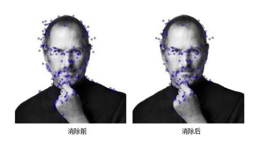

### 有限差分法求导推导

- 有限差分法以变量离散取值后对应的函数值来近似微分方程中独立变量的连续取值。在有限差分方法中， 我们放弃了微分方程中独立变量可以取连续值的特征，而关注独立变量离散取值后对应的函数值。但是从 原则上说，这种方法仍然可以达到任意满意的计算精度。因为方程的连续数值解可以通过减小独立变量离 散取值的间格，或者通过离散点上的函数值插值计算来近似得到。这种方法是随着计算机的诞生和应用而 发展起来的。其计算格式和程序的设计都比较直观和简单，因而，它在计算数学中使用广泛。

- 有限差分法的具体操作分为两个部分:
    * 用差分代替微分方程中的微分，将连续变化的变量离散化，从而得到差分方程组的数学形式;
    * 求解差分方程组。

- 一个函数在x点上的一阶和二阶微商，可以近似地用它所临近的两点上的函数值的差分来表示。如对一个单变量函数f(x)，x为定义在区间[a,b]上的连续变量，以步长h=△x将区间[a,b]离散化，我们会得到一系列节点: $x_1 = a, x_2 = x_1 + h = a + h,..., x_{n+1} = x_n + 1 = b$

- 然后求出f(x)在这些点上的近似值。显然步长h越小，近似解的精度就越好。与节点xi相邻的节点有$x_i+h$和$x_i-h$，所以在节点处可构造如下形式的差值:$f(x_i + h)-f(x_i)$节点的一阶向前差分;$f(x_i)-f(x_i-h)$节点的一阶向后差分;$f(x_i+h)-f(x_i-h)$节点的一阶中心差分。

- 使用中心差分法，做如下推导: 函数f(x)在$x_i$处的泰勒展开式为

$$
f(x) = f(x_i) + f'(x_i)(x - x_i) + \frac{f^n(x_i)}{2!}(x+x_i)^2 + ... + \frac{f^{(n)(x_i)}}{n!}(x-x_i)^n
$$

- 则有:

$$
f(x_i - h) = f(x_i) + f'(x_i)((x_i - h) - x_i) + \frac{f''(x_i)}{2!}((x_i - h) - x_i)^2 + ...
$$

$$
f(x_i + h) = f(x_i) + f'(x_i)((x_i + h) - x_i) + \frac{f''(x_i)}{2!}((x_i + h) - x_i)^2 + ...
$$

- 忽略h平方后的项，联立上式，解得

$$
f'(x_i) = (\frac{\partial f}{\partial x})_x \approx \frac{f(x_i + h) - f(x_i - h)}{2h}
$$

$$
f''(x_i) = (\frac{\partial ^ 2 f}{\partial x^2})_{x_i} \approx \frac{f(x_i + h) + f(x_i - h) - 2f(x_i)}{h^2}
$$

- 二元函数的泰勒展开式如下

$$
f(x + \Delta x, y + \Delta y) = f(x,y) + \Delta x \frac{\partial f(x,y)}{\partial x} + \Delta y \frac{\partial f(x,y)}{\partial y}
$$

$$
+ \frac{1}{2!}[(\Delta x)^2 \frac{\partial ^2 f(x,y)}{\partial x^2} + 2 \Delta x \Delta y \frac{\partial ^2 f(x,y)}{\partial x \partial y} + (\Delta y)^2 \frac{\partial ^2 f(x,y)}{\partial y^2} ] \\
$$

$$
+ \frac{1}{3!} [(\Delta x)^3 \frac{\partial ^3 f(x,y)}{\partial x^3} + 3(\Delta x)^2 \Delta y \frac{\partial ^3 f(x,y)}{\partial x^2 \partial y} + 3 \Delta x (\Delta y)^2 \frac{\partial ^3 f(x,y)}{\partial x \partial y^2} + (\Delta y)^3 \frac{\partial ^3 f(x,y)}{\partial y^3} ] + ...
$$

- 将上式展开后忽略次要项联立解方程得二维混合偏导(x,y两个方向混合求偏导)如下:

$$
\frac{\partial ^2 f(x_i, y_i)}{ \partial x \partial y} \approx \frac{1}{4h^2}[f(x_i + h, y_i + h) + f(x_i - h, y_i - h) - f(x_i + h, y_i -h) - f(x_i - h, y_i + h) ]
$$

- 利用多元泰勒展开式，可得任意偏导的近似差分表示

- 在图像处理中，取 h = 1， 在左图所示的图像中，将像素0的基本中点导数公式整理如下：

    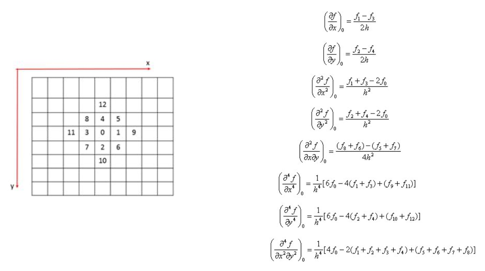

- 若下面的矩阵$A = \begin{Bmatrix} a_{00} & a_{01} & a_{02} \\ a_{10} & a_{11} & a_{12} \\ a_{20} & a_{21} & a_{22} \end{Bmatrix}$可逆，即
    * $|A| = a_{00} a_{11} a_{22} + a_{01} a_{12} a_{20} + a_{02} a_{10} a_{21} - a_{00} a_{12} a_{21} - a_{01} a_{10} a_{22} - a_{02} a_{11} a_{20} \neq 0$

- 则有

$$
A^{-1} = \frac{1}{|A|} 
\begin{Bmatrix} a_{11}a_{22} - a_{21}a_{12}  &  -(a_{01}a_{22} - a_{21}a_{02}) & a_{00}a_{12} - a_{02}a_{11} \\
a_{12}a_{20} - a_{22}a_{10}  &  -(a_{02}a_{20} - a_{22}a_{00}) & a_{02}a_{10} - a_{00}a_{12} \\ 
a_{10}a_{21} - a_{20}a_{11}  &  -(a_{00}a_{21} - a_{20}a_{01}) & a_{00}a_{11} - a_{01}a_{10}
 \end{Bmatrix}
$$

### 邻域窗口梯度

- 为了使描述符具有旋转不变性，需要利用图像的局部特征为给每一个关键点分配一个基准方向。使用图像梯度的方法求取局部结构的稳定方向。对于在DoG金字塔中检测出的关键点，采集其所在高斯金字塔图像3σ邻域窗口内像素的梯度和方向分布特征。梯度的模值和方向如下:

$$
m(x,y) = \sqrt{(L(x+1, y) - L(x-1,y))^2 + (L(x,y+1) - L(x,y-1)) ^2}
$$

$$
\theta(x,y) = tan^{-1}((L(x,y + 1) - L(x,y - 1) / L(x+1, y) - L(x - 1),y)))
$$

- L为关键点所在的尺度空间值，按Lowe的建议，梯度的模值m(x,y)按σ=1.5σ_oct的高斯分布加成，按尺度采样的3σ原则，邻域窗口半径为3×1.5σ_oct

### 方向直方图的生成

- 直方图统计半径为3×1.5σ。即计算以关键点为中心半径3×1.5σ邻域内所有点的梯度方向。
- 梯度直方图将0~360度的方向范围分为36个柱。累计落到每个方向内的关键点个数加权值，以此生成梯度方向直方图。
- 将梯度方向直方图中纵坐标最大的项代表的方向分配给当前关键点作为主方向，若在梯度直方图中存在一个相当于主峰值80%能量的峰值，则将这个方向认为是关键点的辅方向。辅方向的设计可以增强匹配的鲁棒性，Lowe指出，大概有15%的关键点具有辅方向，而恰恰是这15%的关键点对稳定匹配起到关键作用

    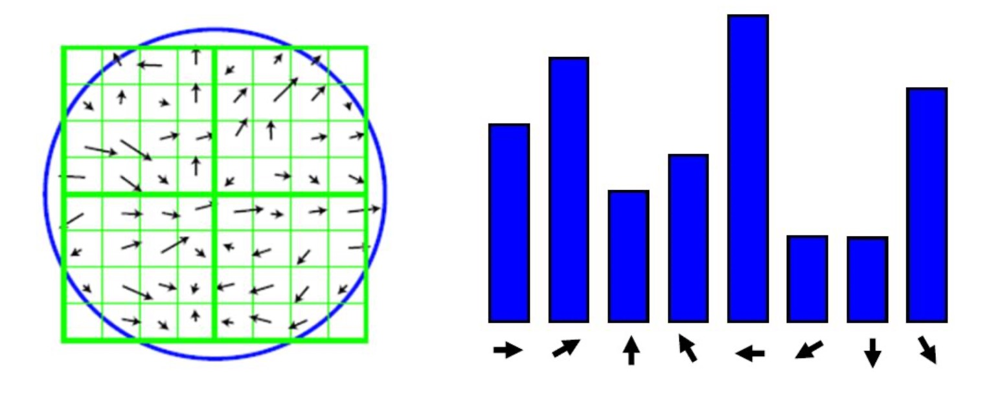

- 对于每一个关键点，拥有三个信息:位置、尺度以及方向。接下来就是为每个关键点建立一个描述符，用 一组向量将这个关键点描述出来，使其不随各种变化而改变，比如光照变化、视角变化等等。这个描述子 不但包括关键点，也包含关键点周围对其有贡献的像素点，并且描述符应该有较高的独特性，以便于提高 特征点正确匹配的概率。
- SIFT描述子是关键点邻域高斯图像梯度统计结果的一种表示。通过对关键点周围图像区域分块，计算块内 梯度直方图，生成具有独特性的向量，这个向量是该区域图像信息的一种抽象，具有唯一性。
- Lowe实验表明描述子采用在关键点尺度空间内4 * 4的窗口中计算的8个方向的梯度信息，共4 * 4 * 8 = 128维向量表征，综合效果最优。

    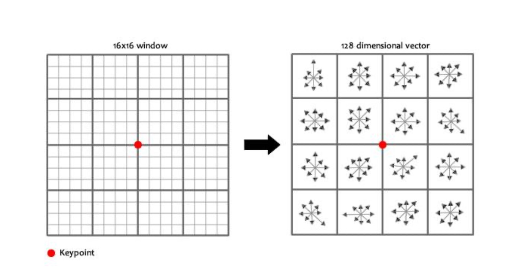

- 下图是一个SIFT描述子实例。其中描述子由2 * 2 * 8维向量表征，也就是2 * 2个8方向直方图组成。左图的种 子点由8 * 8单元组成。每一个小方格都代表了特征点邻域所在的尺度空间的一个像素，箭头方向代表了像 素梯度方向，箭头长度代表了该像素的幅值。然后在4 * 4窗口内计算8个方向的梯度直方图，绘制每个梯度 方向的累加可形成一个种子点。一个特征点由4个种子点的信息所组成。如图所示:

    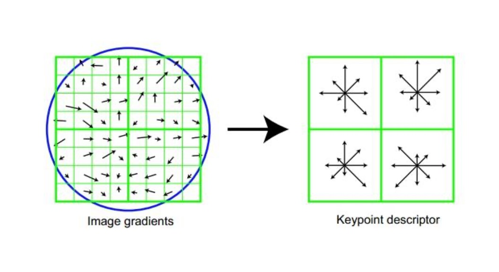

- 表示步骤如下:
    * 1.确定计算描述子所需的图像区域, 特征描述子与特征点所在的尺度有关，因此，对梯度的求取应在特征点对应的高斯图像上进行。 实际计算所需的图像区域半径为:radius=(3σ_oct×(d+1)×√2)/2 计算结果四舍五入取整。(σ_oct为关键点所在组的组内尺度, d=4)

    

        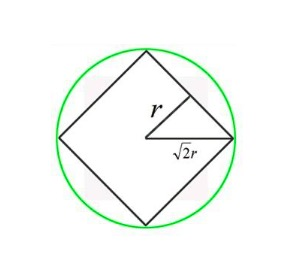
    

    * 2.将坐标轴旋转为关键点的方向, 以确保旋转不变性, 旋转后邻域内采样点的新坐标为: 
        * 其中，$x,y \in [-radius, radius]$
    $$
    \begin{bmatrix} x' \\ y' \end{bmatrix} = \begin{bmatrix} cos \theta & - sin \theta \\ sin \theta & cos \theta \end{bmatrix} \begin{bmatrix} x \\ y \end{bmatrix}
    $$

    

        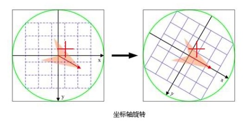
    

    * 3.在图像半径区域内对每个像素点求其梯度幅值和方向，然后对每个梯度幅值乘以高斯权重参数，生成方向直方图。
    
    

        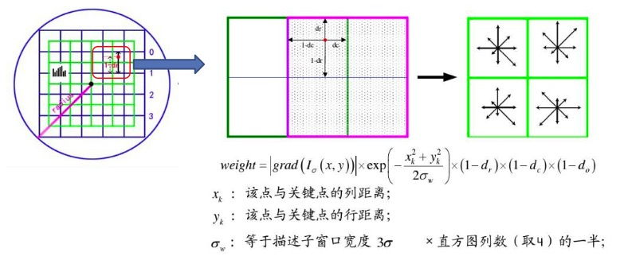
    

    * 4.在窗口宽度为2 * 2的区域内计算8个方向的梯度直方图，绘制每个梯度方向的累加值，即可形成一个种子点。然后在下一个2 * 2的区域内进行直方图统计，生成下一个种子点，一共生成16个种子点。

    * 5.描述子向量元素门限化以及门限化后的描述子向量规范化。
        * 描述子向量元素门限化: 方向直方图每个方向上的梯度幅值限制在一定门限值之下(一般取0.2)
        * 描述子向量元素规范化: 描述子向量为$H=(h_1,h_2,h_3...h128)$, 归一化后的特征向量为$L=(l_1,l_2,l_3...l_128)$，则有
        $$
        l_i = \frac{h_i}{\sqrt{\sum _ {j=1} ^ {128} h_j}} , j = 1,2,3...
        $$

    * 6.描述子向量门限。非线性光照，相机饱和度变化对造成某些方向的梯度值过大，而对方向的影响微弱。 因此设置门限值(向量归一化后，一般取0.2)截断较大的梯度值。
    * 至此，SIFT特征描述向量生成。

### SIFT的缺点

- SIFT在图像的不变特征提取方面拥有无与伦比的优势，但并不完美，仍然存在:
    * 实时性差
    * 有时特征点较少
    * 对边缘光滑的目标无法准确提取特征点等
    * 如下图所示，对模糊的图像和边缘平滑的图像，检测出的特征点过少，对圆更是无能为力。 近来不断有人改进，其中最著名的有SURF;以及另辟蹊径的ORB等算子

    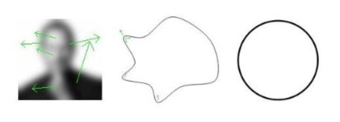

- 结果示例:检测结果

    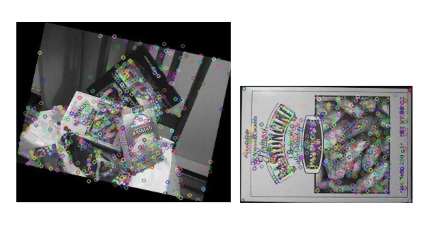

- 结果示例:匹配结果

    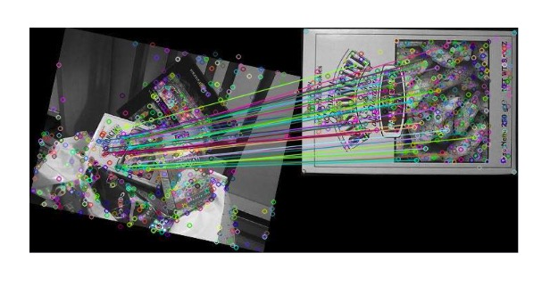

### 总结

1. 尺度空间的核心思想是通过不同分辨率看同一个图像，可通过不同尺度的高斯函数与原始图像卷积实现
2. 极大值点的精确定位可通过解含有二阶导数项的方程得到
3. 借助在关键点附近区域的梯度方向统计与直方图生成，SIFT最终可得到对应每个关键点的128维向量描述。