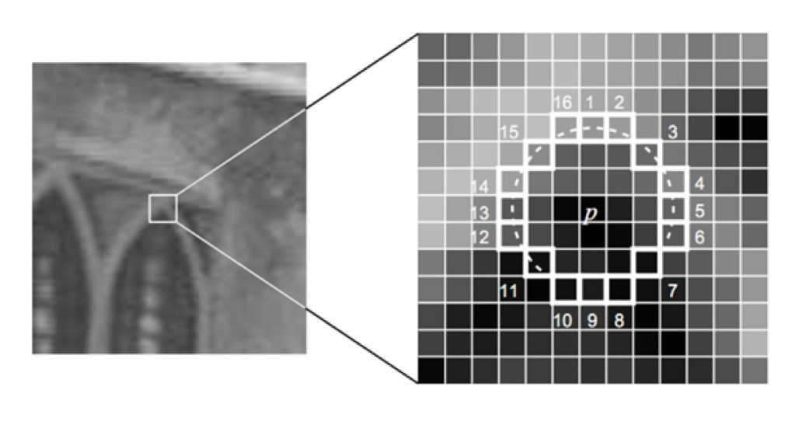
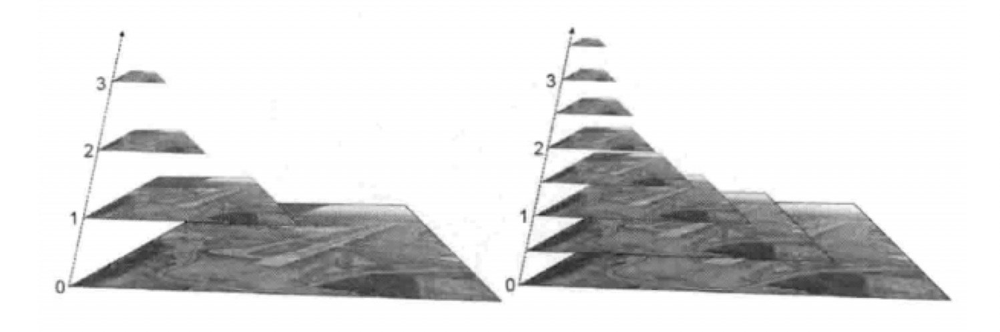
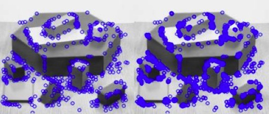
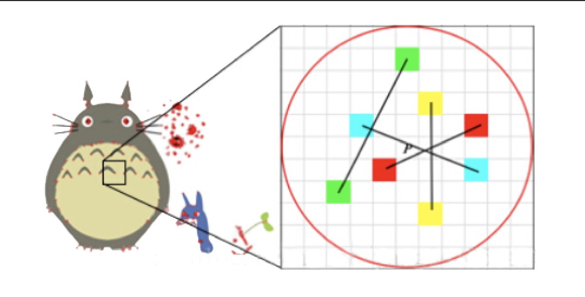
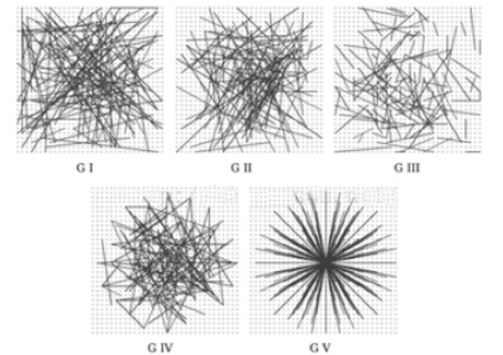
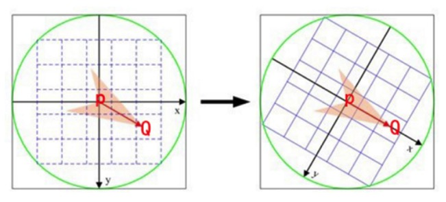
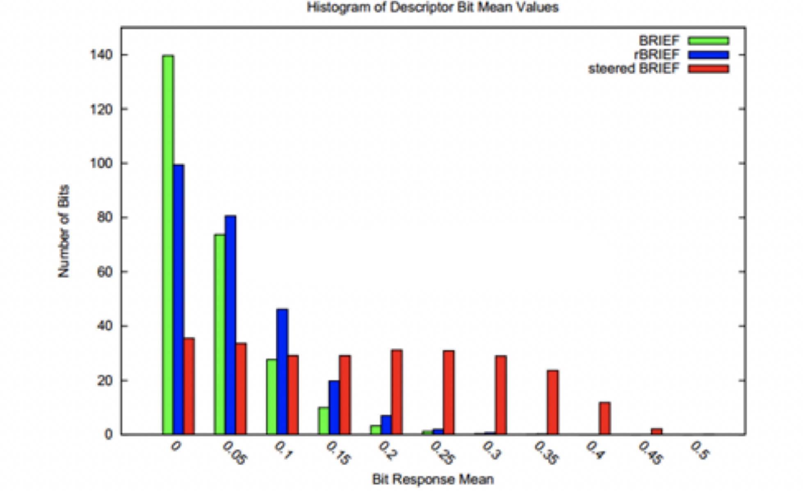
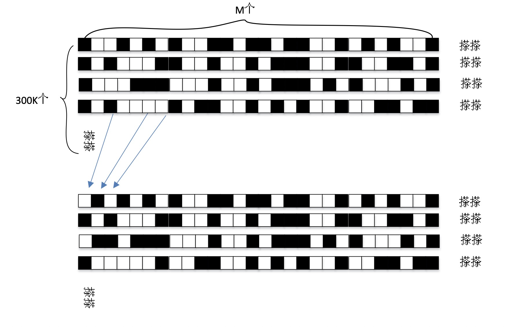
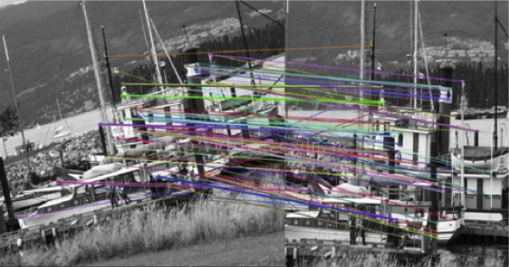
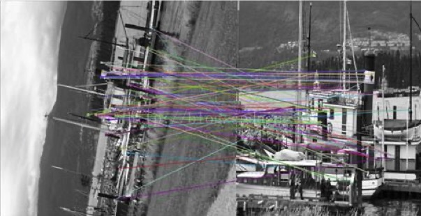

### ORB特征检测算法

- ORB（Oriented FAST and Rotated BRIEF）是一种快速特征点提取和描述的算法
- 这个算法是由Ethan Rublee, Vincent Rabaud, Kurt Konolige以及Gary R.Bradski在2011年一篇名为“ORB：An Efficient Alternative to SIFT or SURF”的文章中提出
- ORB算法分为两部分，分别是特征点提取和特征点描述。特征提取是由FAST（Features from Accelerated Segment Test）算法发展来的，特征点描述是根据BRIEF（Binary Robust Independent Elementary Features）特征描述算法改进的
- ORB = oFast + rBRIEF。据称ORB算法的速度是sift的100倍，是surf的10倍
- ORB算子在SLAM及无人机视觉等领域得到广泛应用

### oFAST特征提取

- ORB算法的特征提取是由FAST算法改进的，这里称为oFAST（FAST keypoint Orientation）
- 在使用FAST提取出特征点之后，给其定义一个特征点方向，以此来实现特征点的旋转不变性

1 ） **粗提取**

- 判断特征点：从图像中选取一点P，以P为圆心画一个半径为3像素的圆。圆周上如果有连续N个像素点的灰度值比P点的灰度值大或小，则认为P为特征点。这就是大家经常说的FAST-N。有FAST-9、FAST-10、FAST-11、FAST-12，大家使用比较多的是FAST-9和FAST-12
- 快速算法：为了加快特征点的提取，快速排出非特征点，首先检测1、5、9、13位置上的灰度值，如果P是特征点，那么这四个位置上有3个或3个以上的的像素值都大于或者小于P点的灰度值。如果不满足，则直接排出此点

    

2 ） **筛选最优特征点**

机器学习的方法筛选最优特征点。简单来说就是使用ID3算法训练一个决策树，将特征点圆周上的16个像素输入决策树中，以此来筛选出最优的FAST特征点。具体步骤如下：

1. 选取进行角点提取的应用场景下的一组训练图像。
2. 使用FAST角点检测算法找出训练图像上的所有角点。
3. 对于每一个角点，将其周围的16个像素存储成一个向量。对所有图像都这样做构建一个特征向量。
4. 每一个角点的16像素点都属于下列三类中的一种，像素点因此被分成三个子集：Pd, Ps, Pb

$$
S_{p \rightarrow x} = 
\begin{cases}
d, \ \ \  I_{p \rightarrow x} \leq I_{p} - t \ \ \ (darker) \\
s, \ \ \  I_p - t < I_{p \rightarrow x} < I_p + t \ \ \ (similar) \\
b, \ \ \  I_p + t \leq I_{p \rightarrow x} \ \ \ (brighter)
\end{cases}
$$

5. 定义一个新的布尔变量Kp ，如果是角点就设置为True，否则就设置为False。
6. 使用ID3算法来查询每一个子集。
7. 递归计算所有的子集直到它的熵为0。
被构建好的决策树用于其它图像的FAST检测。

3 ） **使用非极大值抑制算法去除临近位置多个特征点**

- 计算特征点出的FAST得分值s（像素点与周围16个像素点差值的绝对值之和）
- 以特征点p为中心的一个邻域（如3x3或5x5）内，若有多个特征点，则判断每个特征点的s值
- 若p是邻域所有特征点中响应值最大的，则保留；否则，抑制。若邻域内只有一个特征点，则保留。得分计算公式如下（公式中用V表示得分，t表示阈值）：

$$
V = max
  \begin{cases} 
   \sum(pixel \ values - p) & \text{if } (value - p) > t \\
   \sum(p - pixel \ values) & \text{if } (p - value) > t
  \end{cases}
$$

4 ） **建立金字塔以实现特征点多尺度不变性**

- 设置一个比例因子scaleFactor（opencv默认为1.2）和金字塔的层数nlevels（Opencv默认为8）。
- 将原图像按比例因子缩小成nlevels幅图像。
- 缩放后的图像为：$I'= I/scaleFactor^k(k=1,2,…, nlevels)$。nlevels幅不同比例的图像提取特征点总和作为这幅图像的oFAST特征点。

    

- 特征点的旋转不变性。ORB算法提出使用矩（moment）法来确定FAST特征点的方向。也就是说通过矩来计算特征点以r为半径范围内的质心，特征点坐标到质心形成一个向量作为该特征点的方向。矩定义如下：

$$
m_{pq} = \sum_{x,y \in r} x^p y^q I(x,y)
$$

- 其中，I(x,y)为图像灰度表达式。该矩的质心为：

$$

C = \left(
\frac{m_{10}}{m_{00}} , \frac{m_{01}}{m_{00}}
\right)

$$

- 假设角点坐标为O，则向量的角度即为该特征点的方向。计算公式如下

$$
\theta = arctan(\frac{m_{01}}{m_{00}} / \frac{m_{10}}{m_{00}}) = arctan(m_{01} / m_{10})
$$

5 ） **提取结果示例**

    

- 上图左侧使用了非极大值抑制得到的结果
- 上图右侧没用
- Fast检测足够快，检测时角点可以检测出来，但是会存在大量的误检

### rBRIEF特征描述

- ORB算法的特征描述是由BRIEF算法改进的，这里称为rBRIEF（Rotation-Aware Brief）。
- 也就是说，在BRIEF特征描述的基础上加入旋转因子从而改进BRIEF算法

1 ) **BRIEF算法描述**

- BRIEF算法计算出来的是一个二进制串的特征描述符。它是在一个特征点的邻域内，选择n对像素点$p_i$、$q_i$（i=1,2,…,n）。
- 比较每个点对的灰度值的大小，如果$I(p_i)> I(q_i)$，则生成二进制串中的1，否则为0。
- 所有的点对都进行比较，则生成长度为n的二进制串。一般n取128、256或512，opencv默认为256。

    

- 以关键点P为圆心，以d为半径做圆O。
- 在圆O内某一模式选取N个点对。这里为方便说明，N=4，实际应用中N可以取512.假设当前选取的4个点对如上图所示分别标记为：
    * $p_1(A,B)$ 、$p_2(A,B)$ 、$p_3(A,B)$、$p_4(A,B)$

- 定义操作T
    * 其中 I_A 表示点A的灰度

$$
T(P(A,B)) = 
\begin{cases} 
	1 & I_A > I_B \\
    0 & I_A \leq I_B	
\end{cases}
$$

- 分别对已选取的点对进行T操作，将得到的结果进行组合。假如：
    * $T(P_1(A,B)) = 1$
    * $T(P_2(A,B)) = 0$
    * $T(P_3(A,B)) = 1$
    * $T(P_4(A,B)) = 1$
    * 则最终的描述子为：1011

- 关于在特征点SxS的区域内选取点对的方法，BRIEF论文中测试了5种方法：
    * 在图像块内平均采样
    * p和q都符合(0,$S^2/25$)的高斯分布
    * p符合(0,$S^2/25$)的高斯分布，而q符合(0,$S^2/100$)的高斯分布
    * 在空间量化极坐标下的离散位置随机采样
    * 把p固定为(0,0)，q在周围平均采样
    * 五种采样方法的示意图如下：

    

- 论文中指出，第二种方法能获得较好的匹配结果，在旋转不是非常厉害的图像里，用BRIEF生成的描述子的匹配质量非常高，作者测试的大多数情况中都超越了SURF。但在旋转大于30°后，BRIEF的匹配率快速降到0左右，因此我们需要对BRIEF进行改进

2 ) **具有旋转不变性的BRIEF**

- steered BRIEF（旋转不变性改进）
- 在使用oFast算法计算出的特征点中包括了特征点的方向角度。假设原始的BRIEF算法在特征点SxS（一般S取31）邻域内选取n对点集。

$$
D =
\begin{Bmatrix}
x_1, x_2, ..., x_{2n} \\
y_1, y_2, ..., y_{2n}
\end{Bmatrix}
$$

- 经过旋转角度θ旋转，得到新的点对: $D_\theta = R_\theta D$
- 在新的点集位置上比较点对的大小形成二进制串的描述符

    

3 ）**BRIEF算法的改进**

- rBRIEF-改进特征点描述子的相关性
- BRIEF的一个比较好的特性是，对于所有的特征点上的每一位（bit）上的值的平均值都非常接近0.5，而steeredBRIEF在可区分性(相关性）上不如原始的BRIEF算法，在ORB论文中作者用不同的方法对100k个特征点计算二进制描述符，对这些描述符进行统计，得出下表（其中X轴代表位均值与0.5的距离，y轴是相应均值下的特征点数量统计）：

    

- 我们先不看rBRIEF的分布。对BRIEF和steeredBRIEF两种算法的比较可知，BRIEF算法落在0上的特征点数较多，因此BRIEF算法计算的描述符的均值在0.5左右，每个描述符的方差较大，可区分性较强。而steeredBRIEF失去了这个特性。

- 为了改进BRIEF算法，首先建立300k个特征点测试集。对于测试集中的每个点，考虑其31x31邻域。在对图像进行高斯平滑之后，使用邻域中的某个点的5x5邻域灰度平均值来代替某个点的值，进而比较点对的大小。使用积分图像加快求取5x5邻域灰度平均值的速度。在31x31的邻域内共有(31-5+1)x(31-5+1)=729个这样的子窗口，那么取点对的方法共有M=265356种，我们就要在这Ｍ种方法中选取256种取法，使这256种取法之间的相关性最小

4 ) **选取方法如下**

- 1.在300k特征点的每个31x31邻域内按M种方法取点对，比较点对大小，形成一个300kxM的二进制矩阵Q。矩阵的每一列代表300k个点按某种取法得到的二进制数。
- 2.对Q矩阵的每一列求取平均值，按照平均值到0.5的距离重新对Q矩阵的列向量排序，形成矩阵T。
- 3.将T的第一列向量放到R中。
- 4.取T的下一列向量和R中的所有列向量计算相关性，如果相关系数小于设定的阈值，则将T中的该列向量移至R中。
- 5.按照4的方式不断进行操作，直到R中的向量数量为256。
- 通过这种方法就选取了这256种取点对的方法。这就是rBRIEF算法

    

5 ) **OpenCV实例**

    

    

### 总结

- ORB = oFAST + rBRIEF
- oFAST 是一类快速角点检测算法，并具备旋转不变性
- rBRIEF 是一类角点描述(编码算法)，并且编码具有良好的可区分性