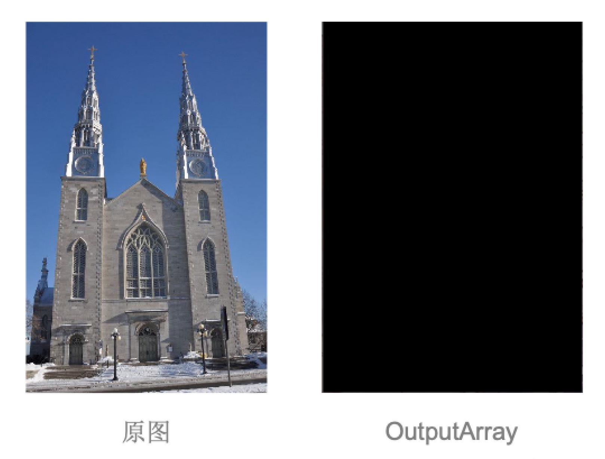
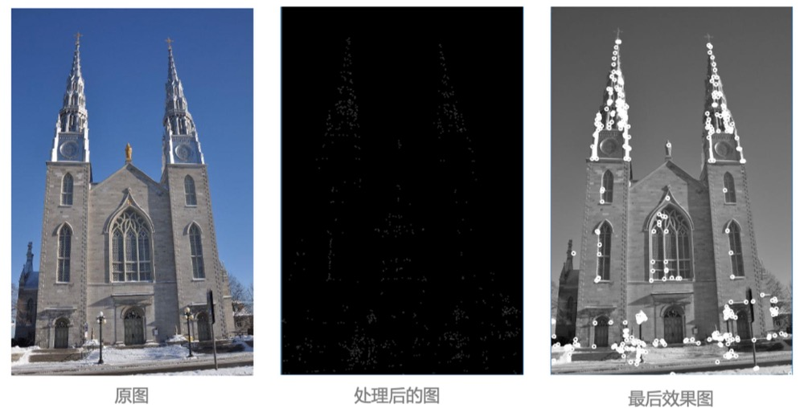
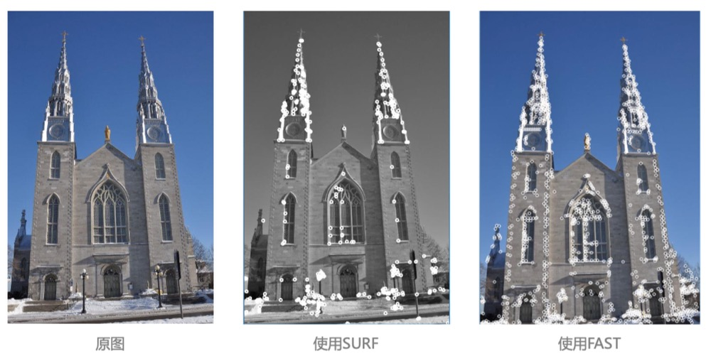
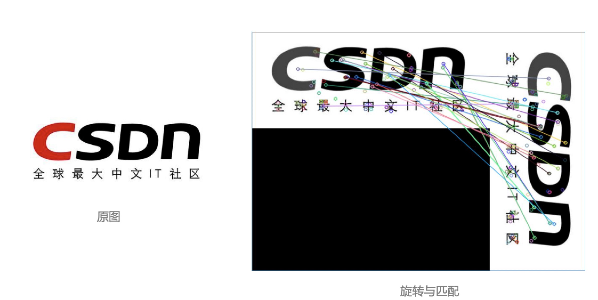
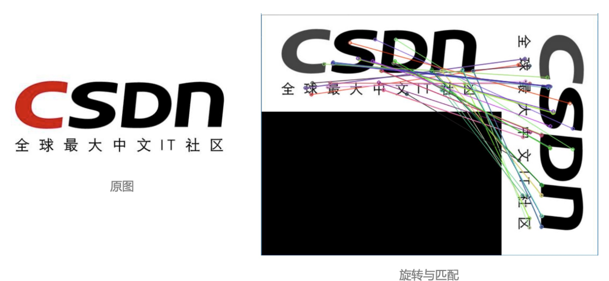

### Harris 角点检测示例

1 ） **相关函数**

- C++版
    * `void cornerHarris(InputArray src, OutputArray dst,
        int blockSize, int ksize, double k, int borderType=BORDER_DEFAULT );`
    * `src`，输入图像，即源图像，填Mat类的对象即可，且需为单通道8位或者浮点型图像。
    * `dst`，函数调用后的运算结果存在这里，即这个参数用于存放Harris角点检测的输出结果，和源图片有一样的尺寸和类型。
    * `blockSize`，表示邻域的大小，更多的详细信息在cornerEigenValsAndVecs中有讲到。
    * `ksize`，表示Sobel()算子的孔径大小。
    * `k`，`Harris`参数。
    * `borderType`，图像像素的边界模式，注意它有默认值BORDER_DEFAULT。更详细的解释，参考borderInterpolate函数。

- Python版
    * `dst = cv.cornerHarris( src, blockSize, ksize, k[, dst[, borderType]] )`

2 ） **cornerHarris 原始结果**

- OpenCV3中提供的函数并不能直接应用到你自己的代码之中 要想在一幅图之中框选出角点，我们还需要做一些其他的工作
- 首先，我们来看一下这个函数中产生的 OutputArray 是一个什么样的存在，我们以下面这张图片作为样例
- 由此可见，此函数我们需要进一步进行调整，才能达到想要的效果

<div align="center">
    
</div>

3 ) **程序示例 (C++)**

- 为了使我们可以很好的使用这个函数，我们首先要对得到的结果进行下一步处理 
- 此步处理中，我们消除掉了可能出现的角点聚集在一起的情况

```cpp
cv::cornerHarris(image, cornerStrength,
    neighbourhood, // neighborhood size
    aperture, // 孔径大小
    k);  // Harris 参数
cv::imshow("ini", cornerStrength);
// 内部阈值计算
// 配合函数minMaxLoc设置的变量, 但后续并没有用处，只为配合函数使用
double minStrength;
cv::minMaxLoc(cornerStrength, &minStrength, &maxStrength);
// 局部最大值检测，使得减少出现角点聚集的情况出现
cv::Mat dilated;
cv::dilated(cornerStrength, dilated, cv::Mat());
cv::compare(cornerStrength, dilated, localMax, cv::CMP_EQ);
```

- 这一步处理中，我们将图像进一步处理，再一次削减角点数量，以便得到最正确的角点 
- 并将角点强度所形成的图像进行返回，我们可以得到以下的效果

```cpp
cv::Mat cornerMap;
// 对角点图像进行阈值化
threshold = qualityLevel * maxStrength;
cv::threshold(cornerStrength, cornerTh, threshold, 255, cv::THRESH_BINARY);
// 转换为8位图像
cv::Mat result;
cornerTh.convertTo(cornerMap, CV_8U);
// 非极大值抑制
cv::bitwise_and(cornerMap, localMax, cornerMap);

// cv::imshow("bitandbef", result);
cv::bitwise_and(result, cornerMap, result);
// cv:imshow("bitand", result);

/*
std::cout << cornerMap.type() << "cornerMap_type" << std::endl;
std:cout << cornerTh.type() << "cornerTh_type" << std::endl;
*/
return cornerMap;
```

- 最后，我们将要把角点用o的方式画出，以便进行效果的测试

```cpp
for(int y=0; y < cornerMap.rows; y++) {
    const uchar* rowPtr = cornerMap.ptr<uchar> (y);
    for(int x=0; x < cornerMap.cols; x++) {
        // 如果是特征点
        if(rowPtr[x]) {
            points.push_back(cv::Point(x,y));
        }
    }
}
```

```cpp
std::vector<cv::Point>::const_iterator it = points.begin();
// 对于所有角点
while(it != points.end()) {
    cv::circle(image, *it, radius, color, thickness);
    ++it;
}
```

4 ) **程序示例 (Python)**

- 使用Harris算子检测角点，并首先消除掉了可能出现的角点聚集在一起的情况

```python
def detect(self, image):
    self.cornerStrength = cv2.cornerHarris(image, self.neighbourhood, self.aperture, self.k)
    cv2.imshow('ini', self.cornerStrength)
    min_val, self.maxStrength, min_indx, max_indx = cv2.minMaxLoc(self.cornerStrength)
    dilated = cv2.dilate(self.cornerStrength, cv2.getStructuringElement(cv2.MORPH_RECT, (3,3)))
```

- 这一步处理中，我们将图像进一步处理，再一次削减角点数量，以便得到最正确的角点

```python
def getCornerMap(self, qualityLevel):
    self.threshold = qualityLevel * self.maxStrength
    _, self.cornerTh = cv2.threshold(self.cornerStrength, self.threshold, 255, cv2.THRESH_BINARY)
    self.cornerTh = np.array(self.cornerTh)
    
    self.cornerMap = self.cornerTh.astype(np.uint8)
    result = self.cornerTh.astype(np.uint8)
    cv2.bitwise_and(self.cornerMap, self.localMax, self.cornerMap)

    cv2.bitwise_and(result, self.cornerMap, result)
    cv2.imshow('bitand', result)
```

- 最后，我们将要把角点用圆圈的方式画出，以便进行效果的测试

```python
def drawOnImage(self, image, points, color, radius, thickness):
    print(len(points))
    for i in points:
        print(i)
        cv2.circle(image, i, radius, color, thickness)
```

5 ) **运行效果**

<div align="center">
    
</div>

### 通用角点检测示例

1 ）**角点检测一般流程(C++)**

OpenCV3支持SIFT/SURF/ORB/KAZE/FAST/BRISK/AKAZE等角点检测，均为Feature2D的子类， 一般使用流程如下: **检测算子创建、检测、 提取描述子、匹配**

- 创建
    * cv::Ptr<cv::算子> 给算子起的名字 = cv::算子::create(阈值); 
    * e.g. cv::Ptr<cv::ORB> orb = cv::ORB::create(nkeypoint);

- 检测
    * 上一步给算子起的名字-> detect(图片, 内容为KeyPoints的vector向量); 
    * e.g. orb->detect(img_1, keypoints_1);

- 提取描述子
    * 上一步给算子起的名字->compute(图片, 上一步中得到的向量, Mat类矩阵); 
    * e.g. orb->compute(img_1, keypoints_1, descriptors_1);

- 匹配
    * BFMatcher类对象.match(描述子1,描述子2,内容为DMatch的vector向量); 
    * e.g. matcher.match(descriptors_1, descriptors_2, matcshes);

2 ）**角点检测一般流程(Python)**

OpenCV3支持SIFT/SURF/ORB/KAZE/FAST/BRISK/AKAZE等角点检测，均为Feature2D的子类， 一般使用流程如下: **检测算子创建、检测、提取描述子、匹配**

- 创建
    * 给算子起的名字 = cv2.算子名_create() 
    * e.g. orb = cv2.orb_create();

- 检测
    * 内容为KeyPoints的vector向量 = 上一步给算子起的名字.detect(图片) 
    * e.g. keypoints = orb.detect( img, None )

- 描述子
    * 上一步给算子起的名字.compute(图片, 上一步中得到的KeyPoints向量) 
    * e.g. keypoints, descriptors = orb.compute( img, keypoints )

- 匹配
    * BFMatcher类对象.match(描述子1, 描述子2, 内容为DMatch的向量); 
    * e.g. matches = matcher.match(descriptors_1, descriptors_2)

###  OpenCV3实现 FAST(C++)

**核心函数**

- FAST角点检测算法在OpenCV3中以虚类的方式呈现，因此在使用上与SURF算法有一定的区别, 我们在调用时一般使用如下方法

```cpp
vector<cv::KeyPoint>keypoints;
cv::Ptr<cv::FeatureDetector> fast = cv::FastFeatureDetector::create(40);
```

- 之后，再使用OpenCV3中提供的角点检测函数，即可找到图片中的角点

```cpp
fast -> detect(image, keypoints);
cv::drawKeypoints(image, keypoints, image, cv::Scalar(255,255,255,))
    cv::DrawMatchesFlags::DRAW_OVER_OUTING);
```

###  OpenCV3实现 SURF(C++)

**核心函数**

- SURF算法是SIFT算法的高效变种，其计算速度远快于SIFT，因此我们在这里介绍SURF

```cpp
CV_WRAP static Ptr<SURF> create(double hessianThreshold=100, int nOctaves = 4, int nOctaveLayers = 3,
bool extended = false, bool upright = false);
```

- 在这个函数中，我们唯一需要了解的即为 hessianThreshold 这个参数 
- 这个参数代表着 Hessisan 矩阵行列式所计算出的曲率强度 
- 此数值越高，代表着区分匹配点的要求越高
- 当然，在OpenCV3中其给出了默认值100，不过一般推荐在1000 ~ 2500之间，如下面这样

```cpp
Ptr<xfeatures2d::SURF> detector = xfeatures2d::SURF::create(minHessian);
Ptr<DescriptorExtractor> descriptor = xfeatures2d::SURF::create();
Ptr<DescriptorMatcher> Matcher1 = DescriptorMatcher::create("BruteForce");
```

**实际应用**

- 在SURF算法中，为了执行匹配，我们首先检测待匹配的两幅图中的特征点

```cpp
// 检测特征点
detector -> detect(img1, keyPoint1);
detector ->detect(img2, keyPoint2);
```

- 之后，我们提取描述这些特征点的描述子

```cpp
// 提取特征点描述子
descriptor -> compute(img1, keyPoint1, descriptors1);
descriptor -> compute(img1, keyPoint2, descriptors2);
```

- 最后，我们将两幅图像中的描述子进行匹配

```cpp
// 匹配图像中的描述子
matcher1 -> match(descriptors1, descriptors2, matcches);
```

- 在将我们的结果展示在电脑屏幕前，我们还需要进行最后一步 
- 即为将对应的匹配点之间通过连线的方式画在图像上
- 为了使我们的结果看起来更加清晰，我们将匹配到的点的数量进行削减

```cpp
std::nth_element(matches.begin(), matches.begin()+24, matches.end());
matches.erase(matches.begin()+25, matches.end());
```

- 之后，我们将相互之间能构成匹配的点画在图像上

```cpp
// 画匹配点
Mat img_matches;
drawMatches(img1, keyPoint1, img2, keyPoint2, matches, img_matches);
imshow("img_matches", img_matches);
```

###  OpenCV3实现 FAST(Python)

**核心函数**

- FAST角点检测算法在OpenCV3中以虚类的方式呈现，因此在创建上与SURF算法有一定的区别， 其它相同，具体如下:

```python
fast = cv2.FastFeatureDector_create(threshold=40,nonmaxSuppression=True, type=cv2.FAST_FEATURE_DETECTOR_TYPE_9_16)
kp = fast.detect(image, None)
cv2.drawKeypoints(image, kp, image, color=(255, 255, 255))
```

###  OpenCV3实现 SURF(Python)

- 根据前述步骤，首先创建:

```python
minHessian = 1000

detector = cv.xfeatures2d.SURF_create(minHessian)
descriptor = cv.xfeatures2d.SURF_create()
matcher1 = cv.DescriptorMatcher_create("BruteForce")
```

- 然后按照检测->计算->绘制的过程进行:

```python
# 检测特征点
keyPoint1 = detector.detect(img1)
keyPoint2 = detector.detect(img2)

# 计算特征点对应描述子
_, descriptors1 = descriptor.compute(img1, keyPoint1)
_, descriptors2 = descriptor.compute(img2, keyPoint2)

# 描述子匹配
matches = matcher1.match(descriptors1, descriptors2)
```

- 最后完成匹配并画出

```python
img_matches = np.empty(img2.shape)
img_matches1 = cv.drawMatches(img1, keyPoint1, img2, keyPoint2, matches, img_matches)
cv.imshow("img_matches", img_matches1)
cv.waitKey();
print("keyPoint1.size = ", len(keyPoint1))
print("keyPoint2.size = ", len(keyPoint2))
```

###  OpenCV3实现 FAST 效果图

<div align="center">
    
</div>

###  OpenCV3实现 SURF 效果图

<div align="center">
    
</div>

###  OpenCV3实现 ORB(C++)

**核心函数**

- 与SURF的功能相同，ORB算法也是对两幅图片进行特征点匹配

```cpp
CV_WRAP static Ptr<ORB> create(int nfeatures=500, float scaleFactor=1.2f, int nlevels=8, int edgeThreshold=31,
int firstLevel=0, int WTA_K=2, int scoreType=ORB::HARRIS_SCORE, int patchSize=31, int fastThreshold=20);
```

- 就像上述函数所声明的，在绝大多数情况下，我们需要改变的只是第一个参数 nfeatures 其代表了算法将会在图片中找到匹配点的对数

- 在OpenCV3中，我们可以如下使用这个函数

```cpp
int nkeypoint = 50;
cv::Ptr<cv::ORB> orb = cv::ORB::create(nkeypoint);
```

###  OpenCV3实现 ORB(Python)

- 与前述检测与匹配过程类似

```python
orb = cv2.ORB_create()
kp1 = orb.detect(image1, None)
kp2 = orb.detect(image2, None)

kp1, des1 = orb.compute(image1, kp1)
kp2, des2 = orb.compute(image2, kp2)

bf = cv2.BFMatcher(cv2.NORM_HAMMING, crossCheck=True)
```

###  OpenCV3实现 ORB 效果图

<div align="center">
    
</div>