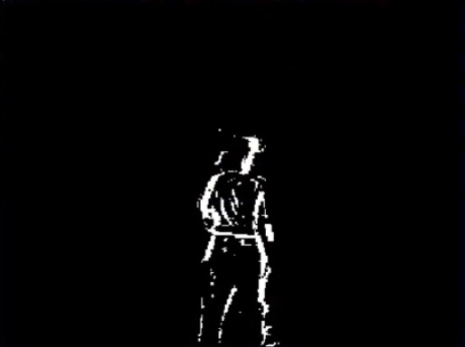
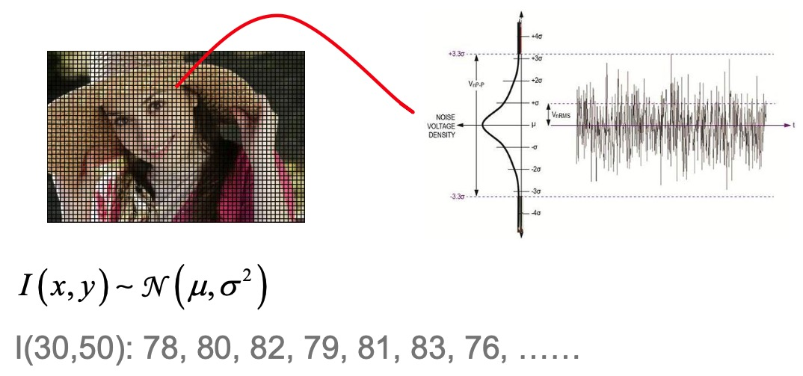
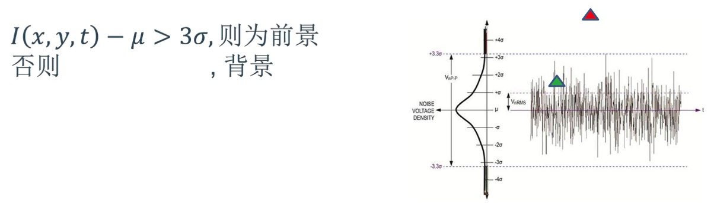
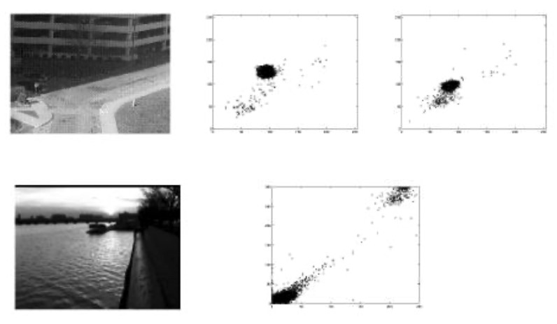
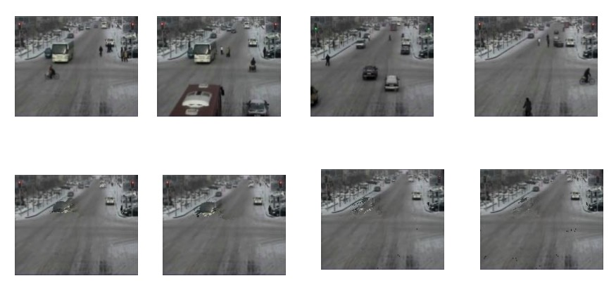
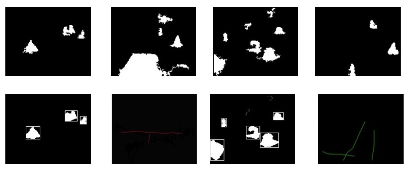

### 背景建模概述

为了完成对图像和视频的运动估计，我们需要对图像进行采集和预处理，以及特征提取等操作，所以运动估计本身要依赖于这些基本的知识来完成，在之前的一些处理流程中，我们的输入或者我们的对象都是一张图片，我们要识别这个图片中的特征，这个图片中的边缘，以及这个图片中的静止目标等等内容，换句话来说，我们需要根据一张静止的图片来对图像进行分析和理解

在生物的自然视觉中，我们会发现，除了对静止场景的理解以外，运动的估计和感知，实际上是视觉中的另外一个很重要，也是相对独立的内容，比如说，很多的动物像青蛙，对运动的目标(昆虫)特别的敏感，其实人类也具有相似的特征，比如：我们从家走到学校，我们不会记得我们走过的路上有多少棵树，景物有什么变化，但是如果有一只鸽子从我面前飞过，我们就会印象特别深，也可以很迅速的感觉到，这说明我们对运动的估计，有的时候这个灵敏度往往还要高于对静止特征的一个分析

运动估计，实际上包括两类，一类是背景静止的运动，所谓背景静止，是指的是我们的视角或者是我们的摄像机本身的位置不发生变化，比如在室外和室内的各类的监控安防摄像头。另外一类是，我们也在运动，换句话来说，我们的视角在动，目标也在动，比如我们坐在车里看目标或者是无人机上装相机，去看地面行驶的车辆，在这种情况下我们就需要用到光流估计的方法

### 相对运动的基本方式

- 相机静止，目标运动 - 背景提取(减除)
    * 我们的所有的监控安防，基本上都是相机，那么这种情况下为了检测运动的目标
    * 最直观的想法就是，如果我们用某种方式，把静止的背景给单独提取出来，那么我们检测运动的目标就很容易了
    * 只需要当前正减去我们提出来那个背景，那么剩下的就应该是我们的目标了
    * 这种基本的思想导致了一类方法，也就是我们这里说的背景提取或者背景减除的方法
- 相机运动，目标静止 - 光流估计(全局运动)
    * 在军事里，我们用一个导弹去攻击敌人的地面基地，那么这个时候相机装在导弹上，就是典型的相机运动，目标静止，这个时候，可以通过光流估计的方法
    * 在这种情况下，我们通过相机可以看到场景整体相对于相机的运动，把这种运动叫做全局运动
- 相机和目标均运动 - 光流估计

### 背景建模原理

1 ) **帧差法运动目标检测**

比如一个视频中，一个人在一个房间里走动，人就是这个场景中的运动目标，我们现在想构建一个方法，能够把这个运动的人提取出来，一个最直观的想法是：相邻两帧一减就会显示出来，具体来说，我们需要计算相邻两帧的帧差，就是相邻两帧中对应的像素相减

$$
D(x,y) = 
  \begin{cases} 
   1; & \text{如果 I(x,y,t) - I(x,y,t-1) > T } \\
   0; & \text{如果其他}
  \end{cases}
$$

- D(x, y): 帧差
- I(x,y,t): 当前帧(t时刻)图像 
- I(x,y,t-1): 上一帧(t-1时刻)图像
- T: 像素灰度差阈值

提取前：
<div align="center">
    
</div>

提取后：
<div align="center">
    
</div>

对比可知：
- 我们这个背景能很好的消除了，因为这个背景我们看到都变成了黑色
- 但是这个前景啊或者运动目标提取的效果就一般了，一般体现在两个地方
- 第1个就是，虽然整个的前景提出来的基本上是一个人的头像，但是这个中间很多地方，他都是空的，出现中间的这些空洞对我们后续去分析这个运动目标是什么以及分析这个运动目标的特征，造成很多麻烦
- 第2个呢就是在这里面有很多噪点
- 换句话来说，帧差法虽然是一个非常直观的想法，但是它做这个运动估计的话，有两个问题，因为前后帧存在重合导致的空洞问题，以及因为我们相邻两帧相减，导致我们的图像噪声被放大而引起的这个图像中的噪声问题
- 所以我们希望对帧差法进行改进，能够提取到更好的背景和运动目标

2 ) **基于高斯模型的背景建模**

<div align="center">
    
</div>

- 我们希望对帧差法进行改进，能够提取到更好的背景和运动目标，基于这个思想，我们使用基于高斯模型的建模
- 还是看我们输入视频中的一张图像，如果我们把输入视频中某一个像素给他拿出来，那么它随着时间的变化，给它做成一个曲线的话
- 我们把这个曲线可以放在右边，比如说，他在第0帧，它的灰度值是78，第1帧它的灰度值是80
- 那么依此下去，我们就可以看到，随着时间轴t再往前推进，那么纵轴是它的灰度值，那么它的变化是呈现了一个这样的变化趋势
- 进一步，如果把这个t轴放得长一点，那么就像我们图像里边画出来的一样
- 因为图像本身有噪声和光照环境的影响，在每一个时间t，虽然它是背景，但是灰度也并不是一个一直保持不变，我们可以看到这个灰度是分布在一定的范围里的
- 进一步，在高斯分布模型中，一个背景像素，它随着时间的变化虽然呈现一种随机性
- 但是如果我们把这个像素在一段时间内的灰度变化，做一个统计的话，那么我们就会发现，它分布在某一个均值和一定的方差范围内
- 在我们这里，如果我们把这些分布求一个均值的话，这个均值就是我们在这里画出来的，绝大多数像素，它的分布应该落在±3σ的范围内
- 如果我们把这个用虚线标出来的话，它就是一个近似的正态分布
- 举个例子：假设我们当前关注的坐标位置是30~50，那么假设t=0的时候是78, t=1时，是80，我们依次往下进行
- 从这个数列，我们直观的可以看到，虽然每一步都是随机的，但是基本上它分布在一个均值大概是在80左右，方差大概是1~2之间的一个数字
- 换句话来说，我们图像中每一个像素，它的灰度值随着时间变化的规律，符合一个高斯分布，我们可以画一个高斯分布的图

<div align="center">
    
</div>

- 如果这个像素本身是背景像素，那么它一定会落在这个范围内
- 换句话来说，如果一个点落到了3σ的范围外，那么我们就认为它已经不在属于背景了
- 根据这个原理，我们可以检测当前图像中，当前帧是否属于前景
- 也就是对应的像素，如果减去这个均值大于3σ的话，我们就认为它不是背景了，那么这个时候就是我们的运动目标，否则的话它就是我们的背景
- 在这个图上，绿色三角代表背景范围(虽然灰度值在不断波动)，红色三角代表运动目标范围
- 基于高斯模型的背景建模里，我们把每一个像素，它随时间的分布用一个高斯模型刻画
- 在实际中，这个像素它的灰度值变化，它的分布情况不能够简单的用一个高斯模型去描述

<div align="center">
    
</div>

- 进一步，我们对我们的建模方式进行扩展，用多个高斯模型组合起来进行刻画，简单来说就是混合高斯模型
- 基于这样一个原理，就是任何一个分布函数，都可以看作是多个高斯分布的线性加权组合
- 上图中的每一个分布函数，我们可以近似的看做：蓝线对应的高斯分布，红线对应的高斯分布以及底下不同颜色对应的虚线标出来的高斯分布的组合
- 同样对应其他的几个，虽然它的分布函数，它的形状差别很大，但是都可以用多个高斯分布的这个线性组合来代替
- 所谓线性组合，我们看到，在一个分布函数中，每个高斯分布的高低不同，这意味着它对应的加权系数不同

<div align="center">
    
</div>

- 上图表示混合高斯模型，在图像或者视频中的一个实例，这是视频中的一帧图像
- 我们随便取一个点，把它视作彩色图像，假设横轴是R分量，纵轴是G分量
- 在任何一个时间内，它肯定对应这个图像里面的一点，下一个时刻，对应另一个点
- 如果我们把很多时刻它对应的像素值都累加起来，一起放到这个图上，我们就会发现的，在一些地方出现了一个很密的黑球，同时在其他位置，都有少量的聚集
- 在这里面，我们就可以近似的把刚才这个像素它随时间的分布，看作是一个混合高斯模型，有三个分量
- 这里面越黑代表它对应的像素越多，因此它的权重也就越大，每一类的中心值恰好就是我们刚才说的高斯分布的均值
- 只不过刚才高斯分布是一维的，这里面这个高斯分布，因为有两个颜色分量，所以是二维的
- 刚才我们是画了一个时间段，它对应的一个分布情况，我们现在把同一个像素在另外一个时间段，它对应的分布情况可以拿出来
- 比如说上图的第二个图表，一个区域有可能是上午的，另一个区域有可能是下午到傍晚的
- 从视觉上来看，它是由两个高斯同步来构成的，分别两个密集度不同的区域，它们的均值分别是对应区域的中心点，权值的话越黑的越大
- 下面的水波图片是另外一类图像，水面因为水波纹的影响波光粼粼，也就是，它的亮和暗会非常迅速的来回交替
- 它对应的这个分布模型就是很多出现在很暗的地方，还有一部分出现在很亮的地方，分别对应我们的眼睛里边看到的是不是反光
- 因此对应水波纹我们可以用一个具有两个分量的混合高斯模型去描述，我们把刚才说的混合高斯模型，用我们的数学语言去描述

$$
P(I) = \sum_{q=1}^Q w_q N(I; u_q, \sigma_q^2) \\
G(I; u_q, \sigma_q) = \frac{1}{\sqrt{2 \pi} \sigma_q} e ^{-\frac{(I-u_q)^2}{2\sigma_q^2}} \\
p(x) = \sum_{q=1}^Q p(x|w_q) P(w_q)
$$

- 每一个像素，它的灰度随时间的概率密度函数也就是我们前面所说的分布，如果用P(I)来表示，I代表它的亮度，p代表概率
- 它看作是多个高斯分量的加权组合，$w$是权值，后面的$N$代表是对应的高斯分布，下标$q$代表是我们的第q个高斯分布
- 高斯分布的定义和传统的定义是一样的，在这里$u$和$\sigma$, 分别对应我们的均值和方差
- 进一步我们可以把概率密度函数可以表达为条件概率的形式，$P(w_q)$代表的是第q个高斯分布它对应的权值
- 下面我们要在线的计算$w_q, u_q, \sigma_q$，也就是混合高斯模型对应的所有参数
- 一旦这几个参数计算出来了，我们就可以计算当前像素值是否落在混合高斯模型里面，从而进一步判断当前像素是背景还是运动的前景

**混合高斯背景建模步骤**

- 首先进行**模型初始化**，将采到的第一帧图像的每个象素的灰度值作为均值，再赋以较大的方差。初值Q=1, w=1.0
    * 需要说明的混合高斯模型处理的输入是视频，也就是一帧一帧对应的连续的图像序列，我们处理首先从第一帧图像开始处理，对应图像中的每一个像素都要建立一个混合高斯模型
    * 换句话来说，比如这个图像的宽度是384，它的高度是288，那么就有10万多个像素，我们就需要对应每一个像素都建立一个混合高斯模型
    * 我们首先将采到的第1帧图像中每个像素的灰度值作为均值，再赋以较大的方差，因为我们背景建模是迭代进行的，在第1帧的时候我们肯定没有模型
    * 在第1帧会有很多很多像素，从第一个像素开始建立一个混合高斯模型，因为原来没有模型，我们就把当前这个像素的灰度值作为我们第1个高斯分量的均值
    * 比如当前灰度值如果是50的话，那么我们就要把它的均值做成50，因为我们要对它建立一个高斯分布，但只有一个图像，具体没有办法计算方差，所以给一个大一点的初值
    * 这个初值是自行设置的，如$\sigma$ 可以设置成10或20，稍大一点没关系
    * 初始值Q=1，w=1.0，Q是我们所有高斯模型的分量个数，因为我们第一帧，所以只有一个分量，这时候Q=1
    * 同样因为我们只有第1帧，所以对应的权值也是等于1的
- 第二步是**模型学习**，将当前帧的对应点象素的灰度值与已有的Q个高斯模型作比较，若满足$|x_k - u_{q,k} < 2.5\sigma_{q,k}|$，则更新(按上面方式调整第q个高斯模型的参数和权重)，否则转入下一步
    * 假设现在来了第2帧，我们还是看对应的像素，这个像素首先和我们对应的这个模型进行比较，那么看它是不是落在我们当前的高斯分量
    * 因为目前我们只有一个高斯分量，所以把它和高斯分量进行比较的时候，我们只需要看一个分量就可以了
    * 假设的第2帧它对应的这个值是53，那么我就把53和50做比较，明显它落在第1个高斯分量的内部，也就是说满足这个条件
    * 这个时候需要去调整这个高斯分量对应的参数了，有2个参数，均值和方差，因为我们有两个数据，一个是50，一个是53
    * 所以它的均值变成了51.5，它的方差，我们就可以根据这两个数算出来，这就是我们调整过程
    * 我们假设第3帧又来了，还是这个像素，加入这时候它的像素发生比较大的变化，比如说变成180了
    * 重复刚才的过程，那么还是把这个分布做比较，它明显落在一个位置，不属于这个高斯分量了
    * 因为当前只有一个高斯分量，Q是我们允许的最大高斯分量的个数，通常Q取值3~5，假设我们给它5，因为目前只有一个，所以1<5
    * 那么我们就把当前这个像素以它为一个新的高斯分量，它的均值再建立起来一个高斯分量
    * 这时候我们增加了一个新的高斯分量，那么它的均值就是180，它的$\sigma$的还是等于10
    * 假设第4帧又来了，这个值等于185，那么明显的它又落到了均值为180的高斯分量上，这时候这个高斯分量的均值变成了(180+185)/2，它的方差也可以依此计算
- 第三步是**增加/替换高斯分量** 若不满足条件，且$q<Q$，则增加一个新分量; 若q=Q，则替换
    * 这个过程依次进行，我们的高斯分量就会不断的去更新，不断的往后增加，一直增加到最大的数量，比如说它等于5的时候，这个时候我们就没有办法再增加了，我们就会替换
    * 替换的意思就是假设我们已经有了5个分量，现在又来了一个新的分量，我们就要把对应权值最小的一个给去除，因为权值越小，它起的作用就越小
- 第四步是**判断背景** $B = arg_b min(\sum_{q=1}^b w_q > T)$
    * 最后，假设经过了1000帧，背景已经基本建立起来了，那1001来了以后，我们怎么样判断当前这个像素它是不是属于背景，需要用上面这个公式来判断
    * 比如我们现在有5个高斯分量，它们对应的权值分别是：0.4，0.3，0.18，0.06，0.06，把这几个权值按照从大到小的顺序排列，这里已经是有序的了
    * 进一步，我们分别把权值进行累加，然后再取一个t，通常t取值0.6~0.9之间的数，这里我们取值0.6
    * 那么我们就说，前面两个是背景分布对应的高斯分量，换句话来说，我们就认为后面三个是因为噪声或其他因素的影响
    * 我们就认为如果是当前像素，属于这两个比较大的分布，可以认为它是一个背景像素
- 第五步是**判断前景**
    * 反之，我们认为它不是一个背景，或者说它就是一个运动目标的一个像素

### 混合高斯模型具体的计算过程

**混合高斯模型迭代计算原理**

- 我们对应每一个高斯模型，都要计算三个参数，分别是这个高斯模型对应的权值，均值和方差
- 这里的计算采用迭代计算，也就是当前帧对应的权值$w_q(k+1)$等于上一帧的权值$w_q(k)$，再加上一个二值化函数$M_q(k+1)$

$$
w_q(k+1) = (1 - \alpha) w_q(k) + \alpha M_q(k+1) \\
u_q(k+1) = (1 - \rho)u_q(k) + \rho I(k+1) \\
\sigma_q^2(k+1) = (1 - \rho)\sigma_q^2(k) + \rho(I(k+1) - u_q(k+1))^2 \\
\rho = \alpha G(I(k+1);u_q, \sigma_q)
$$

- Mq(k)为二值化函数，仅当像素值匹配第q类时取1，其余为0
    * 这个二次函数的意思就是根据刚才我们的步骤，当前这个像素如果属于我们要处理的这个分布，也就是第q个分布
    * 那么M就等于1，反之为0
- $u_q(k+1)$ 和 $\sigma_q^2(k+1)$ 也按照类似的方式来进行计算，那么$\alpha$和$\rho$是对应我们的学习速率，实际上是取大于0小于1之间的数
    * 明显的我们说这个$\alpha$取值越大，实际上这部分信息它的作用率越小
    * 换句话说，当这个$\alpha$越大的时候，学习当前的信息就越快，对于过去也就遗忘的越快
    * 在正常情况下阿尔法的取值，一般是0.005~0.05之间的数
- 类别数取值不大于5
    * 通常的话我们去3~5之间的数

### OpenCV 对混合高斯模型背景估计的实现

1 ) **C++关键代码**

```cpp
resize(source, image, Size(source.cols/2, source.rows/2), INTER_LINEAR);

if(foreGround.empty())
    foreGround.create(image.size(), image.type());

pBgModel -> apply(image, fgMask);

GaussianBlur(fgMask, fgMask, Size(5,5), 0);
threshold(fgMask, fgMask, 10, 255, THRESH_BINARY);

foreGround = Scalar::all(0);
image.copyTo(foreGround, fgMask);

pBgModel -> getBackgroundImage(backGround);

// 显示原始图像及背景，前景
imshow("Source", source);
imshow("Background", backGround);
imshow("ForeGround", foreGround);
```

2 ) **Python关键代码**

```python
cap = cv2.VideoCapture(videoFileName)
fgbg = cv2.createBackgroundSubtractorMOG2()
thresh = 200

count = 0
while True:
    ret, frame = cap.read()
    if not ret: # 没有读取到当前帧，结束
        break
    
    fgmask = fgbg.apply(frame)
    bgImage = fgbg.getBackgroundImage()

    # OpenCV 4.x用法， 3.x需要使用_, cnts, _ 这样
    cnts, _ = cv2.findContours(fgmask.copy(), cv2.RETR_EXTERNAL, cv2.CHAIN_APPROX_SIMPLE)
```

- 在OpenCV里实现了混合高斯模型运动估计的一个类
- 具体来说有两个核心的函数分别是`apply`, 也就是执行混合高斯模型的背景更新
- 以及`getBackgroundImage`，得到我们提取的背景图像

### 背景建模处理实例

使用我们前面说的这个混合高斯模型，对一个实际的视频进行处理

<div align="center">
    
</div>

- 这里第一排有四张图像分别是原视频序列中的第281，477，1072，1399帧图像
- 这个图像是在北方某个路口拍摄的，摄像机静止不动，运动的目标包括车，行人
- 下面一排四张图表示某一时刻提取出的背景
- 根据时间来说，一开始没有完全剔除干净，最后一张表示已经非常干净了，和我们感受到的背景一致
- 最后一张图里有车，是因为这个车一直没有动，于是就作为了背景

<div align="center">
    
</div>

- 这里是提取的前景图像和轨迹跟踪结果
- 前景像素用白色表示，下一排表示用图像分割方法来进行分割前景
- 通过连线可以看到运动目标和轨迹

### 总结

- 背景静止时(摄像机静止)，可以使用基于背景提取的运动估计方法计算运动目标
    * 背景静止表示不运动，并不是背景里所有像素的灰度值是恒定的
    * 实际上由于传感器的噪声和背景的光照影响，光线和传感器都会导入噪声，特别是凌晨，傍晚，黄昏时候，噪声值很大
    * 如果不使用基于混合高斯模型的话，就没有办法提取出来运动目标
- 混合高斯模型可模拟任意概率密度函数，是背景建模的主流方法
    * 当今几乎所有的安防和交通监控中，广泛使用
- 混合高斯模型参数采用迭代方式计算