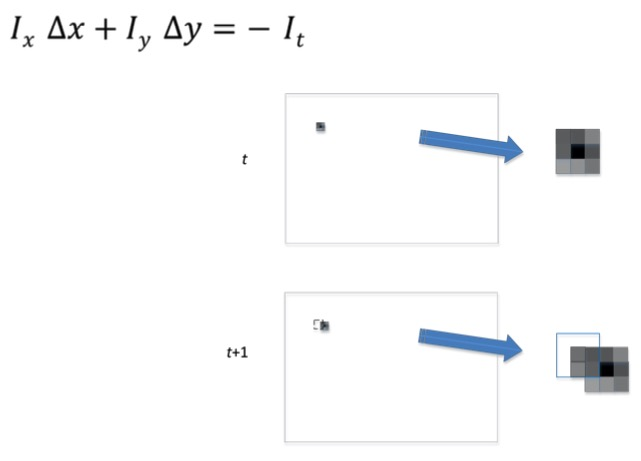
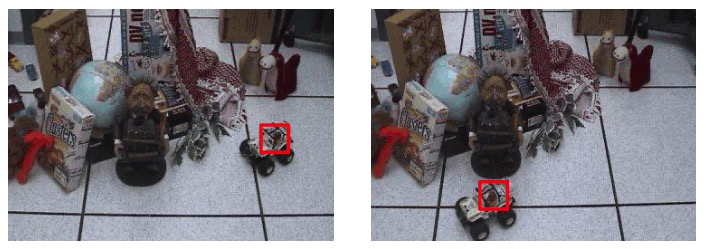
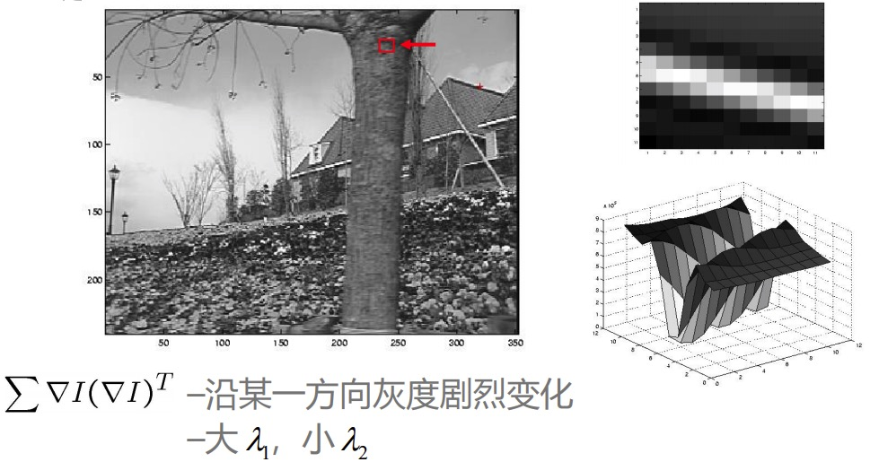
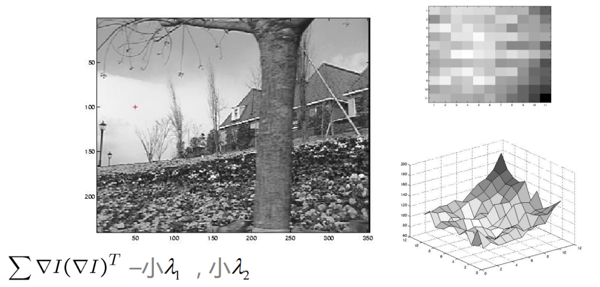
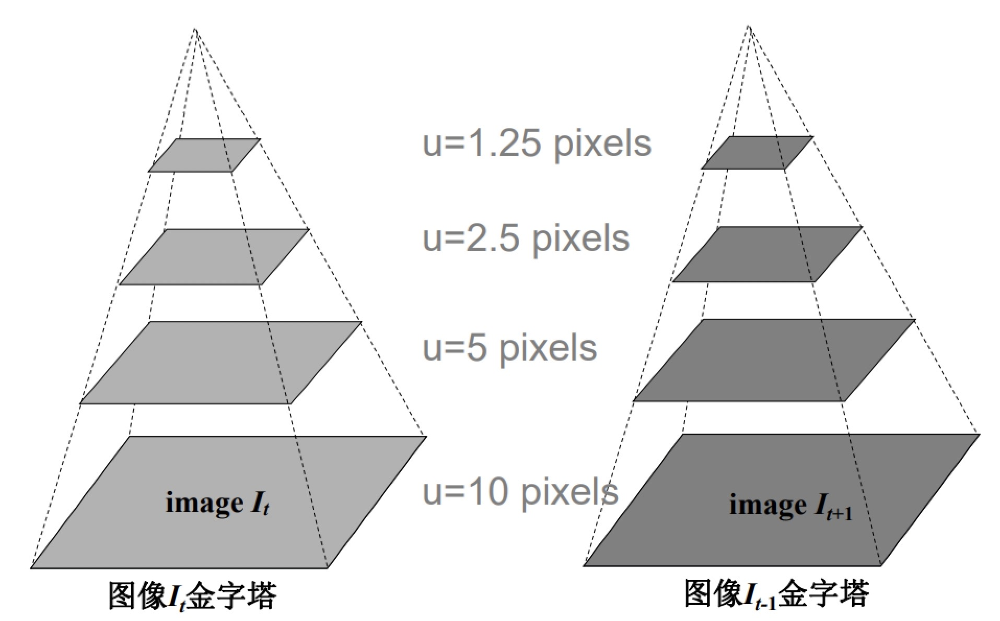
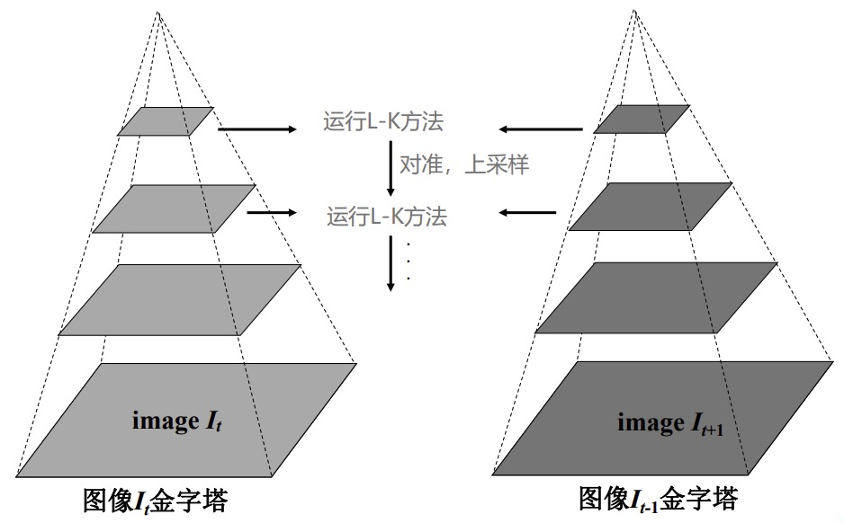
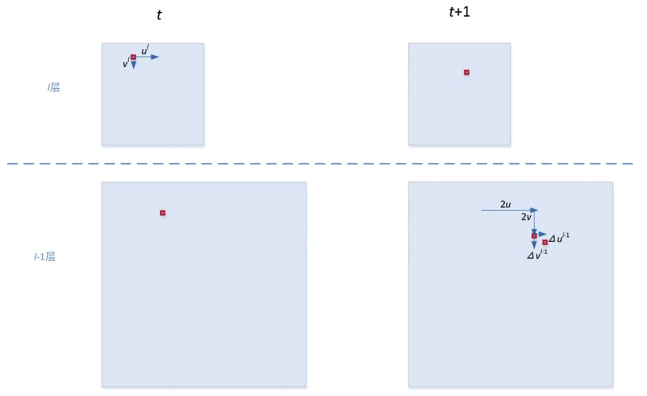
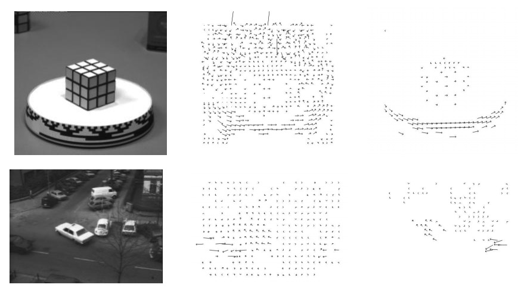
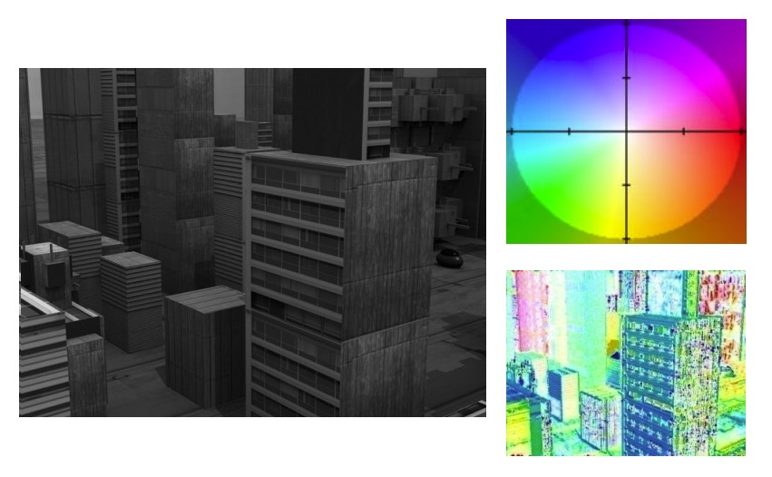

### 光流估计概述

- 基于运动估计的背景提取方法适用于摄像机静止的时候，能够得到比较理想的运动目标的估计效果
- 当背景运动或者是背景和目标都运动的时候，基于背景提取的方法不再使用，这时候就需要用到光流估计方法

### 光流估计解决的问题

1 ) 通用的来说

- 目标在动，背景也在动
- 识别目标和背景

2 ）**用数学的方法来描述**

- 在每个像素(x,y)处，假设在第t帧的时候，它对应的亮度值是$I(x,y,t)$
- 在t+1的时刻，移动了 $I(x + \Delta x,y + \Delta y, t + 1)$, 进一步使用泰勒展开

$$
I(x + \Delta x,y + \Delta y, t + 1) \\
= I(x,y,t) + \frac{\partial I}{\partial x} \Delta x + \frac{\partial I}{\partial y} \Delta y + \frac{\partial I}{\partial t}
$$

- 后面这三项$\frac{\partial I}{\partial x} \Delta x + \frac{\partial I}{\partial y} \Delta y + \frac{\partial I}{\partial t}$ 分别对应的是，I对x, I对y, I对t 进行求导的对应项，从数学角度来说，为了泰勒展开可以使用，$\Delta x, \Delta y$ 应该充分的小，其次这三个偏导项本身是存在的
- 换句话来说，我们要求当前图像在x,y方向和t轴上应该是充分光滑的，实际中图像本身没有剧烈的变化，图像在相邻两帧中变化不大
-  那么我们从数据中也知道，为了这个展开怎么使用，首先x得车牌应该充分的小骑士这三个选项，它本身应该是存在换句话来说。

因此有：

$$
I(x,y,t) + \frac{\partial I}{\partial x} \Delta x + \frac{\partial I}{\partial y} \Delta y + \frac{\partial I}{\partial t} = I(x,y,t) \\

=> \\

\frac{\partial I}{\partial x} \Delta x + \frac{\partial I}{\partial y} \Delta y + \frac{\partial I}{\partial t} = 0 \\ 

=> \\

I_x \Delta x + I_y \Delta y = - I_t
$$

- $I_x, I_y, I_t$ 分别对应当前图像在当前的像素(x,y)，它在x方向，y方向，t轴方向的偏导数，当给定2帧图像时，对应的偏导数是可求的，可使用差分来代替
- 所以 $I_x, I_y, I_t$ 都是已知的，$\Delta x, \Delta y$ 是这个像素在相邻的两帧的位移值
- 我们的任务是求$(u,v) = (\Delta x, \Delta y)$, 存在的困难是在一个方程中，有两个未知数

这里有一个示意图

<div align="center">
    
</div>

- 假设有一个像素在t帧和t+1帧有一个微小的位移
- 这个表达式，也就是光流估计基本方程 $I_x \Delta x + I_y \Delta y = - I_t$ 
- 这个方程基本思想是：从t到t+1帧运动过程中，因为灰度是连续变化的，在之前位置灰度值也变化，通过像素变化推演中心点大概走了多少
- 换句话来说，通过当前位置亮度在x和y方向，以及它在相邻两帧中灰度的变化值$I_t$, 去估计 $\Delta x, \Delta y$就是光流估计的基本思想
- 对应一个方程求解2个未知数显然是做不了的，进一步看下是不是有其他的附加条件可以用
- 当图像足够大的时候，有很高的分辨率，这时候在一个像素周围画一个领域，比如下图的红框，我们近似认为这个小临域内，所有点的位移都是相同的

<div align="center">
    
</div>

- 比如说这个方框是3 * 3的像素，对应第一个像素而言，基本的光流方程是 $I_{x_1} u + I_{y_1} v = - I_{t_1}$, 对应3 * 3里的所有像素，它都有 $I_{x_i} u + I_{y_i} v = - I_{t_i}$
- 进一步把表达式写成矩阵的形式，也就是

$$
\begin{bmatrix}
I_{x_1} & I_{y_1} \\
I_{x_2} & I_{y_2} \\
. \\
. \\
.
\end{bmatrix}

\begin{bmatrix}
u \\
v
\end{bmatrix}

= -

\begin{bmatrix}
I_{t_1} \\
I_{t_2} \\
. \\
. \\
.
\end{bmatrix}
$$

- 每一行对应一个像素，右边乘上对应一个位置向量，$u$和$v$分别对应$\Delta x, \Delta y$, 把所有的行放在一起，构成了一个矩阵方程
- 简写为 $Au = b$

$$
A = \begin{bmatrix}
I_{x_1} & I_{y_1} \\
I_{x_2} & I_{y_2} \\
. & . \\
. & . \\
. & . 
\end{bmatrix} 

\ 

u = \begin{bmatrix}
u \\
v 
\end{bmatrix} 

\ 

b = \begin{bmatrix}
I_{t_1} \\
I_{t_2} \\
. \\
. \\
.
\end{bmatrix} 
$$

- 根据表达式，我们要求u, 而A，b矩阵中的所有元素都是已知的
- 这个问题等同于求解一个最小化的问题，$Au = b$ 就是求解 $min ||Au - b||$，也就是$Au - b$的范数最小值
- 这个实际上就是一个最小二乘的问题，最终得到这个表达式 $u = (A^TA)^{-1}A^Tb$
- 需要注意的是$(A^TA)$要可逆
- 区域像素只有2个时，就是2元一次方程组求解，多个像素，如3 * 3时，则是求上述最小二乘解

### L-K光流估计方法

- 其中L(Lucas)和K(Kanade)方法分别是第1次提出这类光源工具方法的两个作者名
- **思路**：在一个小的图像邻域内所有像素的速度近似一致
    * 求中心点的速度，如果和中心点距离越远，那么和中心点关联越小，需要加一个权值w, 这个权值和当前中心点的位置，和中心点的距离有关
- **约束**：$E(\Delta x, \Delta y) = \sum_i w_i^2(I_{x_i} \Delta x + I_{y_i} \Delta y + I_{t_i})^2$
- $min E(\Delta x, \Delta y)$
- 对应

$$
\begin{bmatrix}
w_1 & 0 & 0 \\
0 & ... & 0 \\
0 & 0 & w_N
\end{bmatrix} 

\ 

\begin{bmatrix}
I_{x_1} & I_{y_1} \\
I_{x_2} & I_{y_2} \\
. & . \\
. & . \\
. & . 
\end{bmatrix} 

\ 

Au = 

\begin{bmatrix}
w_1 & 0 & 0 \\
0 & ... & 0 \\
0 & 0 & w_N
\end{bmatrix} 
b
$$

- 求解后可得到 $u = (A^TW^2A)^{-1}A^TW^2b$， $W$对应的是权值矩阵
- 再来看下可逆是否可以实现，也就是可信度判断

$$
A^TA = 
\begin{bmatrix}
\sum I_xI_x & \sum I_xI_y \\
\sum I_xI_y & \sum I_yI_y
\end{bmatrix} 

= \sum

\begin{bmatrix}
I_x \\
I_y
\end{bmatrix}

\begin{bmatrix}
I_x & I_y
\end{bmatrix}

= \sum

\nabla I(\nabla I)^T
$$

- 在这个表达式里面，它实际上是和当前图像沿着x和y方向的梯度是密切相关的，如果$I_x$ 和 $I_y$ 有一项为0的话，对应的项则是0, 这时候$A^TA$就是不可逆的
- 什么情况下，这个图像沿着x和y方向求偏导接近于0呢，一定是这个图像中对应的位置灰度变化相对平坦，比如全黑的区域，所有像素值都一样，所以$I_x$和$I_y$都等于0
- 显然在这个区域里面我们是没有办法计算光流的，因此，我们计算光流的时候，要求图像对应的位置要有充分的特征，或者说沿着x和y方向灰度变化都比较充分
- 进一步从数学上，判断一个矩阵是否可逆，可以通过特征值来判断，进一步可以对这个矩阵求特征值，如果两个特征值远大于0的话，说明求逆是可靠的
- 换句话说如果有一个接近0，这时候求逆操作不可靠，这个时候这个矩阵就很难求逆了

### 实例

<div align="center">
    
</div>

- 在这幅图片上要计算光流，取一点附近的一个小临域(红框)来看一下
- 刚才的表达式$A^TA = \sum\nabla I(\nabla I)^T$
- 进一步，我们要分析这样的一个2 * 2的一个矩阵，它对应的特征值，假设这个特征值，其中的一个比较大，另外一个比较小
- 我们看一下具体的图像，很显然，在这个局部临域放大的图像中，我们看到它沿着边缘的切线方向(斜着的白色区域)，它的灰度值是近似的变化比较小的
- 而沿着法向方向灰度值是剧烈变化的，推动只有一个图片，我们如果把三维图展开，那么就是上图右下角这样一个形式
- 对应这样的一个形状，我们就说，沿着某一个方向灰度发生了剧烈的变化，而沿着另外一个方向的灰度几乎保持不变
- 可以想象对应这样的一个情形，我们在计算的时候，$A^TA$求逆的话必然是接近0的，因为小的$\lambda$接近主宰整个边缘情况
- 所以说如果灰度沿着一个方向剧烈变化的时候，矩阵是几乎不可逆的，这个表达式和Harris算子的表达式实际上是完全一致的
- 也就是说，实际上对于Harris算子，角点比较明显的地方，那么我们具有两个很大的特征值，这个时候我们计算L-K光流可以得到比较好的结果
- 如果仅有一个比较大的特征值的话，计算的结果不会太好

<div align="center">
    
</div>

- 进一步我们看如果两个特征值都比较小，对应灰度变化比较平缓的区域(也就是低纹理区域，上图红色加号)
- 这个时候我们说$A^TA$的特征值，两个都接近0，那么对于这种情况我们说，$A^TA$, 它接近不可逆的，同样得不到好的L-K光流计算结果
- 综合刚才的分析，我们就说对应的原始图像，如果在两个方向都有比较明显的灰度变化，也就是如果这个点是一个近似的角点的话，那么我们才可以得到比较好的光流计算结果
- 对于Harris算子, 一个图像里有比较好的特征点(明显的角点特征)，一般只占所有点的0.5% ~ 5%的数量
- 也就是说，尽管我们在所有的点都可以应用L-K的计算公式，在一个图像中真正能够计算到比较好的光流点，往往只占这个图像的0.5% ~ 5%，也就是很小的数量，这也是L-K方法的局限
- 因为图像中很少的一些点可以计算光流，所以我们把这类光流计算方法称为稀疏光流算法
- 在前面推导光流基本方程的时候，有一个假设，就是在x和y方向的位移都不能太大，因为我们使用了泰勒展开，泰勒展开一定要在某一点的临域处进行展开
- 但在实际中往往某些点或者目标的运动，很快，比如说飞驰的汽车，飞机，用原始的方法就没有办法进行处理了，需要我们进一步进行扩展

<div align="center">
    
</div>

- 扩展的基本思路也很直接，采用图像金字塔的方法，简单来说对应任何一个图像，我们把原始的分辨率缩小一半，得到比较小的一个图像
- 按照这个步骤，一步一步的重复，最后我们把这个图像按照从小到大的顺序排列，我们就建立起了一个图像金字塔
- 我可以想象假设在原始的图像中，某个点的位移是10个像素，那很显然这是一个非常大的位移，没有办法用泰勒展开的方式来做
- 当我们同样的尺度缩小一半的时候，那么这个位移对应也是原来的一半，进一步，分辨率越往上，那么对应的位移和像素数也就越少
- 因此到达金字塔的顶端的时候，我们说这个位移一定可以充分的小，那么在这个尺度下，我们就可以计算我们的L-K光流
- 进一步，如果我们能找到一种方法，把在金字塔顶端图像计算的光流按照某种方式依次传递到原始图像上就解决了对大位移的估计问题，也就是金字塔L-K方法

<div align="center">
    
</div>

- 简单来说，金字塔L-K方法是首先我们有两帧原始图像，分别是$I_t, I_{t+1}$
- 我们分别对这两个图像建立图像金字塔，我们在最顶端的图像上，运行我们的L-K光流估计方法，得到一个初始的位移估计值
- 进一步我们采用对准和上采样的方式，所谓上采样，就是假设原始分辨率是20×20，那么经过上采样以后，分辨率提高一倍，变成40×40，具体的提高的方式可以采用图像插值
- 进一步，在稍微大一些的图像中，再运行L-K方法，那么这个L-K方法运行的时候是在上一步光流估计完，和用初始值对准完了基础之上再运行
- 这种方式依次进行，直到我们最终到达原始分辨率的图像
- 进一步看下通过数学公式来详细描述
    * l层是分辨率较粗的层，也就是接近顶层
    * 得到了第l层的光流位移估计结果 $\hat{d}^l = (WA^l)^+Wb^l$

这里是第l层

$$
J(d^l;u) = \sum_{x \in \Omega_u^L} w^2(x) \{\nabla^TI^l(x,t)·v^l + (I^l(x, t+\nabla t) - I^l(x,t))\}^2 \\

\hat{d}^l = (WA^l)^+Wb^l \\

d = 
\begin{bmatrix}
\Delta x \\
\Delta y
\end{bmatrix}
$$
   
这里是第l+1层, 分辨率更高

$$
I^{l-1}(u + 2d^l + \Delta d^{l-1}, t + \Delta t) = I^{l-1}(u, t) \\
\nabla I^{l-1}(u+2d^l, t+\Delta t) · \Delta d^{l-1} = I^{l-1}(u,t) - I^{l-1}(u+2d^l, t+\Delta t) \\
\Delta \hat{d}^{l-1} = (WA^{l-1})^+ Wb^{l-1}
$$

这里是金字塔光流位移传播示意图来进行说明

<div align="center">
    
</div>

- 假设在第l层，我们第t帧的图像上的一点运动了t+1帧图像的另一个点
- 我们初步估计到了一个结果，分别对应的是x轴的位移u和y轴的位移v
- 进一步在分辨率更精一些的层次，我们知道这两个分辨率相差2倍
- 所以原来的水平和垂直方向的位移经过上采样，就变成了二倍的u和二倍的v
- 在进行光流估计的时候，我们不是在初始位置进行估计了，而是在移动后的位置进行估计了，我们实际上要估计这个点的$\Delta u, \Delta v$的值
- 从这个图可以看出，因为有上一层位移的传导，所以我们在下一层我们要估计的$\Delta u, \Delta v$的值已经充分的小了，满足泰勒展开的条件

### OpenCV实现光流估计

- C++版本
    ```cpp
    void calcOpticalFlowPyrLK(InputArray prevImg, InputArray nextImg, InputArray prevPts, InputOutputArray
    nextPts, OutputArray status, OutputArray err, Size winSize=Size(21,21), int maxLevel=3, TermCriteria
    criteria=TermCriteria(TermCriteria::COUNT+TermCriteria::EPS, 30, 0.01), int flags=0, double
    minEigThreshold=1e-4 )
    ```
    * `prevImg`，第一帧图像
    * `nextImg`，第二帧图像
    * `prevPts`， 第一帧图像中的所有特征点向量
    * `nextPts`， 第二帧图像中的所有特征点向量
    * `status`，输出状态向量；如果相应点光流被发现，向量的每个元素被设置为1，否则，被置为0
    * 注意：L-K光流估计方法是针对所有的特征点进行估计，也就是说我们在进行L-K估计之前，我们要得到图像中具有明显的灰度变化的特征点
    * 通常可以使用Harris角点检测算子或者其他的检测算子来得到这样的特征

- Python版本
    ```python
    nextPts, status, err = cv.calcOpticalFlowPyrLK( prevImg, nextImg, prevPts, nextPts[, status[, err[,
    winSize[, maxLevel[, criteria[, flags[, minEigThreshold]]]]]]] )
    ```

### 光流估计示例

<div align="center">
    
</div>

- 这里是一个魔方图，实际中，魔方按照逆时针方向旋转
- 在右侧我们使用L-K方法得到了光流估计图，图中的每个箭头大小代表我们估计出来的运动的矢量的矢径大小，它的方向代表运动的方向
- 从这个图来看，首先能明显的看出来它的运动趋势，我们看到在魔方中所有对应的角点的运动和运动趋势是一致的，那么这说明我们的L-K方法是基本合理的
- 下面这个图片，这里其实有三个运动目标，路上左侧和右侧的2辆黑车，一辆正在转向的白车，通过L-K估计，可以看到白车运动最明显和真实情况一致
- 最右侧的车运动显得有些散乱，这是因为这个车纹理和背景接近，如果L-K估计比较准的话，需要它的灰度有明显的差别
- 最左侧的车估计完后，基本看不出来，是因为这个车和背景几乎融为一体，没有办法得到好的角点特征，所有估计没有办法进行

<div align="center">
    
</div>

- 这个图是一个人工合成的图，要针对相邻两张图片进行运动估计
- 除了刚才矢径的表达方式，这里通过颜色给出了另外一种运动的表达
- 具体来说，就是一个运动，假设我们给它归一化以后对应一个向量(假设通过原点做30°角的向量)
- 这个向量始端对应的这点是什么颜色的，我们就把这一点对应的运动值标记成什么颜色
- 从原始图像估计出来的运动是右下角的彩色图片的结果，从这个结果来看，对应大位移的位置它的颜色相对来说较深
- [更多测试图片下载](http://vision.middlebury.edu/flow/)

### 总结

- 光流估计基于恒定亮度假设模型
    * 假设相邻两帧运动的时间间隔足够小
    * 同一个点在相邻2帧亮度近似保持不变
- L-K光流估计方法利用了邻域内的运动不变性
    * 假设图像分辨率足够高
    * 在一个小的3 * 3 或 5 * 5的窗口内，每个点的运动向量完全一致
- 通过金字塔L-K方法可有效提高光流计算对大位移的鲁棒性