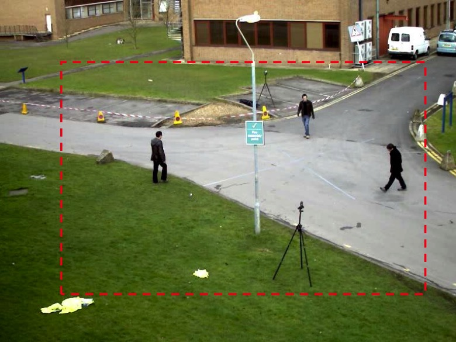

### 通过OpenCV完成基于背景提取的运动估计

- 基于背景的运动估计假设摄像机静止不动，在安防或者是交通监控场合，通常满足这样的条件
- 要求
    * 给定一个视频，用红线的虚线框框定了需要检测的区域
    * 我们需要根据输入的图像序列，检测当前框中所有的运动目标，并且标示出来每一个目标的外接矩形，能够判断这个目标的类别
    * 换句话来说就是针对一个视频标出来这个视频里面运动的各种目标(比如：人)
- [视频资源下载](https://github.com/AI-System/ai-learning-material/blob/master/assets/video/vtest.avi)

<div align="center">
    
</div>

- 上面这张图是经典的PETS测试视频
- PETS最开始是在2000年一个有名的国际会议中提出来的，专门用来测试各种算法
- 后来，大家做这类算法都把这个PETS中的视频作为我的算法的一个测试方式，紧接着PETS每一年或者两年都要更新一次，直到几年以前停止更新
- 在用的时候，通常会看到这个视频，通常会有PETS2000, PETS2001, PETS2004等标志，后面数字代表它出现的年份

**思路**

- 首先我们要进行**视频采集**
    * 在使用测试视频的时候，直接打开当前的视频，取到当前的图像就可以了
    * 在实际中，比如要做一个实际的闯红灯抓拍或者是交通视频检测的应用，就需要用到具体的视频采集模块，和外界使用的摄像机进行搭接
- 采集到当前的图像以后，需要进行**图像的预处理**
- 然后是**背景提取**：根据当前采集的图像提取当前的背景
- 进一步是**前景的分割**：根据背景得到我们的前景(把我们的前景从我们的图像中抠出来)
- 然后需要对分割的前景进行**图像的特征描述以及目标分析**
    * 在这个PETS测试视频中比较简单，都是人
    * 在交通视频里面前景包括大大小小的车辆，以及其他的行人
    * 这个时候就需要进一步的通过不同的特征来细化我们感兴趣的目标
- 最终通过目标分析包括轨迹分析，轨迹生成，得到我们最终需要的结果

### 具体程序示例

1 ） **C++版本**

```cpp
#include "opencv2/opencv.hpp"

using namespace cv;
using namespace std;

int labelTargets(Mat &src, Mat &mask, int thresh=100);

int main() {
    // 测试视频路径
    char *fn = 'vtest.avi';
    // 用于打开视频并采集帧
    VideoCapture cap;
    Mat source, image, foreGround, backGround, fgMask;
    // 用于背景提取 
    // createBackgroundSubtractorMOG2参数更多
    // 也支持createBackgroundSubtractorMOG
    Ptr<BackgroundSubtractor> pBgModel = createBackgroundSubtractorMOG2().dynamicCast<BackgroundSubtractor>();

    // 打开当前对应视频
    cap.open(fn)
    if(!cap.isOpened()
        cout << "无法打开视频文件" << fn << endl;
    // 通过循环取出当前视频中的所有图像帧，将帧存到source变量
    for(;;) {
        cap >> source;
        if(source.empty())
            break;
        // 背景建模需要对图像中的每个像素都要建立一个混合高斯模型，图像很大，建模时间就会很长，不利于时时的处理
        // 将图像大小缩半
        resize(source, image, Size(source.cols/2, source.rows/2), INTER_LINEAR);
        // 第一帧，没有背景，首先，创建空白背景
        if(foreGround.empty()) 
            foreGround.create(image.size(), image.type());
        // 通过指向BackgroundSubtractor的指针pBgModel，执行其中的apply方法完成背景的更新
        // 第一个参数是当前采集到的图像帧，第二个参数是经过背景更新，得到的前景对应的掩膜，并且是一个二值化的图像，白色代表检测到的前景的像素
        pBgModel -> apply(image, fgMask);

        // GaussianBlur(fgMask, fgMask, Size(5,5), 0)
        threshold(fgMask, fgMask, 30, 255, THRESH_BINARY);

        foreGround = Scalar::all(0);
        // 拷贝对应前景的掩膜进行image拷贝，其他不出现前景像素的地方，拷贝完成后啥也没有
        image.copyTo(foreGround, fgMask);
        // 标记找到的运动目标，对图像进行分割和标记
        int nTargets = labelTargets(image, fgMask);
        count << "共检测到 " << nTargets << " 个目标" << endl;

        // 通过getBackgroundImage 取得时时更新后的背景图像
        pBgModel -> getBackgroundImage(backGround);

        // 显示原始图像及背景，前景
        imshow("Souce", image);
        imshow("Background", backGround);
        imshow("Foreground", foreGround);
        imshow("Foreground Mask", fgMask);

        // 以下检测是否终止(按下ESC终止，对应ASCII 27)
        char key = waitKey(100); // 每一帧等待100ms
        if(key == 27)
            break;
    }

    waitKey(0);
}

int labelTargets(Mat &src, Mat &mask, int thresh) {
    // 以下是图像分割
    Mat seg = mask.clone();
    vector<vector<Point>> cnts;
    // 对当前图像进行分割，结果存放于cnts变量中
    findContours(seg, cnts, RETR_EXTERNAL, CHAIN_APPROX_SIMPLE);

    // 进行筛选
    float area;
    Rect rect;
    int count = 0;
    string strCount;

    // 建立一个循环
    for(int i=cnts.size() - 1; i >= 0; i--) {
        // 把每一个目标对应的轨迹存放于c中
        vector<Point> c = cnts[i];
        // 计算每一个目标对应的面积
        area = contourArea(c);
        // 滤除面积小于thresh的分割结果：可能是噪声
        if(area < thresh)
            continue;
        count ++; // 统计运动目标数量
        // count << "blob" << i << " : " << area << endl;
        // 得到当前目标对应的外接矩形
        rect = boundingRect(c);
        // 在原始图像上画出包围矩形，并给出每个矩形标号
        rectangle(src, rect, Scalar(0,0,0xff), 1)

        stringstream ss;
        ss << count;
        ss >> strCount;
        // 将目标编号通过文字显示出来
        putText(src, strCount, Point(rect.x, rect.y), CV_FONT_HERSHEY_PLAIN, 0.5, Scalar(0, 0xff, 0));
    }
}

```

2 ) **Python 版本**

```python
import cv2 as cv
import random

videoFileName = 'vtest.avi'

cap = cv.VideoCapture(videoFileName)
fgbg = cv.createBackgroundSubtractorMOG2()  # 创建背景提取对象
kernel = cv.getStructuringElement(cv.MORPH_ELLIPSE,(3,3))
thresh = 200

# 定义颜色列表 5种
colorList = [(0, 0, 0xff), (0, 0xff, 0), (0xff, 0, 0), (0, 0xff, 0xff), (0xff, 0xff, 0)]

def getColor(i):
    '''通过函数索引获取相应颜色'''
    l = len(colorList)
    if i > l - 1:
        i = l % i
    return colorList[i - 1]

def randomColor():
    '''随机颜色函数'''
    # 使用这个，效果不是很好
    # 这里的顺序是bgr不是rgb
    b = random.randint(0, 255)
    g = random.randint(0, 255)
    r = random.randint(0, 255)
    return (b, g, r)

def labelTargets(frame, fgmask, thresh):
    ''' 用于标记目标的函数 '''

    # 对前景图像各个目标进行计算
    # bin, cnts, heir = cv.findContours(fgmask.copy(), cv.RETR_LIST, cv.CHAIN_APPROX_SIMPLE)
    _, cnts, _ = cv.findContours(fgmask.copy(), cv.RETR_EXTERNAL, cv.CHAIN_APPROX_SIMPLE)

    # 用于统计计数
    count = 0

    # 开始处理每个轮廓
    for c in cnts:
        # 这里的面积是前景轮廓面积
        area = cv.contourArea(c)
        # 获取位置，宽、高
        x, y, w, h = cv.boundingRect(c)

        # 这里要跳过坐标为(0,0) 它是整个图像画面, 还要跳过区域面积小于指定阈值的
        if ((x == 0 and y == 0) or area < thresh):
            continue

        # 获取一种随机颜色，用于标记矩形
        # color = randomColor()
        color = getColor(count)

        count += 1

        # 在当前帧上绘制矩形圈出运动目标
        cv.putText(frame, str(count), (x, y), cv.FONT_HERSHEY_PLAIN, 2, color)
        cv.rectangle(frame, (x, y), (x + w, y + h), color, 2)
        cv.drawContours(frame, c, -1, (0, 0, 255), 2) # 绘制轮廓

        # 输出每个矩形框的位置和大小
        print("第{}个矩形框的坐标位置是：({}, {}), 周长是: {}, 面积是: {}".format(count, x, y, 2 * (w + h), w * h), end="  \n")

    if count:
        print('经统计, 共{}个目标'.format(count, end=" \n"))

# 通过循环读取视频中的每一帧图像
while True:
    ret, frame = cap.read()
    # 没读到当前帧，结束
    if not ret:
        break

    # 通过apply时时更新当前图像，计算出前景对应的掩膜图像
    fgmask = fgbg.apply(frame)
    # 对前景掩膜图像初步进行过滤
    fgmask = cv.morphologyEx(fgmask, cv.MORPH_OPEN, kernel)  # 开运算，去噪点
    _, fgmask = cv.threshold(fgmask, 30, 0xff, cv.THRESH_BINARY)

    # 得到时时更新后的背景图像
    bgImage = fgbg.getBackgroundImage()

    # 开始标记各个分割目标
    labelTargets(frame, fgmask, thresh)

    # 用于分隔输出
    print()

    # cv.imshow('Background', bgImage)
    cv.imshow('frame', frame)
    # cv.imshow('fgmask', fgmask)  # 显示每一帧图像对应的前景提取结果

    # 每一帧间隔 30ms
    key = cv.waitKey(150)
    # 按下ESC键，退出
    if key == 27:
        break

# 释放资源
cap.release()
# 关闭窗口
cv.destroyAllWindows()
```

3 ) **运行结果**

<div align="center">
    
</div>

- 注：图片较大，需要网络流畅以及github资源的可访问性
- 采用混合高斯模型的背景提取建模，可以有效的检测出运动目标，同时检测结果可能存在目标的粘连，噪声等

4 ） **进一步可改进程序**

- 实现红虚线框区域检测
- 实现轨迹分析(识别运动方向和路线)
- 对前景目标进行分析(目标识别与分类)
- 改善效果(减少阴影/目标粘连)

### 通过OpenCV实现基于光流的运动估计

- 还是基于PETS测试视频的一段
- 同样，这个背景是静止的，那么前景的运动基本上是人
- 要求：
    * 使用光流估计算法，跟踪给定视频或者摄像头采集图像中的运动的特征点
    * 在我们这里对应的就是这个人身上的一些特征点

**思路**

- 首先还是要通过**视频采集(获取视频中当前帧图像)**
    * 采集我们事先的存储的视频
    * 或者是当前实时输入的图像
- 进一步进行**图像预处理**
- 接下来是**提取特征点**
    * 针对光流估计自身特点，首先在使用L-K算法之前，要提取图像中的特征点，因为L-K是一种稀疏的光流估计算法
    * 也就是说只有这个点在x，y的方向，它的灰度变化充分的强的话才有可能计算这个点对应的光流，所以首先要提取特征点
- 进一步**使用光流估计算法，估计对应特征点的运动向量**
- 最后，**相邻帧及特征点交换**
    * 光流估计方法是针对两帧图像来的，每一次当前帧来的时候
    * 有一个具体实现上的细节，就是我们要把当前帧和上一帧进行交换

**光流估计OpenCV的相关函数**

- 在提取特征点的时候我们可以直接使用Harris角点检测算子
- 直接使用以后还需要根据检测的结果进一步对好的特征点进行过滤和后续操作
- OpenCv实际上提供了一条语句就可以把这些都完成 `goodFeaturesToTrack`
    ```cpp
    void goodFeaturesToTrack( 
        InputArray _image, 
        OutputArray _corners,
        int maxCorners, 
        double qualityLevel, 
        double minDistance, 
        InputArray _mask, 
        int blockSize, 
        bool useHarrisDetector, 
        double harrisK
    )
    ```
  * `image`，8位或32位浮点型输入图像，单通道
  * `_corners`，保存检测出的角点, 输出参数
  * `maxCorners`，角点数目最大值，如果实际检测的角点超过此值，则只返回前maxCorners个强角点
  * `qualityLevel`，角点的品质因子, 决定角点可信度
      * 在Harris角点检测算子中，里面有个角点响应函数，它越强，对应的角点可辨识程度越高
  * `minDistance`，此邻域范围内如果存在更强角点，则删除此角点
      * 有时候角点很密集，现实中，一个角点周围不会有其他角点
      * 在一个角点周围确定一个临域，如果临域内存在的角点幅值比它还强，那么直接舍弃掉该角点
      * 换句话说在一个临域内取幅值最强的角点作为真正的角点
  * 后面三个参数是提取角点后的过滤

### OpenCV实现光流估计

1 ） **C++版本**

```cpp
#include "opencv2/opencv.hpp"

using namespace cv;
using namespace std;

void main() {
    char *fn = 'vtest.avi';
    VideoCapture cap;
    // gray, lastGray对应上一帧和本帧灰度图
    Mat source, result, gray, lastGray;
    // 对应上一帧和本帧的特征点，上一帧是给定的，本帧是预测结果
    // 这里points[2]是一个vector
    // 就是points[0]里面存储的是我们上一帧检测到的所有角点
    // points[1]对应的所有点指的是上一帧的角点通过光流估计运动到了这一帧的什么位置
    vector<Point2f> points[2], temp;
    vector<uchar> status; // 每个特征点检测状态
    vector<float> err; // 每一特征点计算误差

    cap.open(fn);
    if(!cap.isOpened()) {
        cout << "无法打开当前视频，请检查文件或摄像头" << endl;
        return;
    }

    for(;;) {
        cap >> source;
        if (source.empty()) {
            break;
        }
        // 将当前彩色图像转换为灰度图像，后面的好多函数我们只对灰度图像使用
        cvtColor(source, gray, COLOR_BGR2GRAY);

        // 当前图像点数太少，重新检测特征点，光流计算都是相邻两帧进行计算
        // 比如我们有20帧，计算过程是，首先把第一帧的特征点检测出来后，在第二帧寻找对应第一帧所有的特征点的运动向量
        // 在寻找的过程中，有一些点对应的运动，有可能估计的不对，这样就被我们舍弃了，因此我们检测角点随着帧数的增长，可能越来越少
        // 当点数太少，我们需要在当前帧重新检测特征点 goodFeaturesToTrack，所有检测的特征点放到了points[0]这个vector里
        if(points[0].size() < 10) {
            goodFeaturesToTrack(gray, points[0], MAX_POINT_COUNT, 0.01, 20);
        }
        if(lastGray.empty()) {
            gray.copyTo(lastGray);
        }

        // 使用金字塔LK方法，计算光流
        // 参数：上一帧图像，当前帧图像，上一帧提取出来的所有特征点, 当前帧特征点对应位置
        // points[0], points[1]中存储的是点集，也就是说每个点一一之间都是对应的
        calcOpticalFlowPyrLK(lastGray, gray, points[0], points[1], status, err);

        // 进一步对每个点的运动向量进行分析和筛选 下面删除掉误判点 
        int counter = 0;
        // temp.clear();
        // temp.insert(temp.end(), points[0].begin(), point)
        // 对得到的特征点做一个循环
        for(int i=0; i < points[1].size(); i++) {
            // 首先算一下，相邻两帧对应特征点运动的幅值
            double dist = norm(points[1][i] - points[0][i]);
            // 合理的特征追踪点 status[i] 表示得到的特征点是否可信
            // 如果特征点初步判断可信，而且距离足够的大，又不是特别的大(因为相邻两帧特征点不能运动的太大, 我们在使用泰勒展开是在临近点，临域内展开的)
            // 如果距离太大则是我们估计错了，如果距离太小也可能是噪声或这个点基本上没动
            if(status[i] && dist >=2.0 && dist <= 20.0) {
                // 符合条件，存放到 points[0]、points[1]中
                points[0][counter] = points[0][i];
                points[1][counter++] = points[1][i];
            }
        }
        // 然后我们把每一个对应的数组vector进行一个resize
        points[0].resize(counter);
        points[1].resize(counter);

        // 重点工作已经完成，现在需要把当前结果在图像上画出来 显示特征点和运动轨迹
        source.copyTo(result);
        for (int i=0; i < points[1].size(); i++) {
            // 把所有特征点在上一帧位置和这一帧位置中间连一条线段
            line(result, points[0][i], points[1][i], Scalar(0,0,0xff));
            // 这一帧的特征点用一个小圆标识出来
            circle(result, points[1][i], 3, Scalar(0, 0xff, 0));
        }
        // 下一帧来的时候，当前帧变成了上一帧，我们需要按此进行交换(交换上一帧和当前帧)
        swap(points[0], points[1]);
        swap(lastGray, gray);

        imshow('源图像', source);
        imshow('检测结果', result);

        // 以下检测是否终止(按下ESC终止，对应ASCII 27)
        char key = waitKey(100);
        if(key == 27)
            break;
    }
}
```

2 ） **Python版本**

```python
import cv2 as cv
import numpy as np

videoFileName = 'vtest.avi'

# 角点检测参数
feature_params = dict(
    maxCorners=100,
    qualityLevel=0.3,
    minDistance=7,
    blockSize=7
)

# lucas kanade 光流法参数
lk_params = dict(
    winSize=(15, 15),
    maxLevel=2,
    criteria=(cv.TERM_CRITERIA_EPS | cv.TERM_CRITERIA_COUNT, 10, 0.032)
)

cap = cv.VideoCapture(videoFileName)

# 计算第一帧特征点
ret, prev = cap.read()
# OpenCV只支持灰度图像的特征检测，转换为灰度图像
prevGray = cv.cvtColor(prev, cv.COLOR_BGR2GRAY)
p0 = cv.goodFeaturesToTrack(prevGray, mask=None, **feature_params)

# 特征点集
points = np.zeros_like(prev)
while True:
    ret, frame = cap.read()
    # 没读到当前帧，结束
    if not ret:
        break
    gray = cv.cvtColor(frame, cv.COLOR_BGR2GRAY)
    # 计算光流 参数：prevGray是上一帧灰度图像，gray是当前帧灰度图像，最后一个**lk_params是前面指定的检测参数
    # 返回值p1表示检测到所有光流点的列表，st描述了每一个特征点计算光流时候的置信度
    p1, st, err = cv.calcOpticalFlowPyrLK(prevGray, gray, p0, None, **lk_params)

    # 选取好的跟踪点 只选择置信度好的光流检测结果作为输出
    goodPoints = p1[st == 1]
    goodPrevPoints = p0[st == 1]

    # 在结果图像中叠加画出特征点和计算出来的光流向量
    res = frame.copy()
    drawColor1 = (0, 0, 255)  # 红色
    drawColor2 = (0, 255, 0)  # 绿色

    for i, (cur, prev) in enumerate(zip(goodPoints, goodPrevPoints)):
        # 得到上一帧对应特征点的位置
        x0, y0 = cur.ravel()
        # 得到这一帧对应特征点的位置
        x1, y1 = prev.ravel()
        cv.line(res, (x0, y0), (x1, y1), drawColor1) # 绘制向量
        cv.line(points, (x0, y0), (x1, y1), drawColor1) # 绘制线条
        frame = cv.circle(res, (x0, y0), 3, drawColor2) # 绘制圆点

    trace = cv.add(frame, points)
    # 更新上一帧，在下一阵的时候，当前帧变成了上一帧
    prevGray = gray.copy()
    # 同样更新上一帧对应的特征点
    p0 = goodPoints.reshape(-1, 1, 2)

    # 显示计算结果图像
    # cv.imshow('Detection Result', res)
    cv.imshow('Trace', trace)
    # print('当前较好的特征点个数: ' + str(count))

    key = cv.waitKey(30)  # 每一帧间隔30ms
    # 按下ESC，退出
    if key == 27:
        break

cap.release()
cv.destroyAllWindows()
``` 

### 运行结果

<div align="center">
    
</div>

- 注：图片较大，需要网络流畅以及github资源的可访问性
- 绿色圈是检测出的运动向量的对应位置
- 红箭头表示从上一帧到这一帧对应的运动向量
- 橙色的线条代表运动目标的运动轨迹
- 从这个结果来看，运动目标(人)的一些显著的特征点都得到了对应的一些运动向量，初步判断光流估计方法可信
- 进一步发现一些问题，光流估计特征点似乎有些少，有一些地方的运动没有捕获到对应的光流
- 因为光流计算我们做了一个过滤，太小的计算我们给忽视了

## 总结

- 光流计算需要寻找图像中的特征点
- 比如深色衣服，没有明显的灰度变化，很难被选举成特征，这也是光流估计本身的一些缺点
- 在实际中光流估计是一类很重要的算法
- 如果把它用在目标的运动估计，通常要和其他方法结合使用以得到最好的结果