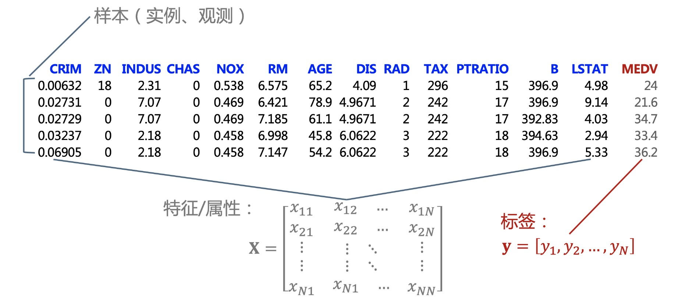
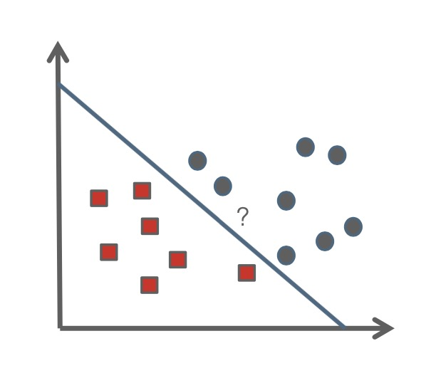
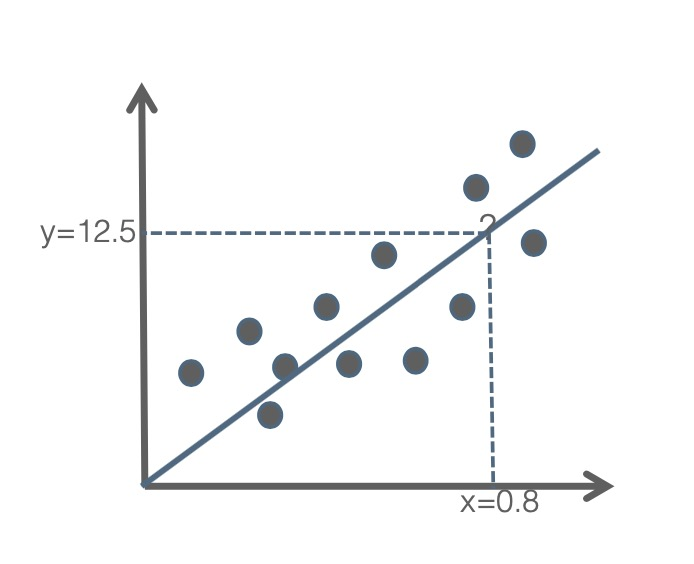
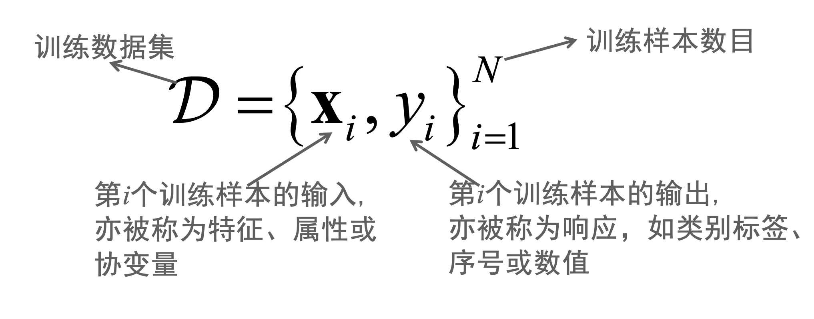
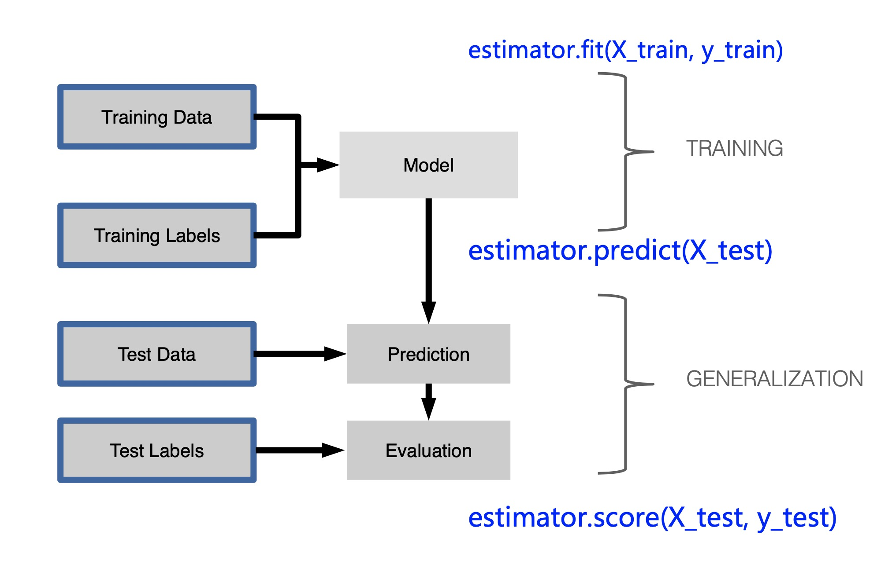
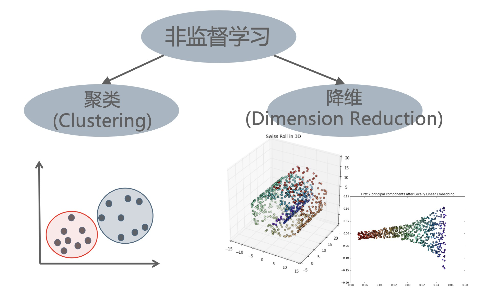
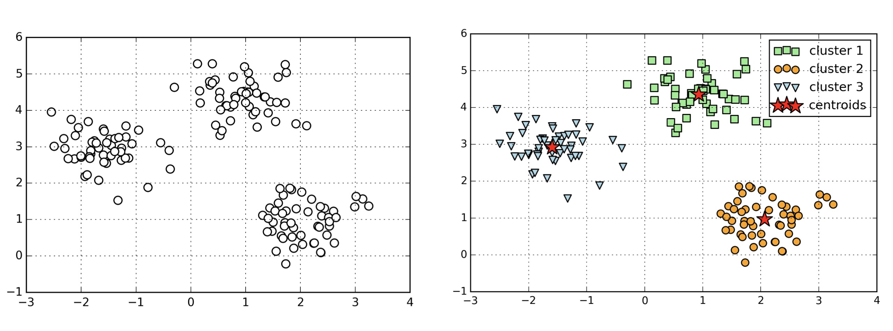
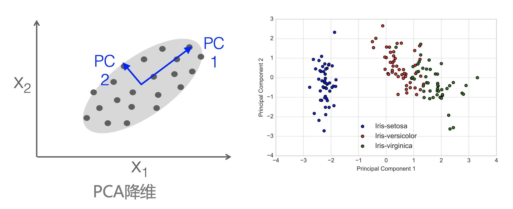
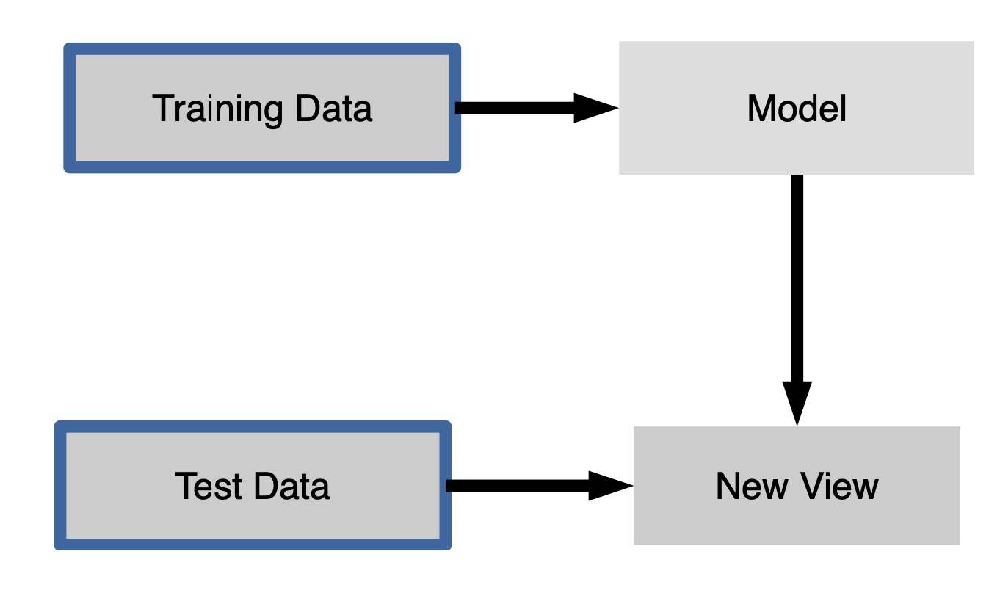
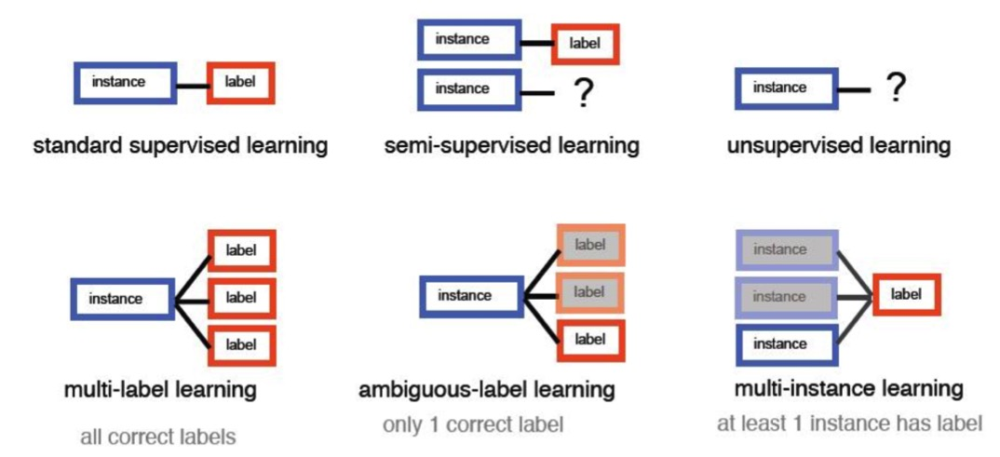

### 机器学习概念

- http://en.wikipedia.org/wiki/Machine_learning
- 机器学习是人工智能的一个分支，主要关于构造和研究可以从**数据**中**学习**的系统
    * 它是依赖于数据的，需要输入大量的数据，因为我们现在是大数据时代，让机器学习更流行
    * 过去的经验，它是蕴含在历史数据中，我们要从数据中学习过去的经验，获得经验后会对类似的新样本或场景做出预测

**数据**

- 在机器学习中的数据通常是以二维表的形式写出来
- 二维表类似于我们关系数据库里头的数据表，每一行，表示一个样本，每一列表示一个属性/特征

**案例**

Boston房价预测数据，根据某地区房屋属性，预测该地区房价 
- 共506行，表示有506个样本
- 共14列
    * 前13列为该地区房屋的属性(CRIM、...、LSTAT) 
    * 最后1列为该地区房价中位数 MEDV
- 根据区域房屋属性，预测该地区房价中位数

    

- 房价的中位数是我们关心的输出量，称为标签y
- 假设有N个样本，就有N个y, 共同构成一个向量y如上图所示
- 前面13列属性作为我们的输入记为X，也是一个矩阵
- 我们想要知道X和y之间的关系，用函数f来表示，在不同的机器学习模型中f的形式是不一样的
- 这个模型写好之后，对于新来一个样本，我就可以丢到这个函数(模型)里面，它就会输出对应的y
- 这样就完成了机器学习的任务

### 机器学习中任务类型的不同

我们根据数据中y形式的不同，分为3类

- 监督学习(Supervised Learning)
    * 监督学习，它是跟人类学习一样，类似有老师指导，或有监督的，也就是说我们数据中有x, 也有每个x对应的y
    * 也就是说从带标签的数据中去学习，像是上面波士顿房价预测的例子，就是监督学习的例子
    * 另外比如对垃圾邮件的过滤，我们给了每封邮件它的属性，然后历史数据中我们告诉每封邮件是垃圾邮件还是不是垃圾邮件，然后我们从这样的一些数据中去学习
- 非监督学习(Un-supervised Learning)
    * 非监督学习和监督学习是相反，也就是说我们的数据是没有标签，也就是没有y的
    * 比如说我们给了一堆样本，但是不知道他们是一个什么样的关系
    * 那这样我就去看是否有一些样本，比如说聚成一团，这样的话其实就是一个典型的一个聚类的任务
    * 比如说我们是要把一堆文档拿过来，发现他们很相似，都和新闻有关，那这就是一个文本聚类的一个任务
- 强化学习(Reinforcement Learning)
    * 在强化学习中，这个y它不是即时的，也就是说不是我当时有一个x，我当时就有一个y，而是这个y可能是一个滞后的
    * 并且这个x是通过我执行了某个动作，比如说下棋(在棋盘上下了一个棋子)，这是一个动作，会对我的目标有影响，会有一个相应的迟来的奖励或惩罚

### 监督学习

- 是最常见的机器学习的任务，根据y形势的不同，又可以分为2类
- 一类是**分类**(Clasification)，另一类是**回归**(Regression)

1 ) **分类**

    

- 对于上面红色方框和黑色圆圈是两类样本
- 分类的意思是我要找到一个函数能把两类样本给分开
- 对分类来讲，这个y等于红色方块或黑色圆圈
- 可知y的取值是一个离散的，有限的一个集合

2 ) **回归**

    

- 回归的y就是属于实数，比如房屋价格预测的案例
- 给一个房屋的属性来预测它的价格，我们输入x，直接用一个函数计算出来y来表示

3 ） **更为形式化的描述监督学习**

    

- 监督学习：我们给的数据叫训练数据，在这个训练数据集D中，这里有N个样本，我们的i从1到N，每个数据它既有属性$x_i$，又有对应的标签$y_i$, 机器学习的任务就是从历史数据中学习到一个𝐱 → 𝑦的映射𝑓，𝑓学习好后就可以对新输入的𝐱进行预测𝑓(𝐱)，$\hat{y} =$ 𝑓(𝐱), 这里 $\hat{}$ 表示估计的意思

- 在监督学习中，训练数据包含标签y，这个标签在训练数据中是可见变量

- 房价预测是一个监督学习任务:根据训练数据 $D = \{xi , yi \}_{i=1}^N$ 对房屋属性和房屋价格之间的关系进行建模，再用学习好的模型预测新的房屋的价格
    * 训练样本数目𝑁 :506个样本
    * 输入房屋属性𝐱:13个特征(CRIM、...、LSTAT) 
    * 输出房价𝑦:MEDV
    * 我们希望我们训练的这个模型𝑓, 以后来了一个新的x, 就可以得到一个房价y, 即：$\hat{y} =$ 𝑓(𝐱)

- 在监督学习任务中，若输出 $y \in R$ 为连续值，则我们称之为一个**回归**(Regression)任务
    * 例:Boston房价预测，输入/协变量(covariate) 𝐱 :房屋的13个属性(CRIM、...、LSTAT)
    * 输出𝑦: 房价中位数MEDV

- 在监督学习任务中，若输出𝑦为离散值，我们称之为**分类**
    * 标签空间: `y = {1, 2, ..., C}`
    * 鸢尾花分类案例中，输入𝐱 :鸢尾花的属性(花萼长度sepal length 、花萼宽度sepal width 、花瓣长度petal length 、花瓣宽度petalwidth)
    * 输出𝑦: 鸢尾花的类别(山鸢尾花Setosa、变色鸢尾花Versicolor、弗吉尼亚鸢尾花Virginica)

4 ）**监督学习工作流程**

    

- 在这里 Training Data & Training Labels 是我们的训练数据D, 用来训练我们的模型 Model, 用 f 表示
- 模型学习好了之后，对于测试数据 Test Data, 我们就可以对它来进行预测 Prediction, 得到这些测试数据x对应的$\hat {y}$, 这个$\hat {y}$叫做y的估计
- 在Test Labels中的真实的y和上面的$\hat {y}$进行对比评估，我们就可以评价这个模型的性能
- 这个流程在Scikit-Learn中表示，estimator是个学习器来调用它的训练，fit表示训练，`estimator.fit(X_train, y_train)`表示用训练数据来训练模型
- 之后模型训练好之后，就可以用测试数据进行预测，`estimator.predict(X_test)` 做完后会得到一个估计值
- 最后根据估计值来计算分数，进行性能的评估 `estimator.score(X_test, y_test)`

### 非监督学习

    

1 ）**概述**

- 在非监督学习里边，我们给的数据只有x, 没有对应的标签y，我们的任务主要是来发现x里面蕴含的结构
- 对于一个给定的任务，通常这个样本点, 在整个特征空间并不是均匀分布的
- 一种可能的情况是左下角图的结构，一些数据样本点, 它会比较紧密的结合在一起，另外一些样本点又聚成另外一团
- 簇和簇之间或者说团和团之间通常会有比较大的空隙，我们可以对这个数据进行聚类分析，然后发现这个样本点成团的这种结构
- 另外一种方式可能是右下角的结构，一个典型的瑞士卷的结构，也类似于我们一个蛋糕卷
- 那在这个卷的结构里头，从紫色的点开始，然后变成蓝色，慢慢成黄色，最后变成红色这样分布
- 如果要从这个三维空间中算样本点和样本之间的距离的话，用欧式距离算，红色点和蓝色点非常近
- 实际上要从红色走到蓝色，需要沿着卷的边缘走，才能走到，实际上很远，也就是这两个样本点在本质结构上是离的比较远的
- 这样的话，我们需要把这个数据从原始的高维空间降到它的本质维度
- 比如说我们把蛋糕卷铺平，那这样我们就会得到，比如说红色的这些点，它对应的是在这个卷的末尾
- 然后这个紫色的这个点对应的是这个卷的开始，我们在这个降维之后的空间里头，我们再来分析样本和样本之间的关系是更准确

2 ） **更为形式化的描述非监督学习**

- `D = \{x_i\}_{i=1}^N`
- 给定训练数据D, $y_i$没有给出来，或者说它是一个隐含变量，我们的任务是要发现这个数据D中"有意义的模式"，比如：团簇结构或瑞士卷(本质)结构
- 有时候非监督学习也叫做知识发现

3 ）**聚类**

    

- 上图是一个典型的聚类的例子，数据x的两维的空间，有$x_1, x_2$, 左边是未处理前的，右边是聚类后的
- 给的这些数据，因为我们没有标签，所以我们把它同等的看待，都用黑色的圆圈表示
- 但是我们会发现这些数据显示成团成簇的这样一个结构，很显然对于这个数据，我们可以把它分成三团
- 每一团内部很紧密，类与类之间有比较大的一个间隔
- 右图是我们做完聚类分析之后的结果，有三类如图所示
- 如果用简介的方式表示一类样本，可以使用类中心来做代表

4 ）**降维**

    

- 第一个坐标系图，假设我们是在一个二维空间里面 $x_1、x_2$, 原始的数据分布于这个灰色的这个椭圆区域里面
- 上图是两维的数据，如果我们现在只能用一维来表示的话，那我们应该选$x_1$还是$x_2$或者其他的某个方向呢？
- 如果是上面这样一个例子，我们应该选择的是PC1的方向(主成分)，因为是在这个方向它保留原始数据的信息最多或者是我们损失的信息最小, 我们应该选这个
- 和它垂直的方向是它第2个主成分的方向
- 第二个图表的例子是我们对鸢尾花数据进行聚类的一个结果，鸢尾花的数据本来有4维，就是花瓣的长度和宽度，花萼的长度和宽度
- 但是我们会发现我把它降到两维之后，这三类数据还是分得很开，很显然这个蓝色的数据和另外两个分的很开
- 红色和绿色的数据有点交织在一起，我们也可以用一个分类器，把红色和绿色分开
- 所以，如果我们用2维或3维分开数据的话，那就没有必要用4维，因为我们把数据降维后，存储量小了，在训练模型的时候，参数也变少了
- 这样模型会更简单，减弱模型过拟合的程度

5 ）**非监督学习的工作流程**

    

- 我们首先要有训练数据 Training Data，然后我们对模型 Model 进行训练
- 这个模型训练的过程，我们要看模型里面包含的原始数据里一共有多少类，每一个类中心是在哪里? 或者说一共有几个主成分，每个主成分的方向是什么？
- 这些是我们由训练数据训练得到这个模型的参数，模型训练好了之后呢，我们可以对训练数据做变换，变换到新的视角来观察这个数据
- 对于测试数据，我们也可以用这个模型来把它变换成了一个新的视角，那这样以后，我们可以在统一的新的视角下来看待训练数据和测试数据了
- 在Scikit-Learn框架下，我们可以这样表示：
    * 第1步要调用`transformer.fit(X_train)`这个函数，fit就是训练，因为这里面我们只有x
        * 对比在监督学习里，我们这个地方写的是estimate，是因为在监督学习里头，我们更多的是要拿来做预测，也就是估计
        * 在非监督学习里头，我们主要是对特征做变换，所以我们用transformer，不同的非监督学习的技术具体的这个transformer不同
        * 比如说它是一个聚类或者是一个PCA或者是一个比如说标准化的一个transformer，它们都是这种流程
        * 第1步是由训练数据来训练模型，也就是得到这个模型的参数
    * 第2步，模型训练好了之后，我们可以对训练数据进行变换，得到变换之后的训练数据的表示 `X_train_transf = transformer.transform(X_train)`
      * 同样我们也可以对测试数据来调用transform函数，然后得到它变换之后的表示 `X_test_transf = transformer.transform(X_test)`
    * 不同的非监督学习技术这个流程都是一样，只是具体的这个每个transformer不同，当然这个模型的参数也是稍微不同

### 其他类型学习任务

    

- 介于`监督学习`(standard supervised learning)和`非监督学习`(unsupervised learning)之间还有其他类型的学习任务
- `半监督学习` (semi-supervised learning)
    * 有少量的样本是有监督的，就是有标签的，大部分样本我们是没有标签的，也就是无监督的
    * 因为在大数据时代，数据是很容易获取的，但是这个数据要对它再进行标注的话，通常是有成本的
    * 而且在一些特定领域，比如医学领域，我们标注还是需要有专业的人士来标，这样的话成本会更高
    * 我们希望机器能够自动利用少量的标注信息和大量的没有标注的信息，得到一个类似标准的监督学习的一个效果
    * 这是一个很火的机器学习研究的方向
- `多标签学习` (multi-label learning)
    * 在典型的监督学习里，一个样本我们只能有一个标签，比如鸢尾花分类，对于给定的一朵花，它只能在三类中的一类
    * 但是另外一些时候可能是一个多标签的，比如在进行文档分类的时候，给定一个文档，这个文档有可能是关于教育的，有可能是同时关于科技的，它有多个标签
    * 多个标签不是互斥的，就像一个人是有多重属性的
- `含糊的标签学习` (ambiguous-label learning)
    * 在标注的时候, 标注信息可能是有歧义的, 就是它被标了多个标签, 但是实际上只有一个是正确的
    * 那也就说这个标注是有噪声的，虽然有噪声, 但是也含有一部分信息, 我们能从这种有噪声的数据里头去学习，也有一定的意义
- `多实例学习` (multi-instance learning)
    * 对很多样本标注了同一个标签，这里很多样本我们称之为样本包，在这个包里面最少有一个样本是真的这个标签，其他的不太确定
    * 这样的话，也是说这个数据是有噪声的，这个模型也是从有噪声的数据中寻找有价值有意义的这样一个模式

### 增强学习

- 增强学习的标签y是从行为的反馈(奖励或惩罚)中学习的，举例
    * 在增强学习中设计了一个回报函数(reward function)
    * 如果learning agent(如机器人、回棋AI程序)在执行一个动作后，获得了较好的结果
    * 那么我们给agent一些奖励(正的回报，函数结果为正); 若得到较差的结果，则给一个惩罚(回报函数为负)
- 增强学习的任务: 找到一条回报值最大的路径
- 是机器学习里面比较火的一个领域，尤其在深入学习出来之后，增强学习和深度学习的结合
- 比如Alpha Go, Alpha Zero, 以及医药的发现，蛋白质的合成等领域，增强学习都发挥着重要作用

### 总结

- 监督学习(SupervisedLearning)
    * 分类 (Classification)
    * 回归 (Regression)
    * 排序 (Ranking)
        * 比如说像我们在检索的过程中，结果是有排序的
        * 在推荐系统中，一个场景下，给我们推荐浏览的内容也是经过排序的
        * 排序评价指标和分类、回归不一样，但模型本质的东西和回归和分类是类似的
        * 这里不再展开

- 非监督学习(UnsupervisedLearning)
    * 聚类 (Clustering)
    * 降维 (Dimensionality Reduction)
    * 概率密度估计 (density estimation)
        * 在低维(一维、二维)情况下比较现实
        * 更高维的时候做概率密度估计是不可能的
        * 实际任务中特征的维度通常都是非常高的
        * 所以这里也不再展开

- 增强学习(ReinforcementLearning)