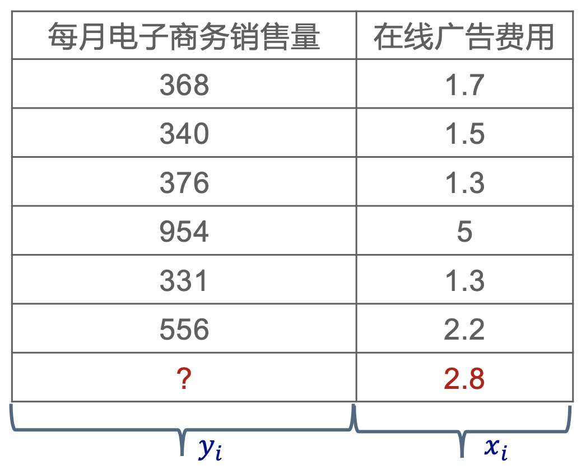
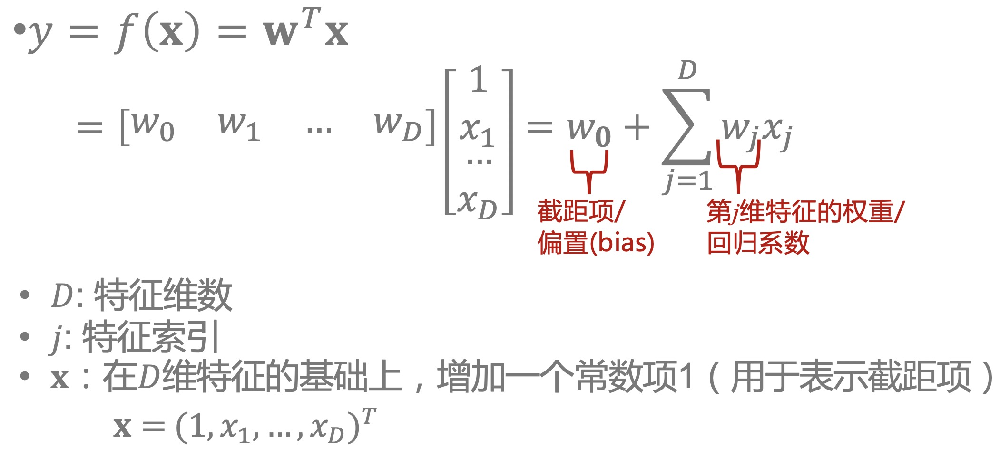
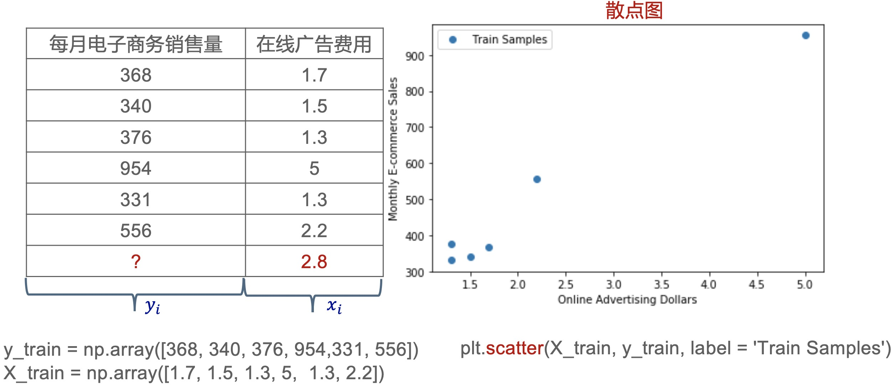
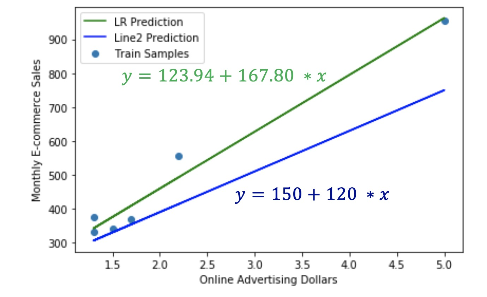
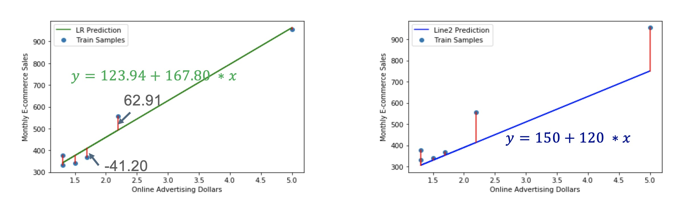

### 关于回归

<div align="center">
    
</div>

- 这里给出了一个典型的回归任务，假设我们要根据商品在线广告的费用来预测每月电子商务的销售量
- 通常的做法是会收集到很多历史数据，然后假设某个商品他在线广告的费用是1.7的时候，每月电子商务的销售量是368
- 广告费用是1.5的时候，销售达成340等等，有了这些数据之后，我们希望能学习到在线广告费用，对电子商务的销售量的一个影响
- 给一个新的数据，我们只知道在线广告的费用假设是2.8的时候，我们要预测它每月电子商务的销售量，这个y是多少？
- 我们把这个例子形式化表示一下，可以写成这样，我们给定的这些历史数据，称为训练数据，用D来表示, $D = \{ \bm{x_i}, y_i \}_{i=1}^N$
- 这个训练数据集里是一些样本的集合，一共有n个样本，每一个样本，有它的输入特征$\bm{x}$，和它对应的输出y
- 这里我们用i来表示样本下标的索引，所以i等于1到n，$\bm{x}_i$就表示第i个样本的输入特征，这里$\bm{x}_i$是一个向量
- 在这个例子里，我们在线广告的费用是一个一维的标量，比如说我们其实还可以包含商品的其他属性，如商品的类别等等
- 这样的话，这个输入特征一般的形式是一个向量，这个y表示第i个样本的输出或者叫响应
- 在回归里这个y是一个实数也是属于R，这个y它其实是一个类别变量
- 在回归任务里，我们就需要根据刚才我们给定的训练数据D来学习到一个 $\bm{x}$ 到 y 的一个映射 f
- f 学习好了之后，我们希望对于新的测试数据$\bm{x}$，我们可以用$f(\bm{x})$来对它进行预测
- 这个预测结果我们记为$\hat{y}$，表示它是一个预测值 $\hat{y} = f(\bm{x})$
- 通常我们就用y来表示真值，$\hat{y}$来表示它的预测值

**回归任务举例**

<div align="center">
    
</div>

- 从这里可以看出响应 y 是一个实数，如：价格，销量，收成，薪水，成绩

### 线性回归模型

<div align="center">
    
</div>

- 在线性回归中，需要确定回归任务中输入$\bm{x}$到输出y的映射f，这个 f 到底是一个什么样的一个形势呢？
- 最简单的来说，我们可以假设$\bm{x}$与y之间的关系是一个线性关系，我们把这个回归模型叫做线性回归模型，线性函数是最简单的函数
- 线性回归模型用数学表达式是这样，$y = f(\bm{x}) = \bm{w}^T \bm{x}$，这里$\bm{w}$和$\bm{x}$都是向量，因为机器学习模型用向量表示更简洁，在具体实践上，用数值和矩阵也更高效
- 展开来看，如上图所示，比如说这个x就是一个列向量，表示前面有一个常数项1，后面是从$x_1$到$x_D$，这里D表示特征的维数，也就是输入特征一共有多少个
- 在广告投入量例子中只有一个特征，D就是1，如果再加入商品的类型，D就变成2了，就有了两维特征
- 这里$\bm{w}$其实也是一个列向量，转置之后$\bm{w}^T$就变成一个行向量，这个$\bm{w}$里面也是包含D+1维，第1个称为$w_0$，后面的D维，我们称从$w_1$到$w_d$
- 习惯上，我们把$w_0$称为截距项或偏置项，一般时候一些论文里用b来表示，其实都一样，因为是基于$y=kx+b$, 这里的b表示bias, 偏置项的意思
- 如果x只有一维的话，k就相当于这里的$w_j$，这个系数k或者是$w_j$表示这个$x_j$的变化对y的一个影响
- $w_j$越大的话，表示当x有一个单位的变化时y的变化更大一些，这里$w_j$有时我们也叫第j维特征的权重，一般我们把它称为回归系数
- 输入$\bm{x}$从$x_i$到$x_D$就是一个D维的输入特征，这个我们加了一个常数项 1，这样的表示是为了把截距项当成x的一维来处理，写起来的形式非常简洁
- 不特殊说明的话，线性回归模型，一般是指 $y = f(\bm{x}) = \bm{w}^T \bm{x}$

<div align="center">
    
</div>

- 这个例子是根据在线广告投入费用预测每月电子商务销售量
- 这里一共有6个样本点，所以训练样本的数目N=6，x是输入，也叫属性，y是输出，也叫目标, 这里y都是向量(用y_train表示)，x都是矩阵(用X_train表示, 可能包含多维数据)
- 第一步我们需要看下x和y之间的关系，所以我们先把这个数据可视化来看一下，用散点图来表示，横轴是x，纵轴是y
- 我们看出来就是这个x越大，看起来y应该是最大的，当然它也没有那么完美的一个关系，比如有两个x相同，它们y的就不同
- 散点图在python中可以用scatter来作图，`plt.scatter(X_train, y_train, label = 'Train Samples')`

<div align="center">
    
</div>

- 用线性模型来表示的话，我们认为x和y之间是一个线性函数，这里的x是一维的，一般形式表示为$y=kx+b$
- 这样在几何上我们就能更清楚的看到这个截距项是什么意思，就是当x等于0的时候y的取值，也就是b或者叫做$w_0$
- 在这里x和y都是一个一维数组，但是在机器学习模型实现的时候，一般情况下这个x是一个二维的数组，也就是它可以有多维特征
- 在Scikit-Learn中，训练数据x是二维数组, 例子中是单维特征，需要变成二维数组
- 这里我们为了把它送到机器学习模型里面去，我们需要把它做一个形状变化叫做reshape，`X_train = X_train.reshape(-1, 1)`，就是把它变成一个二维矩阵，大小就根据它的大小来自动计算
- 在这个例子中是一个6×1的，所以它也是一个二维数组，6行1列
- 数据准备好了之后，如果是用线性模型来表示的话，可以调用Scikit-Learn里的线性模型，里边有一个LinearRegression叫线性回归
    ```python
    #训练模型
    from sklearn.linear_model import LinearRegression
    # 使用默认配置初始化 这里是默认参数，也可指定参数 这里生成一个学习器的实例 lr
    lr = LinearRegression()
    # 这里fit是训练模型函数 用来训练模型参数 训练结束后就会修改 lr 中的一些属性(如截距和系数)
    lr.fit(X_train, y_train)
    ```
- 在sklearn里我们调用学机器学习模型的步骤都是一样的，除了线性回归模型，其他模型也会遵循同样的一个模式
- 根据例子中数据算出来一条绿色直线: $y = 123.94 + 167.80 * x$，这里123.94是$w_0$, 167.80是$w_1$
- 模型 f 学习好了之后就可以把它用到预测，比如我们对一个新的输入x等于2.8，也就是当这些广告费用等于2.8的时候，电子商务的销售量应该是多少？
- 把这个输入x带入到这个f(x)模型，就可以得到它的估计，记为 $\hat{y}$，$\hat{y} = 123.94 + 167.80 ∗ 2.8 = 593.78$
- $w_0$和$w_1$是通过训练数据训练得到的模型的一个解，最终估计是593.78
- 这个过程就是从训练到预测

<div align="center">
    
</div>

- 现在的问题是这个模型已经训练好了，也可以拿来做预测，那怎么知道这个模型它好还是不好？
- 这里除了用线性回归得到的绿色的线之外还有一条蓝色的线，这个蓝色的线是 $y = 150 + 120 * x$
- 蓝色模型似乎没有绿色的预测这条线好，因为它对每一点的预测都是比较悲观的，它的预测值都小于真值，有些差异比较小，有些差异的就比较多
- 我们需要有一个东西来衡量一下预测值和真值，那怎么来衡量呢？这里我们需要用到**预测残差**

<div align="center">
    
</div>

- **预测残差**(Residual):真实值和预测值之间的差异 $r = y − \hat{y}$
- 我们在图上也可以把这个残差画出来，比如说对于绿色这条线(线性回归得到的这条线)
- 绿色直线在训练集上的预测残差:-41.20, -35.64, 33.92, -8.92, -11.08, 62.91
- 蓝色直线在训练集上的预测残差:14, 10, 70, 204, 25, 142
- 可以看到残差有正有负，有大有小，比较起来不方便，要忽略符号对其造成的影响，就和方差类似，我们可以看它的平方
- 我们用残差的平方来度量这个预测模型的好坏，$r^2 = (y − \hat{y}) ^2$
- 我们有多个训练样本，因为我们不能只看一个样本拟合的好就行，应该把所有训练样本上的那个残差平方给加起来，得到所谓的**残差平方和**(Residual Sum of Squares, 简记为 RSS )
- 最佳直线: RSS最小, $RSS = \sum_{i=1}^N r^2 = \sum_{i=1}^N (y_i - \hat{y}_i) ^2$
- 绿色直线在训练集上的 $RSS = (−41.20)^2 + (−35.64)^2 + (33.92)^2 + (−8.92)^2 + (−11.08)^2 + (62.91)^2 = 8277.32$
- 蓝色直线在训练集上的 $RSS = (14)^2 + (10)^2 +(70)^2 + (204)^2 + (25)^2 + (142)^2 = 67601$
- 可以看到绿色线条是比较好的一条线
