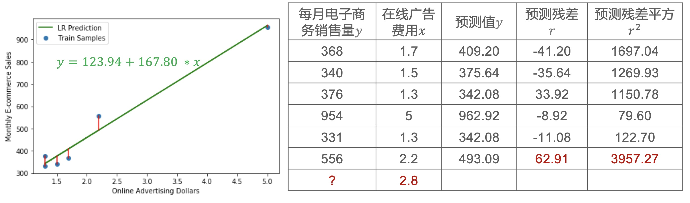
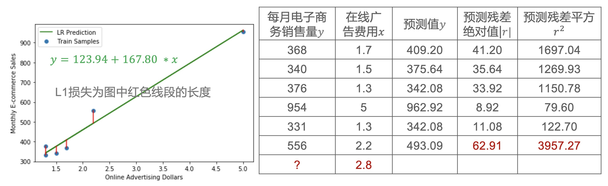
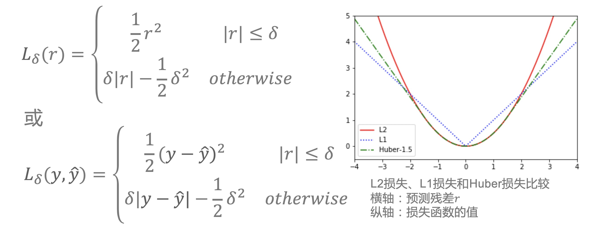
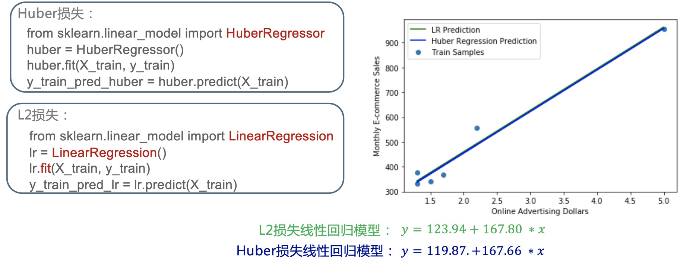

### 损失函数

- 之前我们知道预测残差和残差平方和，在机器学习中，我们用专门的术语叫损失函数(loss function)度量样本真实值与模型预测值之间差异
- 如果我们采用残差平方来作为你的损失函数的话，那我们把它称之为L2损失, 记为：$L(y, \hat{y}) = (y - \hat{y})^2 = r^2$
- L表示loss，损失的意思，它是真值y和估计值$\hat{y}$的一个函数
- 我们的目标函数($\sum_{i=1}^N L(y_i, \hat{y}_i = \sum_{i=1}^N r_i^2$) 就是要使得在训练样本上进行一个求和，每一个样本点的损失函数和最小，我们也把它叫做经验风险最小
- 这个经验，是训练样本，是已经见过的数据，也就是历史数据，经验数据，这个风险是指损失越大风险越大。
- L2损失是回归里头最常用的损失函数，它的形状是一个二次函数，它的好处是处处可导，我们在优化计算的时候可以非常方便。

<div align="center">
    
</div>

- 但它会有一个问题，就是对噪声比较敏感，上面这个例子里头，我们看到就是值比较小的，平方之后就会变大，原本差异不是很大，但平方之后差异会变得非常的大
- 这样使用残差平方作为损失的话，那这个$(y - \hat{y})^2$就更大了，由于我们的目标函数是由每个样本点的残差平方和加起来，如果是某一个值特别大的话，其他的值就很小
- 它就会在目标函数中起主导作用，最后会使得这个模型会变成一个偏向于它的，所以L2损失函数一个不太好的性质，就是对噪声敏感
- 如果我们知道这个数据有很多噪声，L2损失不太合适
- 再回到原始状态，之前预测残差是因为有正负号，我们才去平方的，去除残差符号的影响，其实我们可以取绝对值 $|r|$
- 当损失函数取残差绝对值时，我们称之为L1损失，记为: $L(y, \hat{y}) = |y - \hat{y}| = |r|$

<div align="center">
    
</div>

- L1损失在几何上的含义，其实就是我们在这个图中，这个样本点到这个预测值之间的差异，也就是红色这条线段的一个长度
- 所以我们可以看到L1损失它的那个取值范围，还和y在同一个级别，是没有取平方
- 我们可以比较这个例子里头每一个输入x它对应的预测值和真值之间的残差，取绝对值之后的值L1损失和取平方之后的值L2损失
- 可以看到，比较小的数和比较大的数，在平方层面的差距是非常巨大的
- 所以这样的话就说即使我们有一个噪声点，当然噪声点对模型也会有影响，但是它这个影响，不会像取平方那样偏的那么多，也就是对噪声不敏感，这是L1损失的好处
- 但是L1损失有个问题是在零点不可导，所以它不是连续的，那它在优化计算上就不是很方便
- 综合L2损失和L1损失的优点，得到Huber损失

<div align="center">
    
</div>

- 这里的 $\frac{1}{2}$ 是为了求导计算上的方便，$-\frac{1}{2}\delta^2$ 是为了使 $\delta$ 这一点是连续的
- 把这三个函数放在一个图里的话，可以清楚的看到，这个红色的线是L2损失, 当r的绝对值比较大的时候，它的平方会增长非常快
- 蓝色这条线是L1损失
- Huber损失是绿色这条线，它在r比较小的时候和红色的线是重合的，所以它是L2损失，过了$\delta$ 这一点之后是一个线性增长，这样对噪声点不那么敏感

### Scikit-Learn中的Huber损失回归模型

- Scikit-Learn实现了采用Huber损失的回归模型: HuberRegressor
- 在Scikit-Learn中的一个好处是，不同模型的调用接口几乎相同
    ```python
    from sklearn.linear_model import HuberRegressor 
    huber = HuberRegressor()
    huber.fit(X_train, y_train)
    y_train_pred_huber = huber.predict(X_train)
    ```

    ```python
    from sklearn.linear_model import LinearRegression 
    lr = LinearRegression()
    lr.fit(X_train, y_train)
    y_train_pred_lr = lr.predict(X_train)
    ```

<div align="center">
    
</div>

- 在刚才例子里得到的线性回归模型和采用Huber损失模型得到的结果分别是蓝色的线和绿色的线
- 因为在例子里头只有6个训练样本，而且一些噪声点看起来大一点，在这两条线里，我们在画图的时候分配率不够高，看起来是重合在一起了
- 但是在数字上我们可以看到它们有一点区别，但是区别不是特别大，说明这个数据还算比较好，也就是说噪声点不是很多
- 总结一下，一般来说，我们可以用L2损失，当这个数据中噪声点比较多，那么我们可以用Huber损失