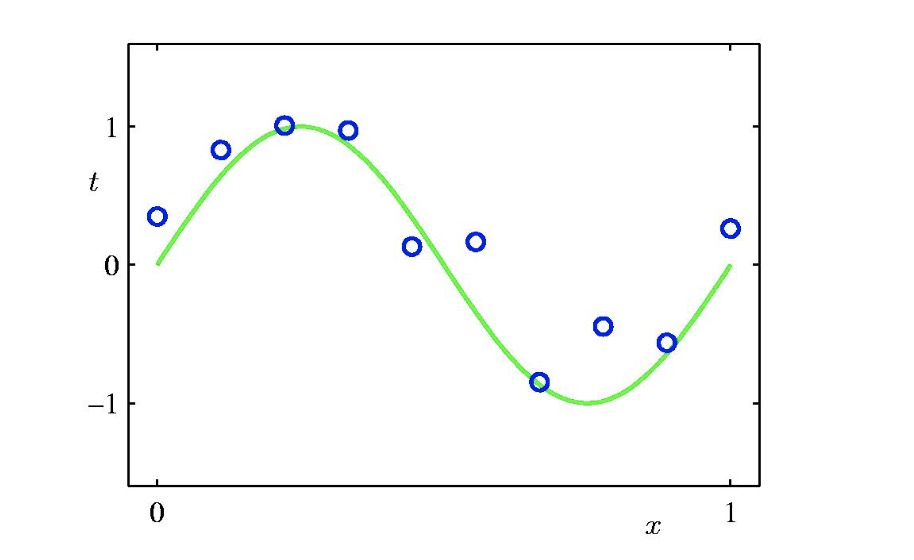
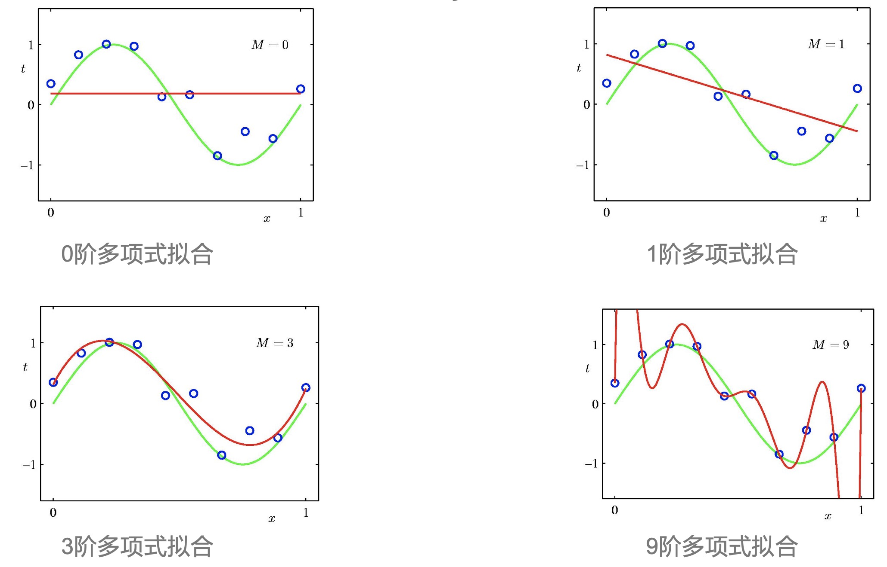
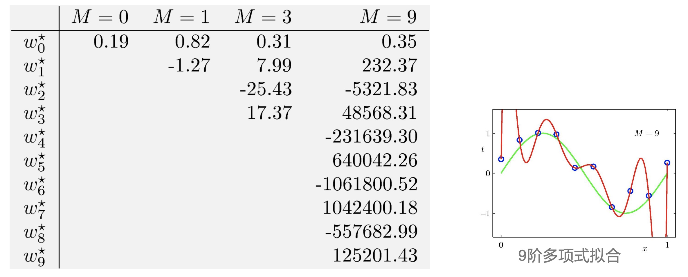
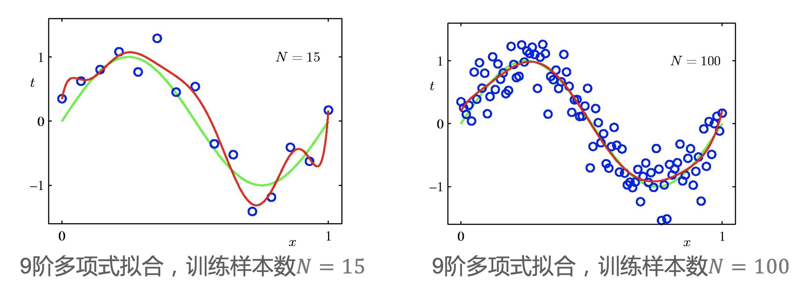
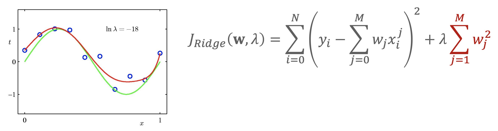
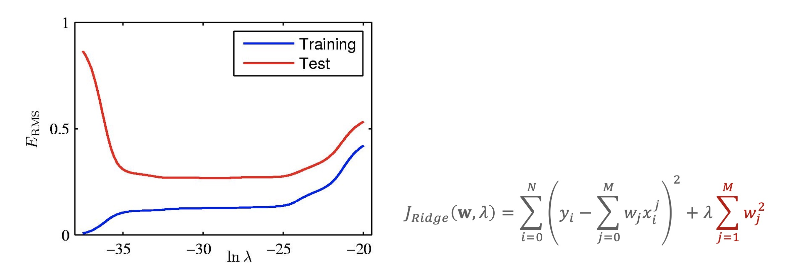

### 过拟合和欠拟合

- 最小二乘回归中，目标函数只考虑了模型对训练样本的拟合程度
    * $J(f) = RSS(f) = \sum_{i=1}^N L(y_i, \hat{y}_i) = \sum_{i=1}^N L(y_i, f(x_i)) = \sum_{i=1}^N (y_i - f(x_i))^2$
    * 这个f是可以变化的，当f函数足够复杂的时候，可以和训练样本拟合的非常好，使得$J(f)$ 接近于0或等于0，我们称这个模型叫做过拟合
- 原则上任意复杂的模型能完全拟合训练数据。我们称之为过拟合
    * 过拟合(overfitting): 过于复杂的模型与训练数据拟合得太好，但和测试数据拟合得不好
    * 欠拟合(underfitting): 过于简单的模型与训练数据拟合得欠佳(和测试数据自然也拟合得不好)
- 在机器学习中，通常我们假设训练数据和测试数据都是独立，同分布的样本，如果它和训练数据拟合的不好，自然和测试数据拟合的也不好，我们需要找到最佳的模型
- 模型的评估，选择，超参数调优是机器学习中最重要的一环
- 注意:线性回归中采用线性模型，而线性模型是很简单的模型，所以当特征维数不是太高时，线性回归的过拟合现象通常不太严重，一开始的时候，人们对过拟合的现象不是很在意

### 相关案例

- 我们要进行sin曲线拟合，数据产生的模型为：$y = sin(2\pi x) + \varepsilon, \ \ \ \varepsilon \sim N(0,0.03^2)$
- 这里的$sin(2\pi x)$ 其实就是我们的 $f(x)$, 这里的 $\varepsilon$ 就是我们的白噪声
- 有了这个数据产生过程中其实可以产生随机数，就是从正态分布产生一个随机数，再加上 $f(x)$ 就好
- 假设 N = 10, 有10个样本点，比如下图有10个蓝色的点，我们用M阶多项式来拟合数据 $y = \sum_{j=0}^M w_jx^j$

    

- 在高等数学中，我们知道这个sin曲线可以用无穷多阶多项式来拟合，阶数越多，拟合误差越小

    

- 上图给出了M为不同值的时候和训练数据拟合最好的曲线
    * 当M=0时，$y=w_0$, 只有常数项和x没有关系，是一条平行于x轴的直线，这里$w_0 = \bar{y}$，为样本点的均值
    * 当M=1时，$y=w_0 + w_1x$, 这是一条直线，要使训练集上的残差平方和最小，这条线如图在样本点中间穿过
    * 当M=3时，这里有四个未知数：$w_0, w_1, w_2, w_3$ 看起来还不错
    * 当M越来越增加时，红色和绿色的线趋于接近，最极端的时候，M=9时，因为样本点N=10, 我们可以提供10个等式，求出10个未知数: $w_0, w_1, w_2, w_3, ..., w_9$
    * 10个未知数刚好对应9阶多项式中对应的10个未知数: $w_0, w_1, w_2, w_3, ..., w_9$
- 等式表示拟合模型(红线)在训练样本上等式是成立的，也就是说残差平方和为0
- 从几何上来看，红线通过每一个样本点，由于样本点散布较开，为了模型和训练样本拟合，可以看到红线抖动的比较厉害
- 我们通常可以用曲线变化的程度表示曲线的复杂度，同时也可通过未知数的数目来看出复杂度
- 我们可以看到这个模型已经很复杂了，同时在训练集上的残差平方和已经为0了，也就是说效果已经达到最优了
- 我们关心一个模型是否最优，要同时看训练数据的拟合程度以及测试数据的拟合程度，也就是看训练误差和测试误差
- 我们通过数据产生的过程再生成100个测试样本，如下图所示，得到的对比结果

    

- 当模型复杂度继续增加( M > 3 )时，训练误差继续下降，甚至等于0，而测试误差反而增大, 这时发生了过拟合。我们一般在 M = 3 的时候画一条分界线，左边是欠拟合，右边是过拟合
- 评价模型性能不能在训练集上评估，而应该在新的测试数据上进行评估: 推广性 / 泛化能力( generalization)。
- 我们希望模型的推广能力越来越好！
- 再来看下M阶多项式系数的情况

    

- 可以看到当M>3的时候已经发生了过拟合
- 发生过拟合时，回归系数(绝对值/平方)很大，即输入x的很小变化 可能带来输出y较大的变化，函数变化剧烈
- 也就是说当模型阶数越来越大的情况，根据公式，如果$w_j$越大，$x^j$只要发生一点变化，抖动的将非常厉害，引起y的变化非常大这是我们不希望的
- 我们希望这个模型是一个平滑的曲线，y的变化是一个平滑的变化

    

- 可以看到样本越来越多的时候，拟合效果越好，也就是说当有更多训练数据时, 复杂模型的过拟合现象减弱
- 只有见过越多的案例，才能学到案例中蕴含的规律，通常样本数越多, 我们就可以使用越复杂的模型
- 我们这里的模型 $y = \sum_{j=0}^M w_jx^j$ 虽然是一个多项式，但是x给定了，$x^j$也就给定了，未知的其实只是w, 从未知数的角度来说，这还是一个线性模型
- 对线性模型来说，通常模型的参数的数目，用5~10倍的数据就可以处理的比较好，比如这里未知数的数目是10个，我们可以用50~100个数据就可以得到比较理想的模型，这里是一个经验值
- 在给定有限训练样本数目时，可通过在目标函数中**增加正则项减弱过拟合现象**，这个方法比较常用。
- 例: 给定N = 10个样本点，目标函数中增加L2正则项，得到岭回归 (Ridge Regression):

    

- 上面的公式表示，不仅要考虑和训练集拟合的程度, 也就是RSS, 还要考虑$w_j^2$ 加起来不要太大, 它的相对权重，用 $\lambda$ 表示
- 如上图所示，岭回归中最佳参数是 $ln \lambda = -18$ 红色和绿色曲线已经匹配的很不错了
- 我们也可以通过看回归系数的值，来看拟合的情况

    

- 我们可以看到，当$\lambda$越大时，要求 $w_j$ 不能太大，当$\lambda$越小时，$w_j^2$ 慢慢变大了
- 这个公式中的前半部分$\sum_{i=0}^N (y_i - \sum_{j=0}^M w_jx_i^j)^2$ 表示RSS, 是训练集上的拟合程度；后半部分 $\lambda \sum_{i=1}^M w_j^2$ 表示模型本身的复杂程度
- 当 $\lambda = 0$ 时，后半部分不起作用，变成了最小二乘线性回归;  当$\lambda = \infty$, 为了使后半部分最小，所有的$w_j = 0$, 这时候后半部分也不用考虑了
- 当然这两种极端情况都不是最优的，所以我们要找到一个合适的 $\lambda$，它是正则参数，控制目标函数中训练误差和模型复杂度(正则项)之间的权重(平衡)
- $\lambda$越大，回归系数(绝对值/平方)越小，模型越简单
- 如下图所示，是不同正则参数对应岭回归的训练误差 vs. 测试误差

    

- 如上图所示，当$\lambda$越小的时候，主要看训练误差的情况，也就是RSS，我们的目标是要求训练误差越小越好，在极端的情况，训练误差为0，这时候模型会很复杂；在测试集上误差反而很大，这是过拟合
- 随着$\lambda$的增大，不仅要考虑训练误差，同时要考虑$w_j^2$不要太大，这时候模型会变得越来越简单，这时候因为训练误差的权重越来越低了，这时候训练误差会随着$\lambda$的增大而一直增大；测试误差在一开始越来越小，小到一定程度的时候，即和训练数据拟合的比较好，$w_j^2$也比较小, 这时候模型是比较好的状态，也就是 $ln \lambda = -18$，这时候是一个最佳的$\lambda$，当$\lambda$继续增大，对训练误差考虑的越来越少了，更多是看$w_j^2$要不要很大，这时候和训练数据，测试数据都匹配的不好，这时候两者误差都很大，这是欠拟合
- 我们要通过训练误差和测试误差的变化曲线学会看模型什么时候是欠拟合，什么时候是过拟合状态
- 如果模型是过拟合状态要控制模型复杂度或增加训练样本的数目，如果是欠拟合状态要增加模型的复杂度，与训练数据拟合的更好

### 机器学习中常用正则项

- L2 正则: $R(w) = ||w||_2^2 = \sum_{j=1}^D w_j^2$
- L1 正则: $R(w) = ||w||_1 = \sum_{j=1}^D |w_j|$
- 还有一种不常见的是L0正则 $R(w) = ||w||_0 = \sum_{j=1}^D |w_j|$ 表示w里面非0元素的数目
    * $w_j = 0$时表示这个模型是稀疏的, 在模型里，此时特征$x_j$不起作用，起到了特征选择的作用
    * 以后有测试的话，这个特征不需要收集数据，在医疗领域里比如做检查的时候，如果$x_j$无用的话，就无需做该项检查，可以减少一笔费用
- 其中w为模型参数，D为参数的维数(对截距项不惩罚，没有包括$w_0$)
- 在岭回归中，通常我们可以先对数据做中心化，去掉截距项的影响，后面就可以统一对所有参数做同样的处理，也就是先算出$w_0$
- 注意:L1范数是L0范数的最优凸近似，更方便优化计算，这里不单独讨论L0正则
- Lp正则取的是向量的Lp范数(p=0, 1, 2, ...)有关
- L0范数: 向量中非0元素的数目
- 我们在抑制过拟合的时候，除了减少模型复杂度，增加训练数据样本，还可以减少数据的噪声
    * 如果我们可以控制数据产生的过程，就可以减少数据产生的噪声，我们的数据一般是从传感器或某种设备接收来的，设备会有测量误差，设备越好，误差会越少
    * 在实际任务中，通常我们的训练数据是给定的(包含两种情况，样本N给定，方差$\sigma^2$给定), 这时候只能用正则
    * 如果数据产生过程可以控制，我们控制N和控制方差$\sigma^2$