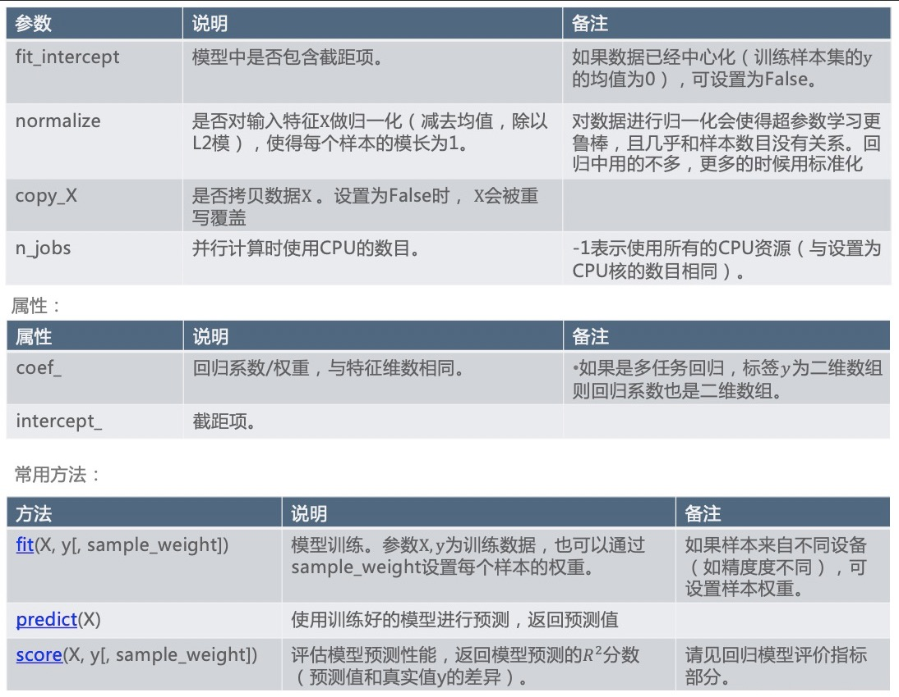
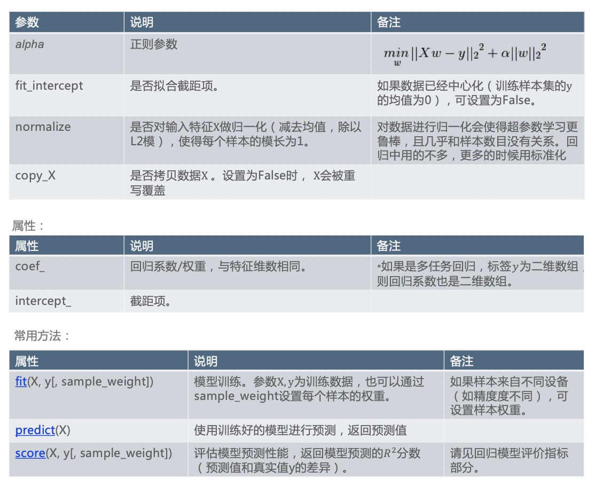
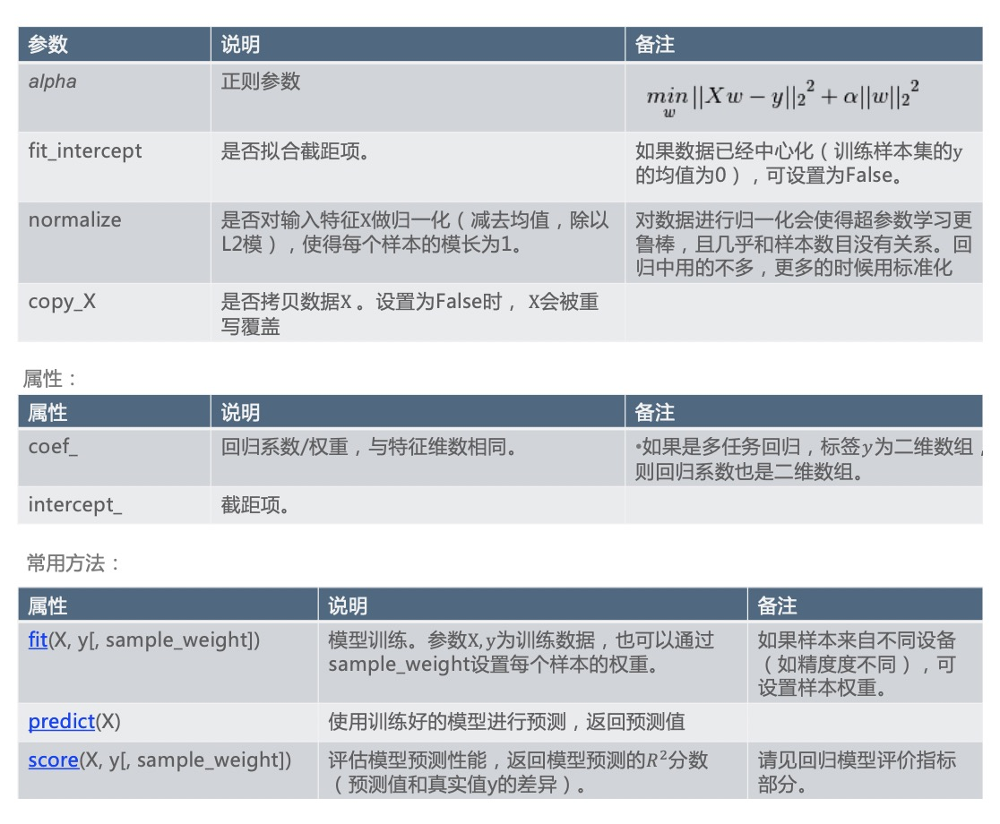

### 最小二乘线性回归

- 最小二乘(OLS)线性回归中，目标函数只考虑了模型对训练样本的拟合程度: $J(w) = \sum_{i=1}^N L(y_i, f(x_i, w)) = \sum_{i=1}^N (y_i - f(x_i;w))^2 = ||y-Xw||_2^2$
    * 这里损失取的是L2损失
- Scikit-Learn中实现的最小二乘线性回归为:LinearRegression
    * `class sklearn.linear_model.LinearRegression(fit_intercept=True, normalize=False, copy_X=True, n_jobs=1)`
    * $f(x_i;w) = \sum_{j=1}^D w_j x_j + w_0$
    * 把模型训练好之后，参数会保留在模型里面，

    

- 如果目标函数只考虑模型对训练样本的拟合，会选择一个非常复杂的模型，和训练数据拟合的特别好，但和测试数据拟合的并不好，容易产生过拟合。
- 抑制过拟合:在目标函数中加入正则项: $J(w,\lambda) = \sum_{i=1}^N L(y_i,f(x_i;w)) +\lambda R(w)$
    * w是模型参数，$\lambda$是正则系数
    * 这个目标函数由两部分组成，加号前面是训练的损失和，叫经验风险
    * 加号后面只和w有关系，和模型本身复杂度(模型结构)有关系，R表示Risk的意思，这部分通常叫做结构风险，更多的时候把前后合起来叫结构风险
    * 我们把目标函数最小化，通常指的是结构风险最小化
    * 这个$\lambda$在正则项的前面表示对这个正则项有多看中，所以我们把它称为正则参数，$\lambda$越大表示正则$R(w)$不能太大, 这时候倾向于选择比较简单的模型
    * 这个$\lambda$参数我们把它称为模型的超参数，我们可以通过交叉验证的方式找到合适的$\lambda$
    * 在这个目标函数中包含两部分，一部分是要求模型和训练数据拟合的较好(能解释训练数据)，另一部分要求模型不要太复杂，这个目标函数体现了一个哲学思想: 奥卡姆剃刀原理
- 奥卡姆剃刀(Occam's Razor)原理:简单有效，选择能解释数据的最简单的模型。

### 常用正则项

- L2正则: $R(w) = ||w||_2^2 = \sum_{j=1}^D w_j^2$
- L1正则: $R(w) = ||w||_1 = \sum_{j=1}^D |w_j|$
- 其中w为模型参数， D为参数的维数

### 岭回归

- 当损失函数取L2损失: $L(y_i,f(x_i;w)) = (y_i - f(x_i;w))^2$
- 正则项取L2正则: $R(w) = \sum_{i=1}^D w_j^2$ (对截距项不施加惩罚)
- 模型取线性回归: $f(x;w) = w^Tx = \sum_{j=0}^D w_jx_j$ (增加常数项$x_0 = 1$表示截距项)
- 得到岭回归的目标函数为:

$$
J(w;\lambda) = \sum_{j=1}^N L(y_i, f(x_i;w)) + \lambda R(w) \\
= \sum_{j=1}^N(y_i - w^T x_i)^2 + \lambda \sum_{j=1}^D w_j^2 \\
= ||y - Xw||_2^2 + \lambda ||w||_2^2
$$

- 岭回归的目标函数为: $J(w;\lambda) = ||y - Xw||_2^2 + \lambda||w||_2^2$
- Scikit-Learn中实现的岭回归为: Ridge
    * `class sklearn.linear_model.Ridge(alpha=1.0, fit_intercept=True, normalize=False, copy_X=True, max_iter=None, tol=0.001, solver=’auto’, random_state=None)`
    * alpha: 目标函数$J(w; \lambda)$中的$\lambda$
    * fit_intercept、normalize、copy_X: 意义同LinearRegression
    * 其余参数与优化计算有关
    * 属性和常用方法同`LinearRegression`
    * Ridge中的属性和之前一样，包括截距项$w_0$, 回归系数$w_j$
    * 岭回归和`LinearRegression`的不同在于多了一个参数alpha, 也就是正则参数$\lambda$, 所以岭回归是带正则的，`LinearRegression`是不带正则的

    

### Lasso

- Lasso 模型： L2损失 + L1正则
- 当损失函数取L2损失：$L(y_i, f(x_i, w)) = (y_i - f(x_i;w))^2$
- 正则项取L1正则：$R(w) = \sum_{j=1}^D |w_jx_j|$
- 得到Lasso (Least Absolute Shrinkage and Selection Operator) 的目标函数为
$$
J(w;\lambda) = \sum_{j=1}^N L(y_i, f(x_i; w)) + \lambda R(w) \\
= \sum_{j=1}^N (y_i - w^T x_i)^2 + \lambda \sum_{j=1}^D |w_j| \\
= ||y - Xw||_2^2 + \lambda ||w||_1
$$

- Lasso 回归的目标函数为：$J(w; \lambda) = ||y - Xw||_2^2 + \lambda ||w||_1$
- Scikit-Learn中实现的Lasso为：$J(w; \lambda) = 1/(2N) ||y - Xw ||_2^2 + \lambda ||w||_1$
    * `class sklearn.linear_model.Lasso(alpha=1.0, fit_intercept=True, normalize=False, precompute=False, copy_X=True, max_iter=1000, tol=0.0001, warm_start=False, positive=False, random_state=None, selection=’cyclic’)`
    * alpha: 目标函数中的 $\lambda$
    * fit_intercept、normalize、copy_X: 意义同LinearRegression 
    * 其余参数与优化计算有关
    * 属性和常用方法同`LinearRegression`

    

### 弹性网络

- 弹性网络:L2损失 + (L1正则 + L2正则)
- 正则项还可以取L1正则和L2正则的组合: $R(w) = \sum_{j=1}^D (\rho |w_j| + \frac{(1-\rho)}{2} w_j^2)$, $\rho$表示L1正则的比例
- 得到弹性网络的目标函数为: $J(w; \lambda, \rho) = \frac{1}{2N} ||y - Xw||_2^2 + \lambda(\rho ||w||_1 + \frac{(1-\rho)}{2} ||w||_2^2), \ \  0 \leq \rho \leq 1.$
- Scikit-Learn中实现的弹性网络为:ElasticNet
    * `class sklearn.linear_model.ElasticNet(alpha=1.0, l1_ratio=0.5, fit_intercept=True, normalize=False, precompute=False, max_iter=1000, copy_X=True, tol=0.0001, warm_start=False, positive=False, ra ndom_state=None, selection=’cyclic’)`
    * alpha参数为上述目标函数中的𝜆，l1_ratio为上述目标函数中的𝜌

### 正则的效果

- 使用正则的目的是为了$w_j$的值不要太大，从而使得模型不会太复杂
- L2正则使得线性回归系数收缩，模型稳定。
- 当输入特征之间存在共线性时使用L2正则。
- L1正则也会收缩回归系数。当正则参数取合适值时，L1正则使得有些线性回归系数为0，得到稀疏模型。
- 当输入特征多，有些特征与目标变量之间相关性很弱时，L1正则可能只选择强相关的特征，模型解释性好。
- 注意:由于正则项中对不同维度的$w_j$同等对待，对输入特征X最好做去量纲(scaling)处理，使得不同维度的特征取值范围大致相同。(如标准化:sklearn.preprocessing.StandardScaler )
