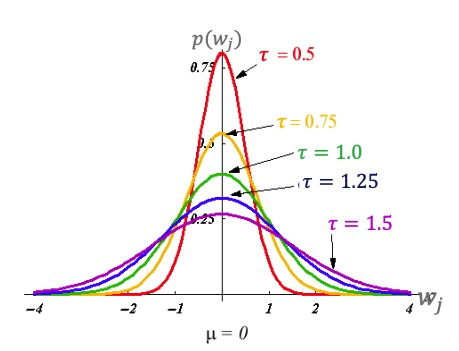
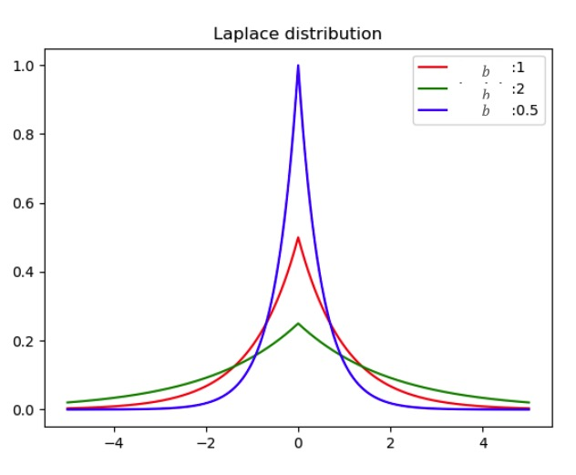

### 正则的概率解释

**常用正则项**

- L2正则: $R(w) = ||w||_2^2 = \sum_{j=1}^D w_j^2$
- L1正则: $R(w) = ||w||_1 = \sum_{j=1}^D |w_j|$
- 这里以L2正则来进行概率解释

**之前损失函数的概率解释**

- 当假设数据产生模型为: $y = f(x) + \epsilon, \ \ \ \epsilon \sim N(0, \sigma^2)$
    * $\epsilon$ 是一个噪声，均值是0， 方差是$\sigma^2$
- 则 $y | x \sim N(f(x;w), \sigma^2)$, 即 $p(y|x) = \frac{1}{\sqrt{2 \pi} \sigma} exp(- \frac{(y-f(x;w))^2}{2 \sigma^2})$
    * 这就是一个高斯分布的概率密度函数
    * 每个数据点的概率知道了，就可以求似然函数
- 似然函数为 $p(D|w) = \prod_{i=1}^N \frac{1}{\sqrt{2\pi} \sigma} exp(- \frac{(y_i - f(x_i; w))^2}{2 \sigma^2})$
    * D是训练数据，有N个样本

**正态分布先验**

- 增加参数的先验: $w_j$的值不能太大, $w_j$ 取0附近的值概率更高，越远离0概率越小

    

- 可用正态分布: $w_j \sim N(0, \tau^2)$
- 则$w_j$独立的概率密度函数为: $p(w_j) = \frac{1}{\sqrt{2\pi} \tau} exp(- \frac{w_j^2}{2\tau^2})$
- 假设$w_j$独立，得到向量w的概率密度函数: $p(w) = \prod_{j=1}^D p(w_j)$
- 根据贝叶斯公式，参数的`后验分布`为: $p(w|D) \varpropto p(w) p(D|w)$

**贝叶斯估计**

- 似然函数为：$p(D|w) = \prod_{i=1}^N p(y_i| x_i) = \prod_{i=1}^N \frac{1}{\sqrt{2\pi}\sigma} exp(-\frac{(y_i - f(x_i;w))^2}{2 \sigma^2})$
- 参数的先验为：$p(w) = \prod_{i=1}^D p(w_j) = \prod_{j=1}^D \frac{1}{\sqrt{2\pi}\tau} exp(-\frac{w_j^2}{2 \tau^2})$
- 参数的后验分布为：$p(w|D) \varpropto p(w) p(D|w)$
- 两边取log运算，得到：

$$
log p(w|D) = log p(w) + log p(D|w) \\
= - \frac{D}{2} log(2 \pi) - D log \tau - \sum_{j=1}^D \frac{w_j^2}{2 \tau^2}
$$

- 最终得到 $log p(w|D) = - \frac{N}{2} log(2 \pi) - Nlog \sigma - \sum_{i=1}^N \frac{(y_i - f(x_i; w))^2}{2 \sigma^2}$

- 贝叶斯最大后验估计(Maximum a posteriori estimation, MAP)为

$$
\hat{w} = \underset{w}{argmax} log p(w | D) \\
= \underset{w}{argmax} (logp(w) + logp(D|w)) \\
= \underset{w}{argmin} (\sum_{j=1}^D \frac{w_j^2}{2 \tau^2} + \sum_{i=1}^N \frac{(y_i - f(x_i;w))^2}{2 \sigma^2}) \\
= \underset{w}{argmin} (\frac{\sigma^2}{\tau^2} \sum_{j=1}^D w_j^2 + \sum_{i=1}^N (y_i - f(x_i; w))^2) \\
$$

- 上面去掉与𝐰无关的项，去掉负号，最大变成最小， 并且乘以 $2 \sigma^2$
-  等价于岭回归的目标函数 : (L2正则等价于正态分布先验) $J(w, \lambda) = \sum_{i=1}^N (y_i - f(x_i; w))^2 + \lambda \sum_{j=1}^D w_j^2$
- 同理可推到L1正则，等价于Laplace分布先验 $p(w_j) = Laplace(0, b) = \frac{1}{2b}exp(- \frac{|w_j|}{b})$

    

- 当b不同的时候，控制了$w_j$在0的概率有多大