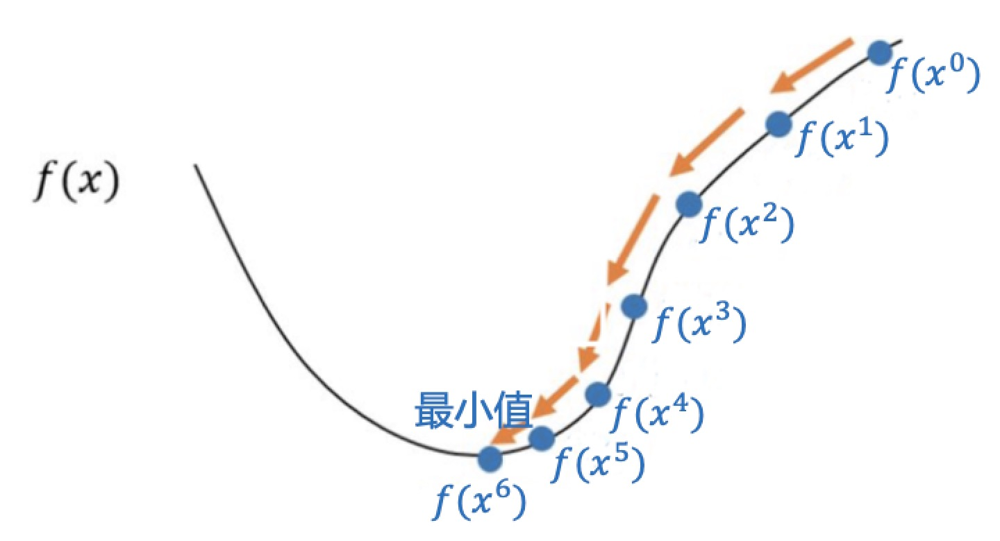
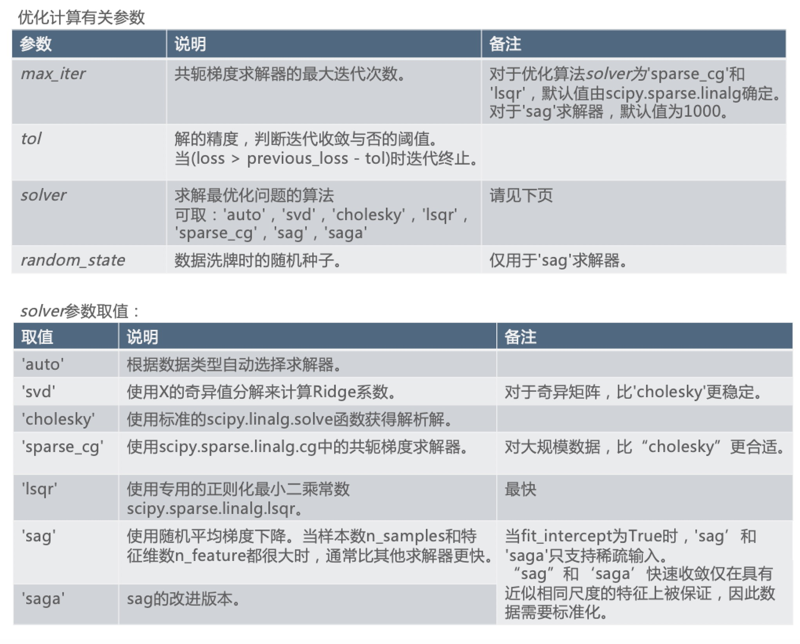
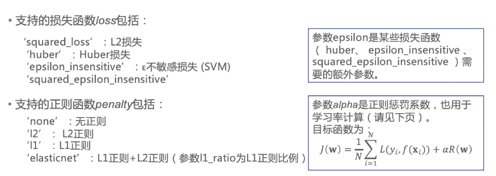

### 梯度

- 在微积分中，一元函数f(x)在x处的梯度为函数在该点的导数 df⁄dx
- 对多元函数$f(x_1, ..., x_D)$，在点$x = (x_1, ... , x_0)$处，共有D个偏导数：$\partial f/\partial x_1, ..., \partial f/\partial x_D$
- 将这D个偏导数组合成一个D维矢量 $(\partial f/\partial x_1, ..., \partial f/\partial x_D)^T$, 称为函数$f(x_1, ..., x_D)$ 在X处的梯度
- 梯度一般记为$\nabla$或grad，即: $\nabla f(x_1, ..., x_D) = grad f(x_1, ..., x_D)=(\partial f/\partial x_1, ..., \partial f/\partial x_D)^T$
- 从几何意义上讲，某点的梯度是函数在该点变化最快的地方
- 沿着梯度向量的方向，函数增加最快，更容易找到函数的最大值
- 沿着负梯度方向，函数减少最快，更容易找到函数的最小值
- $\nabla$ 发音为nabla，表示微分，不属于希腊字母，只是一个记号

### 梯度下降法

- 解析求解法:对𝑁×𝐷维的矩阵𝐗进行SVD的复杂度为: $O(N^2D)$
- 当样本数目𝑁很大或者特征维数𝐷很大时，SVD计算复杂度高，或者机器的内存根本不够
- 可采用迭代求解: 梯度下降法、随机梯度下降法、次梯度法、坐标轴下降法等
- 梯度下降法(Gradient Descent)是求解无约束优化问题最常采用的方法之一
- 要计算𝑓(𝑥)的最小值
- 如果函数形式比较简单且数据量小，可以采用解析计算 $f'(x) = 0$
- 否则可以采用迭代计算
    * 从$t = 0$开始，初始化$x^0$为随机值
    * 找到下一个点$x^{(t+1)}$, 使得函数值越来越小, 即$f(x^{t+1}) < f(x^t)$
    * 重复，知道函数值不再减小，则已经找到函数的最小值
    * 注意：该方法只能找到局部极小值
- 对函数算f(x)进行一阶泰勒(Taylor)展开，得到：$f(x + \Delta x) \approx f(x) +  \Delta x \nabla f(x)$
- 要找到函数的最小值，需要 $f(x + \Delta x) < f(x)$, 因此 $\Delta x \nabla f(x) < 0$
- 可选择$\Delta x = - \eta \nabla f(x), \ (\eta > 0)$
- 其中$\eta$是一个较小的正数，从而$\Delta x \nabla f(x) = - \eta (\nabla f(x))^2 < 0$
- 因此, x的更新: $x^{t+1} = x + \Delta x = x^t - \eta \Delta f(x)$
- 沿负梯度方向走一小步，会使得 $f(x^{t+1}) < f(x^t)$
- 梯度下降法是一阶最优化算法

    

### OLS的梯度下降

- OLS的目标函数为: $J(w) = \sum_{i=1}^N (y_i - w^Tx_i)^2 = ||y - Xw||_2^2 = (y - Xw)^T(y - Xw)$
- 梯度：$\nabla J(w) = - 2 X^Ty + 2X^TXw = - 2 X^T (y - Xw)$
- 梯度下降：$w^{t+1} = w^t - \eta \nabla J(w^t) = w^t + 2\eta X^T(y - Xw^t)$
    * 这里 $y - Xw^t$ 预测残差 r
    * 参数的更新量与输入与预测残差的相关性有关
- OLS的梯度下降法：
    * 1.从t = 0开始，初始化$w^(t)$为较小的随机值(或0)
    * 2.计算目标函数J(w)在当前值的梯度: $\nabla J(w^{(t)})$;
    * 3.根据学习率$\eta$, 更新参数: $w^{(t+1)} = w^{(t)} - \eta \nabla J(w^{(t)})$
    * 4.判断是否满足迭代终止条件。如果满足，循环结束，返回最佳参数 $w^{t+1}$和目标函数极小值$J(w^{(t+1)})$, 否则转到第2步
- 迭代终止条件：
    * 迭代次数达到最大次数
    * 目标函数值变化很小 $\frac{J(w^{t}) - J(w^{(t+1)})}{J(w^{t})} \leq \epsilon$

### 岭回归的梯度下降

- 岭回归的目标函数为 $J(w) = ||y - Xw||_2^2 + \lambda ||w||_2^2$
- 梯度: $\nabla J(w) = -2X^Ty + 2X^TXw + 2\lambda w$
- 梯度下降过程同OLS

### Lasso

- Lasso的目标函数为 $J(w) = ||y - Xw||_2^2 + \lambda ||w||_1$
- 其中绝对值函数$||w||_1$ 在原点𝐰 = 𝟎处不可导，无法用梯度下降求解
    * 可用次梯度概念替换梯度，得到次梯度法
    * 或用坐标轴下降求解

### 梯度下降实用技巧

- 学习率 $\eta$ 需小心设置。太大可能引起目标函数值震荡，太小收敛速度慢。可采用自适应学习率(深度学习部分会学习更多自适应学习率算法)。
- 梯度下降对特征的取值范围敏感。建议对输入特征x最好做去量纲
    * 可用`sklearn.preprocessing.StandardScaler`实现
    * $w^{t+1} = w^t + 2\eta X^T(y - Xw^t)$ 与输入X的取值有关

### 随机梯度下降法

- 在机器学习模型中，目标函数形式为：$J(w) = \sum_{i=1}^N L(y_i, f(x_i;w)) + \lambda R(w)$
- 梯度：$\nabla J(w^{t}) = \sum_{i=1}^N \nabla L(y_i, f(x_i; w^t)) + \lambda \nabla R(w^t)$
- 当样本中存在信息冗余(正负抵消或梯度相似)时效率不高
- 随机梯度下降: 每次梯度下降更新时只计算一个样本上的梯度，即 $\nabla J(w^{t}) = \nabla L(y_t, f(x_t; w^{t}) + \lambda \nabla R(w^{t})$
- 为了确保收敛，相比于同等条件下的梯度下降，随机梯度下降需要采用更小的步长和更多的迭代轮数
- 相对于非随机算法，随机梯度下降在前期迭代效果卓越
- 小批量梯度下降法: 介于一次使用所有样本(批处理梯度下降)和一次只使用一个样本(随机梯度下降)，实践中常采用小批量样本 (mini-batch)

### Ridge优化计算有关参数

- `class sklearn.linear_model.Ridge(alpha=1.0, fit_intercept=True, normalize=False, copy_X=True, max_iter =None, tol=0.001, solver=’auto’, random_state=None)`

    

### SGDRegressor

- Scikit-Learn中的实现了随机梯度下降回归:SGDRegressor
    * SGDRegressor对于大数据量训练集(>10000)的回归问题合适
    * `class sklearn.linear_model.SGDRegressor(loss=’squared_loss’, penalty=’l2’, alpha=0.0001, l1_ratio=0.15, fit_intercept=True, max_iter=None, tol=None, shuffle=True, verbose=0, epsilon=0.1, random_state=None, learning_rate=’invscaling’, eta0=0.01, power_t=0.25, warm_start=False, average=False, n_iter=None)`

    

- 优化相关的参数包括
    * max_iter: 最大迭代次数(访问训练数据的次数，epoches的次数)。SGD在接近10D的训练样本时收敛。因此可将迭代数设置成$np.ceil(10^6 / N)$，其中N是训练集的样本数目。默认值是5。参数n_iter意义相同，已被抛弃
    * tol:停止条件。如果非None，当(loss > previous_loss - tol)时迭代终止
    * shuffle: 每轮SGD之前是否重新对数据进行洗牌
    * random_state: 随机种子，Scikit-Learn中如随机有关的算法均有此参数，含义相同。当参数shuffle==TRUE时用到。如果随机种子相同，每次洗牌得到的结果一样, 可设置为某个整数
    * learning_rate: 支持三种方式
        * constant: eta = eta0
        * optimal: eta = 1.0 / (alpha * (t + t0))
        * invscaling: eta = eta0 / pow(t, power_t)
    * warm_start: 是否从之前的结果继续, 随机梯度下降中初始值可以是之前的训练结果, 支持在线学习。初始值可在fit函数中作为参数传递
    * average: 是否采用平均随机梯度下降法(ASGD)
