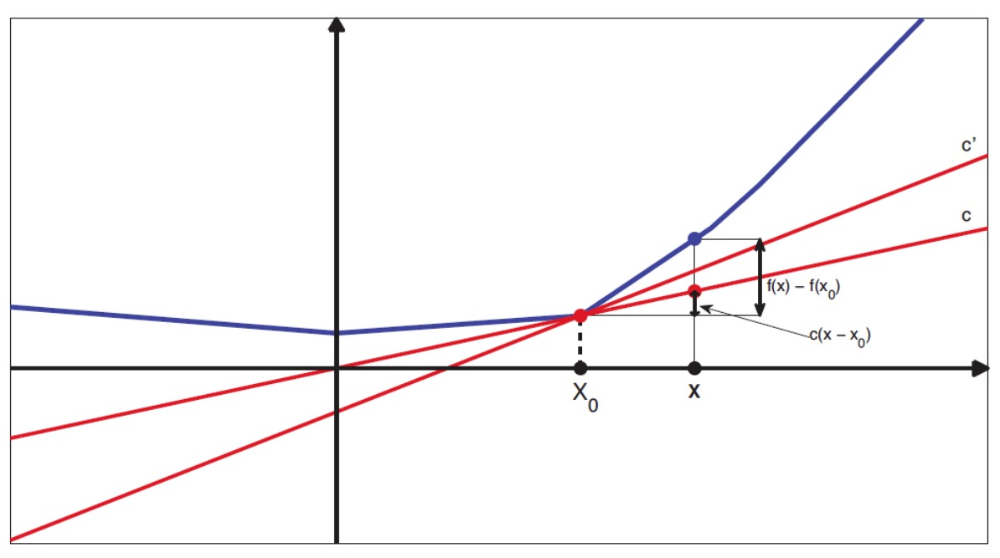
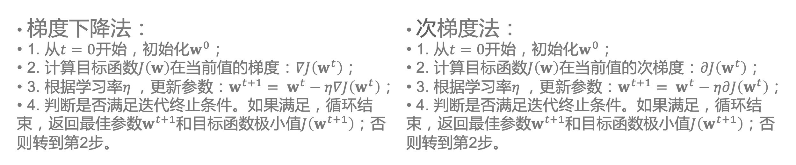
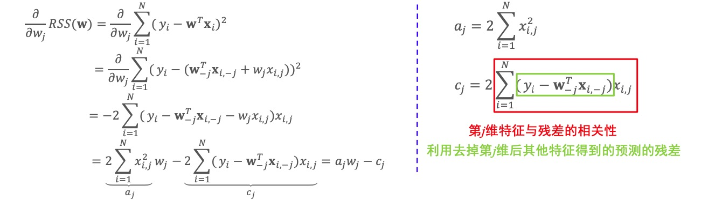
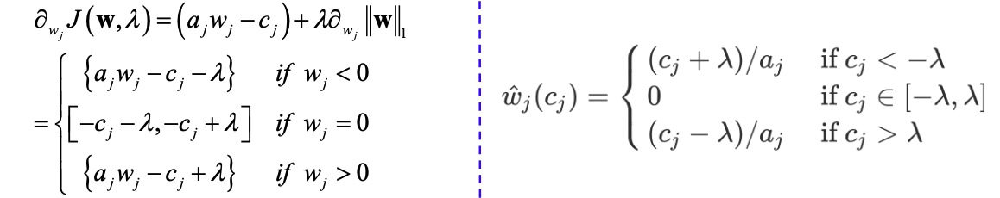
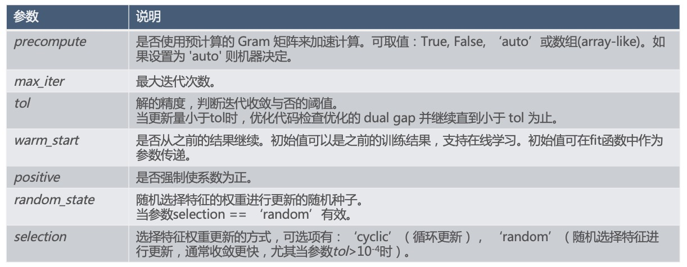

### 梯度下降法

- 当函数可导时，梯度下降法是非常有效的优化算法

    

- Lasso的目标函数为：$J(w) = ||y-Xw||_2^2 + \lambda||w||_1$
- 其中绝对值函数$||w||_1$在$w_j = 0$时不可导, 无法计算梯度, 也无法用梯度下降法求解
- 次梯度法将梯度扩展为次梯度，可以解决这个难题
- 为了处理不平滑函数，扩展导数的表示，定义一个凸函数f在点$x_0$处的次导数为一个标量g，使得$f(x) - f(x_0) \geq g(x - x_0), \forall x \in I$
    * 其中I为包含$x_0$的某个区间

    

- 如上图所示，对于定义域中的任何$x_0$，我们总可以作出一条直线通过点 $(x_0, 𝑓(x_0))$，且直线要么接触f，要么在它的下方。直线的斜率称为函数的次导数
- 次导数的集合为函数f在$x_0$处的次微分，记为$\partial f(x_0)$
- 定义次导数集合为区间 [a, b]:

$$
a = \underset{x \rightarrow x_0^-}{lim} \frac{f(x) - f(x_0)}{x - x_0} \\
$$

$$
b = \underset{x \rightarrow x_0^+}{lim} \frac{f(x) - f(x_0)}{x - x_0}
$$

- 例:对凸函数 f(x) = |x|, $\partial f(x) = \begin{cases} \{-1\} \ \ \ if \ \ \  x < 0 \\ [-1, +1] \ \ \ if \ \ \  x = 0 \\ \{+1\} \ \ \ if \ \ \  x > 0 \end{cases}$
    * 当函数在$x_0$处可导时，次微分只有一个点组成，这个点就是函数在$x_0$处的导数
    * Python可用`numpy.sign`函数实现绝对值函数 的次梯度
- 通过求函数在某点每个分量的次微分，可以求出函数在该点的次梯度
- 最优解条件 $0 \in \partial f(x^*) \leftrightarrow f(x^*) = \underset{x}{min} f(x)$ , 即当且仅当0属于函数f在点$x^*$处次梯度集合时，$x^*$为极值点

### 次梯度法

- 将梯度下降法中的梯度换成次梯度，就得到次梯度法

    

- 与梯度下降算法不同，次梯度算法并不是下降算法(每次对参数的更新，并不能保证目标函数单调递减)
- 因此一般情况下我们选择: $f(x^*) = \underset{1, ..., t}{min} f(x^t)$
- 虽然不能保证次梯度法中目标函数单调下降，可以证明对满足一定条件的凸函数，次梯度法是收敛的，只是收敛速度比梯度下降法慢

### 坐标轴下降法

- 次梯度法收敛速度慢，Lasso求解推荐使用坐标轴下降法
- 坐标轴下降法:沿坐标轴方向搜索
- 在每次迭代中，在当前点处沿一个坐标轴方向进行一维搜索
- 循环使用不同的坐标轴。一个周期的一维搜索迭代过程相当于一个梯度迭代
- 利用当前坐标系统进行搜索，无需计算目标函数的导数，只按照某 一坐标方向进行搜索最小值
- 梯度下降法:沿目标函数负梯度的方向搜索，梯度方向通常不与任 何坐标轴平行
- 坐标下降法在稀疏矩阵上的计算速度非常快

### Lasso的坐标轴下降法求解

- Lasso的目标函数为: $J(w) = ||y - Xw||_2^2 + \lambda ||w||_1$
- 坐标轴下降法:每次搜索一个维度
- 对第j维，目标函数第一部分为残差平方和 RSS(w)

    

- 注意: $w_{-j}$表示D维向量w中去掉第j维的其他(𝐷 − 1)维向量; 类似的，$x_{i, -j}$表示D维向量$x_i$中去掉第j维的其他(D − 1)维向量

### Lasso的坐标轴下降法求解

- Lasso的目标函数为: $J(w) = ||y - Xw||_2^2 + \lambda ||w||_1$
- 第𝑗维对应目标函数次梯度为

    

-  最优解条件: $0 \in \partial_{w_j} J(w)$
-  1.计算 $a_j = 2 \sum_{i=1}^N x_{i,j}^2$
-  2.初始化参数𝒘(全0或随机)
-  3.循环直到收敛: 选择变化幅度最大的维度或者轮流更新$w_j$
    * 3.1计算$c_j = 2 \sum_{i=1}^N (y_i - w_{-j}^T x_{i, -j}) x_{i,j}$
    * 3.2计算$\hat{w_j} = \begin{cases} (c_j + \lambda) / a_j \ \ \ \text{ 如果 } c_j < - \lambda \\ 0 \ \ \ \ \ \ \ \ \ \ \ \ \ \ \ \ \ \ \ \ \text{ 如果 } c_j \in [-\lambda, \lambda ] \\ (c_j - \lambda) / a_j \ \ \ \text{ 如果 } c_j > \lambda \end{cases}$
    * 注意:当特征与预测残差弱相关, 即：$c_j \in [-\lambda, \lambda]$时，$w_j = 0$
    * 当$\lambda \leq max_j(x_{:j}^T y$时，所有$w_j = 0$, 其中$w_{:j}$表示所有样本第j维的特征值，y表示所有样本的标签

### Lasso 优化计算有关参数

- `class sklearn.linear_model.Lasso(alpha=1.0, fit_intercept=True, normalize=False, precompute=False, copy_X =True, max_iter=1000, tol=0.0001, warm_start=False, positive=False, random_state=None, selection=’cyclic’)`

    

