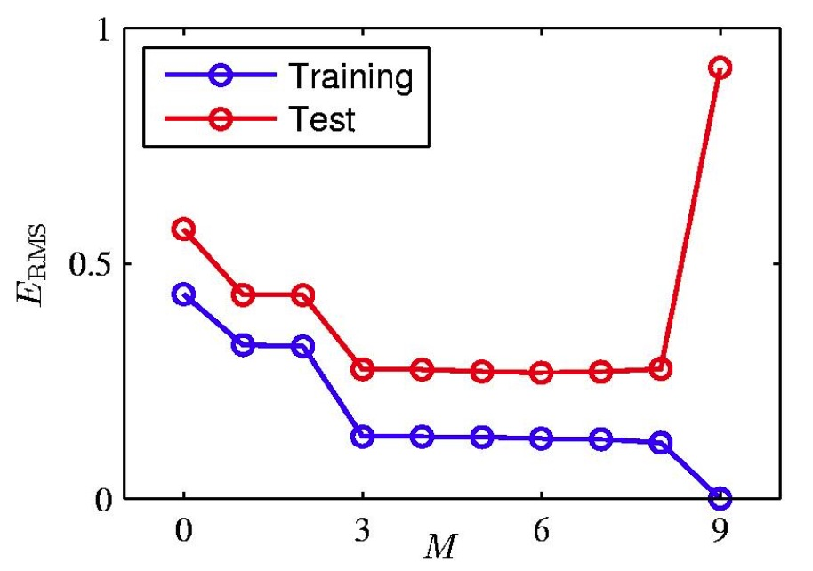
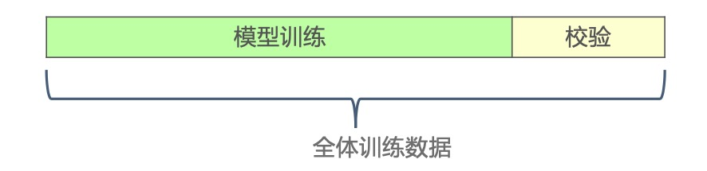
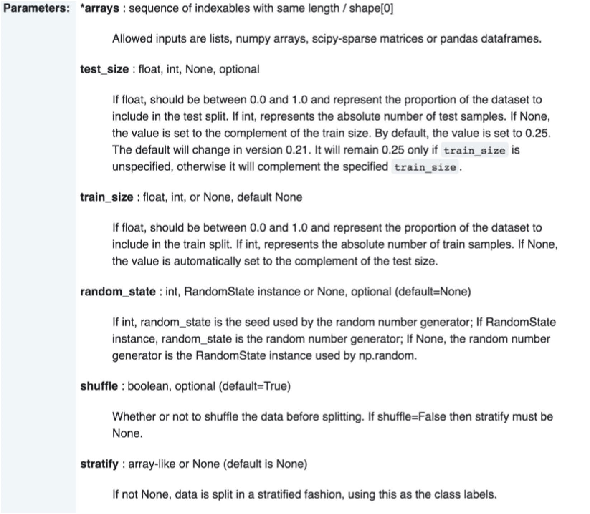
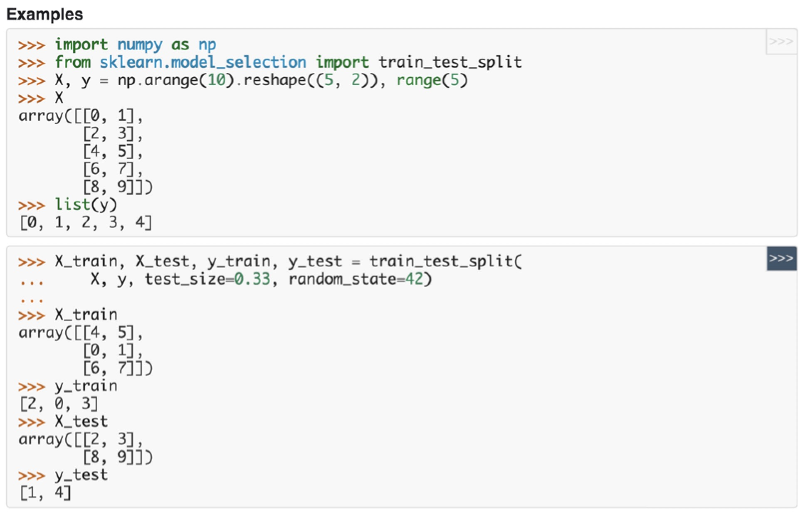
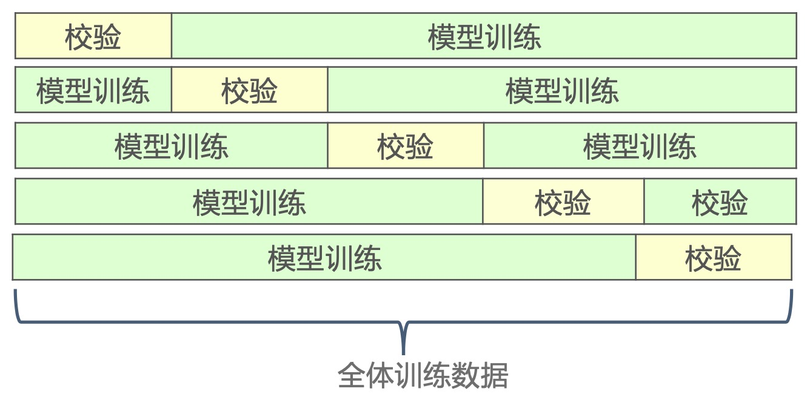
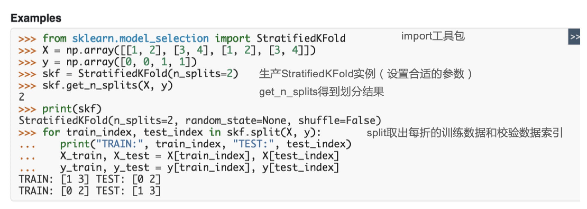
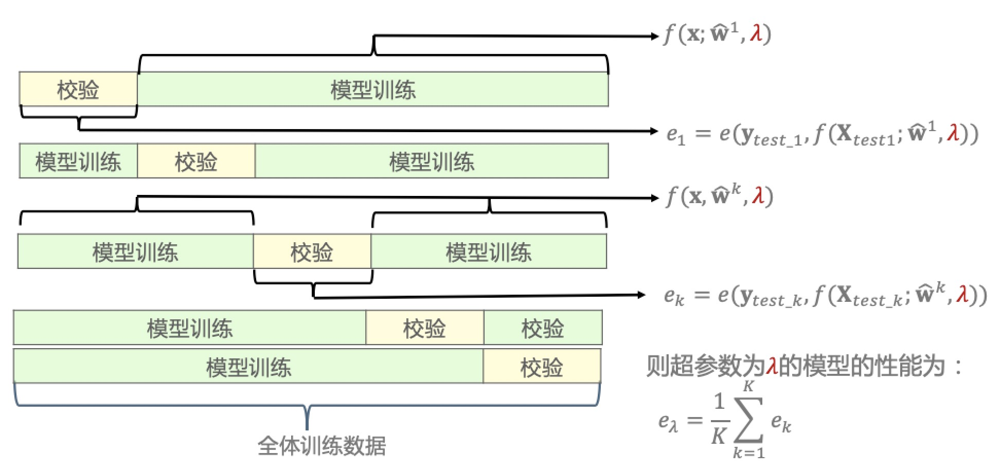
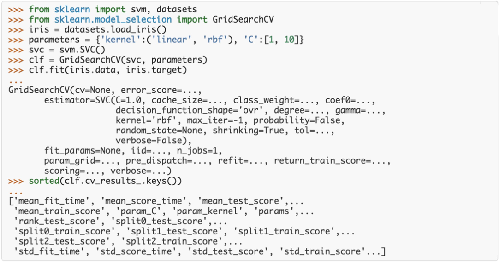
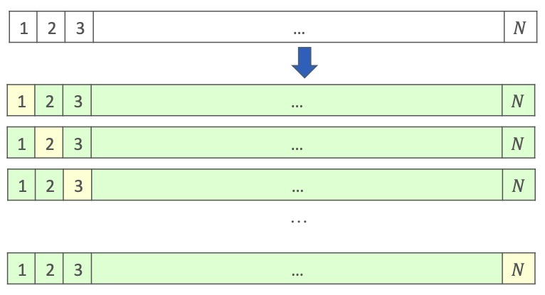

### 模型评估

- 不能用训练集评估模型性能，而应该在新的测试数据上进行:推广能力/泛化能力
- 例: sin曲线拟合:用多项式拟合sin曲线
- 数据产生模型为 $y = sin(2\pi x) + \epsilon, \ \ \ \epsilon \sim N (0, 0.03^2)$
- 给定𝑁 = 10个样本点，采用𝑀阶多项式拟合数据: $y = \sum_{j=0}^M w_jx^j$
- 训练误差vs. 测试误差(100个测试样本)

<div align="center">
    
</div>

### 校验集

- 但实际应用中测试数据标签不可得(待预测)。如何评估模型性能?
- 答案:在校验集上评估模型性能
- 校验集从全体训练数据集中分出一部分数据，不参与模型训练

<div align="center">
    
</div>

- 当训练数据很多时，留出一部分数据做校验后，训练集样本还足够，可以采用上述方式得到校验集

### Scikit-Learn:校验集数据划分

- Scikit-Learn将全体训练数据划分随机划分为训练集/校验集: train_test_split
- `sklearn.model_selection.train_test_split(*arrays, **options)`

<div align="center">
    
</div>

- `*arrays` 要划分的数据 (X,y)
- `test_size` 校验集大小
- `train_size` 训练集大小
- `random_state` 随机种子:由随机数产生器产生的随机种子。 当参数shuffle==TRUE时用到random_state参数。如果随机种子不同，每次调用交叉验证的到的数组分组不同。为了保证每次的划分结果一样，可以设置random_state为某个整数
- `shuffle` 是否在划分数据之前洗牌
- `stratify` 分层抽样。如果是分类数据，划分时训练集/校验集各个类别的样本比例相同

### Scikit-Learn: 校验集数据划分

Scikit-Learn将全体训练数据划分随机划分为训练集/校验集:train_test_split

<div align="center">
    
</div>

- 输入:要划分的数据(X, y)校验集的大小(test_size), 随机种子(random_state) 
- 输出:训练集和校验集的X,y
- 注意:这里用test表示校验集

### 交叉验证

- 但从训练集中分离一部分数据作为校验集，会使得模型训练能使用的 数据减少(机器学习中训练样本越多越好)。有更好的办法?
- 答案:K折交叉验证
- 将全体训练数据等分为K份
- 重复K次:每次用1份数据做校验，余下 K−1 份数据训练模型

<div align="center">
    
</div>

- 注意: 该方法计算代价很高，但不会浪费太多的数据，当样本数据集较少时有优势

### Scikit-Learn: K折交叉验证数据划分

- 当数据是一个分类数据(标签𝑦是类别)，为了保证每折中各个类别样 本比例一致， Scikit-Learn实现了分层(Stratified)数据划分的类: StratifiedKFold
- 其他情况用类:Kfold
- `class sklearn.model_selection.StratifiedKFold(n_splits=3, shuffle=False, random_state=None)`
- `class sklearn.model_selection.KFold(n_splits=3, shuffle=False, random_state=None )`
- 参数说明
    * n_splits: 交叉验证的折数𝐾
    * shuffle: 是否在划分数据之前对全体数据进行洗牌(打乱顺序)
    * random_state: 由随机数产生器产生的随机种子。当参数shuffle==TRUE时用到random_state参数。如 果随机种子不同，每次调用交叉验证的到的数组分组不同。为了保证每次的划分结果一样，可以设置 random_state为某个整数。

### Scikit-Learn: K折交叉验证数据划分

<div align="center">
    
</div>

<table>
    <tr>
        <td>样本索引</td>
        <td>x1</td>
        <td>x2</td>
        <td>y</td>
    </tr>
    <tr>
        <td>0</td>
        <td>1</td>
        <td>2</td>
        <td>0</td>
    </tr>   
    <tr>
        <td>1</td>
        <td>3</td>
        <td>4</td>
        <td>0</td>
    </tr>    
    <tr>
        <td>2</td>
        <td>1</td>
        <td>2</td>
        <td>1</td>
    </tr>    
    <tr>
        <td>3</td>
        <td>3</td>
        <td>4</td>
        <td>1</td>
    </tr>
</table>

### 模型评估

- 校验验证通常用于模型选择/模型的超参数调优:评价不同超参数对应模型的性能
- 模型超参数:如Lasso中的正则参数 $\lambda$

<div align="center">
    
</div>

### Scikit-Learn:𝐾折交叉验证评估模型性能

- Scikit-Learn实现两个了采用𝐾折交叉验证评估模型性能的函数:
    * cross_val_score:评估一个指标，在校验集上的得分
    * `sklearn.model_selection.cross_val_score(estimator, X, y=None, groups=None, scoring=None, cv=None, n_jobs=1, verbose=0, fit_params=None, pre_dispatch='2*n_jobs')`
    * cross_validate:允许指定多个指标进行评估。除了校验集上的得分外，还会返回一个包含训练得分、拟合次数、得分次数的一个字典
    * `sklearn.model_selection.cross_validate(estimator, X, y=None, groups=None, scoring=None, cv=None, n_jobs=1, verbose=0, fit_params=None, pre_dispatch=‘2*n_jobs’, return_train_score=’warn’)`

### Scikit-Learn: cross_val_score

- `sklearn.model_selection.cross_val_score(estimator, X, y=None, groups=None, scoring=None, cv=None, n_jobs=1, verbose=0, fit_params=None, pre_dispatch='2*n_jobs')`

- 参数说明
    * estimator: 要训练的模型
    * X, y: 全体训练数据
    * groups: 数据的分组标识。通常我们假设数据是独立同分布( i.i.d. )，但在有些应用中如果数据生成过程依赖于样本的groups，(如从多个患者收集医学数据，从每个患者身上采集多个样本。则每个样本的患者 ID 是其分组标识)。 在这种情况下，我们想知道在一组特定的 groups 上训练的模型是否能很好地适用于未见过的 group 。因此，要确保验证数据的所有样本与对应的训练折中的数据没有相同的组。(Scikit-Learn中有一整套与 groups有关的校验验证实现)
    * scoring: 评价指标
    * cv:交叉校验划分策略。可为整数(交叉验证的折数𝐾)、交叉验证生成器的对象、产生train/test划分的迭 代器对象。默认是None，采用3折交叉验证。输入类别数据时，自动采用分层抽样。
    * n_jobs: 使用CPU的数目，-1表示使用所有的CPU资源(与设置为CPU核的数目相同)。
    * verbose:日志冗长度。0:不输出训练过程，1:偶尔输出，>1:对每个子模型都输出。
    * fit_params: estimator的fit函数需要的参数
    * pre_dispatch : 控制并行计算中预派遣的任务数。
  
- 例：

jobs=3， CV=12 
如果没有设置参数pre_dispatch，当开始执行cross_val_score时，程序会一次性把全部12个CV都派遣出 去，每个处理器领到4个CV(把任务和任务对应的数据发送给处理器)。如CPU_A领到了CV_1, CV_4, CV_7, CV_10，那么CPU_A就领到了四份训练数据集、四份测试集存放在内存里，然后CPU_A开始依次 完成CV_1, CV_4, CV_7, CV_10。

如果设置pre_dispatch=‘2*n_jobs’，当开始执行cross_val_score时，程序会派遣6个CV出去，每个处理器 领到2个CV。所以一开始每个处理器只需要存两份训练集、测试集。比如说CPU_A领到了CV_1和 CV_4，CPU_B领到了CV_2和CV_5，CPU_C领到了CV_3和CV_6，如果CPU_B率先完成了CV_2，那么 系统会自动把CV_7派遣给CPU_B;接着CPU_A完成了CV_1，系统再把任务CV_8放在CPU_A的任务队列 里。pre_dispatch=‘2*n_jobs’的意思就是保持每个CPU都有两个任务在身(一个在做，一个在排 队)，除非所有任务都被派遣出去了。

如果我们设置pre_dispatch=‘1*n_jobs’，这样占用的内存最低，只有当当前的任务完成之后，才会有 新任务(数据)派遣到闲置处理器，而非将数据放在队列中等待。

- Examples

```python
from sklearn import datasets, linear_model
from sklearn.model_selection import cross_val_score # 工具包
diabetes = datasets.load_diabetes() # 训练数据
X = diabetes.data[:150]
y = diabetes.target[:150]
lasso = linear_model.Lasso() # 机器学习模型(需要设置合适的参数, 这里采用缺省参数)
print(cross_val_score(lasso, X, y)) # cross_val_score得到每折的校验得分， 缺省为3折交叉验证 [0.33150734 0.08022311 0.03531764]
```

### Scikit-Learn: cross_validate

- `sklearn.model_selection.cross_validate(estimator, X, y=None, groups=None, scoring=None, cv=None, n_jobs=1, verbose=0, fit_params=None, pre_dispatch=‘2*n_jobs’, return_train_score=’warn’)`
- 参数说明
    * return_train_score : 是否包含训练得分。缺省”warn”表示真，包含训练得分。计算训练得分可以通过 训练得分和校验得分查看模型在过拟合状态还是欠拟合状态。但是训练得分较慢，且不计算也不影响模型 的最佳参数选取(最佳参数只看校验得分)，后续版本可能将缺省值设为False。
    * 过拟合状态:训练集上表现很好，校验集上表现欠佳 
    * 欠拟合状态:训练集和校验集上性能都不好
- Examples
    ```python
    from sklearn import datasets, linear_model
    from sklearn.model_selection import cross_validate
    from sklearn.metrics.scorer import make_scorer
    from sklearn.metrics import confusion_matrix
    from sklearn.svm import LinearSVC
    diabetes = dataets.load_diabetes() # 训练数据
    X = diabetes.data[:150]
    y = diabetes.target[:150]
    lasso = linear_model.Lasso() # 机器学习模型
    ```
    * Single metric evaluation using `cross_validate`
        ```python
        cv_results = cross_validate(lasso, X, y, return_train_score=False)
        sorted(cv_results.keys()) # ['fit_time', 'score_time', 'test_score']
        # cross_validate得到每折的训练得分和校验得分。这里只打印了校验得分test_score
        print(cv_results['test_score']) # array([0.33..., 0.08..., 0.03...])
        ```
    * Multiple metric evaluation using `cross_validate` (please refer the `scoring` parameter doc for more information)
        ```python
        scores = cross_validate(lasso, X, y, scoring=('r2', 'neg_mean_squared_error'))
        # 多种评价指标(r2', 'neg_mean_squared_error') 训练得分、校验得分
        print(scores['test_neg_mean_squared_error']) # [-3635.5... -3573.3... -6114.7 ...]
        print(scores['train_r2']) # [0.28... 0.39... 0.22 ...]
        ```

### 模型超参数调优

- 交叉验证可以评价一个超参数取值𝜆对应模型的性能 $e_\lambda$
- 超参数调优:遍历不同的超参数取值，选择性能最好的超参数 $\lambda^*$
- 模型再训练:在给定最优超参数$\lambda^*$情况下，用全体训练数据再次训练模型，得到模型参数w，得到最终模型$f(x; w, \lambda^*)$
- Scikit-Learn中用交叉验证实现模型超参数调优: GridSearchCV
    * `class sklearn.model_selection.GridSearchCV(estimator, param_grid, scoring=None, fit_params=None, n_jobs=1, iid=True, refit=True, cv=None, verbose=0, pre_dispatch=‘2*n_jobs’, error_score=’raise’, return_train_score=’warn’)`
    * 参数说明
      * param_grid: 待评价参数(可以多个超参数一起调优:grid)
      * X, y: 全体训练数据
      * iid: 样本是否是独立同分布。
      * refit: 评价指标(后续我们会学习针对不同应用的多种评价指标)是否在找到最佳超参数后用全体训练数据 再次训练(fit)模型参数
      * error_score : 训练失败的处理
  
<div align="center">
    
</div>

- 相关说明
    * 1.设置参数搜索范围
    * 2.生产要训练模型/学习器的实例
    * 3.生成一个GridSearchCV实例，需要的参数 包括:学习器(SVC)、参数搜索范围、交叉 验证参数、评价指标...
    * 4.调用GridSearchCV实例的fit函数。 这个过程可能很慢(次数:搜索参数的 数目 * 交叉验证折数)
    * 5.运行结果: 属性cv_results_ 最佳超参数: best_params_ 最佳得分:best_score_ 最佳模型:best_estimator_(refit=true) 适用

### 特殊的交叉验证:留一交叉验证

- 特别的，当交叉验证的折数𝐾 = 𝑁时，因为每次留出一个样本做校验，我们称之为 留一交叉验证。
- 因为折数更多，通常进行时间更长。当样本数非常少使用。
- 对线性模型，可采用广义交叉验证(Generalized Cross Validation, GCV)近似 留一交叉验证，极大降低交叉验证的计算量。Scikit-Learns实现基于GCV的线性模型:如 RidgeCV、LassoCV、 LogisticRegressionCV、...

<div align="center">
    
</div>

### 特殊的交叉验证:自助法(Bootstrap)

- 交叉验证，包括留一交叉验证，采样时都是无放回采样(一旦从数据集中被取出放入训练集或校验集中，它就不能被放回)。也就是说，一个实例只能被选择一次
- 自助法: 有放回的抽样。假设数据集中N个数据，每次放回地从数据集中抽取一个样本，共抽样N次。一个Bootstrap样本有N个样本，所以一个Bootstrap样本中的数据可能存在重复
- 每个数据每次被取到的概率是1/N，不被抽到的概率是1 − 1/N 。则一个Bootstrap样本中的N个样本中，某个样本点不被取到的概率是 $(1 - 1/N)^N \approx 0.368$也就是一个Bootstrap样本中只包含了训练集中63.2%的数据。因此也被称为0.632自助法。(10折交叉验证中每次 包含90%的训练数据。)

**例:Booststrap采样**

- 例:输入3个数据: 1, 2, 3, 则Bootstrap采样可能为:
    * 1, 2, 3
    * 2, 2, 1
    * 3, 3, 1
    * 1, 1, 2
    * 3, 3, 3
    * ...

### 特殊的校验验证

- 一般我们是假设数据是独立同分布(i.i.d)
- 但在实践中，有时样本是使用时间相关的过程生成的，则使用time-series aware cross-validation scheme更安全
- 同样，如果我们知道生成过程具有分组结构(group structure)，如从不同subjects、不同实验、不同测量设备收集的样本，则使 用 group-wise cross-validation更安全