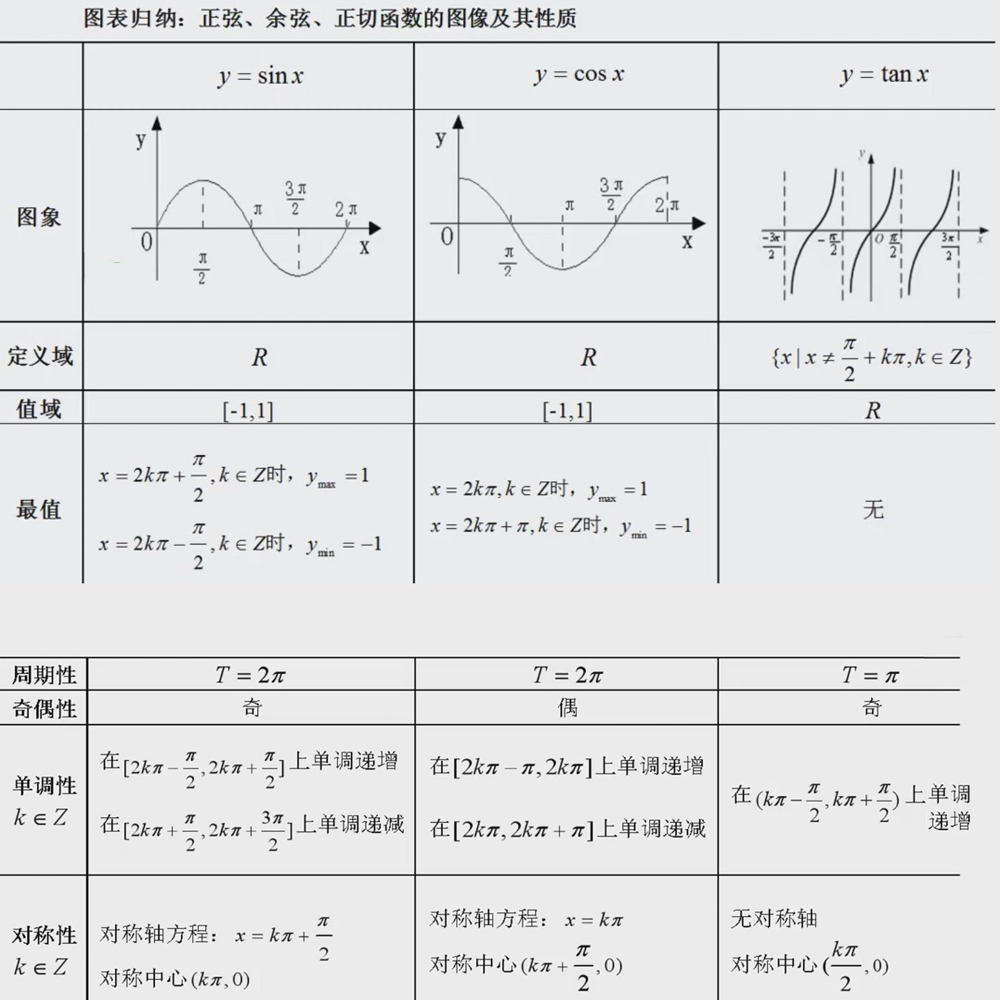
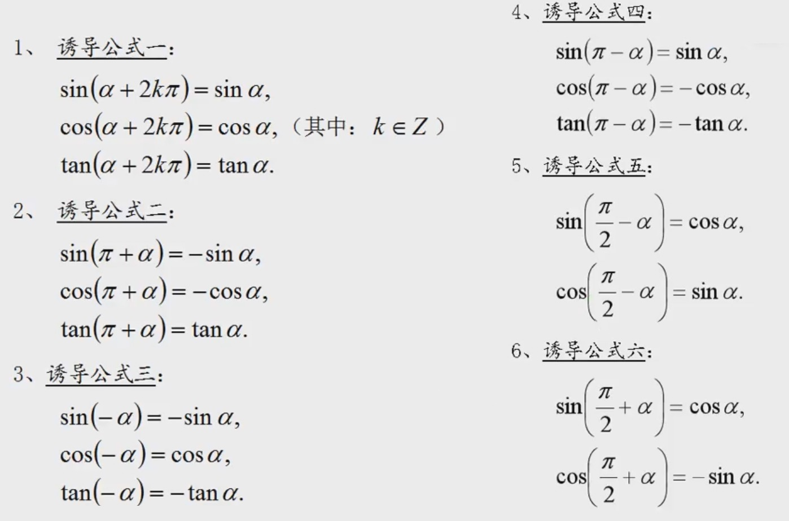

### 关于角

1 ） **角的概念**

- 在数学和物理中，弧度是角的度量单位。它是由国际单位制导出的单位
- 同一三角形中, 等边对等角, 等角对等边
- 直角三角形中, 30度角所对边等于斜边一半
- 直角三角形中, 斜边中线等于斜边一半
- 直角三角形中, 两直角边的平方和等于斜边的平方（勾股定理）
- 等腰三角形中, 两腰相等
- 等腰直角三角形中, 两直角边相等

2 ） **任意角**

- 正角、负角、零角、象限角的概念
- 与角a终边相同的角的集合: $\{ b | b = a + 2k\pi, k \in Z \}$

3 ） **弧度制**

- 把长度等于半径长的弧所对的圆心角叫做1弧度的角
- 弧度与角度是可以换算的
    * 90°、180°、270°、360° ...
    * $\frac{\pi}{2}、\pi、\frac{3\pi}{3}、2\pi$ ...
- $|a| = \frac{l}{r}$
- 弧长公式 $l = \frac{n\pi R}{180} = |a|R$
- 扇形面积公式 $S = \frac{n\pi R^2}{360} = \frac{1}{2} lR$

### 三角函数

**任意角**

- 设a是一个任意角，它的终边与单位圆交于点P(x,y), 那么： $sin a = y, cosa = x, tan a = \frac{y}{x}$
- 设点A(x,y)为角a终边上任意一点，设 $r = \sqrt{x^2 + y^2}$ 那么: $sina = \frac{y}{r}, cosa = \frac{x}{r}, tana = \frac{y}{x} cota = \frac{x}{y}$
- sina, cosa, tana 在四个象限的符号和三角函数线的画法

    
     
    
备注：图片托管于github，请确保网络的可访问性

     

**同角三角函数的基本关系式**

- 平方关系：$sin^2 a + cos^2 a = 1$
- 商数关系：$tana = \frac{sina}{cosa}$
- 倒数关系：$tana cota = 1$

**正弦、余弦、正切函数的图像和性质**

    
     
    
备注：图片托管于github，请确保网络的可访问性

     

**三角常用公式**

    
     
    
备注：图片托管于github，请确保网络的可访问性

     

