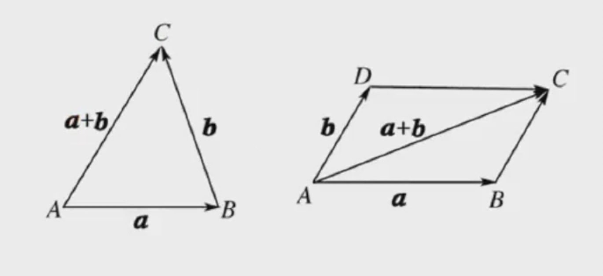
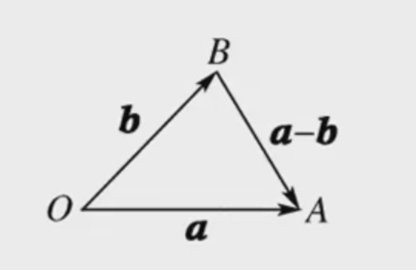
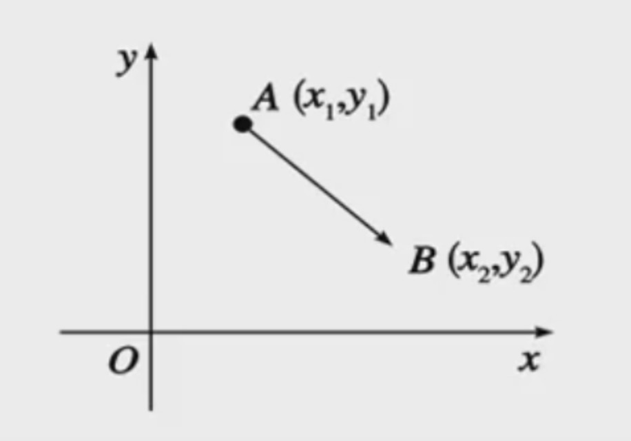

### 向量

1 ） **概念**

- **向量**：既有大小，又有方向的量叫做向量，如力、位移等
- **数量**：只有大小，没有方向的量称为数量，如年龄、身高、长度、面积、体积、质量等
- **向量和数量的区别**：向量有方向，数量没有方向；数量之间可以比较大小，而向量之间不能比较大小
- **零向量**：长度为0的向量
- **单位向量**：长度为1个单位的向量
- **有向线段**：带有方向的线段叫有向线段，其方向是由起点指向终点，以A为起点、B为终点的有向线段记做 $\overrightarrow{AB}$，
- 线段AB的长度也叫做有向线段$\overrightarrow{AB}$的长度，记为 $|\overrightarrow{AB}|$. 
- 书写有向线段时，起点写在终点的前面，上面标上箭头，三角函数都是有向线段

2 ） **相等向量**

- 长度相等且方向相同的向量叫做相等向量，记为 $a = b$
- 任意两个相等的非零向量，都可用同一条有向线段来表示，并且与有向线段的起点无关
- 在平面上，两个长度相等且方向一致的有向线段表示同一个向量

2 ） **平行向量**

- 方向相同或相反的非零向量叫做平行向量，记为 $a // b$
- 规定：零向量与任何向量都平行，记为 $0 // a$
- 任意组平行向量都可以平移到统一直线上，因此，平行向量也叫有线向量

3 ） **总结**

- 共线向量所在直线平行或重合，如果两个向量所在的直线平行或重合，则这两个向量是平行向量.
- 在平面内，相等的向量有无数多个，它们的方向相同且长度相等. 
- 相等向量是共线向量，而共线向量不一定能是相等向量.

### 向量的运算

1 ） **加法**

- **定义**：求两个向量和的运算，叫做向量的加法，两个向量的和仍然是一个向量
- **三角形法则**：已知非零向量 a,b, 在平面内任取一点，作 $\overrightarrow{AB} = a, \overrightarrow{BC} = b$, 则向量 $\overrightarrow{AC}$ 叫做向量a与b的和，记为: $a + b$. 这种求 **向量和** 的方法叫做向量加法的三角形法则
- **平行四边形法则**：已知两个不共线向量a,b, 作 $\overrightarrow{AB} = a, \overrightarrow{AD} = b$, 则 A、B、D 三点不共线，以 $\overrightarrow{AB} , \overrightarrow{AD}$ 为邻边作平行四边形ABCD, 则向量 $\overrightarrow{AC} = a + b$, 这种作两个向量和的方法叫做向量加法的平行四边形法则

    
     
    
备注：图片托管于github，请确保网络的可访问性

     

- **向量加法的多边形法则**：n个向量经过平移，顺次使前一个向量的终点与后一个向量的起点重合，组成一组向量折线，这n个向量的和等于折线起点到终点的向量。这个法则叫做向量加法的多边形法则。多边形法则的实质就是三角形法则的连续应用
- 三角形法则和平行四边形法则就是向量加法的几何意义
- 规定： $a + 0 = 0 + a = a$
- 结论：$|a + b| \leq |a| + |b|$

2 ) **减法**

- **定义**：$a - b = a + (-b)$, 即减去一个向量相当于加上这个向量的**相反向量**
- **作法**：在平面内任取一点 O，作 $\overrightarrow{OA} = a, \overrightarrow{OB} = b$, 则向量 $a-b = \overrightarrow{BA}$，如图所示

    
     
    
备注：图片托管于github，请确保网络的可访问性

     

- **几何意义**：如果把两个向量a,b的起点放在一起，则a-b可以表示为从向量b的重点指向向量a的终点的向量
- 向量减法的实质是向量加法的逆运算，利用相反向量的定义，就可以把减法化成加法
- 在用三角形法则作向量减法时，只要记住"连接两向量的终点，箭头指向被减向量"即可
- 以向量$\overrightarrow{AB} = a, \overrightarrow{AD} = b$ 为邻边作平行四边形ABCD, 则两条对角线的向量为 $\overrightarrow{AC} = a + b, \overrightarrow{BD} = b - a, \overrightarrow{DB} = a - b$, 这一结论在以后应用非常广泛

3 ） **数乘**

- **定义**：一般地，实数$\lambda$与向量a的积是一个向量，这种运算叫做向量的数乘，记为：$\lambda a$
- **长度**：$|\lambda a| = |\lambda|a$
- **方向**
    * $\lambda > 0$ $\lambda a$的方向与a的方向相同
    * $\lambda = 0$ $\lambda a = 0$
    * $\lambda < 0$ $\lambda a$的方向与a的方向相反
- 实数与向量可以进行数乘运算，其结果是一个向量，不是实数；但实数与向量不能进行加减运算
- 对任意非零向量a, 则向量 $\frac{a}{|a|}$是与向量a同向的单位向量
- $\lambda a$的几何意义就是把向量a沿着a的方向或反方向扩大或缩小$|\lambda|$倍

**向量数乘的运算律**

- 设$\lambda, \mu$为实数
- $\lambda(\mu a) = (\lambda \mu) a$
- $(\lambda + \mu)a = \lambda a + \mu a$
- $\lambda (a + b) = \lambda a + \lambda b$ 分配率
- 特别地：我们有$(- \lambda) a = -(\lambda a) = \lambda (-a), \lambda(a-b) = \lambda a - \lambda b$

4 ) **向量的线性运算**

- 向量的加、减、数乘 运算统称为向量的线性运算，对于任意向量 a, b 以及任意实数 $\lambda, \mu_1, \mu_2$, 恒有 $\lambda(\mu_1 a \pm \mu_2 b) = \lambda \mu_1 a \pm \lambda \mu_2 b$

5 ) **两个向量数量积的坐标表示**

- **数量积的坐标表示形式**：设 $a = (x_1, y_1), b = (x_2, y_2)$, 则 $a*b = x_1x_2 + y_1y_2$
- **数量积坐标形式的推导**：
    * 取与x轴，y轴分别同向的两个单位向量 i、j, 则 $a = (x_1, y_1) = x_1 i + y_1 j, b = (x_2, y_2) = x_2 i + y_2 j$
    * 由数量积的定义可知：$i*i = 1, j*j = 1, i*j = 0, j*i = 0$
    * 所以，$a*b = (x_1 i + y_1 j)(x_2 i + y_2 j = x_1 x_2 i^2 + x_1 y_2 i j + x_2 y_1 j i + y_1 y_2 j^2 = x_1x_2 + y_1y_2$
    * 即：两个向量的数量积等于他们对应坐标的乘积的和

6 ） **向量的模与垂直关系的坐标表示**

- **向量的模**： 设 $a = (x,y)$, 由数量积的坐标表示，有 $a*a = x^2 + y^2$, 又 $a * a = a^2 = |a|^2$, 所以，$|a|^2 = x^2 + y^2$, 即：$|a| = \sqrt{x^2 + y^2}$
- **两点间的距离公式**：已知$A(x_1, y_1), B(x_2, y_2)$, 则 $\overrightarrow{AB} = (x_2, y_2) - (x_1, y_1) = (x_2 - x_1, y_2 - y_1)$, 所以 $\overrightarrow{AB} = \sqrt{(x_2 - x_1)^2 + (y_2 - y_1)^2}$, 这就是平面内两点间的距离公式

    
     
    
备注：图片托管于github，请确保网络的可访问性

     

- **向量垂直的坐标表示**：由向量数量积的定义，$a*b = |a|*|b|*cos \theta = x_1 x_2 + y_1 y_2$, 所以 $a \perp b \Leftrightarrow a * b  = 0 (|a| * |b| \neq 0 ) \Leftrightarrow x_1 x_2 + y_1 y_2 = 0$

- **向量夹角的坐标表示**： 设$a = (x_1, y_1), b = (x_2, y_2), \theta$ 是 a 与 b的夹角，由数量积的定义 $a * b = |a| * |b| cos \theta$ , 得 $cos \theta = \frac{a * b}{|a| * |b|}$, 即：$cos \theta = \frac{x_1x_2 + y_1 y_2}{\sqrt{x_1^2 + y_1^2} \sqrt{x_2^2 + y_2^2}}$, 利用此公式，可直接求出两个向量的夹角