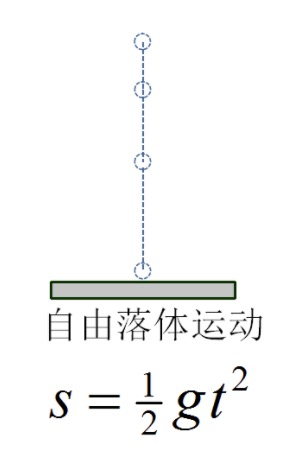
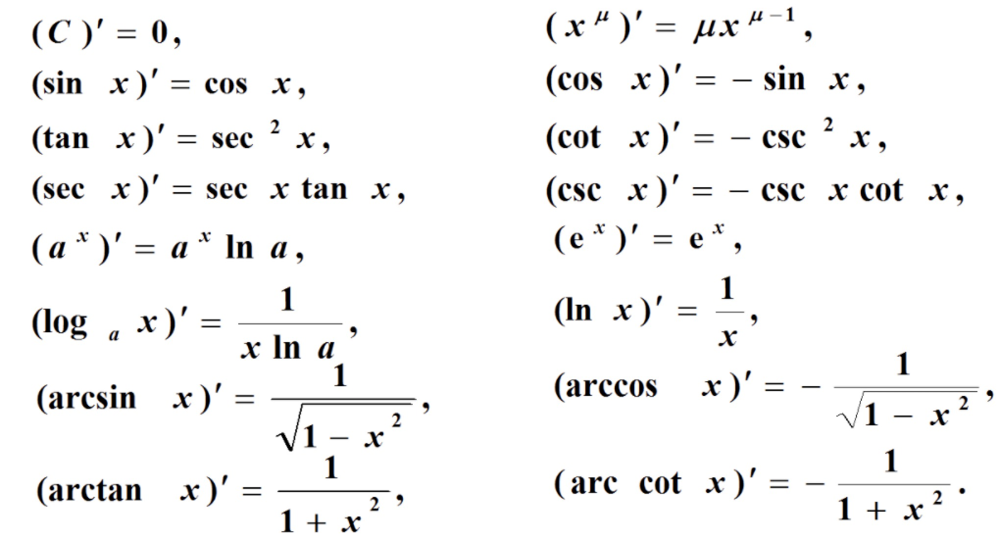

### 关于导数

- 导数是数学中非常重要的概念，它能反应出速度变化的快慢，尤其在AI的算法分析，优化以及数据挖掘中用到很多

### 导数的引出

**引例1**

- 变速直线运动的速度
    * s是距离，t是时间，v是速度
    * 设描述指点运动的位置函数为 $s = f(t)$ 
    * 则$t_0$到t的平均速度为 $\overrightarrow{v} = \frac{f(t) - f(t_0)}{t - t_0}$
    * 而在$t_0$时刻的瞬时速度为 $v = \lim_{t \to t_0} \frac{f(t) - f(t_0)}{t - t_0}$

    
     
    
备注：图片托管于github，请确保网络的可访问性

     

**引例2**

- 曲线的切线斜率
    * 曲线C: $y = f(x)$ 在M点处的切线MT，与x轴夹角是$\alpha$
    * MN是曲线C的一条割线，与x轴夹角是$\beta$
    * 割线MN的极限位置MT(当$\beta \to \alpha$时)
    * 切线MT的斜率 $k = tan \alpha = \lim_{\beta \to \alpha} tan \beta$
    * 割线MN的斜率 $tan \phi = \frac{f(x) - f(x_0)}{x - x_0}$ 如图虚线所示的比
    * $k = \lim_{x \to x_0} \frac{f(x) - f(x_0)}{x - x_0}$ 
    * 可见增量比的极限就是曲线C在M点处的切线MT

### 导数的定义

- 设函数y=f(x)在点$x_0$的某临域内有定义
- 设$\triangle y = f(x) - f(x_0)$
- 设$\delta x = x - x_0$
- 若$\lim_{x \to x_0} \frac{f(x) - f(x_0)}{x - x_0} = \lim_{\delta x \to 0} \frac{\delta y}{\delta x}$ 存在
- 则称函数f(x)在点$x_0$处可导，并称此极限为y=f(x)在点$x_0$的导数
- 记为：
    * $\mathop{{\left. y'  \right| }}\nolimits_{{x=\mathop{{x}}\nolimits_{{0}}}}$
    * $f'(x_0)$
    * $\mathop{{\left. \frac{dy}{dx}  \right| }}\nolimits_{{x=\mathop{{x}}\nolimits_{{0}}}}$
    * $\mathop{{\left. \frac{df(x)}{dx}  \right| }}\nolimits_{{x=\mathop{{x}}\nolimits_{{0}}}}$
    * 以上四种均可表示，即：$\mathop{{\left. y'  \right| }}\nolimits_{{x=\mathop{{x}}\nolimits_{{0}}}} = f'(x_0) = \lim_{\triangle x \to 0} \frac{\triangle y}{\triangle x} = \lim_{\triangle x \to 0} \frac{f(x_0 + \triangle x) - f(x_0)}{\triangle x}$

### 导数公式

**常数和基本初等函数的导数公式**

仅供查阅

    
     
    
备注：图片托管于github，请确保网络的可访问性

     

### 基本求导法则

1 ） **函数的和、差、积、商的求导法则**

- 设 $u = u(x), v = v(x)$ 都可导，则
    * (1) $(u \pm v)' = u' \pm v'$
    * (2) $(Cu)' = Cu'$ (C是常数)
    * (3) $(uv)' = u'v + uv'$
    * (4) $(\frac{u}{v})' = \frac{u'v - uv'}{v^2}$ ($v \neq 0$)

2 ) **反函数的求导法则**

- 如果函数$x=f(y)$在区间$I_y$内单调、可导且$f'(y) \neq 0$
- 则它的反函数$y=f^{-1}(x)$在区间$I_x = \{ x| x = f(y), y \in I_y \}$内也可导，且有
- $[f^{-1}(x)]' = \frac{1}{f'(y)}$ 或 $\frac{dy}{dx} = \frac{1}{\frac{dx}{dy}}$

3 ) **复合函数求导法则**

- 设$y=f(u), u=\varphi (x)$, 则复合函数$y = f[\varphi (x)]$的导数为
- $\frac{dy}{dx} = \frac{dy}{du} * \frac{du}{dx} = f'(u)*\varphi ' (x)$

**例子1**

- 求$y=2x^3 - 5x^2 + 3x - 7$的导数
    * $y' = 2*3*x^2 - 5*2*x + 3 + 0$
    * $y' = 6x^2 - 10x + 3$

**例子2**

- 已知$f(x) = x^3 + 4cosx - sin \frac{\pi}{2}$, 求$f'(x) 、f'(\frac{\pi}{2})$
    * $f'(x) = 3*x^2 - 4*sin x - 0$
    * $f'(x) = 3x^2 - 4sinx$
    * $f'(\frac{\pi}{2}) = 3*(\frac{\pi}{2})^2 - 4*\frac{\pi}{2}$
    * $f'(\frac{\pi}{2}) = \frac{3}{4} \pi^2 - 4$

**例子3**

- 求$y=\sqrt{x} * ln x$的导数
    * $y' = (\sqrt{x}'ln x + \sqrt{x}(ln x)')$
    * $y' = \frac{1}{2} * \frac{1}{\sqrt{x}} * ln x + \sqrt{x} * \frac{1}{x}$
    * $y' = \frac{1}{\sqrt{x}} (\frac{ln x}{2} + 1)$

**例子4**

- 求$y=e^x(sin x + cos x)$的导数
    * $y' = (e^x)'(sin x + cos x) + e^x(sinx + cosx)'$
    * $y' = e^x(sin x + cos x) + e^x(cosx - sinx)$
    * $y' = e^x * 2 * cos x$
    * $y' = 2 e^x cos x$

### 高阶导数

- 若函数y=f(x)的导数$y' = f'(x)$可导
- 则称$f'(x)$的导数为f(x)的二阶导数
- 记为 $y''$ 或 $\frac{d^2y}{dx^2}$
- 即：$y'' = (y')'$ 或 $\frac{d^2y}{dx^2} = \frac{d}{dx} * (\frac{dy}{dx})$
- 类似地，二阶导数的导数称为三阶导数，以此类推，n-1阶导数的导数称为n阶导数，分别记为：
- $y', y'', y''', y^{(4)}, y^{(5)}, ..., y^{(n)}$ 或 $f'(x), f''(x), f'''(x), f^{(4)}(x), f^{(5)}(x), ..., f^{(n)}(x)$
- $y^{(n)} = \frac{d^ny}{dx^n}$
- 原函数可以称为**0阶导数**
- 二阶及其以上导数统称为**高阶导数**