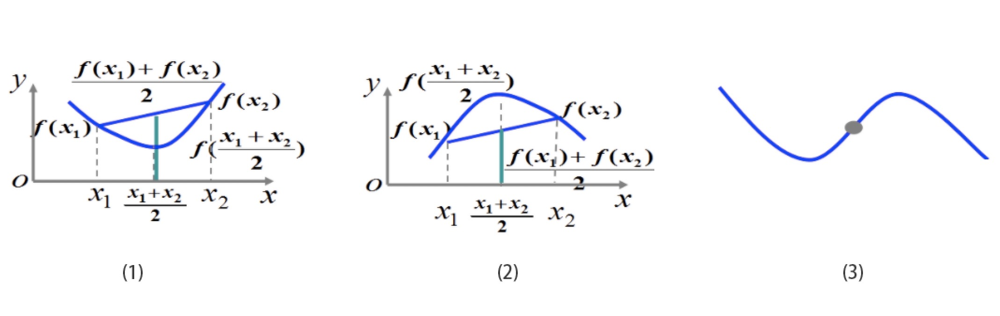
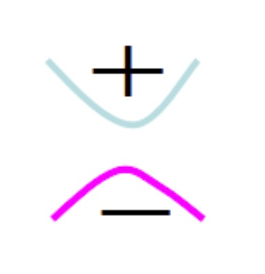
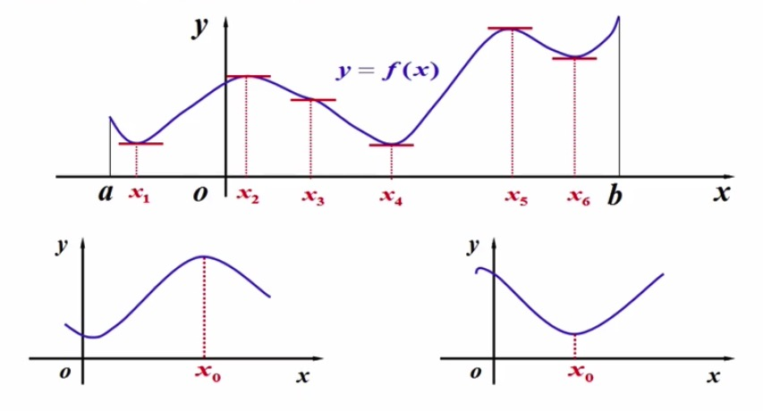
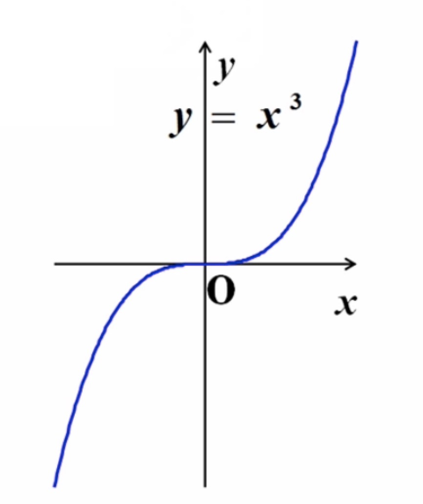
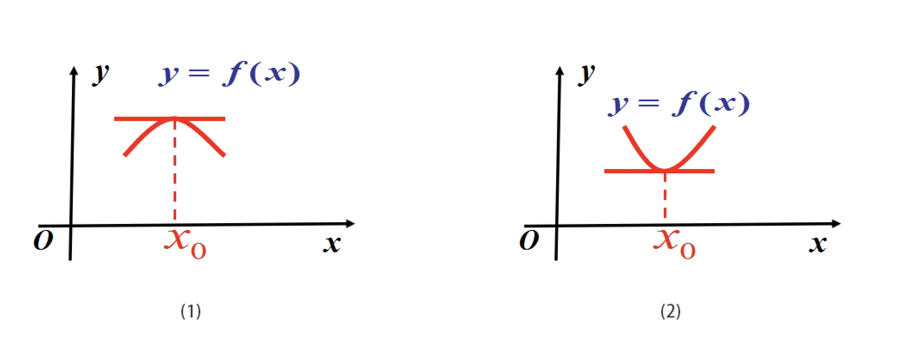

### 导数应用之函数单调性

- 通过函数的导数的值，可以判断出函数的单调性、驻点、极值点
  * 若导数>0,则单调递增
  * 若导数<0,则单调递减
  * 若导数=0,则该点为函数的驻点
- 如果函数的导函数在某一个区间内恒大于零(或恒小于零),那么函数在这一区间内单调递增(或单调递减),这一区间就称为单调区间
- 函数的驻点和不可导点函数有可能取得极大值或极小值(极值可疑点)
- 对于极值点的判断需要判断驻点附近的导函数的值符号，如果存在使得之前区间上导函数值都大于零，而之后的区间上都小于零，那么这个点就是一个极大值点，反之则是一个极小值点

### 导数应用之曲线的凹凸性

- 设函数f(x)在区间I上连续，$\forall x_1, x_2 \in I$,
- (1)若恒有$f(\frac{x_1 + x_2}{2}) < \frac{f(x_1) + f(x_2)}{2}$,则称f(x)的图形是凹的
- (2)若恒有$f(\frac{x_1 + x_2}{2}) > \frac{f(x_1) + f(x_2)}{2}$,则称f(x)的图形是凸的
- (3)连续曲线上的凹弧与凸弧的分界点称为曲线的拐点(在这一点上二阶导数不存在或异号(由正变负或由负变正))

    
     
    
备注：图片托管于github，请确保网络的可访问性

     

**定理(凹凸判定法)**

- 设函数f(x)在区间I上有二阶导数
- (1) 在I内$f''(x) > 0$, 则f(x)在I内图像是凹的
- (2) 在I内$f''(x) < 0$, 则f(x)在I内图像是凸的

    
     
    
备注：图片托管于github，请确保网络的可访问性

     

### 导数应用之函数的极值与最值

1 ） **函数的极值及其求法**

    
     
    
备注：图片托管于github，请确保网络的可访问性

     

- 极大值：设函数f(x)在$x_0$的某个邻域U$(x_0, \delta)$有定义，且当$x \in \mathring{U}(x_0, \delta)$时, 恒有$f(x) < f(x_0)$,则称$f(x_0)$为f(x)的一个极大值
- 极小值：如果当$x \in \mathring{U}(x_0, \delta)$时，恒有$f(x) > f(x_0)$, 则称$f(x_0)$为f(x)的一个极小值
- 极值：是局部区间的概念，函数的极大值与极小值统称为极值，使函数取得极值的点称为极值点
- 最值：是全局区间的概念
- 若f(x)在极值点$x_0$处可导, 则$f'(x_0) = 0$导数等于零的点称为**驻点**
- 对可导函数来讲，极值点必为驻点，驻点不一定是极值点，如下图原点是驻点，但不是极值点

    
     
    
备注：图片托管于github，请确保网络的可访问性

     

**极值存在的第一充分条件**

- 设函数f(x)在$x_0$处连续，且在$x_0$的某去心邻域$x \in \mathring{U}(x_0, \delta)$内可导
- (1)若当$x \in (x_0 - \delta, x_0)$时，$f'(x) > 0$, 若当$x \in (x_0, x_0 + \delta)$时, $f'(x) < 0$, 则f(x)在$x_0$处取得极大值
- (2)若当$x \in (x_0 - \delta, x_0)$时，$f'(x) < 0$, 若当$x \in (x_0, x_0 + \delta)$时, $f'(x) > 0$, 则f(x)在$x_0$处取得极小值
- (3)若当$x \in \mathring{U}(x_0, \delta)$时，$f'(x)$符号保持不变, 则f(x)在$x_0$处无极值

    
     
    
备注：图片托管于github，请确保网络的可访问性

     

**例子1**

- 函数$y=x^3$这个函数在(0,0)处是否为极值点
    * 求一阶导数：$y' = 3x^2$ 
    * 当x = 0时, $y' = 0$
    * 当x < 0时, $y' > 0$
    * 当x > 0时, $y' > 0$
    * 所以不是极值点而是驻点

**例子2**

- 求$f(x) = (x-1)x^{\frac{2}{3}}$的极值
    * 可见$x \in R$ 连续
    * 求极值可疑点
        * $f'(x) = 0$
        * $f'(x)$ 不存在
    * $f'(x) = \sqrt[3]{x^2} + (x-1) * \frac{2}{3} * x^{-\frac{1}{3}} = \sqrt[3]{x^2} + \frac{2}{3} (x-1) \frac{1}{\sqrt[3]{x}} = \frac{5}{3} \frac{x - \frac{2}{5}}{\sqrt[3]{x}}$
    * 若$f'(x) = 0$ $\Rightarrow x = \frac{2}{5}$ 为驻点
    * 若$f'(x)$ 不存在, 则 $x = 0$
    * 所以，目前极值可疑点有两个点，$\frac{2}{5}$和$0$, 需要分类讨论，也就是分区间讨论
      * 当x<0时, $f'(x) > 0$
      * 当$0<x<\frac{2}{5}$时, $f'(x) < 0$
      * 当$x>\frac{2}{5}$时, $f'(x) > 0$
    * 可见，这两点都是极值点，且$0$是极大值点，$\frac{2}{5}$是极小值点