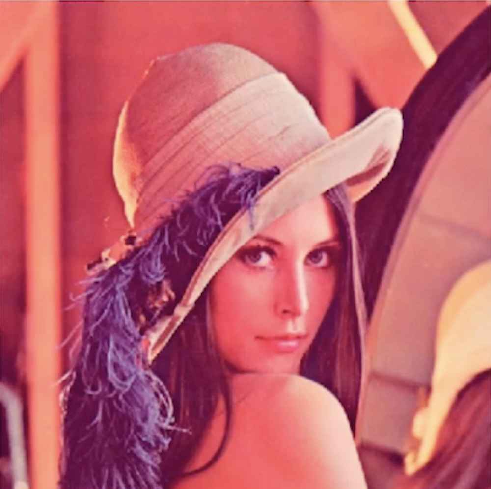
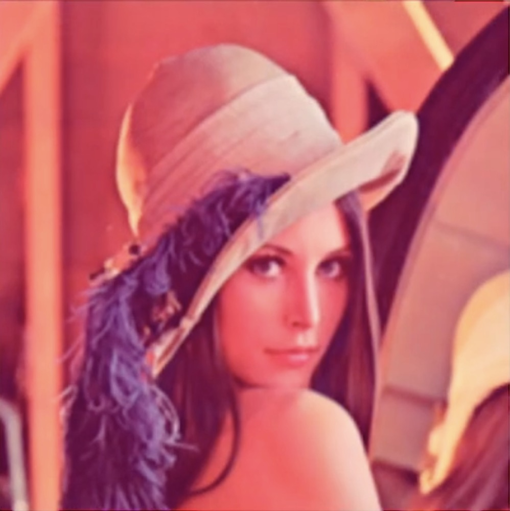
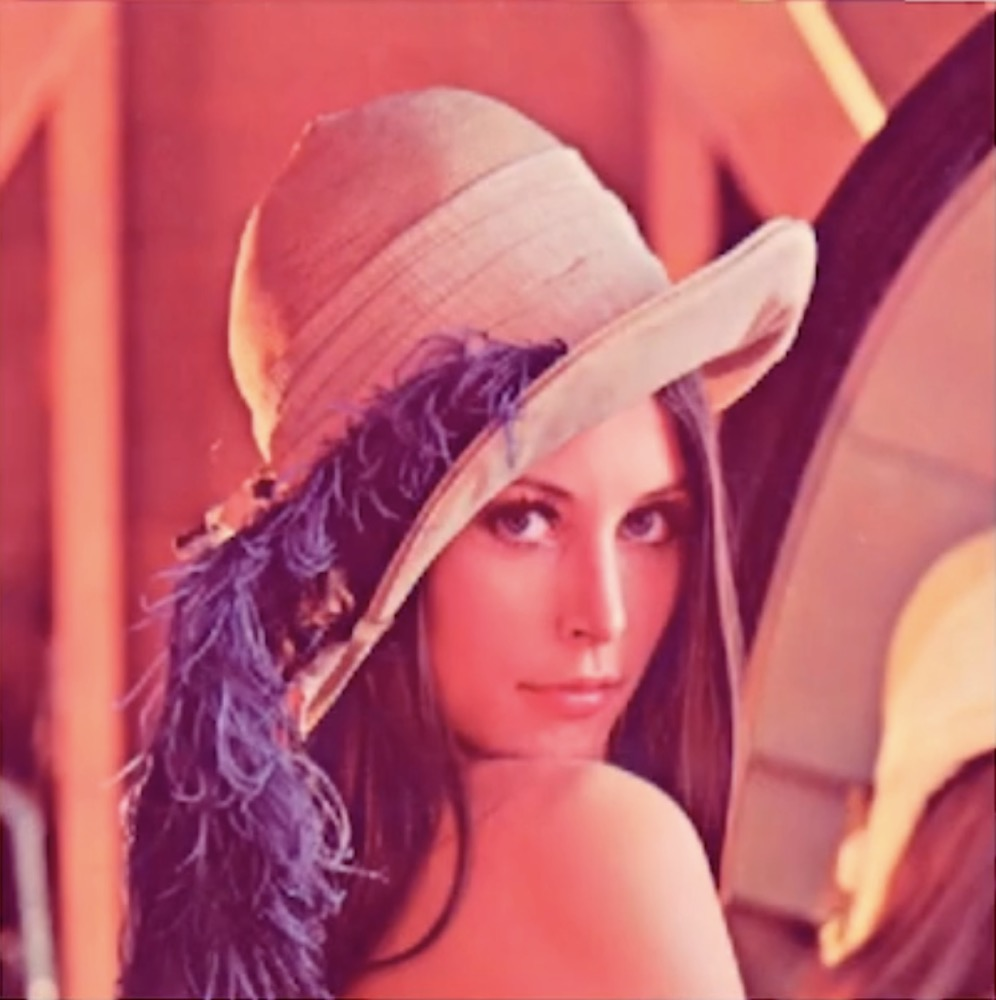

### 图像预处理滤波概述

大米质量检测：数出图像里的所有米粒，并计算米粒的平均长度及面积，以评价等级

test:


<div align="left">
    
</div>

描述： 图片背景不是完全清晰，需要进行背景噪点的滤波处理来减少或消除，进一步通过图像分割得到各个米粒对象，并进行相关数字特征(长度、面积、均值等)的计算

### 了解图像滤波基本原理

- 与一维信号滤波类似，图像滤波也由卷积定义, 由原来的一维做了二维的扩展
  * 原始的图像f通过滤波器进行滤波，相当于f和这个滤波器一起做卷积
  * 图像都是数字化的图像，我们的卷积也是离散化的
  * 在图像中我们使用的滤波器是一个对称的滤波器(正负半轴曲线一样), 因为是对称的, 我们不进行区分正负

$$
f(x,y)g(x,y) = \frac{1}{NM}\sum_{n=0}^{N-1}\sum_{m=0}^{M-1}f(n,m)g(x-n,y-m)
$$

- 在图像中，也常以模版的形式定义
    * 在图像中的卷积等同于在原始图像上用一个移动的模板来加权平均

$$
f(x,y)g(x,y) = \frac{1}{NM}\sum_{n=0}^{N-1}\sum_{m=0}^{M-1}f(x+n,y+m)g(n,m)
$$

- 如果滤波器对称，则二者等价
    * 上面的2个公式就是将负的变为正的，两者等价

- 滤波器计算某一像素的滤波结果
    * 一个原始图像f经过一个滤波器(卷积和)g来滤波, g是3*3大小的
    * 做卷积的方式是将原始图像上的对应像素和滤波器上的对应像素先进行两两相乘
    * 将9个像素对应相乘后的和作为滤波后的结果, 滤完波的位置是滤波器的中心位置,
    * 也就是原始图像与滤波器中心位置对应的值是刚才滤波后的结果
    * 刚刚我们只是得到了一个结果, 如果我们想要最终完成滤波，需要滤波器在这个图像中不断滑动
    * 也就是从左到右，从上到下的Z字形滑动，每次滑动计算得到一个值
    * 滤波后的结果一定比原始图像要小一圈，小多少由滤波器的大小决定的
    * 滤波器大小的一半称为滤波器的半径, 3*3的滤波器半径是1(1.5向下取整)
    * 原始图像经过半径为1的滤波器进行计算后，周围都少1个像素

### 掌握基本图像预处理滤波方法 

1 ） **图像平滑 -- 平均滤波**

- 在一维信号处理里可以让原始信号更加平滑, 把这一概念扩展到2维里就是图像平滑
- 噪声是图片中像素值突变的像素点, 图像平滑可消除或减弱图像中的噪声
- 在一个小区域内(通常3*3), 把所有像素都做下平均, 我们就得到了我们最简单的一个滤波器叫平均滤波
- 为了保证滤波后图像的能量大小和滤波后相同, 需要除上一个系数M, 这叫归一化处理
- 换言之，滤波前它的亮度是1，我们要保证它在滤波后对应恒定亮度的区域值仍为1

$$
g(x,y) = \frac{1}{M}\sum_{(m,n)\in{S}}f(m,n)
$$

**举例**

- 5个像素的平均滤波器(十字滤波器)：对于中心点有4个像素叫四临域
- 8像素平均滤波器
- 9像素平均滤波器：对于中心点上下左右斜角共8个都是相邻像素叫八临域

$$

\frac{1}{5}
\begin{bmatrix}
0 & 1 & 0 \\ 
1 & 1 & 1 \\ 
0 & 1 & 0
\end{bmatrix}

、

\frac{1}{8}
\begin{bmatrix}
1 & 1 & 1 \\ 
1 & 0 & 1 \\ 
1 & 1 & 1
\end{bmatrix}

、

\frac{1}{9}
\begin{bmatrix}
1 & 1 & 1 \\
1 & 1 & 1 \\
1 & 1 & 1
\end{bmatrix}

$$

2 ） **图像平滑 -- 加权平均滤波**

- 在一个小区域内(通常3*3), 像素值加权平均
    * 在每个像素前面乘上一个系数
    * 同样除上M进行归一化处理
    * 加权平均最主要的作用是图像中心点起到的作用是最大的
    * 在图像滤波的时候离中心越近, 它的作用越重要
    * 权值的选取多种多样，下面有两种选取方式
    * 1/16的这个滤波器比较特殊, 中心点权值最高为4, 上下左右为2, 斜角各为1, 权值关于中心对称
        * 形象上像个草帽(抽象), 也像是高斯函数的形状 
        * 我们称之为高斯模板, 这种滤波叫高斯平均滤波

$$
g(x,y) = \frac{1}{M}\sum_{(m,n)\in{S}}w_{mn}f(m,n)
$$

**举例**

$$

\frac{1}{10}
\begin{bmatrix}
1 & 1 & 1 \\ 
1 & 2 & 1 \\ 
1 & 1 & 1
\end{bmatrix}

、

\frac{1}{16}
\begin{bmatrix}
1 & 2 & 1 \\ 
2 & 4 & 2 \\ 
1 & 2 & 1
\end{bmatrix}

$$


3 ） **图像平滑 -- 中值滤波**

- 和前面的滤波方式稍有不同, 前面的滤波也可称为线性滤波，而中值滤波不是这样，更为直观
- 简单来说，我们选定一个窗口后，针对这个窗口内的图像的像素进行滤波
- 首先把这个窗口内的像素按照从小到大，或从大到小的顺序进行排列, 找到中间的值4, 进一步我们把4作为滤波后的结果，如下矩阵图所示


**举例**

滤波前

$$
\begin{bmatrix}
5 & 3 & 4 \\ 
3 & 10 & 5 \\ 
3 & 4 & 5
\end{bmatrix}
$$

排序(中值为4)

$$
3334[4]55510
$$

滤波后的结果

$$
\begin{bmatrix}
5 & 3 & 4 \\ 
3 & 4 & 5 \\ 
3 & 4 & 5
\end{bmatrix}
$$

**总结**

- 确定窗口及位置(含有奇数个像素)
- 窗口内像素按灰度大小排序
- 取中间值代替原窗口中心像素值
- 中值滤波对椒盐噪声有效

**常用的窗口选取方式**

3 * 3的窗口

```log
.
...
.
```

```log
 .
...
 .
```
(四临域)

```log
...
...
...
```
(八临域)

5 * 5的窗口

```log
  .
  .
.....
  .
  .
```

```log
  .
 ...
.....
 ...
  .
```

### 比较各个滤波器的效果

1 ） **原图**

<div align="left">
    
</div>

2 ） **平均滤波后**

<div align="left">
    
</div>

图像变虚, 有去噪效果但同时会使图像模糊, 实际中很少采用

3 ） **高斯滤波(加权平均滤波)后**

<div align="left">
    
</div>

几乎和原始图像一样清晰, 噪声减少了很多, 是一种有效的去噪方式

4 ） **中值滤波后**

- 和高斯滤波的效果很像, 人眼无法分辨, 不再展示
- 主要是椒盐去噪效果显著
- 对于一般图像，我们不知道噪声的形式, 可以采用高斯滤波或中值滤波对图像进行处理
- 在图片中噪声是广泛存在的, 眼睛看不到的并不代表没有
- 我们拿到图像的第一步都要进行去噪处理