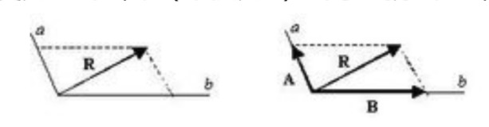
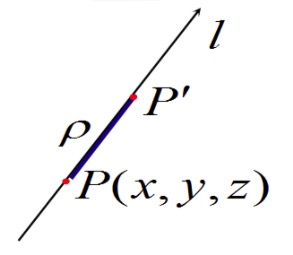

### 多元函数偏导数

- 在一个多变量的函数中，偏导数就是关于其中一个变量的导数而保持其他变量恒定不变。
- 假定二元函数$z=f(x,y)$, 点(x_0, y_0)是其定义域内的一个点，将y固定在$y_0$上，而x在$x_0$上增量$\triangle x$,
- 相应的函数z有增量$\triangle z = f(x_0 + \triangle x, y_0) - f(x_0, y_0)$
- $\triangle z$ 和 $\triangle x$的比值当$\triangle x$的值趋近于0的时候，如果极限存在，那么此极限称为函数$z=f(x,y)$在$x_0,y_0$处对x的偏导数(partial derivative),
- 记为：$f'_x(x_0, y_0)$
- 对x的偏导数：$\left.\frac{\partial f}{\partial x} \right|_{x=x_0, y=y_0}$
- 对y的偏导数：$\left.\frac{\partial f}{\partial y} \right|_{x=x_0, y=y_0}$

### 三元函数的偏导数

- 对于三元函数$u = f(x,y,z)$可类似求偏导数，定义u在点$P_0(x_0, y_0, z_0)$分别对x,y,z的偏导数
    * $f_x'(x_0, y_0, z_0) = \lim_{\triangle x \to 0} \frac{f(x_0 + \triangle x, y_0, z_0) - f(x_0, y_0, z_0)}{\triangle x}$
    * $f_y'(x_0, y_0, z_0) = \lim_{\triangle y \to 0} \frac{f(x_0, y_0 + \triangle y, z_0) - f(x_0, y_0, z_0)}{\triangle y}$
    * $f_z'(x_0, y_0, z_0) = \lim_{\triangle z \to 0} \frac{f(x_0, y_0, z_0 + \triangle x) - f(x_0, y_0, z_0)}{\triangle z}$
- 偏导数是多元函数对其中某一个自变量(其余自变量视为常量)的变化率

**案例**

- 求$z=x^2 + 3xy + y^2$在点(1,2)处的偏导数
- 解法1：
    * $\frac{\partial z}{\partial x} = 2x + 3y$
    * $\frac{\partial z}{\partial y} = 3x + 2y$
    * $\left.\frac{\partial z}{\partial x} \right|_{(1,2)} = 2*1 + 3*2 = 8$
    * $\left.\frac{\partial z}{\partial y} \right|_{(1,2)} = 3*1 + 2*2 = 7$
- 解法2：
    * $\left. z \right|_{y=2} = x^2 + 6x + 4$
    * $\left. \frac{\partial z}{\partial x} \right|_{(1,2)} = \left. (2x+6) \right|_{x=1} = 8$
    * $\left. z \right|_{x=1} = 1 + 3y + y^2$
    * $\left. \frac{\partial z}{\partial y} \right|_{(1,2)} = \left. (3+2y) \right|_{y=2} = 7$

### 高阶偏导数

1 ） **二阶偏导**

- 函数$z=f(x,y)$的二阶偏导数为：
- 有两大类，四小类
    * 纯偏导
        * $\frac{\partial}{\partial x} (\frac{\partial z}{\partial x}) = \frac{\partial^2 z}{\partial x^2} = f''_{xx} = f''_{11}$
        * $\frac{\partial}{\partial y} (\frac{\partial z}{\partial y}) = \frac{\partial^2 z}{\partial y^2} = f''_{yy} = f''_{22}$
    * 混合偏导
        * $\frac{\partial}{\partial y} (\frac{\partial z}{\partial x}) = \frac{\partial^2 z}{\partial x \partial y} = f''_{xy} = f''_{12}$
        * $\frac{\partial}{\partial x} (\frac{\partial z}{\partial y}) = \frac{\partial^2 z}{\partial y \partial x} = f''_{yx} = f''_{21}$

2 ) **类似可以定义更高阶的偏导数**

- $z=f(x,y)$关于x的三阶偏导数为：$\frac{\partial^3 z}{\partial x^3} = \frac{\partial}{\partial x} (\frac{\partial^2 z}{\partial x^2})$
- $z=f(x,y)$关于x的n-1阶偏导数，再关于y的一阶偏导数为：$\frac{\partial^n z}{\partial x^{n-1} \partial y} = \frac{\partial z}{\partial y} (\frac{\partial^{n-1}z}{\partial x^{n-1}})$
- 定义：二阶及以上的偏导数统称为**高阶偏导数**

### 方向导数

1 ） **向量**

- 向量：是指具有n个相互独立的性质(维度)的对象的表示,向量常使用字母+箭头的形式进行表示，也可以使用几何坐标来表示向量, 比如：$\vec{a} = \vec{OP} = x\vec{i} + y\vec{j} + z\vec{k}$, 可以用坐标(i,j,k)表示向量a
- 向量的模：向量的大小，也就是向量的长度，向量坐标到原点的距离，常记为：$|a|$
- 单位向量：长度为一个单位(即模为1)的向量叫做单位向量

    
     
    
备注：图片托管于github，请确保网络的可访问性

     

2 ) **向量的运算**

- 设两向量为：$\vec{a} = (x_1,y_1), \vec{b} = (x_2, y_2)$, 并且a和b之间的夹角为: $\theta$
- 数量积：两个向量的数量积(内积、点积)是一个数量/实数，记为：$\vec{a} · \vec{b}$
    * $\vec{a} · \vec{b} = |\vec{a}| * |\vec{b}| * cos \theta$
- 向量积：两个向量的向量积(外积、叉积)是一个向量, 记为：$\vec{a} × \vec{b}$. 向量积即两个不共线的非零向量所在平面的一组法向量
    * $|\vec{a} × \vec{b}| = |\vec{a}| * |\vec{b}| * sin \theta$
    * 乘积的模为两个向量平移后组成的平行四边形的面积
    * 法向量方向为两个向量所组成平面的垂线方向
- 知道两个向量，就可以求出两个向量的夹角$\theta$
    * $cos \theta = \frac{\vec{a} \vec{b}}{|\vec{a}||\vec{b}|} = \frac{x_1x_2 + y_1y_2}{\sqrt{x_1^2 + y_1^2} * \sqrt{x_2^2 + y_2^2}}$

3 ） **正交向量**

- 正交向量：如果两个向量的点积为零，那么称这两个向量互为正交向量，在几何意义上来说，正交向量在二维/三维空间上其实就是两个向量相互垂直
- 如果两个或多个向量，它们的点积均为0，那么它们互相称为正交向量

4 ） **向量的方向角以及方向角的余弦**

- 设在一个三维坐标轴下有一个向量$\vec{a} = \vec{OA}$ 与x,y,z轴所成的夹角分为$\alpha, \beta, \gamma$, 这些就是方向角
- $cos \alpha = \frac{x_0}{|\vec{OA}|}$ ，其中，$x_0$ 是该向量映射到x轴的长度
- $cos \beta = \frac{y_0}{|\vec{OA}|}$，其中，$y_0$ 是该向量映射到y轴的长度
- $cos \gamma = \frac{z_0}{|\vec{OA}|}$，其中，$z_0$ 是该向量映射到z轴的长度
- 可见，$cos^2 \alpha + cos^2 \beta + cos^2 \gamma = 1$

5 ） **方向导数**

- 定义：若函数$f(x,y,z)$在点$P(x,y,z)$处沿方向l(方向角为：$\alpha, \beta, \gamma$), 其中$\rho = |PP'|$, 存在下列极限
- $\lim_{\rho \to 0} \frac{\triangle f}{\rho} = \lim_{\rho \to 0} \frac{f(x + \triangle x, y + \triangle y, z + \triangle z) - f(x,y,z)}{\rho} = \frac{\partial f}{\partial l}$
- 其中，$\rho = \sqrt{(\triangle x)^2 + (\triangle y)^2 + (\triangle z)^2}$, $\triangle x = \rho cos \alpha$, $\triangle y = \rho cos \beta$, $\triangle z = \rho cos \gamma$
- 则称 $\frac{\partial f}{\partial l}$ 为函数在点P处沿方向l的**方向导数**

    
     
    
备注：图片托管于github，请确保网络的可访问性

     

