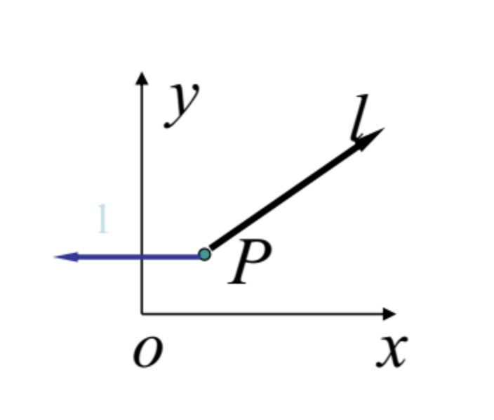
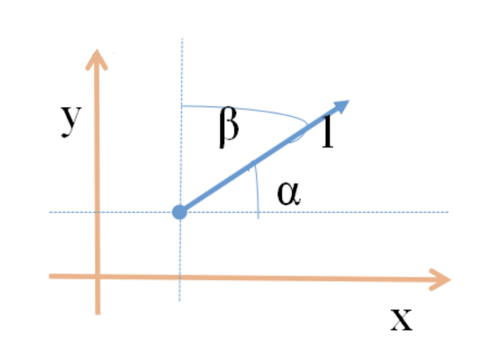

### 方向导数

1 ）**定理**

- 若函数f(x,y,z)在点P(x,y,z)处可微，沿任意方向l的方向导数 $\frac{\partial f}{\partial l} = \frac{\partial f}{\partial x} cos \alpha + \frac{\partial f}{\partial y} cos \beta + \frac{\partial f}{\partial z} cos \gamma$, 其中$\alpha, \beta, \gamma$ 为l的方向角
- 证明
    * 由函数$f(x,y,z)$在点P可微
    * $\triangle f = \frac{\partial f}{\partial x} \triangle x + \frac{\partial f}{\partial y} \triangle y + \frac{\partial f}{\partial z} \triangle z + o(\rho)$
    * $= \rho(\frac{\partial f}{\partial x} cos \alpha + \frac{\partial f}{\partial y} cos \beta + \frac{\partial f}{\partial z} cos \gamma) + o(\rho)$
    * $\frac{\partial f}{\partial l} = \lim_{\rho \to 0} \frac{\triangle f}{\rho} = \frac{\partial f}{\partial x} cos \alpha + \frac{\partial f}{\partial y} cos \beta + \frac{\partial f}{\partial z} cos \gamma$

    
     
    
备注：图片托管于github，请确保网络的可访问性

     

- 对于二元函数f(x,y)在点P(x,y)处沿着方向l(方向角为$\alpha, \beta$)的方向导数为：$\frac{\partial f}{\partial l} = \lim_{\rho \to 0} \frac{f(x+\triangle x, y + \triangle y) - f(x,y)}{\rho} = f_x'(x,y)cos \alpha + f_y'(x,y) cos \beta$
    * $\rho = \sqrt{(\triangle x)^2 + (\triangle y)^2}, \triangle x = \rho cos \alpha, \triangle y = \rho cos \beta$
- 特别地
    * l与x轴同向($\alpha = 0, \beta = \frac{\pi}{2}$)时，有$\frac{\partial f}{\partial l} = \frac{\partial f}{\partial x}$
    * l与x轴反向($\alpha = \pi, \beta = \frac{\pi}{2}$)时，有$\frac{\partial f}{\partial l} = -\frac{\partial f}{\partial x}$

    
     
    
备注：图片托管于github，请确保网络的可访问性

     

### 方向导数

- 方向导数(directional derivative): 有时不仅仅需要知道函数在坐标轴上的变化率(即偏导数)，而且还需要设法求得函数在其他特定方向上的变化率(即偏导数)，而且还需要设法求得函数在其他特定方向上的变化率；
- 而方向导数就是函数在其他特定方向上的变化率。如果函数$z=f(x,y)$在点P(x,y)是可微分的，那么，函数在该点沿着任意方向L的方向导数都存在，且计算公式为：$\frac{\partial f}{\partial l} = \frac{\partial f}{\partial x} cos \alpha + \frac{\partial f}{\partial y} cos \beta$

    
     
    
备注：图片托管于github，请确保网络的可访问性

     

**例1**

- 求函数$u = x^2yz$ 在点P(1,1,1)沿向量 $\vec{l} = (2, -1, 3)$的方向导数. $\frac{\partial u}{\partial l} = \frac{\partial u}{\partial x} cos \alpha + \frac{\partial u}{\partial y} cos \beta + \frac{\partial u}{\partial z} cos \gamma$
- 解
    * 向量$\vec{l}$的方向余弦为: $cos \alpha = \frac{2}{\sqrt{14}}, \cos \beta = \frac{-1}{\sqrt{14}}, cos \gamma = \frac{3}{\sqrt{14}}$
    * $\left. \frac{\partial u}{\partial l} \right|_P = \left. (2xyz * \frac{2}{\sqrt{14}}) - x^2z * \frac{1}{\sqrt{14}} + x^2y * \frac{3}{\sqrt{14}} \right|_{(1,1,1)} = \frac{6}{\sqrt{14}}$

**例2**

- 求函数$z=xe^{2y}$在点P(1,0)处沿从点P(1,0)到点Q(2, -1)的方向的方向导数
- 解
    * 方向l即向量$PQ = (1, -1)$的方向，与l同方向的单位向量$e_l = (\frac{1}{\sqrt{2}}, - \frac{1}{\sqrt{2}}). = (cos \alpha, cos \beta)$
    * 因函数可微，且$\left. \frac{\partial z}{\partial x} \right|_{(1,0)} = \left. e^{2y} \right|_{(1,0)} = 1,  \left. \frac{\partial z}{\partial y} \right|_{(1,0)} = \left. 2xe^{2y} \right|_{(1,0)} = 2$
    * 所以，所求方向导数为：$\left. \frac{\partial z}{\partial l} \right|_{(1,0)} = 1 * \frac{1}{\sqrt{2}} + 2 * (- \frac{1}{\sqrt{2}}) = - \frac{\sqrt{2}}{2}$

**例3**

- 求$f(x,y,z) = xy + yz + zx$  在点(1,1,2)沿方向l的方向导数，其中l的方向角分别为：60°, 45°, 60°
- 解：
    * 与l同方向的单位向量 $e_l = (cos 60°, cos 45°, cos 60°) = (\frac{1}{2}, \frac{\sqrt{2}}{2}, \frac{1}{2})$
    * 因函数可微，且
        * $f_x'(1,1,2) = (y + z)|_{(1,1,2)} = 3$
        * $f_y'(1,1,2) = (x + z)|_{(1,1,2)} = 3$
        * $f_z'(1,1,2) = (y + x)|_{(1,1,2)} = 2$
    * 所以$\frac{\partial f}{\partial l}_{(1,1,2)} = 3*\frac{1}{2} + 3*\frac{\sqrt{2}}{2} + 2*\frac{1}{2} = \frac{1}{2}(5 + 3\sqrt{2})$

### 梯度

1 ） **概念**

- 在空间的每一个点都可以确定无限多个方向，因此，一个多元函数在某个点也必然有无限多个方向导数. 
- 在这无限多个方向导数中，最大的一个(它直接反映了函数在这个点的变化率的数量级)等于多少? 它是沿什么方向达到的?
- 描述这个最大方向导数及其所沿方向的矢量，就是我们所讨论的梯度.
- 梯度是场论里的一个基本概念.所谓"场", 它表示空间区域上某种物理量的一种分布
- 从数学上看，这种分布常常表示为 $\Omega$ 上的一种数值函数或向量函数
- 能表示为数值函数$u=u(x,y,z)的场，称为数量场，如温度场、密度场$

2 ) **方向导数公式**

- $\frac{\partial f}{\partial l} = \frac{\partial f}{\partial x} cos \alpha + \frac{\partial f}{\partial y} cos \beta + \frac{\partial f}{\partial z} cos \gamma$
    * 令向量 $\vec{G} = (\frac{\partial f}{\partial x}, \frac{\partial f}{\partial y}, \frac{\partial f}{\partial z})$
    * $\vec{l°} = (cos \alpha, cos \beta, cos \gamma)$
- $\frac{\partial f}{\partial l} = \vec{G}·\vec{l°} = |\vec{G}|cos(\vec{G}, \vec{l°}) \ \ \ (|\vec{l°}| = 1)$
- 当$\vec{l°}$与$\vec{G}$方向一致时，方向导数取最大值：$max(\frac{\partial f}{\partial l}) = |\vec{G}|$
- 可见：$\vec{G}$
    * 方向：f 变化率最大的方向
    * 模：f 的最大变化率之值

3 ) **梯度定义**

- 向量$\vec{G}$：称为函数$f(P)$在点P处的梯度(gradient), 记做：grad f 即 $grad f = (\frac{\partial f}{\partial x}, \frac{\partial f}{\partial y}, \frac{\partial f}{\partial z}) = \frac{\partial f}{\partial x} \vec{i} + \frac{\partial f}{\partial y} \vec{j} + \frac{\partial f}{\partial z}\vec{k}$
- 同样可定义二元函数f(x,y)在点P(x,y)处的梯度 $grad f = \frac{\partial f}{\partial x} \vec{i} + \frac{\partial f}{\partial y} \vec{j} = (\frac{\partial f}{\partial x}, \frac{\partial f}{\partial y})$
- 说明：函数的方向导数为梯度在该方向上的投影
- $\nabla = (\frac{\partial}{\partial x}, \frac{\partial}{\partial y})$, 引用记号，称为奈布拉(Nebla)算符，或称为向量微分算子或哈密顿(W.R.Hamilton)算子
- 则梯度可记为：$gradf = (\frac{\partial f}{\partial x}, \frac{\partial f}{\partial y}) \nabla f$
- 函数f沿梯度grad f方向，增加最快(上升)
- 函数f沿负梯度 -grad f方向，减小最快(下降)
- $grad f(x_0, y_0 = f_x'(x_0, y_0)i + f_y'(x_0, y_0)j)$ 或 $\nabla f(x_0, y_0) = f_x'(x_0, y_0)i + f_y'(x_0, y_0) j = {f_x'(x_0, y_0), f_y'(x_0, y_0)}$
- $grad f = (\frac{\partial f}{\partial x}, \frac{\partial f}{\partial y}, \frac{\partial f}{\partial z}) = \frac{\partial f}{\partial x} \vec{i} + \frac{\partial f}{\partial y} \vec{j} + \frac{\partial f}{\partial z}\vec{k}$ 或 $\nabla f(x_0, y_0, z_0) = {f_x'(x_0, y_0, z_0), f_y'(x_0, y_0, z_0), f_z'(x_0, y_0, z_0)} = f_x'(x_0, y_0, z_0)i + f_y'(x_0, y_0, z_0)j + f_z'(x_0, y_0, z_0)k$

**例子**

- 以三元函数为例，设$u=f(x,y,z)$在点P(x,y,z)出可微分，则函数在该点的梯度为 $grad f = \nabla f = \frac{\partial f}{\partial x} \vec{i} + \frac{\partial f}{\partial y} \vec{j} + \frac{\partial f}{\partial z}\vec{k} = (\frac{\partial f}{\partial x}, \frac{\partial f}{\partial y}, \frac{\partial f}{\partial z}) = (\frac{\partial (f)}{\partial(x,y,z)})$
- 梯度是函数$u=f(x,y,z)$在点P处取得的最大方向导数的方向，最大方向导数为：$|grad f| = \sqrt{(\frac{\partial f}{\partial x})^2 + (\frac{\partial f}{\partial y})^2 + (\frac{\partial f}{\partial z})^2}$
- 函数$u=f(x,y,z)$在点P处沿方向$\vec{l}$的方向导数：$\frac{\partial f}{\partial \vec{l}} = grad f·\vec{l°} = \nabla f · \vec{l °}$

**例1**

- 求$grad \frac{1}{\sqrt{x^2 + y^2}}$
- 解：
    * 这里$f(x,y) = \frac{1}{x^2 + y^2}$
    * 因 $\frac{\partial f}{\partial x} = - \frac{2x}{(x^2 + y^2)^2} \vec{i} - \frac{2y}{(x^2 + y^2)^2} \vec{j}$

**例2**

- 设$f(x,y,z) = x^3 - xy^2 - z$, $p(1,1,0)$ 问f(x,y,z)在p处沿什么方向变化最快，在这方向的变化率是多少?
- 解
    * $\nabla f = f_x'i + f_y'j + f_z'k = (3x^2 - y^2)i - 2xyj - k$
    * $\nabla f(1,1,0) = 2i - 2j - k$
    * 沿 $\nabla f(1,1,0)$ 方向，增加最快(上升)
    * 沿 $- \nabla f(1,1,0)$ 方向，增加最快(下升)
    * $max{\frac{\partial f}{\partial l}_p} = |grad f| = |\nabla f(1,1,0)| = 3$
    * $min{\frac{\partial f}{\partial l}_p} = -|grad f| = -|\nabla f(1,1,0)| = -3$