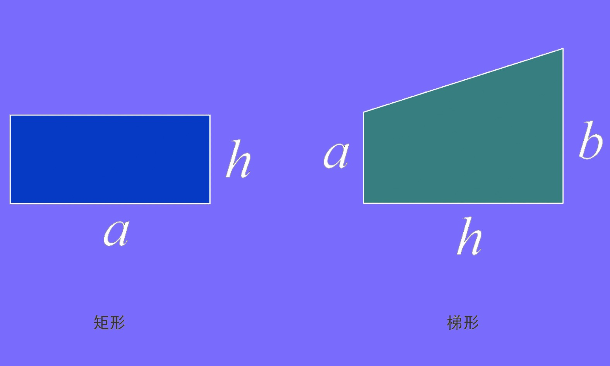
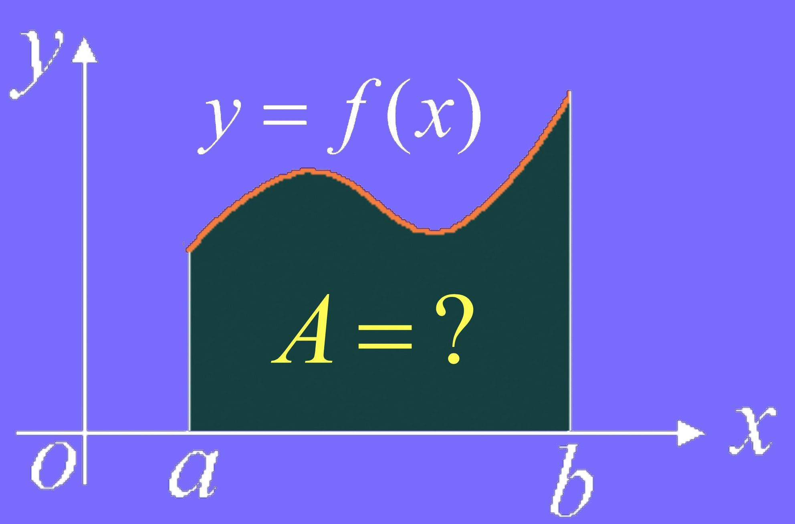
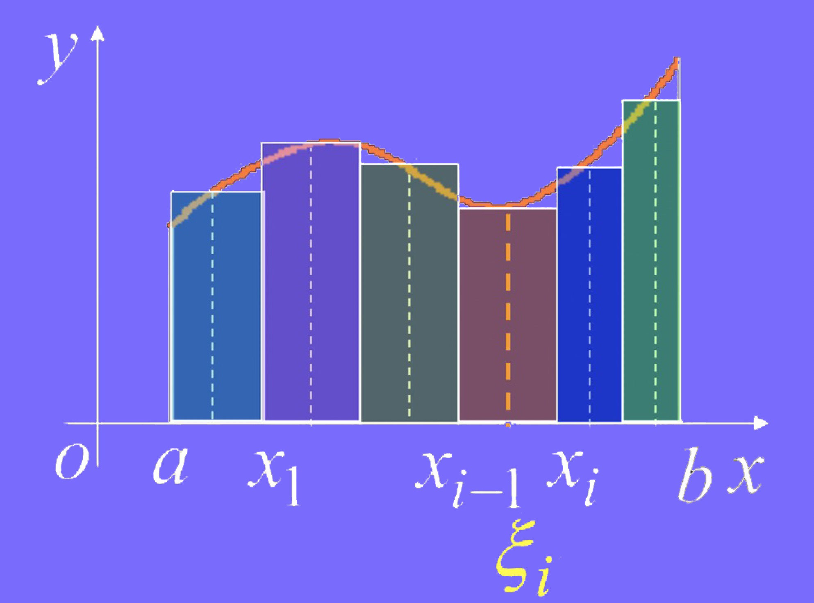
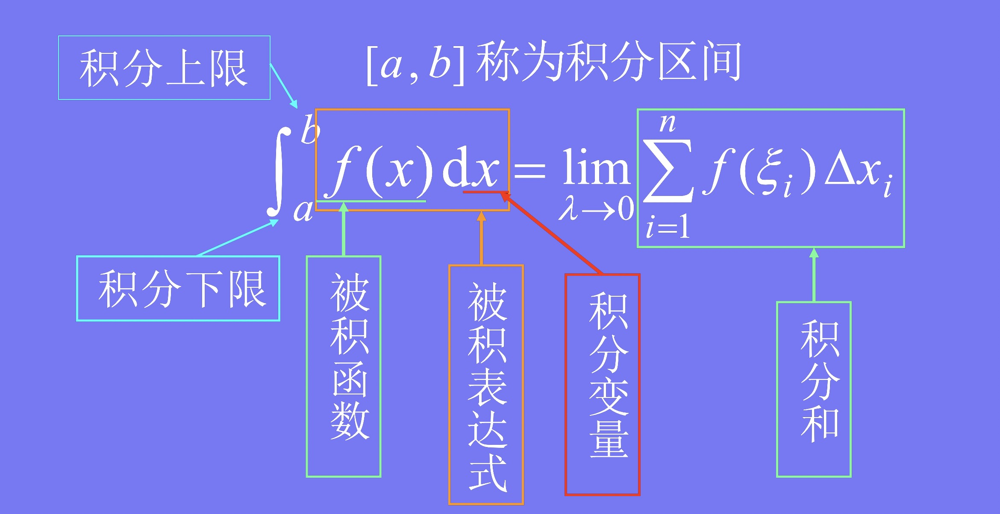
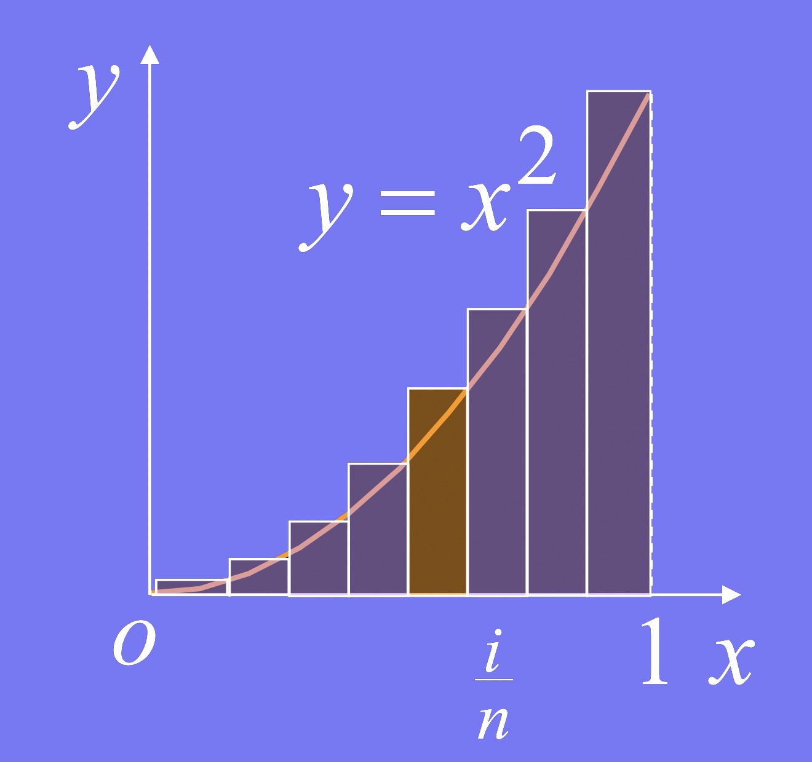
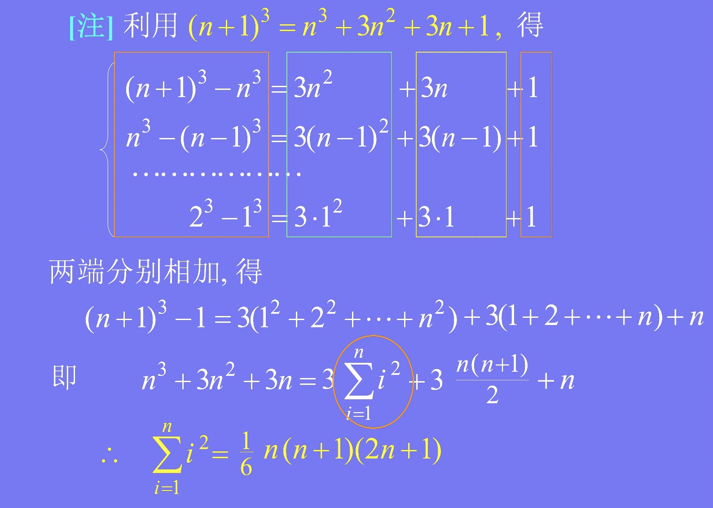
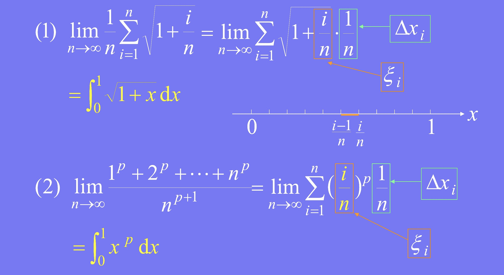

### 概述

- 积分学
    * 不定积分
    * 定积分

### 定积分举例

1 ）**举例**

    
     
    
备注：图片托管于github，请确保网络的可访问性

     

- 矩形面积：$S = ah$
- 梯形面积：$S = \frac{h}{2}(a+b)$

2 ) **曲面梯形的面积**

    
     
    
备注：图片托管于github，请确保网络的可访问性

     

- 设曲边梯形是由连续曲线 $y = f(x) (f(x) \geq 0$ 及x轴，以及两直线 $x=a, x=b$所围成，求其面积A
- 解决方案
    * (1)、**大化小**. 在区间[a,b]中任意插入n-1个分点$a=x_0 < x_1 < x_2 < ... < x_{n-1} < x_n = b$, 用直线 $x=x_i$ 将曲边梯形分成n个小曲边梯形
    * (2)、**常代变**. 在第i个窄曲边梯形上任取$\xi \in [x_{i-1}, x_i]$作以$[x_{i-1}, x_i]$为底, $f(\xi)$为高的小矩形，并以此小梯形面积近似代替响应窄曲边梯形面积$\triangle A_i$, 得
        * $\triangle A_i \approx f(\xi) \triangle x_i (\triangle x_i = x_1 - x_{i-1}, i=1,2,...,n)$
    * (3)、**近似和**. $A = \sum_{i=1}^n \triangle A_i \approx \sum_{i=1}^n f(\xi) \triangle x_i$
    * (4)、**取极限**. 令 $\lambda = max_{1\leq i\leq n} \{ \triangle x_i \}$, 则曲边梯形面积为
        * $A = \lim_{\lambda \to 0} \sum_{i=1}^n \triangle A_i = \lim_{\lambda \to 0} \sum_{i=1}^n f(\xi) \triangle x_i$

    
     
    
备注：图片托管于github，请确保网络的可访问性

     

3 ) **变速直线运动的路程**

- 设某物体作直线运动，已知速度$v=v(t) \in C[T_1, T_2]$, 且 $v(t) \geq 0$, 求在运动时间内物体所经过的路程s
- 解决步骤
    * (1)、**大化小**. 在$[T_1, T_2]$中任意插入n-1个分点，将它分成n个小段$[t_{i-1}, t_i](i=1,2,...,n)$, 在每个小段上物体经过的路程为: $\triangle s_i \ \ \ (i = 1,2,...,n)$
    * (2)、**常代变**. 任取$\xi_i \in [t_{i-1}, t_i]$, 以$v(\xi_i)$ 代替变速, 得 $\triangle s_i \approx v(\xi_i) \triangle t_i \ \ \ (i=1,2,...,n)$
    * (3)、**近似和**. $s \approx \sum_{i=1}^n v(\xi_i) \triangle t_i$
    * (4)、**取极限**. $s = \lim_{\lambda \to 0} \sum_{i=1}^n v(\xi) \triangle t_i \ \ \ (\lambda = max_{1 \geq i \geq n} \triangle t_i)$

4 ) **总结**

- 上述两个问题的共性：
    * 解决问题的方法步骤相同："大化小, 常代变, 近似和, 取极限"
    * 所求量极限结构式相同：特殊乘积和式的极限

### 定积分定义

1 ) **概念**

- 设函数f(x)定义在[a,b]上，若对[a,b]的任一种分法$a = x_0 < x_1 < x_2 < ... < x_n = b$
- 令$\triangle x_i = x_i - x_{i-1}$, 任取 $\xi_i \in [x_i, x_{i-1}]$
- 只要 $\lambda = max_{1 \leq i \leq n} \{ \triangle x_i \} \to 0$时，$\sum_{i=1}^n f(\xi_i) \triangle x_i$ 总趋于确定的极限I
- 则称此极限I为函数f(x)在区间[a,b]上的定积分，记为：$\int_a^b f(x) dx$, 即：$\int_a^b f(x)dx = \lim_{\lambda to 0} \sum_{i=1}^n f(\xi_i) \triangle x_i$
- 此时称 f(x) 在[a,b]上可积

    
     
    
备注：图片托管于github，请确保网络的可访问性

     

2 ） **各部分结构**

    
     
    
备注：图片托管于github，请确保网络的可访问性

     

- 定积分仅与被积函数及积分区间有关, 而与积分变量用什么字母表示无关，即 $\int_a^b f(x) dx = \int_a^b f(t) dt = \int_a^b f(u) du$

3 ) **定积分的几何意义**

- $f(x) > 0, \int_a^b f(x) dx = A$ 曲边梯形面积
- $f(x) < 0, \int_a^b f(x) dx = -A$ 曲边梯形面积的负值

    
     
    
备注：图片托管于github，请确保网络的可访问性

     

- $\int_a^b f(x) dx = A_1 - A_2 + A_3 - A_4 + A_5$

4 ）**可积的充分条件**

- 定理1：函数f(x)在[a,b]上连续 $\Rightarrow$ f(x) 在[a,b]上可积.
- 定理2：函数f(x)在[a,b]上有界, 且只有有限个间断点 $\Rightarrow$ f(x)在[a,b]上可积

5 ） **案例**

**例1：利用定义计算定积分 $\int_0^1 x^2 dx$**

分析：

    
     
    
备注：图片托管于github，请确保网络的可访问性

     

- 将[0,1] n等分，分点为：$x_i = \frac{i}{n} (i=0,1,...,n)$, 取$\xi_i = \frac{i}{n}, \triangle x_i = \frac{1}{n} \ \ \ (i=1,2,...,n)$
- 则 $f(\xi_i) \triangle x_i = \xi^2 \triangle x_i = \frac{i^2}{n^3}$
- $\sum_{i=1}^n f(\xi_i) \triangle x_i = \frac{1}{n^3} \sum_{i=1}^n i^2 = \frac{1}{n^3} · \frac{1}{6} n(n+1)(2n+1) = \frac{1}{6}(1+\frac{1}{n}(2+\frac{1}{n}$
- 所以, $\int_0^1 x^2 dx = \lim_{\lambda \to 0} \sum_{i=1}^n \xi^2 \triangle x_i = \lim_{n \to \infty} \frac{1}{6}(1 + \frac{1}{n})(2+\frac{1}{n}) = \frac{1}{3}$

注解：

    
     
    
备注：图片托管于github，请确保网络的可访问性

     

**例2：用定积分表示下列极限**

(1)、$\lim_{n \to \infty} \frac{1}{n} \sum_{i=1}^n \sqrt{1 + \frac{i}{n}}$

(2)、$\lim_{n \to \infty} \frac{1^p + 2^p + ... + n^p}{n^{p+1}}$

    
     
    
备注：图片托管于github，请确保网络的可访问性

     

说明

- 设$f(x) \in C[a,b]$, 则 $\int_a^b f(x) dx$ 存在，根据定积分定义可得如下近似计算方法
- 将[a,b]分成n等份：$\triangle x = \frac{b-a}{n}, x_i = a + i·\triangle x \ \ \ (i = 0,1,...,n)$
- 记：$f(x_i) = y_i \ \ \ (i = 0, 1, ..., n)$
- (1)、$\int_a^b f(x) dx \approx y_0 \triangle x + y_1 \triangle x + ... + y_{n-1} \triangle x = \frac{b-a}{n}(y_0 + y_1 + ... + y_{n-1})$ 左矩形公式
- (2)、$\int_a^b f(x)dx \approx y_1 \triangle x + y_2 \triangle x + ... + y_n \triangle x = \frac{b-a}{n}(y_1 + y_2 + ... + y_n)$ 右矩形公式
- (3)、$\int_a^b f(x) dx \approx \sum_{i=1}^{n-1} \frac{1}{2} [y_{i-1} + y_i] \triangle x = \frac{b - a}{n} [\frac{1}{2}(y_0 + y_n) + (y_1 + ... + y_{n-1})]$ 梯形公式
- 为了提高精度，还可简历更好的求积公式，例如辛普森公式，复化求积公式等