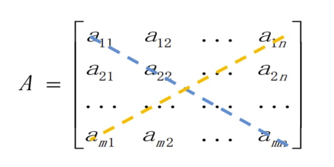
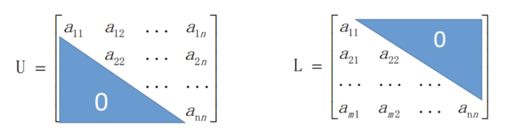
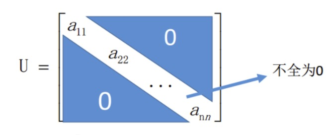
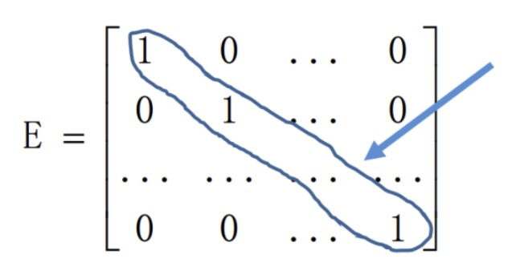

### 线性代数

- 线性(linear)指量(变量)与量(变量)之间按比例、成线性关系，在数学上可以理解为一阶导数为常数的函数
- 非线性(non-linear)是指不成比例、没有直线关系, 一阶导数不是常数的函数
- 线性代数中的基本量指的是向量，基本关系是严格的线性关系，也就是可以简单的将线性代数理解为向量和向量之间的线性关系的映射

### 矩阵

- 矩阵：即描述线性代数中线性关系的参数，即矩阵是一个线性变换，可以将一些向量转换为另一些向量
- 在初等代数中，y=ax表示的是x到y的一种映射关系,其中a是描述这种关系的参数
- 在线性代数中，Y=AX表示的是向量X和Y的一种映射关系，其中A是描述这种关系的参数

### 矩阵的直观表示

- 数域F中m*n个数排成m行n列，并括以圆括弧(或方括弧)的数表示成为数域F上的矩阵，通常用大写字母记为A或者$A_{m*n}$
- 有时也记为$A=(a_{ij})_{m*n} \ \ \ (i=1,2,...,m; j=1,2,...n)$, 其中$a_{ij}$表示矩阵A的第i行的第j列元素
- 当F为实数域R时，A叫做实矩阵，当F为复数域C时，A叫做复矩阵

$$
A = \left \{
\begin{array}{cccc}
a_{11}& a_{12} &\cdots & a_{1n} \\
a_{21}& a_{22} &\cdots & a_{2n} \\
\cdots& \cdots &\cdots & \cdots \\
a_{m1}& a_{m2} &\cdots & a_{mn} \\
\end{array} 
\right \}
$$

### 矩阵与向量

- 当m=1或n=1的时候,称A为行向量或列向量
- $A = [a_{11} \ a_{12} \ ... a_{1n}]$
- $A = \left [\begin{array}{cccc} a_{11} \\ a_{21} \\ \cdots \\ a_{m1} \end{array}  \right ]$

### 矩阵相等

- 对于两个矩阵A和B, 当它们的行数相同，列数相同，并且对应位置上的元素都相等时，称矩阵A与B相等, 记为A=B
- 即$a_{ij} = b_{ij}$, 对所有$i =1,2,...,m; j=1,2,...,n$都成立
- 若两个矩阵行数与列数分别相等，则为同型矩阵，如下
    * $A = \left [\begin{array}{cccc} 1 & 2 \\ 5 & 6 \\ 4 & 7\end{array}  \right ]$ 与 $A = \left [\begin{array}{cccc} 14 & 3 \\ 7 & 4 \\ 5 & 9 \end{array}  \right ]$

### 方阵

- 如果矩阵A中m等于n，那么称矩阵A为n阶矩阵(或n阶方阵)
    * 从左上到右下的对角线称为主对角线
    * 从右上到左下的对角线称为次对角线

    
     
    
备注：图片托管于github，请确保网络的可访问性

     

### 负矩阵、上三角矩阵、下三角矩阵

- 对于矩阵A(所有元素m*n), 各个元素取相反数得到的矩阵称为A的负矩阵，记为$-A$
- 对于矩阵 $A = \left [\begin{array}{cccc} 1 & 2 \\ 5 & 6 \end{array} \right ]$ 的负矩阵为 $-A = \left [\begin{array}{cccc} -1 & -2 \\ -5 & -6 \end{array}  \right ]$
- 三角阵
    * 上三角矩阵
    * 下三角矩阵

    
     
    
备注：图片托管于github，请确保网络的可访问性

     

### 对角矩阵

- 即为上三角阵，又是下三角阵的矩阵称为对角方阵或对角矩阵，记为 $D = diag[a_{11} a_{22} ... a{nn}]$

    
     
    
备注：图片托管于github，请确保网络的可访问性

     

- 对角元的和$\sum_{i=1}^n a_{ii}$称方阵A的迹，记为: trA

### 单位矩阵

- 单位矩阵：n阶方阵中除了主对角线上的元素外，其他元素均为0，主对角线元素为1
- 那么此时的n阶方阵叫做n阶单位矩阵。单位矩阵常用E或I表示

    
     
    
备注：图片托管于github，请确保网络的可访问性

     

### 零矩阵

- 如果矩阵A中的所有元素(m*n个)均为0，那么此时矩阵A叫做零矩阵，可以记为0

$$
B = \left [
\begin{array}{cccc}
0 & 0 & \cdots & 0 \\
0 & 0 & \cdots & 0 \\
\cdots & \cdots &\cdots & \cdots \\
0 & 0 & \cdots & 0 \\
\end{array} 
\right ]
$$

### 矩阵的加减法

- 矩阵的加法与减法要求进行操作的两个矩阵A和B具有相同的阶
- 假设A为$m*n$阶矩阵，B为$m*n$阶矩阵，那么$C = A \pm B$ 也是$m*n$阶的矩阵，并且矩阵C元素满足: $c_{ij} = a_{ij} \pm b_{ij}$

$$
A = \left \{
\begin{array}{cccc}
a_{11} & a_{12} &\cdots & a_{1n} \\
a_{21} & a_{22} &\cdots & a_{2n} \\
\cdots & \cdots &\cdots & \cdots \\
a_{m1} & a_{m2} &\cdots & a_{mn} \\
\end{array} 
\right \}
$$

$$
B = \left \{
\begin{array}{cccc}
b_{11} & b_{12} &\cdots & b_{1n} \\
b_{21} & b_{22} &\cdots & b_{2n} \\
\cdots & \cdots &\cdots & \cdots \\
b_{m1} & b_{m2} &\cdots & b_{mn} \\
\end{array} 
\right \}
$$

$$
C = A \pm B = \left \{
\begin{array}{cccc}
a_{11} \pm b_{11} & a_{12} \pm b_{12} & \cdots & a_{1n} \pm b_{1n} \\
a_{21} \pm b_{21} & a_{22} \pm b_{22} &\cdots & a_{2n} \pm b_{2n} \\
\cdots & \cdots & \cdots & \cdots \\
a_{m1} \pm b_{m1} & a_{m2} \pm b_{m2} &\cdots & a_{mn} \pm b_{mn} \\
\end{array} 
\right \}
$$

- 记 $A_{m×n} = (a_{ij}) B_{m×n} = (b_ij)$
- 加法：$A_{m×n} + B_{m×n} = (a_{ij} + b_{ij})$

$$
\left [
\begin{array}{cccc}
1 & 2 \\
5 & 6
\end{array} 
\right ] +
\left [
\begin{array}{cccc}
3 & 4 \\
7 & 8
\end{array} 
\right ] =
\left [
\begin{array}{cccc}
4 & 6 \\
12 & 14
\end{array} 
\right ]
$$

- 减法：$A_{m×n} - B_{m×n} = (a_{ij} - b_{ij})$

$$
\left [
\begin{array}{cccc}
6 & 8 \\
11 & 14
\end{array} 
\right ] -
\left [
\begin{array}{cccc}
3 & 4 \\
7 & 8
\end{array} 
\right ] =
\left [
\begin{array}{cccc}
3 & 4 \\
4 & 6
\end{array}
\right ]
$$

- 运算律：
    * 交换律：$A + B = B + A$
    * 结合律：$(A + B) + C = A + (B + C)$

### 矩阵与数的乘法

- 数乘：将数$\lambda$与矩阵A相乘，就是将数$\lambda$与矩阵A中的每一个元素相乘，记为：$\lambda A$
- 结果 $C = \lambda A$, 并且C中的元素满足：$c_{ij} = \lambda a_{ij}$

$$
A = \left \{
\begin{array}{cccc}
a_{11} & a_{12} & \cdots & a_{1n} \\
a_{21} & a_{22} & \cdots & a_{2n} \\
\cdots & \cdots & \cdots & \cdots \\
a_{m1} & a_{m2} & \cdots & a_{mn} \\
\end{array} 
\right \}
$$

$$
\lambda A = \left \{
\begin{array}{cccc}
\lambda  a_{11} & \lambda a_{12} &\cdots & \lambda a_{1n} \\
\lambda  a_{21} & \lambda a_{22} &\cdots & \lambda a_{2n} \\
\cdots & \cdots &\cdots & \cdots \\
\lambda a_{m1} & \lambda a_{m2} &\cdots & \lambda a_{mn} \\
\end{array} 
\right \}
$$

- 数乘：$kA = (ka_{ij})$

$$
3 ×
\left [
\begin{array}{cccc}
1 & 2 \\
5 & 6
\end{array} 
\right ] =
\left [
\begin{array}{cccc}
3 × 1 & 3 × 2 \\
3 × 5 & 3 × 6
\end{array} 
\right ] =
\left [
\begin{array}{cccc}
3 & 6 \\
15 & 18
\end{array} 
\right ]
$$

- 数乘运算律
    * 结合律：$(\lambda \mu)A = \lambda(\mu A)$
    * 分配律
        * $(\lambda + \mu)A = \lambda A + \mu A$
        * $\lambda (A+B) = \lambda A + \lambda B$

- 例子：$A = \left [\begin{array}{cccc}1 & 0 & 2 \\ 2 & -1 & 3 \end{array} \right]$, $B = \left [\begin{array}{cccc}1 & 3 & 4 \\ 1 & 0 & 5 \end{array} \right]$, 求：-3A+2B

$$
-3A + 2B =
\left [
\begin{array}{cccc}
-3 & 0 & -6 \\
-6 & 3 & -9
\end{array} 
\right ]  +
\left [
\begin{array}{cccc}
2 & 6 & 8 \\
2 & 0 & 10
\end{array}
\right ] =
\left [
\begin{array}{cccc}
-1 & 6 & 2 \\
-4 & 3 & 1
\end{array}
\right ]
$$

### 矩阵与向量的乘法

- 假设A为$m*n$阶矩阵，x为$n*1$的列向量，则Ax为$m*1$的列向量，记为：$\vec{y} = A\vec{x}$

$$
A = \left \{
\begin{array}{cccc}
a_{11} & a_{12} &\cdots & a_{1n} \\
a_{21} & a_{22} &\cdots & a_{2n} \\
\cdots & \cdots &\cdots & \cdots \\
a_{m1} & a_{m2} &\cdots & a_{mn} \\
\end{array} 
\right \}
$$

$$
\vec{x} = 
\left (
\begin{array}{cccc}
x_1 \\
x_2 \\
\cdots \\
x_n \\
\end{array}
\right )
$$

$$
\vec{y} = A \vec{x} =
\left (
\begin{array}{cccc}
y_1 \\
y_2 \\
\cdots \\
y_m \\
\end{array}
\right )
$$

$$
y_i = \sum_{j=1}^n a_{ij} x_j
$$

### 矩阵与矩阵的乘法

- 矩阵的乘法仅当第一个矩阵A的列数和第二个矩阵B的行数相等时才能够定义，假设A为$m*s$阶矩阵，B为$s*n$阶矩阵
- 那么$C=A*B$是$m*n$阶矩阵，并且矩阵C中的元素满足：$c_{ij} = \sum_{k=1}^s a_{ik} b_{kj}$

$$
A = \left \{
\begin{array}{cccc}
a_{11} & a_{12} & \cdots & a_{1s} \\
a_{21} & a_{22} & \cdots & a_{2s} \\
\cdots & \cdots & \cdots & \cdots \\
a_{m1} & a_{m2} & \cdots & a_{ms} \\
\end{array} 
\right \}
$$

$$
B = \left \{
\begin{array}{cccc}
b_{11} & b_{12} & \cdots & b_{1n} \\
b_{21} & b_{22} & \cdots & b_{2n} \\
\cdots & \cdots & \cdots & \cdots \\
b_{s1} & b_{s2} & \cdots & b_{sn} \\
\end{array} 
\right \}
$$

$$
C=A*B=
\left \{
\begin{array}{cccc}
c_{11} & c_{12} & \cdots & c_{1n} \\
c_{21} & c_{22} & \cdots & c_{2n} \\
\cdots & \cdots & \cdots & \cdots \\
c_{m1} & c_{m2} & \cdots & c_{mn} \\
\end{array} 
\right \}
$$

### 矩阵与矩阵的乘法

- (AB)C = A(BC)
- (A+B)C = AC+BC
- C(A+B) = CA + CB
- 例：$A = \left [\begin{array}{cccc}1 & 0 & -1 & 2 \\-1 & 1 & 3 & 0 \\0 & 5 & -1 & 4\end{array} \right ]$，$B = \left [\begin{array}{cccc}0 & 3 & 4 \\1 & 2 & 1 \\3 & 1 & -1 \\-1 & 5 & 1 \\\end{array} \right ]$，求C=AB
    * 解：$C=AB=\left [\begin{array}{cccc}1 & 0 & -1 & 2 \\-1 & 1 & 3  & 0 \\0 & 5 & -1 & 4\end{array} \right ]\left [\begin{array}{cccc}0 & 3 & 4  \\1 & 2 & 1  \\3 & 1 & -1  \\-1 & 2 & 1\end{array} \right ]=\left [\begin{array}{cccc}-5 & 6 & 7  \\10 & 2 & -6 \\-2 & 17 & 10\end{array} \right ]$
- 例：$A = \left [\begin{array}{cccc}1 & 1 \\-1 & -1\end{array} \right ]$, $B = \left [\begin{array}{cccc}1 & 1 \\1 & 1\end{array} \right ]$, $C = \left [\begin{array}{cccc}-1 & 2 \\3 & 0\end{array} \right ]$
    * $AB = \left [\begin{array}{cccc}1 & 1 \\-1 & -1\end{array} \right ]\left [\begin{array}{cccc}1 & 1 \\1 & 1\end{array} \right ]=\left [\begin{array}{cccc}2 & 2 \\-2 & -2\end{array} \right ]$
    * $BA = \left [\begin{array}{cccc}1 & 1 \\1 & 1\end{array} \right ]\left [\begin{array}{cccc}1 & 1 \\-1 & -1\end{array} \right ]=\left [\begin{array}{cccc}0 & 0 \\0 & 0\end{array} \right ]$
    * $AC = \left [\begin{array}{cccc}1 & 1 \\-1 & -1\end{array} \right ]\left [\begin{array}{cccc}-1 & 2 \\3 & 0\end{array} \right ]=\left [\begin{array}{cccc}2 & 2 \\-2 & -2\end{array} \right ]$
    * $A^2 \overset{\text{def}}{=} AA =\left [\begin{array}{cccc}1 & 1 \\-1 & -1\end{array} \right ]\left [\begin{array}{cccc}1 & 1 \\-1 & -1\end{array} \right ]=\left [\begin{array}{cccc}0 & 0 \\0 & 0\end{array} \right ]$
- 注意：
    * 只有两个矩阵是同型矩阵时，才能进行加法运算
    * 只有当第一个矩阵的列数等于第二个矩阵的行数时，两个矩阵才能相乘，且矩阵相乘不满足交换律
    * 矩阵的数乘运算与行列式的数乘运算不同
    * 矩阵乘法中存在化零因子，而实数乘法中不存在化零因子
    * 在实数运算系统中，方程 $ax = 0 (a \neq 0)$ 有唯一解，等价的有消去律，矩阵乘法中没有，消去律不成立

### 矩阵转置

- 矩阵的转置：把矩阵A的行和列相互交换所产生的矩阵称为A的转置矩阵，这一过程叫做矩阵的转置，使用$A^T$表示A的转置

$$
A = \left \{
\begin{array}{cccc}
a_{11} & a_{12} & \cdots & a_{1n} \\
a_{21} & a_{22} & \cdots & a_{2n} \\
\cdots & \cdots & \cdots & \cdots \\
a_{m1} & a_{m2} & \cdots & a_{mn} \\
\end{array} 
\right \}
$$

$$
A^T = \left \{
\begin{array}{cccc}
a_{11} & a_{21} & \cdots & a_{m1} \\
a_{12} & a_{22} & \cdots & a_{m2} \\
\cdots & \cdots & \cdots & \cdots \\
a_{1n} & a_{2n} & \cdots & a_{mn} \\
\end{array} 
\right \}
$$

- 例：$A = \left [\begin{array}{cccc}1 & 2 \\5 & 6\end{array} \right ]$, A的转置为：$A^T = \left [\begin{array}{cccc}1 & 5 \\2 & 6\end{array} \right ]$
- 转置的运算性质
    * $(A^T)^T = A$
    * $(\lambda A)^T = \lambda A^T$
    * $(AB)^T = B^TA^T$
    * $(A + B)^T = A^T + B^T$
- 例：$A = \left (\begin{array}{cccc}2 & 0 & -1 \\1 & 3 & 2\end{array}\right )$, $B = \left (\begin{array}{cccc}1 & 7 & -1 \\4 & 2 & 3 \\2 & 0 & 1\end{array}\right)$, 求$(AB)^T$
    * 解法一：
        * $AB = \left (\begin{array}{cccc}2 & 0 & -1 \\1 & 3 & 2\end{array} \right )\left (\begin{array}{cccc}1 & 7 & -1 \\4 & 2 & 3 \\2 & 0 & 1\end{array} \right )=\left (\begin{array}{cccc}0 & 14 & -3 \\17 & 13 & 10\end{array} \right )$
        * $(AB)^T = \left \{\begin{array}{cccc}0 & 17  \\14 & 13 \\-3 & 10\end{array} \right \}$
    * 解法二：
        * $(AB)^T = B^T A^T = \left (\begin{array}{cccc} 1 & 4 & 2 \\ 7 & 2 & 0 \\ -1 & 3 & 1 \end{array} \right ) \left (\begin{array}{cccc} 2 & 1 \\ 0 & 3 \\ -1 & 2 \end{array} \right ) = \left (\begin{array}{cccc} 0 & 17 \\ 14 & 13 \\ -3 & 10 \end{array}  \right )$
