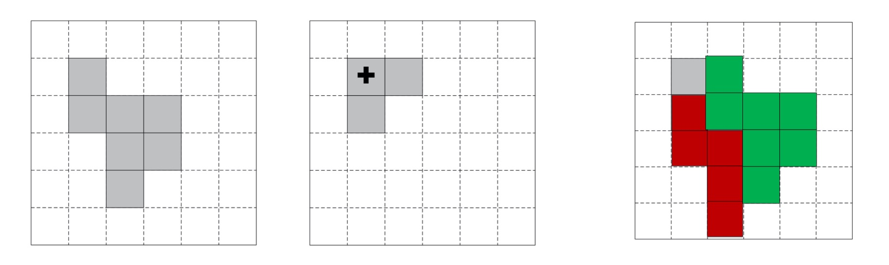
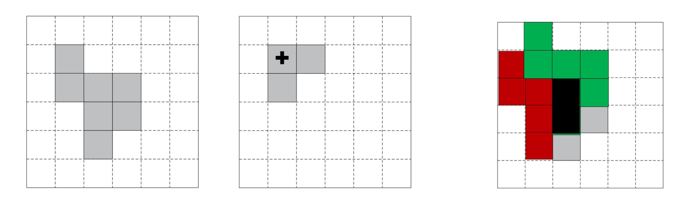

### 概述

- 数学形态学滤波是基于几何操作的形式
- 最基本的操作就2种：膨胀、腐蚀
- 其他操作都是基于这两种操作组合而来的

### 数学形态学滤波 - 膨胀

- $A \oplus B$ 表示集合A用结构元素B膨胀，定义为：
    * $A \oplus B = \bigcup_{b\in{B}}(A)_b$

**下面通过图示来说明**

<div align="left">
    
</div>

- 第一个是原始图像A
- 第二个是结构元素B，其中➕表示锚定点，也就是B的坐标零点，旁边有两个像素，分别在零点的右侧和下侧
- $(A)_b$ 表示用A中的每一个像素进行移动b操作，也就是右移和下移b单位像素(B的零点旁像素的指向)
- 最终把所有像素合并到一起(包括原图)，形成第三个图像

### 数学形态学滤波 - 腐蚀

- $A \Theta B$表示集合A用结构元素B腐蚀
- 定义为：$A \Theta B = \bigcap_{b\in{B}}(A)_{-b}$

**下面通过图示来说明**

<div align="left">
    
</div>

- 第一个是原始图像A
- 第二个是结构元素B，其中➕表示锚定点，也就是B的坐标零点，旁边有两个像素，分别在零点的右侧和下侧
- $(A)_{-b}$ 表示用A中的每一个像素移动-b的距离，-表示原来是右移和上移，现在变成左移和下移
- 最终把所有三个图像求交集，得到中间黑色部分的结果

### 实际中使用的操作 - 开闭运算

- 膨胀和复试并不互为逆运算，二者级联使用可生成新的形态学运算
- 开运算：先腐蚀后膨胀: $A \circ B = (A \Theta B) \oplus B$
- 闭运算：先膨胀后腐蚀: $A \bullet B = (A \oplus B) \Theta B$
- 先开后闭：可有效去除噪声，效果类似高斯去噪或中值滤波，又稍有不同，多次使用会使图像部分区域出现马赛克现象
- 注意：腐蚀和膨胀不是互为逆运算的关系，腐蚀完后在膨胀可能就不是原图像了
    * 比如图像中的一个孤立像素，腐蚀后就没有了，那么就无法再进行膨胀了

### 各种滤波操作的OpenCV实现

- 高斯平滑滤波
    * C++版本
        ```cpp
        void GaussianBlur( InputArray src, OutputArray dst, Size ksize, double sigmaX, double sigmaY = 0, int borderType = BORDER_DEFAULT );
        ```
    * Python版本
        ```python
        dst = cv.GaussianBlur( src, ksize, sigmaX[, dst[, sigmaY[, borderType]]] )
        ```

- 中值滤波
    * C++版本
        ```cpp
        void medianBlur( InputArray src, OutputArray dst, int ksize );
        ```
    * Python版本
        ```python
        dst = cv.medianBlur( src, ksize[, dst] )
        ```

- 形态学滤波
    * C++版本
        ```cpp
        void morphologyEx( InputArray src, OutputArray dst, int op, InputArray kernel,
            Point anchor=Point(-1,-1), int iterations=1,
            int borderType=BORDER_CONSTANT,
            const Scalar& borderValue=morphologyDefaultBorderValue() );
        ```
        * kernel : 形态学运算的结构元素。可使用getStructuringElement创建 
        * op: MORPH_OPEN – 开运算; MORPH_CLOSE – 闭运算 等
    * Python版本
        ```python
        dst = cv.morphologyEx(src, op, kernel[, dst[, anchor[, iterations[, borderType[, borderValue]]]]] )
        ```

### 总结

- 滤波即卷积，由逐点乘积后累加得到
- 平滑滤波包括平均滤波、高斯滤波、中值滤波等方法，其中高斯滤波最为常用
- 数学形态学滤波基于腐蚀与膨胀两个基本操作