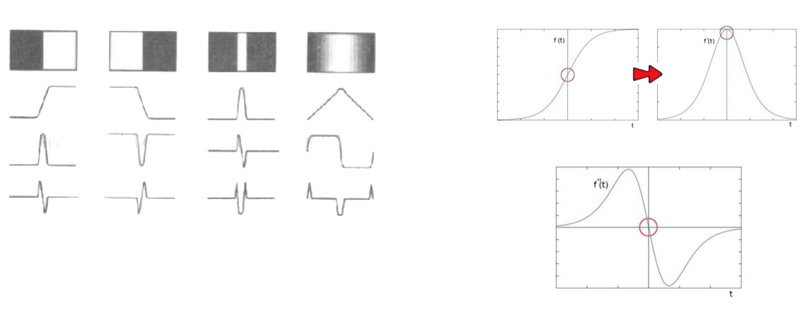
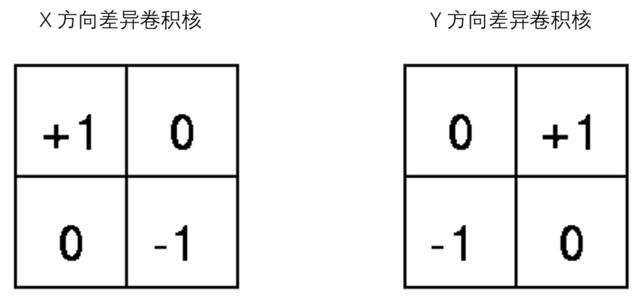
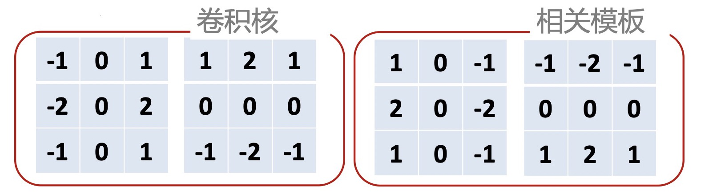
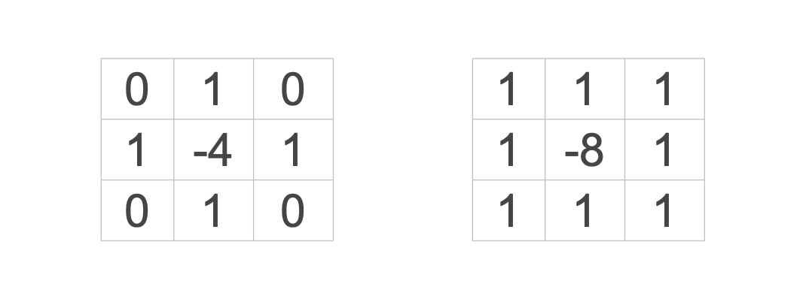
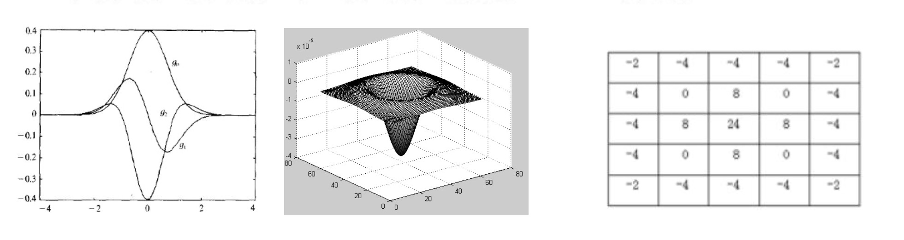
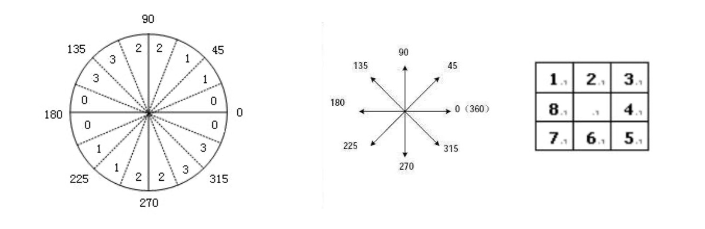
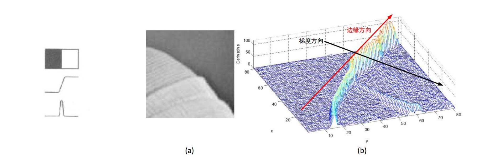
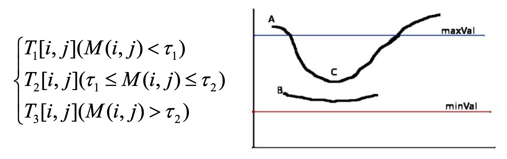
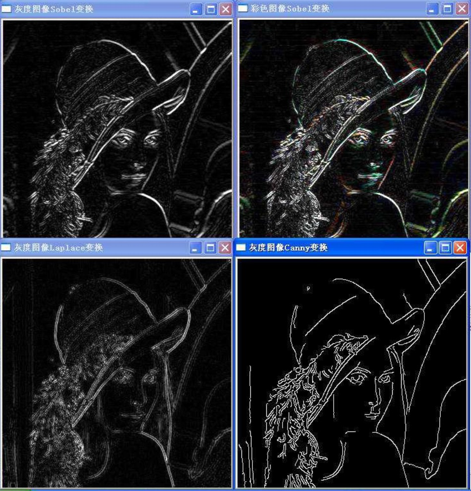

### 边缘检测基本思想

- 边缘是图像最重要的一类特征
- 在生活中速写就是用铅笔勾勒出图像的边缘信息，我们通过速写识别作画的内容，也就是说边缘能够提供图像中特别重要的信息

**四类不同的边缘**

<div align="left">
    
</div>

- 第一层是图像的变化趋势
- 第二层是灰色的函数趋势
- 第三层是对这个函数一阶微分
- 第四层是对这个函数二阶微分
- 边缘检测的本质是微分
- 实际中常用差分，x方向和y方向

### 图像边缘检测 - 基本算子

Robert算子卷积核

<div align="left">
    
</div>

- $E_{x} = \frac{\partial{f(x,y)}}{\partial{x}} = f(x,y) - f(x - 1, y - 1)$

- $E_{y} = \frac{\partial{f}}{\partial{y}} = f(x - 1,y) - f(x, y - 1)$

### 图像边缘检测 - Sobel算子

Sobel算子卷积核

<div align="left">
    
</div>

- Sobel算子卷积核(左右分别是x,y方向卷积核,相关模板正好要上下、左右翻转)

- $\frac{\partial{f(x,y)}}{\partial{x}} = [f(x-1, y-1) + 2f(x-1,y) + f(x-1,y+1)] - [f(x+1,y-1) + 2f(x+1,y) + f(x+1,y+1)]$

- $\frac{\partial{f(x,y)}}{\partial{y}} = [f(x-1, y+1) + 2f(x,y + 1) + f(x+1,y+1)] - [f(x-1,y-1) + 2f(x,y-1) + f(x+1,y-1)]$

### 图像边缘检测 - Laplace算子

<div align="left">
    
</div>

- 这是一个通过二阶差分过零点来检测边缘的例子

- 任何一个函数或图像, 它的Laplace算子作用的结果等于它的x方向的二阶偏导+它的y方向的二阶偏导

- 上图是它对应的二阶差分的模板, 第一个是四临域，第二个是八临域

- 差分能够有效的检测边缘, 也会使噪声变大

- $\Delta{f(x,y)} = \nabla^2{f(x,y)} = \frac{\partial^2{f}}{\partial{x^2}} + \frac{\partial^2{f}}{\partial{y^2}} = f(x+1,y) + f(x-1,y) + f(x,y + 1) + f(x,y - 1) - 4f(x,y)$

### 图像边缘检测 - LoG算子

<div align="left">
    
</div>

- 它的基本思想是：首先对原始图像进行一次高斯滤波, 然后再求Laplace
- 首先对原始图像采用一个宽度为 σ 的高斯滤波器$G_\sigma(x,y)$, 进一步在其前面使用Laplace算子$\Delta$
- 根据卷积的性质, Laplace算子和卷积对应的括号是可交换的, 所以可以写成首先对高斯函数求Laplace变换, 得到的结果再和图像进行卷积
- 这么做的意义是，如果采用这个表达式$\Delta{[G_\sigma(x,y) * f(x,y)]}$计算,意味着我们首先要对原始图像进行高斯平滑，进一步再进行Laplace计算，换句话说我们的原始图像需要两次计算
- 在这个$LoG * f(x,y)$表达式中，高斯函数和Laplace计算的结果可以事先知道, 只需要和原始图像进行一次计算即可，可以节省一半的计算量
- $\Delta{[G_\sigma(x,y) * f(x,y)]} = [\Delta{G_\sigma(x,y)}] * f(x,y) = LoG * f(x,y)$
- 第一张图最上面是原始的高斯曲线, 中间线条是高斯曲线求了一次导数的, 最下面的曲线是高斯函数求了两次导数的，从这张图中可以看出高斯函数求完二阶导数, 也就是经过Laplace运算后, 它明显是类似草帽的性质
- 第二张图就是它的三维图，像是一个草帽
- 第三张图表示LoG算子通常用一个5*5的模板来描述，根据高斯函数宽度 σ 的选取的不同，LoG有不同的算子的系数形式，我们这里给出了比较常用的
- 以上我们描述的这些算子，都是在原始图像上通过一个滤波器模板进行卷积得到的，这样得出的结果，虽然形式上简单，但更容易受到噪声的影响, 同时在求取边缘的时候, 往往因为图像中的噪声或边缘本身的模糊性, 导致我们最后求出的边缘不清楚, 或者边缘本来是一种联通的曲线, 结果中间中断了很多, 针对这一问题，下面我们来谈一谈Canny算子

### 图像边缘检测 - Canny算子

- 是Canny学者在上世纪提出的，用于有效检测边缘的方法
- 已有方法问题：噪声，断裂，虚检(渐变灰度)
- Canny算子核心优点：边缘可自动连同，有效消除虚检出的边缘
  
**算法步骤**

- 使用高斯函数的一阶导数同时完成平滑图像和计算微分
    * $H(x,y) = \Delta{(G(x,y)*f(x,y)} = \Delta{G(x,y)*f(x,y))}$
    
    * $\Delta{G} = \begin{bmatrix} \partial{G} / \partial{x} \\ \partial{G} / \partial{y} \end{bmatrix}$
    
    * $G(x,y) = \frac{1}{\sqrt{2\pi} \sigma} exp[- \frac{x^2 + y^2}{\sigma^2} ]$

- 计算梯度(幅值和方向)
    * 得到x,y方向平滑一阶导数计算的结果

    * $E_x = \frac{\partial{G}} {\partial{x}} * f(x,y)$

    * $E_y =  \frac{\partial{G}} {\partial{y}} * f(x,y)$

    * 进一步得到每一个点的位置梯度的幅值和方向
    
    * $M(x,y) = \sqrt{E_x^2(x,y) + E_y^2(x,y)}$
    
    * $\theta{(x,y)} = tan^{-1}(\frac{E_y(x,y)}{E_x(x,y)})$

    * 计算完方向后实际是一个 0 ~ 2π的连续分布的数，我们要将连续的数转换为离散的方向
    
    * 方向离散化:离散化为上下左右和斜45°共4个方向
    
    <div align="left" style="margin-left:50px;">
        
    </div>

    * 任何一个像素考虑到3*3的规模，它的方向实际上有8个(上下左右4个和斜角4个)
  
    * 根据离散图像的性质, canny 把原始图像中的方向同样也离散化成8个, 分别对应0,1,2,3 其中每个数又对应2个不同的方向
    
    * 最终离散化后的方向只有4个

- 梯度幅值进行非极大值抑制,消除虚检出的边缘
    * 在实际中，边缘的灰度是缓慢变化的, 它是一个范围, 理想的边缘应该只有一条线
    
    * 在二维图像中将边缘表现出来，实际上是一个山脊的情况 
    
    * 细化梯度幅值图像中的屋脊带，只保留幅值局部变化最大的点(这个点是沿着梯度变化的方向)
    
    * 使用一个3*3邻域作用于幅值阵列的所有点。在每一点上, 邻域的中心像素与沿梯度方向的两个梯度幅值的插值结果进行较，仅保留极大值点，如果是极值点，我们才认为它是边缘
    
    * 如果不满足，我们将梯度值置为0，我们认为它是一个假的边缘点
    
    <div align="left" style="margin-left:50px;">
        
    </div>

- 自动边缘连接，断裂的可以重新有效的进行连接

    * 对上一步得到的图像使用低、高阈值 $\tau_1 \tau_2$ 阈值化，得到三幅图像, 这里 $\tau_2 > \tau_1$
    
    <div align="left" style="margin-left:50px;padding-top:10px;">
        
    </div>

    * 把梯度幅值对应的图像做一个阈值化, 将所有小于低阈值的得到一个图像, 这时的梯度较弱，肯定不是边缘
  
    * 将介于两个阈值之间的做成一个图
  
    * 大于高阈值的做成一个图，在这里梯度很强，一定是边缘
  
    * 前面不可靠的值已经设置为0，所以T_3得到的一定是很强的边缘，比$T_3$弱的也不一定是边缘，比如图上c点比较弱，其他相邻两点较强, 那么我们认为c点是边缘
    
    * $T_1$对应假边缘，去除
    
    * $T_3$对应真边缘，全部保留
    
    * $T_2$连接：临接像素中是否有属于$T_3$的像素

- Canny算子考虑了去噪，非极大值抑制和断裂边缘的问题，较为复杂，实际效果也好的多，是目前使用最为广泛的一类算子

### OpenCV对边缘检测算法的支持

- Sobel算子
    * c++版本
        ```c
        void Sobel( InputArray src, OutputArray dst, int ddepth, int dx, int dy, int ksize=3, double scale=1, double delta=0, int borderType=BORDER_DEFAULT );
        ```
    * python版本
        ```python
        dst = cv.Sobel( src, ddepth, dx, dy[, dst[, ksize[, scale[, delta[, borderType]]]]] )
        ```

- 拉普拉斯滤波
    * c++版本
        ```cpp
        void Laplacian(InputArray src, OutputArray dst, int ddepth, int ksize = 1, double scale = 1, double delta = 0, int borderType = BORDER_DEFAULT )
        ```
    * python版本
        ```python
        dst = cv.Laplacian( src, ddepth[, dst[, ksize[, scale[, delta[, borderType]]]]] )
        ```

- Canny算子
    * c++版本
        ```cpp
        void Canny( InputArray image, OutputArray edges, double threshold1, double threshold2, int apertureSize=3, bool L2gradient=false );
        ```
    * python版本
        ```python
        dst = cv.Canny( image, threshold1, threshold2[, edges[, apertureSize[, L2gradient]]] )
        ```

### 算子各类效果比较

<div align="left">
    
</div>

- 可以看到Laplace算子存在明显问题, 采用二次导数的原因，对应边缘形成了2条线，而非一条线，而且很多地方处理不好，在实际中不会单独使用
- Canny算子处理的则非常好

### 总结

- 边缘检测即图像差分
- 常见边缘检测算子包括Robert算子，Sobel算子，LoG算子等，其中Sobel算子最为常用
- Canny算子的基本优点在于检测准确、对噪声稳健，在实际中广泛应用