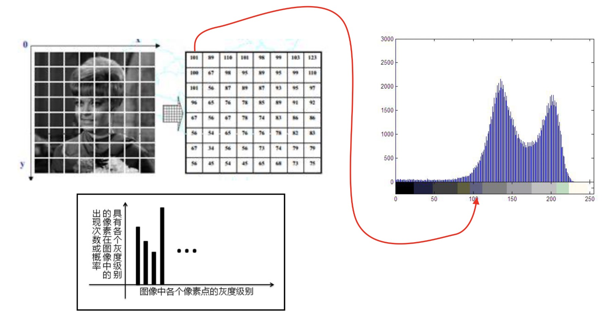
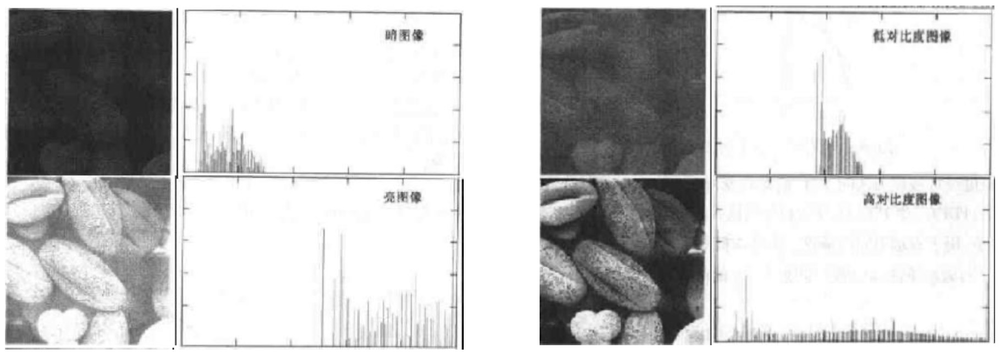
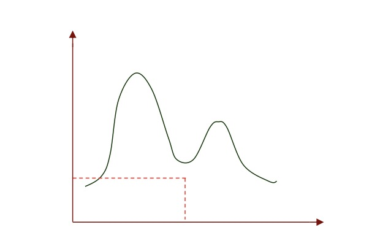
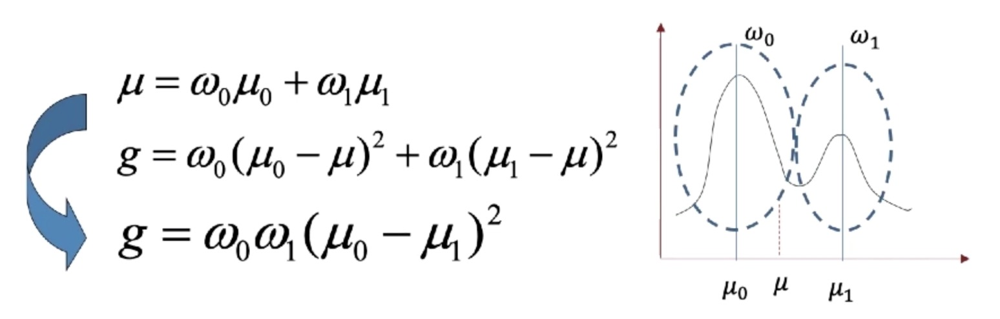
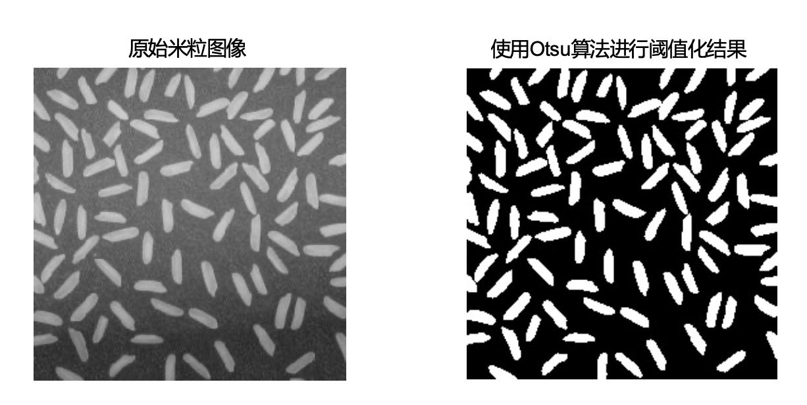
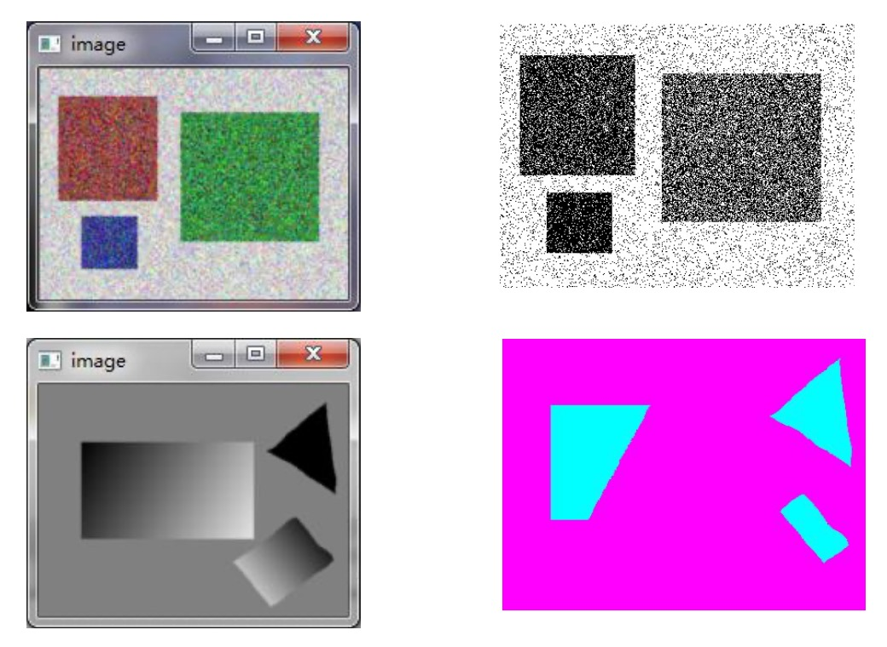
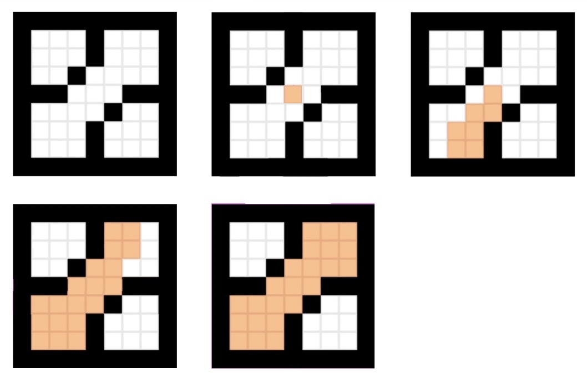
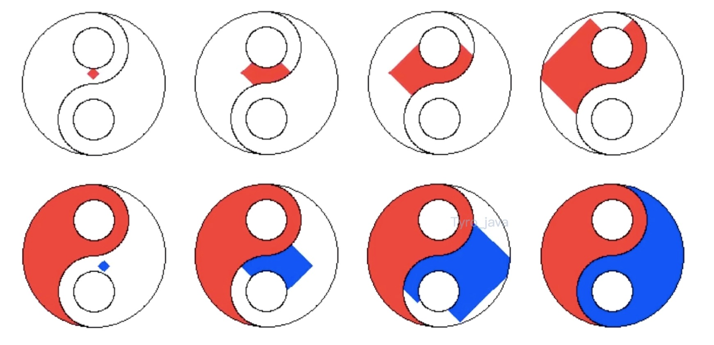
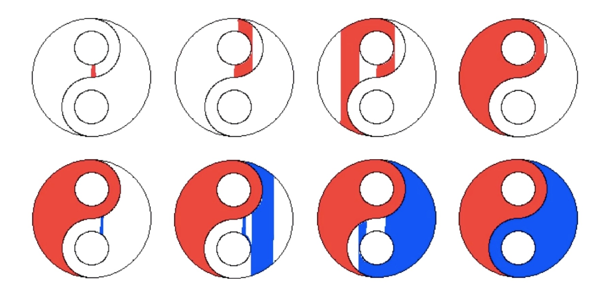
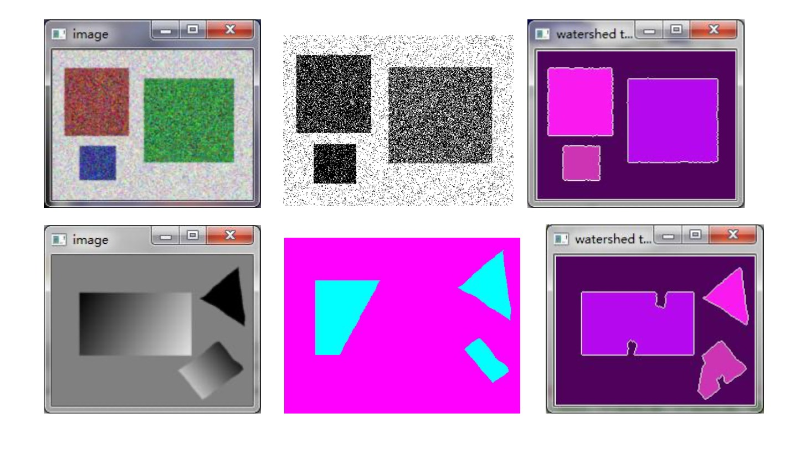

### 概述

- 图像分割是视觉中非常重要的一个内容
- 我们人类在看周围世界的时候, 首先会将视野中的目标分成一个一个不同的焦点, 进一步再对每一个目标进行详细的分析
- 模拟人类视觉，计算机视觉也要对图像中不同的目标一个一个的进行分割出来

### 图像直方图(灰度直方图)

<div align="left" style="margin-left:50px;">
    
</div>

- 在左上角的图像每一个像素格分别对应了该像素的对应灰度，在这里我们只考虑灰度图像
- 每个像素对应的灰度幅值是0~255之间，我们可以围绕着这个图像做它的灰度直方图
- 灰度直方图以灰度为横坐标，围绕着每个灰度值在图像中出现的次数作为它的纵坐标
- 灰度直方图描述了图像中灰度的分布情况，在灰度直方图里，波峰位置通常对应这个灰度出现频次最高的位置
- 波谷位置则是出现频次最低的位置
- 进一步，我们的纵坐标可以不是出现的频次，而是出现的频次和所有像素个数的一个比例
- 纵坐标使用百分比的好处：所有灰度统计的个数一定是这个灰度像素的个数
- 纵坐标使用百分比，那么这个灰度直方图的积分就是1，所以这个灰度直方图就等同于灰度出现的概率密度函数

### 通过灰度直方图看图像的照明效果

<div align="left" style="margin-left:50px;">
    
</div>

- 第一张图左上角的图片明显发暗，灰度直方图大部分的位置都聚集在了灰度值比较低的位置
- 相反，第一张图左下角图片整体较亮，灰度直方图大部分的位置都聚集在亮的区域
- 第二张图，右上角对比度(图像亮和暗的部分的比较)比较低的图像，它的灰度直方图大部分像素都挤在一个区域中，这说明灰度之间亮和暗没有区分
- 相反，第二张图右下角高对比度的图像，它的亮和暗的图像都分得比较开，在直方图上几乎是平均分布，我们希望我们的图像对比度高一些好
- 对比度太高也会存在一个问题：噪声点会比较突出，我们可以根据这个图像来提升自己的摄影水平

### 灰度阈值分割

- 通过灰度直方图来完成灰度阈值分割
- 基于灰度的阈值分割，假设:图像中的目标区和背景区之间或者不同目标区之间，存在不同的灰度或平均灰度
- 比如在一个比较亮的背景里，有一个比较暗的目标，或者目标与背景有一个比较明显的亮度区分
- 灰度阈值的基本定义：凡是灰度值包含于z的像素都变成某一灰度值，其他的变成另一个灰度值，则该图像就以z为界被分成两个区域
    * $f(x,y) = \begin{cases} z_a & {f(x,y) \in z} \\ z_b & 其他 \end {cases}$

- 我们通常把阈值$z_a$ 和 $z_b$ 取成最亮的和最暗的，也就是取成0和255
- 在matlib中最亮和最暗是1和0，如果=1和=0，分割后的图像为二值图像
- 对应阈值分割的问题，通常它的灰度直方图就像在图里画的，从图里看，它有两个明显的波峰，分别对应的是前景和背景

<div align="left" style="margin-left:50px;">
    
</div>

- 要是人来做，我们会选择两个波峰之间的波谷位置，作为我们要选择的阈值，来区分背景和前景
- 我们的任务是让计算机去自动选择最佳的阈值，我们选择阈值的标准是让当前目标和背景之间做到最大化
- 也就是下面要谈到的大津算法

### 大津(Otsu)算法

- 由日本学者大津在1973年的时候提出的
- 他要解决的问题是：确定最佳阈值，使背景和目标之间的**类间方差**最大(因为二者差异最大)

<div align="left" style="margin-left:50px;">
    
</div>

- 其中一类的均值是$u_0$, 另一类是$u_1$, 整体直方图是均值是$u$
- $w_0$ 和 $w_1$ 对应的是每一类直方图的面积，也就是像素的个数
- $w_0$ 和 $w_1$ 加起来一定等于1(整体), 因为我们分成了2类
- 由1,2的表达式合并得到了表达式3, 我们的任务是选择最佳的阈值, 让类间方差g最大
- 这个问题的难点在于：$g$与$w_0, w_1, u_0, u_1$相关, 我们的阈值$t$, 并没有直接出现
- 每次我们阈值$t$取一个值, $w_0, w_1$都会随之变化, 同样, $u_0, u_1$也会随着阈值$t$的选择而变化，这个变化关系不是一个简单的数学表达式，而是一个函数关系
- 换句话来说，我们的$g$和$t$之间是一个隐函数的关系，我们要求$g$的最大值就很麻烦
- 找一个更加方便的方法来解决问题，至关重要
- 算法实现: 遍历灰度取值
  * 在灰度直方图上，横轴对应的灰度值是0~255
  * 我们去掉2头,也就是1 ~ 254, 在这254个值中，把$t$取值从1~254遍历所有的灰度值
  * 把每个$t$对应的$g$的值都取出来
  * 最后计算下$g$的最大值，那对应我们的最佳阈值也就知道了

**举例**

<div align="left" style="margin-left:50px;">
    
</div>

- 从图上可出分割效果非常理想
- 在原始图像中背景是渐变的灰色是因为光线造成的影响
- 大津算法可以有效的把这个影响去掉

**局限性**

<div align="left" style="margin-left:50px;">
    
</div>

- 噪声的影响造成的雪花点特别多
- 灰度渐变很难确定阈值，在某一中间点上把图给切开了
- 局限性如何解决，那就是需要用到区域生长法

### 区域生长法

<div align="left" style="margin-left:50px;">
    
</div>

- 中间的这个点叫种子点
- 从种子点开始，按照一定准则(如相邻像素灰度相似性)向周围扩散 ，将邻域相似像素加入区域中(也就是种子点周围每个像素和这个种子点的灰度差异是否小于一个阈值，小于则认为一类，就直接加入区域)
- 当周围有多个点之后, 再把多个点作为我们的种子点，遵循这个原则，一点点儿把这个区域向外扩散，直到最后到达区域的边界为止

**区域生长实现步骤**

- 1.对图像顺序扫描，找到第1个还没有归属的像素, 设该像素为$(x_0, y_0)$;
- 2.以$(x_0, y_0)$为中心, 考虑$(x_0, y_0)$的8邻域像素(x, y)，当然也可以考虑它的四邻域，如果$(x, y)$满足生长准则, 将(x, y) 与 $(x_0, y_0)$合并, 同时将(x, y)压入堆栈;
- 3.从堆栈中取出一个像素, 把它当作$(x_0, y_0)$返回到步骤2;
- 4.当堆栈为空时，返回到步骤1;
- 5.重复步骤1-4直到图像中的每个点都有归属时，生长结束。
- 这是一个递归算法。

**区域生长的两种方法**

<div align="left" style="margin-left:50px;">
    
</div>

- 方法一：首先选择一个种子点后，再比较它的四邻域或八临域像素，看是否和种子点是一类，如果是，那么进一步以它周围临域为种子点，慢慢向外扩散，直观来说是一圈一圈的往外扩散，它在数据结构上对应我们树或图的广度优先搜索

<div align="left" style="margin-left:50px;">
    
</div>

- 方法二：首先选择一个种子点后，再比较它的四邻域或八临域像素，看是否和种子点是一类，如果是，那么不再搜索临域中的其他像素, 以新的像素为种子点，进一步往外搜索，就像是锥子一样，沿着一个方向一直锥到底，直到到达边界，再回去再从另外一个像素开始，这种方式对应数据结构中的深度优先搜索

- 这两种方式最终达到的目标是一致的，但是生长的过程可能不同

### 大津算法与区域生长方法结果比较

<div align="left" style="margin-left:50px;">
    
</div>

- 右侧图是使用区域生长算法得到的图，两个结果基本正确，可以避免大津算法的问题
- 从本质上来说，大津算法是一类全局阈值化算法，它的阈值选取是针对整个图像的效果来取的，当图像中灰度值发生渐变，或目标表面光照比较复杂，往往得不到太好的效果
- 而区域生长算法是一类局部的算法，我们的准则是基于某个像素和旁边临域像素差异，这意味着我们考察相似性的时候，以临域为我们的考察范围，在左下角灰度渐变的图像中，虽然，灰度值整体渐变，但我们每次比较的都是它的相邻像素，所以就可以一点点向前推演，最终就可以得到一个相对完整的结果

### OpenCV的实现

- 计算灰度直方图
    * c++版本
        ```cpp
        void calcHist( const Mat* arrays, intnarrays, const int* channels, InputArray mask, OutputArray hist, int dims, const int* histSize, const float** ranges, bool uniform=true, bool accumulate=false );
        ```
    * python版本
        ```python
        dst = cv.calcHist( images, channels, mask, histSize, ranges[, hist[, accumulate]] )
        ```

- 大津算法计算阈值
    * c++版本
        ```cpp
        double threshold( InputArray src, OutputArray dst, double thresh, double maxval, int type ); // type : THRESH_OTSU
        ```
    * python版本
        ```python
        retval, dst = cv.threshold( src, thresh, maxval, type[, dst] )
        ```

- 漫水填充(区域生长法)
    * c++版本
        ```cpp
        int floodFill( InputOutputArray image, Point seedPoint, Scalar newVal, Rect* rect=0, Scalar loDiff=Scalar(), Scalar upDiff=Scalar(), int flags=4 );
        ```
    * python版本
        ```python
        retval, image, mask, rect = cv.floodFill( image, mask, seedPoint, newVal[, loDiff[, upDiff[, flags]]] )
        ```

### 总结

- 灰度直方图是图像中灰度分布统计图
- 大津算法是最常用的一类灰度阈值自动选取方式，目标是令类间方差最大
- 区域生长法是另一类有效的分割方法，其核心在于利用相邻像素间的相似性
