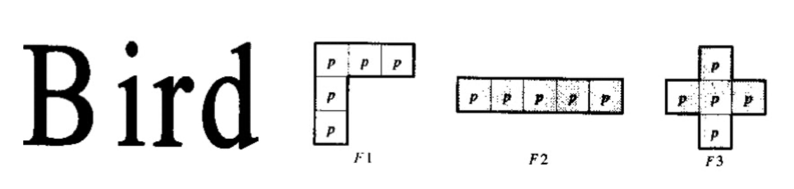
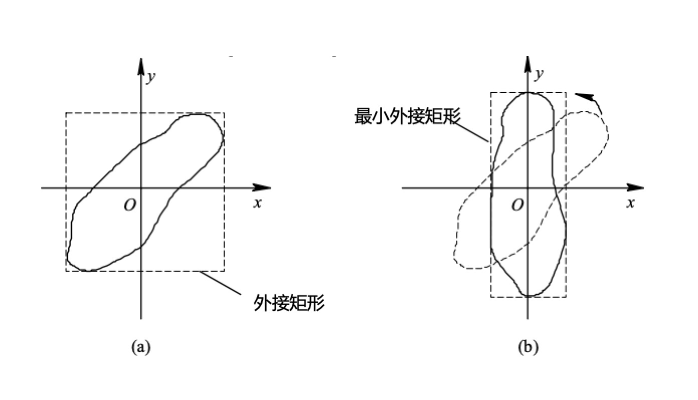
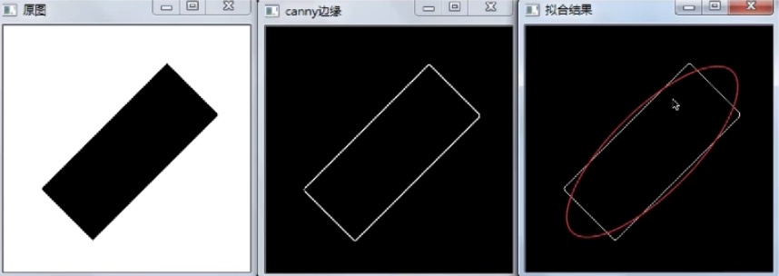
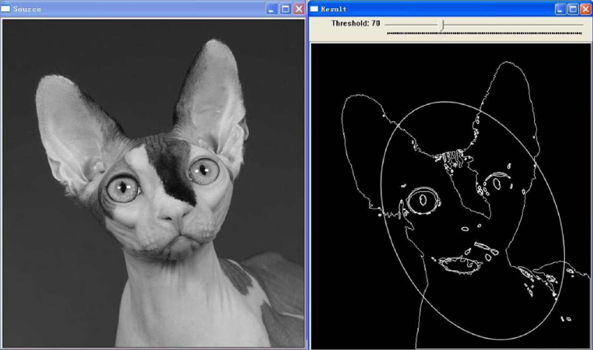
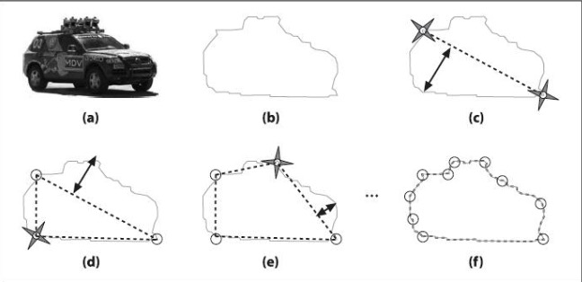
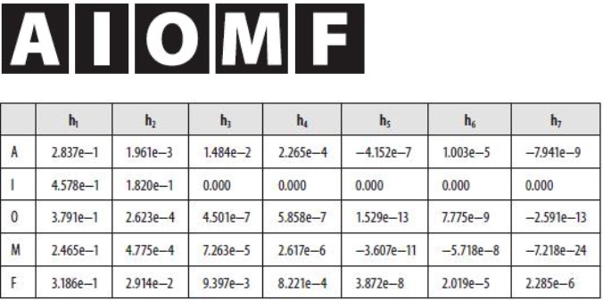

### 图像特征的简单描述

1 ） **简单描述符**

- 区域面积(A)：区域包含的像素数

- 区域重心

$$
x = \frac{1}{A} \sum_{(x,y) \in R} x
$$

$$
y = \frac{1}{A} \sum_{(x,y) \in R} y
$$

- 一个区域的重心x,y分别等于对应像素的累加除以这个区域的面积
- 区域重心可能不是整数

2 ） **形状描述符**

- 形状参数：$F= \frac{{\parallel B \parallel}^2}{4πA}$ 圆形F=1 其他F>1
    * B: 边界长度, 对于圆形的区域 B: 2πR
- 偏心率：等效椭圆宽高比
- 欧拉数：$E = C - H$
    * C是这个区域中连通子区域的数量
    * H是孔的数量
- 圆形性
    * $(x_i, y_i)$ 是这个区域边界上每个像素的坐标
    * $(\bar{x},\bar{y})$ 是这个区域的中心点x,y的坐标
    * K是区域边界所有像素的个数
    * 如果是圆形的话 $\sigma$ = 0
    * 只有它是个圆的时候，它的圆形性才趋向于无穷大, 圆形性C越小, 它越偏离圆
$$
C = \frac{\mu_R}{\sigma_R}
$$

$$
\mu = \frac{1}{K} \sum_{(x_i,y_j)\in{E(R)}} \parallel(x_i,y_i) - (\bar{x}, \bar{y})\parallel
$$

$$
\sigma = \frac{1}{K} \sum_{(x_i,y_i)\in{E(R)}} [\parallel(x_i, y_i) - (\bar{x}, \bar{y}) \parallel - \mu] ^ 2
$$

**示例**

    

- B 这个字母可以用1笔画出来C=1, 它有2个洞, 则 $E = C - H = -1$
- i 这个字母：$E = 2 - 0 = 2$
- r 这个字母：$E = 1 - 0 = 1$
- d 这个字母：$E = 1 - 1 = 0$
- 对于F1、F2、F3 这三个图边界长度 B = 5 , 面积 A = 5, 最后算出形状参数F的值都是一样的
- 但是很明显这三个区域具有不同的形状，所以不同形状的区域有着同样参数的运行结果
- 为了区分多个形状区域，使用多个简单形状描述参数的组合

### 图像特征的一般化描述

1 ） **最小包围矩形(MER)**

    

- 对于a图，这个矩形正好包围了该不规则图形，但是区域很大
- 对于b图，这个矩形最小化的包围了该不规则图形

2 ) **方向和离心率**

- $E = \sqrt{1 - \frac{a^2}{b^2}}$
- 方向：位于区域内部的最长的一条直线, 也就是这条直线的方向
- 最小包围矩形的长轴和短轴的长度分别为b和a

3 ) **椭圆拟合**

    

- 上面三个图给定一个矩形区域，通过canny算子得到结果以及对边缘进行椭圆拟合的效果
- 椭圆拟合实际上是在边缘上拟合任意一个形状，让椭圆的边缘和拟合区域的边缘方差最小

    

- 这是任意一个图像，如小喵，拟合出来的效果

4 ） **D-P算法**

    

- 这是多边形拟合的方法, 是一类特别重要的形状描述方式
- 矩形拟合和椭圆拟合由于参数较少，通常只适合简单的形状
- 这幅图是吉普车的多边形拟合
- 理论上对应原图的模拟边足够多就可以得到对应原图足够详细的形状拟合
- 从原始目标到多边形拟合结果的计算，有一种可靠的方式叫D-P算法
- 首先得到原始区域对应的轮廓(图像分割方法), 然后遍历这个轮廓(顺时针，逆时针都可以)
- 然后在轮廓的所有的像素中，任意找一点，再次遍历轮廓，然后在所有像素中找到离它最远的点
- 将这两个点连成一个虚线, 再分别在虚线的两侧找离虚线最远的两个点，这样就形成了一个拟合的四边形
- 四边形的每个边都对应一条虚线, 进一步在轮廓上寻找到每个虚线距离最远的点
- 这个过程不断重复，直到最终我们找到所有的拟合点，找到所有拟合点的标准有两种方式
- 方式1，两个拟合点足够近，表示精度满足要求
- 方式2，多边形拟合出的顶点和原始轮廓, 面积上做一个差，满足我们期望的误差要求
- D-P算法实际上是一个递归的算法

### 不变距描述

1 ） **首先定义归一化的中心距**

- 图像f(x,y)的p+q阶矩定义为：
    * 当p=q=0时，$m_{00}$就是一个区域的面积
    * 当p=0,q=1时，$m_{01}$是y方向的质心
    * 当p=1,q=0时，$m_{10}$是x方向的质心
    * 面积和质心都是$m_{pq}$特例
    * 这个公式的定义对x,y敏感

$$
m_{pq} = \sum_{(x_i,y_i) \in R} x_i^py_i^qf(x_i, y_i)
$$

- f(x,y)的p+q阶中心矩定义为：
    * 为了消除区域在不同位置对我们计算结果的影响
    * 在原公式的基础之上减掉一个质心的位置，直观来说就是把当前目标移到坐标原点
    * 其中 $\bar{x} = \frac{m_{10}}{m_{00}}, \bar{y} = \frac{m_{01}}{m_{00}}$ , 即前面定义的重心

$$
\mu_{pq} = \sum_{(x_i,y_i) \in R} (x - \bar{x})^p(y - \bar{y})^q f(x_i, y_i)
$$

- f(x,y)的归一化中心矩定义为：
    * $\eta_{pq} = \frac{\mu_{pq}}{\mu_{00}^\gamma}$
    * $\gamma = \frac{p+q}{2} + 1$
    * $p + q \geqslant 2$
    * $\mu_{00}$就是我们归一化的图像的面积
    * 除以$\mu_{00}^\gamma$就是为了消除我们目标等比例缩放对我们特征描述的影响
  
2 ） **定义不变矩**

- 常用的有七个不变矩，即对平移、旋转和尺度变化保持不变
    * 这里的尺度变化指的是`缩放`
- 这些可由归一化的二阶和三阶中心距得到
- $\phi_1 = \eta_{20} + \eta_{02}$
- $\phi_2 = (\eta_{20} - \eta_{02})^2 + 4\eta_{11}^2$
- $\phi_3 = (\eta_{30} - 3\eta_{12})^2 + (3\eta_{21} - \eta_{03})^2$
- $\phi_4 = (\eta_{30} - \eta_{12})^2 + (\eta_{21} - \eta_{03})^2$
- 进一步可以定义到7，甚至无穷
- 虽然可以定义到无穷，但是我们常用前面的7个数字，在7个不变矩中常用的也就这4个
- 所以我们常说7个不变矩，也叫做$Hu$不变矩
- 不变矩的阶次越高，对噪声越敏感，所以高阶的不变矩在实际中很难用到

**计算示例**

    

- 这里有5个字母，分别列出了它的7个不变矩
- 从这个表来看，不同字母的前4阶矩很容易区分出它具体是哪个字母，都有自己的特征
- 例如：O 这个字母 h3,h4几乎接近于0；I 字母特征是最后的h3,h4完全等于0，而它的h1,h2是在一个数量级上

### 总结

- 区域的基本特征包括面积、质心、圆形性等
- 最小包围矩形和多边形拟合能有效的描述区域形状 
- 七个不变矩特征可以有效的度量区域形状，对平移、旋转和比例放缩变换不敏感