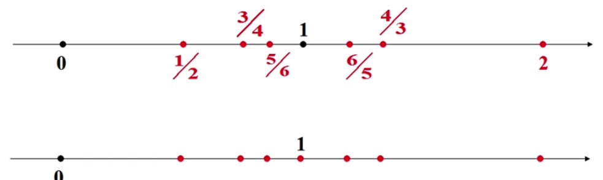
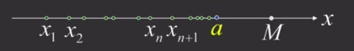
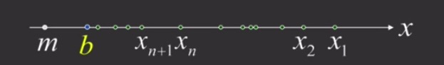

### 数列极限的定义

1 ） **中国古代极限思想**

- 庄子：'截杖说' : 一尺之棰,日取其半,万世不竭
    * 每日杖棰所余长度组成的数列 $\frac{1}{2}, \frac{1}{4}, \frac{1}{8}, ..., \frac{1}{2^n}, ...$
    * 该数列中的项随着n的增大，越来越接近0
- 刘徽：'隔圆术' ：割之弥细，所失弥少，割之又割，以至于不可割，则与圆合体，而无所失矣
    * 基本思想用内接正 $6*2^{n-1}$ 边形的面积$A_n$来近似圆的面积
    * 随着n的无限增大，多边形面积$A_n$将无限接近圆的面积

2 ） **无限接近1的案例**

- 数列 $\frac{n + (-1)^{n-1}}{n}$ 即：$2,\frac{1}{2},\frac{4}{3},\frac{3}{4},\frac{6}{5}, ..., 1 + \frac{(-1)^{n-1}}{n}, ...$

    
     
    
备注：图片托管于github，请确保网络的可访问性

     

- 数学上用"距离"来刻画与1无限接近的这个现象
- $x_n$与1的距离： $|x_n - 1| = |\frac{n+(-1)^{n+1}}{n} - 1|$ = $\frac{1}{n}$
- 可见，n越大，$|x_n - 1|$就越小，即$x_n$与1就越接近
- 给定0.01，欲使$\frac{1}{n} < 0.01$ 即 n > 100, 即从第100项往后，$x_n$与1间的距离就可以小于0.01了
- 给定0.0012，欲使$\frac{1}{n} < 0.0012$ 即 $n > \frac{10000}{12} = 833 \frac{1}{3}$, 即从第833项往后，$x_n$与1间的距离就可以小于0.0012了
- 给定$10^{-9}$，欲使$\frac{1}{n} < 10^{-9}$, 即 $n > 10^9$ 即从第$10^9$项往后的所有项与1之间的距离小于$10^{-9}$

**推理**

无论有一个多么小的正数$\varepsilon$, 总可以找到一个正整数N, 当$n > N$时，$|x_n - 1| < \varepsilon$

**数列极限的定义**

设$\{x_n\}$为一个数列. 若有常数a, 对任意给定的正数$\varepsilon$(无论它有多小), 总存在正整数N, 使当 n > N时，不等式$|x_n - a| < \varepsilon$ 恒成立，则称a是数列$\{x_n\}$的极限或称$\{x_n\}$收敛于a, 记为: $\lim_{x \to \infty} x_n = a$ 或 $x_n \rightarrow a \ \ \ (n \rightarrow \infty)$, 若这样的a不存在，则称数列$\{x_n\}$无极限或${x_n}$发散或不存在

**极限的$\varepsilon - N$语言**

- (1)$\lim_{n \to \infty} x_n = a$
- (2)$\forall \varepsilon > 0$ $\exists$ 正整数 N, 当n > N时, $|x_n - a| < \varepsilon$
- 说明：(1)、(2)两者等价，互为充要条件，$\varepsilon$是任意的，这样才能表示无限接近，N是相应于$\varepsilon$的，只要N存在，而不必找其最小值

**用定义证明数列极限的证明思路**

- 欲证 $\lim_{n \to \infty} x_n = a$ 关键找N
- 分析过程
    * 从最后的结论不等式$|x_n - a| < \varepsilon$出发
    * 解出n应大于怎样的数，对此数取整得N
    * 解不出n，必须对结论不等式进行适当的放大，使放大后的不等式能解出n
- 证明过程
    * 取定上述N, 将分析过程逆推

**例证1**

- 已知$x_n = \frac{n + (-1)^n}{n}$, 证明数列$\{x_n\}的极限为1$ 
- 证明：
    * $|x_n - 1| = |\frac{n+(-1)^n}{n}| - 1 = \frac{1}{n}$
    * $\forall \varepsilon > 0$, 欲使 $|x_n - 1| < \varepsilon$, 即 $\frac{1}{n} < \varepsilon$, 只要$n > \frac{1}{\varepsilon}$
    * 因此，取 $N = [\frac{1}{\varepsilon}]$, 则当$n > N$时，就有 $|\frac{n + (-1)^n}{n} - 1| < \varepsilon$
    * 故：$\lim_{n \to \infty} x_n = lim_{n \to \infty} \frac{n + (-1)^n}{n} = 1$

**例证2**

- 证明$\lim_{n \to \infty} \frac{cos \frac{n \pi}{2}}{n} = 0$
- 分析：
    * $|x_n - 0| = |\frac{cos \frac{n \pi}{2}}{n}|$, $\forall \varepsilon > 0$, 为使 $|x_n - 0| < \varepsilon$
    * 只需要$\frac{|cos \frac{n \pi}{2}|}{n} < \varepsilon$, n无法解出
    * 注意到 $\frac{|cos \frac{n \pi}{2}|}{n} \leq \frac{1}{n}$, 故只需要 $\frac{1}{n} < \varepsilon$, 即 $n > \frac{1}{\varepsilon}$
    * $\forall \varepsilon > 0$, 取 $N = [\frac{1}{\varepsilon}]$, 则当$n > N$时，就有 $|x_n - 0| = \frac{|cos \frac{n \pi}{2}|}{n} \leq \frac{1}{n} < \varepsilon$ 恒成立
    * 从而 $\lim_{n \to \infty} \frac{cos \frac{n \pi}{2}}{n} = 0$

**例证3**

- 证明 $\lim_{n \to \infty} \frac{(-1)^n}{(n+1)^2} = 0$
- 分析
    * $|x_n - 0| = \frac{1}{(n+1)^2}$, $\forall \varepsilon > 0$, 为使 $|x_n - 0| < \varepsilon$
    * 只需要$\frac{1}{(n+1)^2} < \varepsilon$, 即 $(n+1)^2 > \frac{1}{\varepsilon}$, 即 $n > \frac{1}{\sqrt{\varepsilon}} - 1$
    * $\forall \varepsilon > 0$ (不妨设 $\varepsilon < 1$), 取 $N = [\frac{1}{\sqrt{\varepsilon}} - 1]$
    * 则当 n > N时，就有$|\frac{(-1)^n}{(n+1)^2} - 0| < \varepsilon$, 即 $\lim_{n \to \infty} \frac{(-1)^n}{(n+1)^2} = 0$
- 另证(另一种证明方法)
    * $|x_n - 0| = \frac{1}{(n+1)^2} < \frac{1}{n+1} < \frac{1}{n}$，为使$|x_n - 0| < \varepsilon$
    * 只需要 $n > \frac{1}{\varepsilon}$, 即 $n > \frac{1}{\varepsilon}$
    * 从而取 $N = [\frac{1}{\varepsilon}]$ 即可.

### 收敛数列的性质

**定理1**：若数列$\{x_n\}$收敛，则它的极限唯一

- 证明：使用反证法, 设$x_n \to a, x_n \to b$ 且 $a < b$, 取 $\varepsilon = \frac{b - a}{w}$
- 由极限定义知，对此 $\varepsilon > 0$,
- $\exists$ 正整数 $N_1$, 当 n > $N_1$时， $|x_n - a| < \varepsilon$, 即有 $x_n < \frac{a + b}{2}$
- $\exists$ 正整数 $N_2$, 当 n > $N_2$时， $|x_n - b| < \varepsilon$, 即有 $x_n < \frac{a + b}{2}$
- 故取 $N = max\{N_1, N_2\}$, 当n > N时，有 $x_n < \frac{a+b}{2}$ 且 $x_n > \frac{a+b}{2}$ 矛盾! 从而假设不成立
- 于是由a,b的大小任意性可推知 a = b. 即：极限唯一

**定理2**：若数列$\{x_n\}$收敛，则数列$\{x_n\}$一定有界

- 证明：设$\lim_{n \to \infty} x_n = a$ 取 $\varepsilon = 1$ 则 $\exists$ 正整数 N
- 当 n > N时，有$|x_n - a| < 1$, 从而有：$|x_n| = |(x_n - a) + a| \leq |x_n - a| + |a| < 1 + |a|$
- 再取 $M = max\{|x_1|,|x_2|,...,|x_N|,1 + |a|\}$
- 则有 $|x_n| \leq M (n = 1,2,...)$. 故数列$\{x_n\}$有界
- 注：数列收敛**不等价于**数列有界，如$(-1)^{n+1}$有界但不收敛

**定理3**：(收敛数列的保号性)

- 若 $\lim_{n \to \infty} x_n = a$ 且 $a > 0$ (< 0), 则 $\exists$ 正整数 N, 当 n > N时，有 $x_n > 0$ (< 0)
- 证：只证明 a > 0的情况
- 取 $\varepsilon = \frac{a}{2}$, 则由极限定义知： $\exists$ 正整数 N
- 当 n > N时，有 $|x_n - a| < \frac{a}{2}$, 即 $\frac{a}{2} < x_n < \frac{3a}{2}$
- 因 a > 0, 故 $x_n > 0$

推论：若 $\lim_{n \to \infty} x_n = a$ 且 $\forall$ 正整数 N, 当 n > N时，$x_n \geq 0 \ \ \ (\leq 0)$, 则$a \geq 0 \ \ \ (\leq 0)$

### 极限存在的准则

**一、夹逼准则**

- (1) $y_n \leq x_n \leq z_n \ \ (n = 1,2,...)$
- (2) $lim_{n \to \infty} y_n = lim_{n \to \infty} z_n = a$
- 由(1)、(2)推出 $\lim_{n \to \infty} x_n = a$

证明

- 由条件(2), $\forall \varepsilon > 0, \exists N_1, N_2$ 
- 当$n > N_1$时，$|y_n - a| < \varepsilon$
- 当$n > N_2$时，$|z_n - a| < \varepsilon$
- 令 $N = max\{N_1, N_2\}$, 则当 n > N时，有 $a - \varepsilon < y_n < a + \varepsilon, a - \varepsilon < z_n < a + \varepsilon$
- 由条件(1) $a - \varepsilon < y_n \leq x_n \leq z_n < a + \varepsilon$
- 即：$|x_n - a| < \varepsilon$, 故 $\lim_{n \to \infty} x_n = a$

**二、单调有界数列必有极限准则**

- 由 $x_1 \leq x_2 \leq ... \leq x_n \leq x_{n+1} \leq ... \leq M$ 推 $\lim_{n \to \infty} x_n = a (\leq M)$

    
     
    
备注：图片托管于github，请确保网络的可访问性

     

- 由 $x_1 \geq x_2 \geq ... \geq x_n \geq x_{n+1} \geq ... \geq m$ 推 $\lim_{n \to \infty} x_n = b (\geq m)$

    
     
    
备注：图片托管于github，请确保网络的可访问性

     

