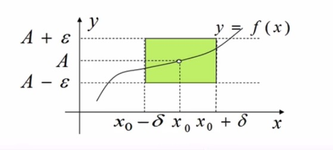
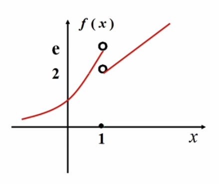
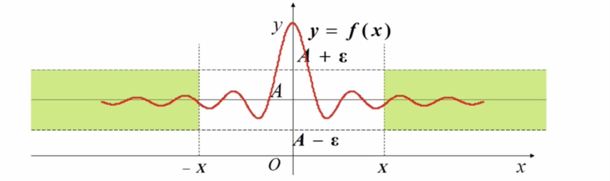
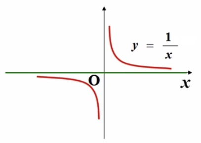
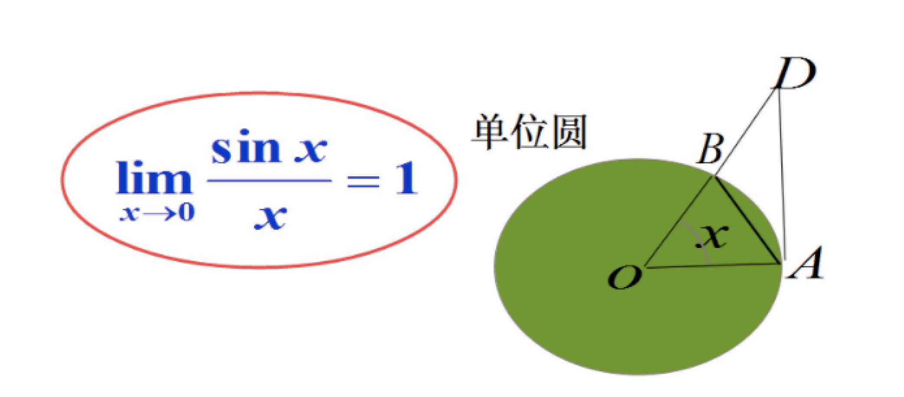
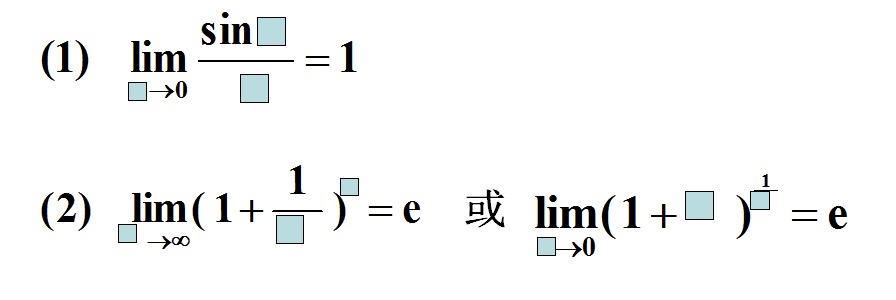

### 函数的极限

1 ）**概述**
- 自变量趋于有限值$x_0$时函数的极限
    * $x \to x_0$
    * $x \to x_0^+$
    * $x \to x_0^-$
- 自变量趋于无穷大时函数的极限
    * $x \to \infty$
    * $x \to +\infty$
    * $x \to -\infty$
- 以上是**函数f(x)自变量变化过程的六种形式**

2 ) **自变量 $x \to x_0$ 时函数的极限**

- 如何刻画 $x \to x_0$
    * $0 < |x - x_0| < \delta$
    * 即$x_0$的去心$\delta$邻域，$\delta$是个较小的正数
- 如何刻画对应函数值的变化
    * 要有对应函数值，就要先使函数在$x_0$的去心$\delta$邻域内有定义
    * 而函数在$x_0$有无定义则无要求
- 如何刻画对应的函数值无限接近于某个常数A
    * $\forall \varepsilon > 0, |f(x) - A| < \varepsilon, x \in \mathring{U}(x_0, \delta)$

3 ) **自变量 $x \to x_0$ 时函数的极限定义**

- 设函数$f(x)$在点$x_0$的某一去心邻域内有定义。
- 如果存在常数A，对任意给定的正数$\varepsilon$(无论它有多小)，总存在正数$\delta$, 使得当x满足$0 < |x - x_0| < \delta$时，
- 对应的函数值都有|$f(x) - A| < \varepsilon$, 则称A为函数f(x)当$x \to x_0$时的极限，记为：$\lim_{x \to x_0} f(x) = A$ 或 $f(x) \to A(x \to x_0)$
- $\varepsilon - \delta$ 语言描述
    * (1)、$lim_{x \to x_0} f(x) = A$ 
    * (2)、$\forall \varepsilon > 0, \ \exists \  \delta > 0$, 当 $0 < |x - x_0| < \delta$ 时 $|f(x) - A| < \varepsilon$
    * (1) $\Leftrightarrow$ (2)
- 几何解释

    
     
    
备注：图片托管于github，请确保网络的可访问性

     

**例证**

- 证明：$\lim_{x \to 1} \frac{2(x^2 - 1)}{x - 1} = 4$
- 分析：
    * $|f(x) - A| = |\frac{2(x^2 - 1)}{x - 1} - 4| = |2(x+1) - 4| = 2|x - 1| < \varepsilon$
    * $\forall \varepsilon > 0$, 取 $\varepsilon = \frac{\varepsilon}{2}$
    * 当 $0 < |x - 1| < \delta$ 时，必有 $|\frac{2(x^2 - 1)}{x - 1} - 4| < \varepsilon$
    * 因此 $\lim_{x \to 1} \frac{2(x^2 - 1)}{x - 1} = 4$

- 左极限与右极限(单侧极限)
    * 左极限
        * (1) $\lim_{x \to x_0} f(x) = A = :f(x_0^-)$
        * (2) $\forall \varepsilon > 0$, $\exists \delta > 0$, 当 $x \in (x_0 - \delta, x_0)$时，$|f(x) - A| < \varepsilon$
        * (1) $\Leftrightarrow$ (2)
    * 右极限
        * (1) $\lim_{x \to x_0^+} f(x) = A = :f(x_0^+)$
        * (2) $\forall \varepsilon > 0$, $\exists \delta > 0$, 当 $x \in (x_0, x_0 + \delta)$时，$|f(x) - A| < \varepsilon$
        * (1) $\Leftrightarrow$ (2)
    * 可见
        * (1) $\lim_{x \to x_0} f(x) = A$
        * (2) $\lim_{x \to x_0^+} f(x) = \lim_{x \to x_0^-} f(x) = A$
        * (1) $\Leftrightarrow$ (2)

**例证**

- 试证函数$f(x) = \begin{cases} e^x, \ \ \ x < 1\\ 0, \ \ \ x = 1\\ x + 1, \ \ \ x > 1 \end{cases}$, 当 $x \to 1$时, 极限不存在
    * 从下图可见
    * $\lim_{x \to 1^-} f(x) = \lim_{x \to 1^- e^x = e}$
    * $\lim_{x \to 1^+} f(x) = \lim_{x \to 1^+ (x + 1) = 2}$
    * 显然 $e \neq 2$, 从而 $\lim_{x \to 1^-} f(x) \neq \lim_{x \to 1^+} f(x)$
    * 故函数f(x)当 $x \to 1$ 时极限不存在

    
     
    
备注：图片托管于github，请确保网络的可访问性

     

4 ) **自变量 $x \to \infty$ 时函数的极限**
    
- 如何刻画$x \to \infty$?
    * $|x| > X$, 其中X是个较大的数
- 如何刻画对应函数值f(x)的变化?
    * 要有对应函数值，首先要使函数在$|x| > X$内有定义
- 如何刻画对应的函数值f(x)无限接近于某个常数A?
    * $\forall \varepsilon > 0$, 当 $|x| > X$时，$|f(x) - A| < \varepsilon$

5 ) **自变量 $x \to \infty$ 时函数的极限定义**

- 设函数f(x)在当|x|大于某一正数时有定义，如果存在常数A，对任意给定的正数$\varepsilon$(无论它有多小)，总存在正数X,
- 使得当x满足$|x| > X$时，对应的函数值都有$|f(x) - A| < \varepsilon$, 则称A为函数f(x)当$x \to \infty$时的极限
- 记为：$\lim_{x \to \infty} f(x) = A$ 或 $f(x) \to A(x \to \infty)$
- 左极限与右极限 (单侧极限)
    * $\lim_{x \to -\infty} f(x) = A \Leftrightarrow \exists \varepsilon > 0, \exists X > 0$, 当 $x < -X$时，$|f(x) - A| < \varepsilon$
    * $\lim_{x \to +\infty} f(x) = A \Leftrightarrow \exists \varepsilon > 0, \exists X > 0$, 当 $x > X$时，$|f(x) - A| < \varepsilon$
- $\varepsilon \to \infty$ 语言描述
    * (1) $\lim_{x \to \infty} f(x) = A$
    * (2) $\forall \varepsilon > 0$, 当 $\exists X > 0$, 当 $|x| > X$时，$|f(x) - A| < \varepsilon$
    * (1) $\Leftrightarrow$ (2)
- 几何解释

    
     
    
备注：图片托管于github，请确保网络的可访问性

     

**例证**

- 证明： $\lim_{x \to \infty} \frac{1}{x} = 0$
- 分析：
    * 欲使$|\frac{1}{x} - 0| = \frac{1}{|x|} < \varepsilon$ 即：$|x| > \frac{1}{\varepsilon}$
    * $\forall \varepsilon > 0$, 取 $X = \frac{1}{\varepsilon}$, 则当 $|x| > X$ 时，就有 $|\frac{1}{x} - 0| < \varepsilon$
    * 因此 $\lim_{x \to \infty} \frac{1}{x} = 0$
    * 由下图可见， y=0 为 $y = \frac{1}{x}$的水平渐近线

    
     
    
备注：图片托管于github，请确保网络的可访问性

     

### 函数极限的性质

**定理1** 函数极限唯一性

- 如果 $\lim_{x \to x_0} f(x)$ 存在，则此极限唯一

**定理2** 函数极限的局部有界性

- 若$\lim_{x \to x_0} f(x) = A$, 则存在常数 $M > 0$ 和 $\delta > 0$，使得当 $0 < |x - x_0| < \delta$ 时，有 $|f(x)| \leq M$
- 证明
    * 因 $\lim_{x \to x_0} f(x) = A$, 则 $\forall \varepsilon > 0, \exists \delta > 0$
    * 使得当$0 < |x - x_0| < \delta$时，$|f(x) - A| < \varepsilon$.
    * 特别地取 $\varepsilon = 1$, 则 $|f(x)| = |f(x) - A + A| \leq 1 + |A|$
    * 取 $M = 1 + |A|$ 即可

**定理3** 函数极限的局部保号性

- 如果$\lim_{x \to x_0} f(x) = A$, 而且 A > 0 (A < 0), 那么存在常数 $\delta > 0$，使得当 $0 < |x - x_0| < \delta$时，有 $f(x) > 0 (f(x) < 0)$
- 证明：
    * 只证 A < 0 的情况
    * 因为 $\lim_{x \to x_0} f(x) = A < 0$
    * 取 $\varepsilon = - \frac{A}{2}$, 则 $\exists \delta > 0$, 当 $0 < |x - x_0| < \delta$ 时
    * 有 $|f(x) - A| < -\frac{A}{2}$, 即 $f(x) < A - \frac{A}{2}$
    * 从而 $f(x) < \frac{A}{2} < 0$

### 两个重要极限

1 ） **第一个重要极限**

    
     
    
备注：图片托管于github，请确保网络的可访问性

     

- 证明： 
    * 当 $x \in (0, \frac{\pi}{2})$ 时，$\triangle AOB$的面积 < 圆扇形AOB的面积 < $\triangle AOD$的面积
    * 即 $\frac{1}{2} * 1 * 1 * sin x < \frac{x}{2\pi} * \pi * 1^2 < \frac{1}{2} * 1 * tan x$
    * 即 $sin x < x < tan x \ \ \ (0 < x < \frac{\pi}{2})$, 从而 $1 < \frac{x}{sin x} < \frac{1}{cos x}$
    * 显然有 $cosx < \frac{sinx}{x} < 1 \ \ (0 < |x| < \frac{\pi}{2})$
    * 又 $\lim_{x \to 0} cos x = 1$, 故 $\lim_{x \to 0} \frac{sinx}{x} = 1$

1 ） **第二个重要极限**

$\lim_{x \to \infty} (1 + \frac{1}{x})^x = e$

e = 2.718281828459045...

- 证明思路：
    * 1.首先证明数列$\{x_n\}$是单调有界数列，从而极限存在，其中 $x_n = (1+\frac{1}{n})^n$
    * 2.其次利用两边夹准则证明 $\lim_{x \to \infty} (1 + \frac{1}{x})^x = e$
    * 3.再用变量代换法证明 $\lim_{x \to -\infty} (1 + \frac{1}{x})^x = e$
    * 4.联合上面两个结论可得：$\lim_{x \to \infty} (1 + \frac{1}{x})^x = e$

- 证明：
    * 先证数列$\{x_n\}$收敛，其中$x = (1 + \frac{1}{n})^n$
        * 第一步，证明数列$\{x_n\}$是单调增加的
            * $x_n = (1 + \frac{1}{n})^n = C_n^0(\frac{1}{n})^0 + C_n^1(\frac{1}{n})^1 + C_n^2(\frac{1}{n})^2 + ... + C_n^n(\frac{1}{n})^n$
            * $= 1 + \frac{n}{1!}*\frac{1}{n} + \frac{n(n-1)}{2!}*\frac{1}{n^2} + \frac{n(n-1)(n-1)}{3!}*\frac{1}{n^3} + ... + \frac{n(n-1)(n-2)*...*2*1}{n!}*\frac{1}{n^n}$
            * $= 1 + 1 + \frac{1}{2!}(1 - \frac{1}{n}) + \frac{1}{3!}(1 - \frac{1}{n})(1 - \frac{2}{n}) + ... + \frac{1}{n!}(1 - \frac{1}{n})(1 - \frac{2}{n})*...*(1 - \frac{n-1}{n})$
            * 同理，$x_{n+1} = 1 + 1 + \frac{1}{2!}(1 - \frac{1}{n+1}) + \frac{1}{3!}(1 - \frac{1}{n+1})(1 - \frac{2}{n + 1}) + ... + \frac{1}{n!}(1 - \frac{1}{n+1})(1 - \frac{2}{n+1})*...*(1 - \frac{n-1}{n+1}) + \frac{1}{(n+1)!}(1 - \frac{1}{n+1})(1 - \frac{2}{n+1})*...*(1- \frac{n}{n+1})$
            * 可见, $x_{n+1} > x_n, \ \ \forall n \in N^+$
        * 第二步，证明数列$\{x_n\}$是有界的
            * $x_n = 1 + 1 + \frac{1}{2!}(1 - \frac{1}{n}) + \frac{1}{3!}(1 - \frac{1}{n})(1 - \frac{2}{n}) + ... + \frac{1}{n!}(1 - \frac{1}{n})(1 - \frac{2}{n})*...*(1 - \frac{n-1}{n})$
            * 从而，$x_n < 1 + 1 + \frac{1}{2!} + \frac{1}{3!} + ... + \frac{1}{n!}$
            * $< 1 + 1 + \frac{1}{2} + \frac{1}{2^2} + ... + \frac{1}{2^{n-1}}$
            * $= 1 + \frac{1*(1 - (\frac{1}{2})^n)}{1 - \frac{1}{2}}$
            * $= 1 + 2(1 - (\frac{1}{2})^n) < 3$
            * 其中我们用了不等式 $2^{n-1} \leq n!$ (数学归纳法)
            * 于是，由单调增加和有界性知数列$\{x_n\}$极限存在，记为 $\lim_{n \to \infty} (1 + \frac{1}{n})^n = e$ 
            * 上面暂且记为字母e，这里的e满足 $1 < e < 3$
        * 第三步，证明函数极限$\lim_{x \to \infty} (1 + \frac{1}{x})^x = e$
            * 一方面，当x > 1时，设 $n \leq x < n+1$
            * 则 $(1 + \frac{1}{n+1})^n < (1 + \frac{1}{x})^x < (1 + \frac{1}{n})^{n+1}$
            * $\lim_{n \to \infty} (1 + \frac{1}{n+1})^n = \lim_{n \to \infty} \frac{(1 + \frac{1}{n+1})^{n+1}}{1 + \frac{1}{n+1}} = e$
            * $\lim_{n \to \infty} (1 + \frac{1}{n})^{n+1} = \lim_{n \to \infty} [(1 + \frac{1}{n})^n(1 + \frac{1}{n})] = e$
            * $\Rightarrow \lim_{x \to +\infty} (1 + \frac{1}{x})^x = e$ (因$n \to +\infty$时， $x \to +\infty$)
            * 另一方面，当 $x \to -\infty$时，
            * 令$x = -(t+1)$, 则$t \to +\infty$, 从而有
            * $\lim_{x \to -\infty} (1 + \frac{1}{x})^x = \lim_{t \to +\infty} (1 - \frac{1}{t + 1})^{-(t+1)}$
            * $= \lim_{t \to +\infty} (\frac{t}{t+1})^{-(t+1)} = \lim_{t \to +\infty} (1+\frac{1}{t})^{t+1}$
            * $= \lim_{t \to +\infty} [(1+\frac{1}{t})^t(1 + \frac{1}{t})] = e$
            * 故：$\lim_{x \to \infty} (1 + \frac{1}{x})^x = e$ (因 $\lim_{x \to +\infty} (1 + \frac{1}{x})^x = \lim_{x \to -\infty} (1 + \frac{1}{x})^x = e$)

### 自然常数e

- 假设某种类的单细胞生物每24小时分裂一次，在不考虑死亡与编译的情况下，那么很显然这群单细胞生物的总数量每天会增加一倍，也就是增长率为：
    * $growth = (1 + 100\%) = 2$
- 假设这种细胞没过12小时，平均会产生一般的原数量的新细胞，而且新细胞在之后的12小时已经存在分裂了，那么增长率为：
    * $growth = (1 + \frac{100\%}{2})^2 = 2.25$
- 假设每过8小时分裂一次，那么增长率为：
    * $growth = (1 + \frac{100\%}{3})^3 = 2.37037...$
- 实际上，细胞的分裂是不间断的、连续的产生新细胞，而且每个新细胞都会立即和母体细胞一起进行分裂操作，那么一天24小时的分裂增长率为
    * $growth = (1 + \frac{100\%}{n})^n = 2.71828...$
- 因此，将改值称为e, 表示单位时间内，持续翻倍增长所能达到的极限值，公式为
    * $e = \lim_{n \to \infty} (1 + \frac{1}{n})^n$

### 两个很重要的极限

- $\lim_{x \to 0} \frac{sin x}{x} = 1$
- $\lim_{x \to \infty} (1 + \frac{1}{x})^x = e$
- 以上两个极限的**变式**如下图，方框中的框可以是任意表达式

    
     
    
备注：图片托管于github，请确保网络的可访问性

     

**案例1**

- 求$\lim_{x \to 0} \frac{sin 2x}{x}$
- 分析：
    * 由 $\lim_{x \to 0} \frac{sin x}{x} = 1$
    * 推出：$\lim_{x \to 0} \frac{sin 2x}{2x} = 1$ (①式)
    * 有题目变形：$\lim_{x \to 0} \frac{2*sin 2x}{2x}$ (②式)
    * 综合①、②推出：$\lim_{2x \to 0} \frac{2*sin 2x}{2x} = 2 * \lim_{2x \to 0} \frac{sin 2x}{2x} = 2 * 1 = 2$
    * 还有另一种方式是化简 $sin 2x = 2 * sin x cos x$ ，当$x \to 0, cos x \to 1$, 同解！

**案例2**

- 求$\lim_{x \to 0} \frac{tan x}{x}$
- 分析：
    * 切割化弦：$tan x = \frac{sin x}{cos x}$
    * $\lim_{x \to 0} \frac{sin x}{x cos x}$
    * 当 $x \to 0$ 时, $cos x \to 1$
    * 最终，同 $\lim_{x \to 0} \frac{sin x}{x} = 1$
    * 结果为1

**案例3**

- 求$\lim_{x \to \infty} (1 + \frac{1}{2x})^x$
- 分析：
    * 当 $x \to \infty$ 时，$2x \to \infty$
    * $\lim_{2x \to \infty} ((1 + \frac{1}{2x})^{2x})^{\frac{1}{2}}$
    * 由$\lim_{x \to \infty} (1 + \frac{1}{x})^x = e$知
    * 最终结果为 $e^{\frac{1}{2}} = \sqrt{e}$

**案例4**

- 求$\lim_{x \to \infty} (1 - \frac{1}{x})^x$
- 分析：
    * $\lim_{x \to \infty} ((1 + \frac{1}{-x})^{-x})^{-1}$
    * 当 $x \to \infty$ 时，$-x \to \infty$
    * 化简为：$\lim_{-x \to \infty} ((1 + \frac{1}{-x})^{-x})^{-1} = e^{-1} = \frac{1}{e}$