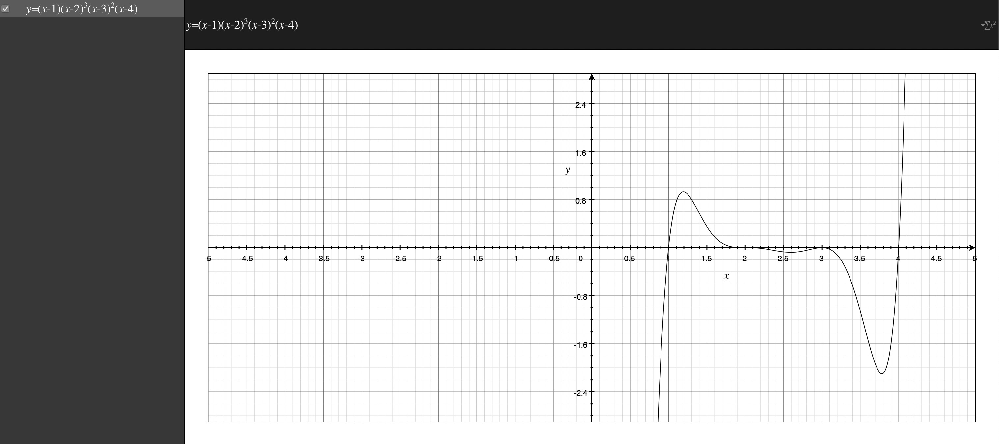
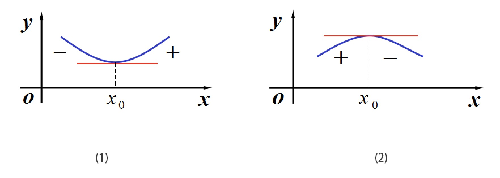
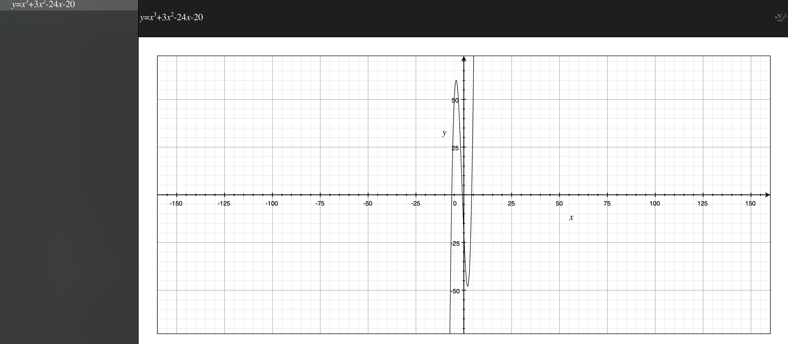
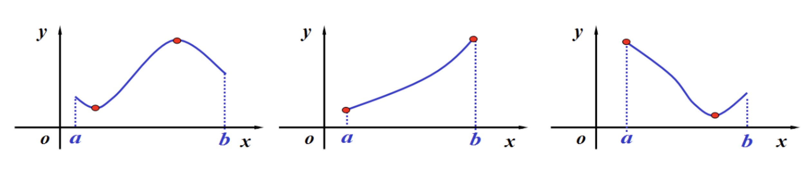
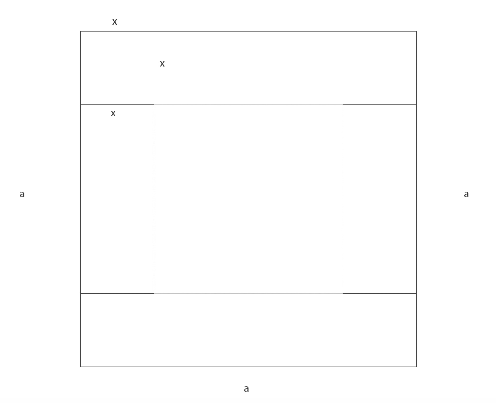
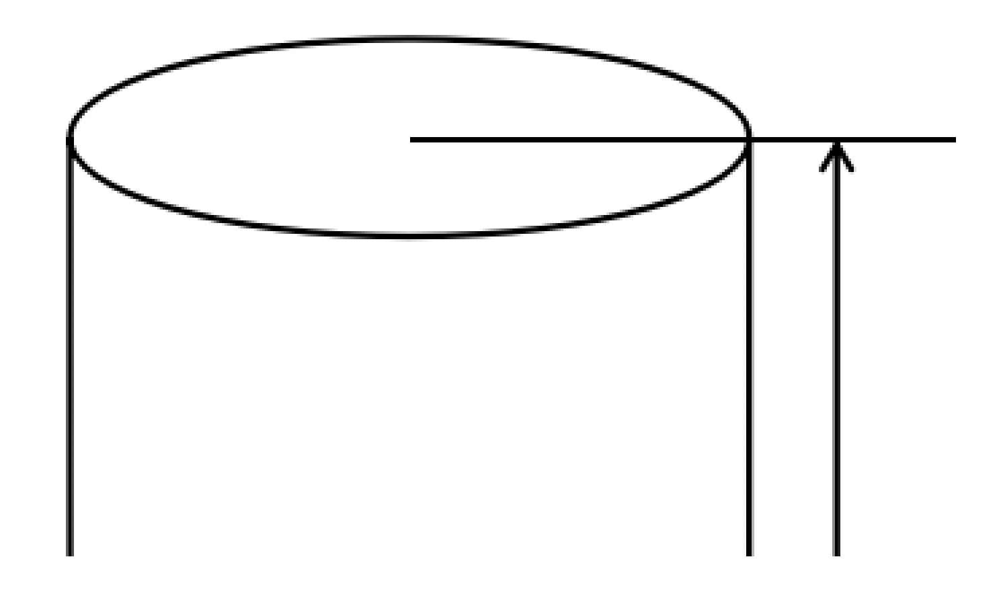

### 穿针引线法

- 又叫做穿线法或数轴穿根法
- 函数$f(x)=(x-1)(x-2)^3(x-3)^2(x-4) \ \ \ x \in R$, 求$f(x)>0$时的x范围或$f(x)<0$时的x范围
    * 易见, f(x)=0时，可知该函数的根为：1,2,3,4 , 作图的时候注意以下要点：
    * (1)从上到下，从右到左
    * (2)奇穿偶不穿
    * (3)x系数要为正(如果是负数换成正的)
    * f(x) > 0 时，1<x<2 或 x>4
    * f(x) < 0 时, x<1, 或 (2<x<4 且 $x \neq 3$)

    
     
    
备注：图片托管于github，请确保网络的可访问性

     

**例子**

- 求函数$f(x) = (2-x)(x-1)(x+1) < 0$ 的x范围
    * 将x系数变正, $f(x) = (x-2)(x-1)(x+1) > 0$
    * 同上解法即可！

### 极值存在的第二充分条件

- 设函数f(x)在它的驻点$x_0$处二阶可导,则
    * (1) 如果$f''(x_0) > 0$, 则$x_0$为极小值点
    * (2) 如果$f''(x_0) < 0$, 则$x_0$为极大值点
    * (3) 如果$f''(x_0) = 0$, 则无法判断
    * 称为"二阶导数非零法"
    * 说明
        * 此法只适用于驻点，不能用于判断不可导点
        * 当$f''(x_0) = 0$时, 失效, 如:$x^2, x^3$在$x=0$处
        * 应用面没那么广，但也是一种方法

    
     
    
备注：图片托管于github，请确保网络的可访问性

     

**例子**

- 求函数$f(x) = x^3 + 3x^2 - 24x - 20$的极值
- 分析
    * $f'(x) = 3x^2 + 6x - 24 = 3(x+4)(x-2)$
    * 令$f'(x) = 0$, 得驻点 $x_1 = -4$, $x_2 = 2$
    * $f''(x) = 6x + 6$
    * $f''(-4) = -18 < 0$ 故极大值 $f(-4) = 60$
    * $f''(2) = 18 > 0$ 故极小值 $f(2) = -48$

    
     
    
备注：图片托管于github，请确保网络的可访问性

     

### 求极值的步骤

- (1)确定函数的定义域
- (2)求导数 $f'(x)$
- (3)求定义域内部的极值可疑点(即驻点或一阶导数不存在的点)
- (4)用极值的判定第一或第二充分条件(注:第二充分条件只能判定驻点的情形)

### 函数的最大值、最小值的问题

- 极值是局部性的，而最值是全局性的
- 若函数f(x)在[a,b]上连续, 则f(x)在[a,b]上的最大值与最小值存在 (注意区间是闭区间)

    
     
    
备注：图片托管于github，请确保网络的可访问性

     

**具体求法**

- (1)求出定义域内的极值可疑点(驻点和不可导点), $x_1, ... , x_k$ 并算出函数值 $f(x_i)(i=1,2,...,k)$
- (2)求出端点的函数值$f(a),f(b)$
- (3)求出最值
    * 最大值：$M = max\{ f(x_1), ..., f(x_k), f(a), f(b) \}$
    * 最小值：$m = min\{ f(x_1), ..., f(x_k), f(a), f(b) \}$

**例子**

- 求函数 $y = 2x^3 + 3x^2 - 12x + 14 \ \ \ x \in R$ 在[-3, 4]上的最大值与最小值
- 分析
    * $f'(x) = 6x^2 + 6x - 12 = 6(x^2 + x - 2) = 6(x+2)(x-1)$
    * 令$f'(x) = 0$ 求得驻点：-2,1 无不可导点
    * f(-2) = 34, f(1) = 7, f(-3) = 23, f(4) = 142
    * 最大值是142，最小值是7

**总结**

- 如果f(x)在[a,b]上单调，则它的最值必在端点处取到
- 如果f(x)在[a,b]上连续,且在(a,b)内可导,且有唯一驻点,则若为极小值点必为最小值点,若为极大值点必为最大值点
- 进一步,若实际问题中有最大(小)值,且有唯一驻点,则不必判断极大还是极小,立即可以断定该驻点即为最大(小)值点

**例1**

- 将边长为a的正方形铁皮,四角各截去相同的小正方形,折成一个无盖方盒,问如何截,使方盒的容积最大,为多少?
- 分析
    * 折起来后形成一个正方体，其体积为底面积*高
    * $V = x(a-2x)^2 \ \ \ x \in (0, \frac{a}{2})$ 求 max {V}
    * 化简V，得 $V = 4x^3 - 4ax^2 + a^2x$
    * 对V求一阶导数 $V' = 12x^2 - 8ax + a^2 = (2x - a)(6x - a)$
    * 得到两个值，$\frac{a}{2}, \frac{a}{6}$ 因为区间限制，舍去前者，存在唯一的驻点 $\frac{a}{6}$
    * 这里唯一驻点下可以得到最大体积，如果还不放心，可以如下：
      * $V'' = 24x - 8a$, 带入$\frac{a}{6}$得，$V'' = -4a < 0$ 存在极大值, 这时的极大值就是最大值
      * 当$x=\frac{a}{6}$时，代入原式，得：$V_{max} = \frac{2}{27} a^3$

    
     
    
备注：图片托管于github，请确保网络的可访问性

     

**例2**

- 要做一个容积为V的圆柱形罐头筒,怎样设计才能使所用材料最省?
- 分析：
    * 用料最省的意思就是表面积最小，设底半径为r, 高为h
    * 由体积公式：$V = \pi r^2 h \Rightarrow h = \frac{V}{\pi r^2}$
    * 表面积为：$S = 2 \pi r^2 + 2 \pi r h = 2 \pi r^2 + \frac{2V}{r}$ 这里 r>0 得到了表面积S与底半径r之间的一个关系式子
    * 求表面积导数：$S' = 4 \pi r - \frac{2V}{r^2}$, 令 $S' = 0 \Rightarrow r = \sqrt[3]{\frac{V}{2\pi}}$ 得到唯一驻点
    * 此时可以通过此r求出最小表面积，如果不放心的话，可以求二阶导数
        * $S'' = 4 \pi + 4V \frac{1}{r^3} = 4 \pi + 4V \frac{2\pi}{V} = 12 \pi > 0$ 存在极小值，此时极小值为最小值
        * 当 $r = \sqrt[3]{\frac{V}{2\pi}}$ 时，代入原式, 得 $S_{min} = 2 \pi (\frac{V}{2 \pi})^{\frac{2}{3}} + 2 V (\frac{V}{2 \pi})^{- \frac{1}{3}}$

    
     
    
备注：图片托管于github，请确保网络的可访问性

     

