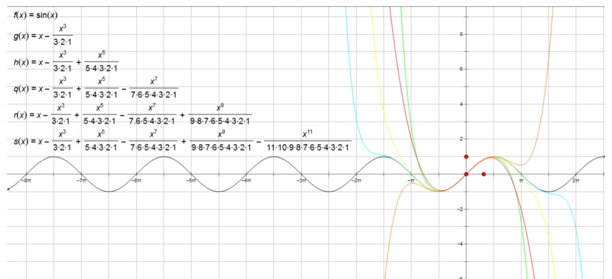
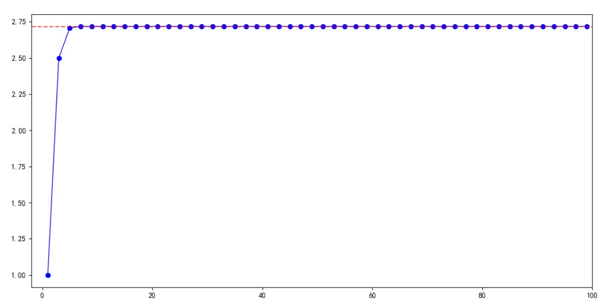

### 泰勒公式的变形

- 我们知道泰勒公式是这样的：$f(x) = \frac{f(x_0)}{0!} + \frac{f'(x_0)}{1!}(x-x_0) + \frac{f''(x_0)}{2!}(x-x_0)^2 + ... + \frac{f^{(n)(x_0)}}{n!}(x-x_0)^n + R_n(x)$
- 可以变形为：$f(x) = a_0 + a_1(x-x_0) + a_2(x-x_0)^2 + a_3(x-x_0)^3 + R_n(x)$, 其中 $a_n = \frac{f^{(n)}(x_0)}{n!}$
    * 根据上式有：
    * $f'(x) = a_1 + 2a_2(x-x_0) + 3a_3(x-x_0)^2 + ...$
    * $f''(x) = 2a_2 + 6a_3(x-x_0) + ...$
    * $f'''(x) =  6a_3 + ...$
    * ...
    * 将$x_0$带入之后，直接约去了x, 有：
    * $f'(x_0) = a_1 \Rightarrow a_1 = \frac{f'(x_0)}{1!}$
    * $f''(x_0) = 2a_2  \Rightarrow a_2 = \frac{f''(x_0)}{2!}$
    * $f'''(x_0) = 6a_3  \Rightarrow a_3 = \frac{f'''(x_0)}{3!}$
    * ...

### 泰勒公式的应用

1 ） **麦克劳林公式**

- $e^x = 1 + x + \frac{1}{2!}x^2 + ... + \frac{1}{n!}x^n + o(x^n)$
    * 这里$e^x$的n阶导数都是它本身, 无惧降维打击
    * 其次，$e^x = \sum_{n=0}^\infty \frac{x^n}{n!} \ \ x \in R$
    * 进行泰勒展开就有上式
- $sin x = x - \frac{1}{3!}x^3 + ... + \frac{(-1)^{m-1}}{(2m - 1)!} x^{2m -1} + o(x^{2m -1})$
    * $f(x) = sin x, x_0 = 0$
    * $sin'x=cosx、sin''x=-sinx、sin'''x=-cosx、sin^{(4)}x = sinx、sin^{(5)}x = cosx、sin^{(6)}x = -sin x、...$
    * $sinx=0+\frac{1}{1!}x + \frac{0}{2!} + \frac{-1}{3!}x^3 + \frac{0}{4!} + \frac{1}{5!}x^5 + \frac{0}{6!} + \frac{-1}{7!}x^7 + ...$
    * 由此推出上式
    * 另外：可以将它的n阶导数看成这样：$f^{(n)}(x) = sin (x+\frac{n\pi}{2})$
- $cos x = 1 - \frac{1}{2!}x^2 + \frac{1}{4!}x^4 - ... + \frac{(-1)^m}{(2m)!}x^{2m} + o(x^{2m})$
    * 同理$sin x$
- $ln(1+x) = x - \frac{1}{2}x^2 + \frac{1}{3}x^3 - ... + \frac{(-1)^{n-1}}{n} x^n + o(x^n)$
    * 这里是复合函数求导
    * $f(x) = ln(1+x)$
    * $f'(x) = \frac{1}{1+x}, f''(x), f'''(x), ....$
    * 同理推出上式
- $\frac{1}{1 - X} = 1 + x + x^2 + ... + x^n + o(x^n)$
- $(1+x)^m = 1 + mx + \frac{m(m-1)}{2!}x^2 + ... + \frac{m(m-1)...(m-n+1)}{n!}x^n + o(x^n)$

另外：关于$sin x = x - \frac{1}{3!}x^3 + ... + \frac{(-1)^{m-1}}{(2m - 1)!} x^{2m -1} + o(x^{2m -1})$的推导，参考下图，可见n越大，误差越小

    
     
    
备注：图片托管于github，请确保网络的可访问性

     

2 ） **计算自然常数e的近似值**

- 计算近似值$e = \lim_{x \to \infty} (1 + \frac{1}{n})^n$，并估计误差值
- 分析
    * $y = e^x \Rightarrow y' = y = e^x$
    * $e^x \approx \sum_{k=0}^n \frac{e^{x_0}}{k!} (x - x_0)^k$ 令 $x_0 = 0 \Rightarrow$
    * $e^x \approx 1 + x + \frac{x^2}{2!} + ... + \frac{x^n}{n!}$ 令 $x = 1 \Rightarrow$
    * $e \approx 1 + 1 + \frac{1}{2!} + \frac{1}{3!} + ... + \frac{1}{n!}$ 令 $x = 10 \Rightarrow$
    * $e \approx 2.7182815$
    * 余项(误差)：$\delta = |R_{10}| = \frac{1}{11!} + \frac{1}{12!} + ... = \frac{1}{11!}(1 + \frac{1}{12} + \frac{1}{12 * 13} + ...) < \frac{1}{11!} (1 + \frac{1}{12} + \frac{1}{12^2} + ...) = \frac{12}{11*11!} = 2.73 * 10^{-8}$ 微乎其微了
    * 当n逐渐变大时，参考下图

    
     
    
备注：图片托管于github，请确保网络的可访问性

     

