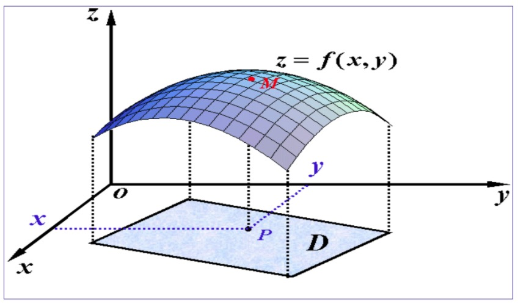
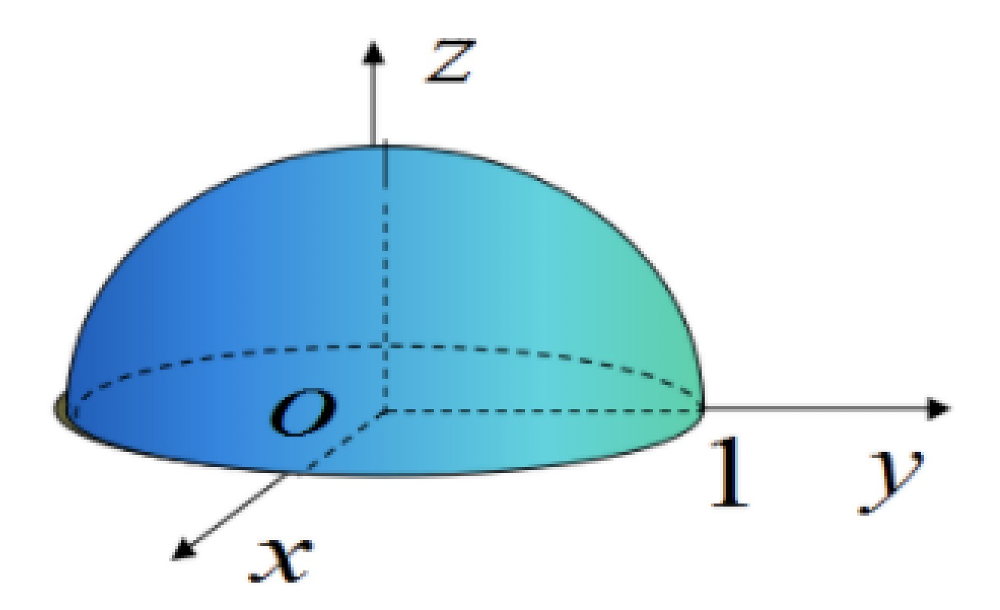
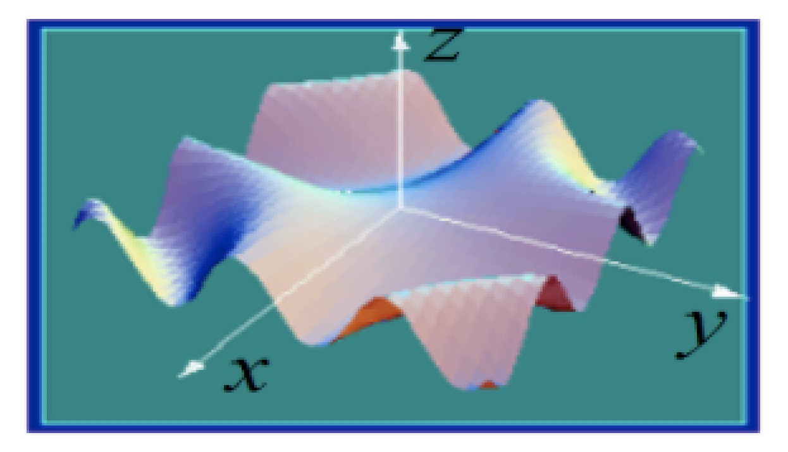

### 多元函数

1 ） **概念**

- 设D为一个非空的n 元有序数组的集合，f为某一确定的对应规则。
- 若对于每一个有序数组 ( x1,x2,…,xn)∈D，通过对应规则f，都有唯一确定的实数y与之对应，则称对应规则f为定义在D上的n元函数。
- 记为y=f(x1,x2,…,xn) 其中 ( x1,x2,…,xn)∈D。 变量x1,x2,…,xn称为自变量，y称为因变量。
- 当n=1时，为一元函数，记为y=f(x),x∈D，当n=2时，为二元函数，记为z=f(x,y),(x,y)∈D。二元及以上的函数统称为多元函数。

更好的理解，可以通过**二元函数、三元函数的定义** 作如下表述

- 设D是平面上的一个点集，如果对于每个点$P(x,y) \in D$
- 变量z按照一定的法则总有确定的值和它对应
- 则称z是变量x,y的二元函数，记为$z=f(x,y)$ (或 记为 $z=f(P)$)
- 类似地可定义三元及以上函数
- 当$n \geq 2$时, n元函数统称为多元函数
- 多元函数中同样有定义域、值域、自变量、因变量等概念

2 ） **例子**

- 圆柱体的体积：$V = \pi r^2 h, \ \ \ \{(r,h) | r > 0, h > 0\}$
- 定量理想气体的压强：$p = \frac{RT}{V} \ \ \ \{(V,T), | V > 0, T > T_0 \}$ (R为常数)
- 三角形面积的海伦公式
    * $p = \frac{a + b + c}{2}$
    * $S = \sqrt{p(p - a)(p - b)(p - c)} \ \ \ \{ (a,b,c) | a > 0, b > 0, c > 0, a + b > c \}$

### 二元函数$z=f(x,y)$的图形

- 设函数$z=f(x,y)$的定义域为D, 对于任意取定的$P(x,y) \in D$, 对应的函数值为 $z=f(x,y)$, 这样，以x为横坐标、y为纵坐标、z为竖坐标, 在这个三维空间就确定一点M(x,y,z)
- 取遍D上的一切点(x,y)时，的一个空间点集 $\{(x,y,z) | z = f(x,y), (x,y) \in D\}$, 这个点集称为二元函数的图形
- 如下图，二元函数的图形通常是一张曲面

    
     
    
备注：图片托管于github，请确保网络的可访问性

     

**例子**

- (1) 二元函数$z=\sqrt{1-x^2-y^2}$定义域为圆域 $\{ (x,y) | x^2 + y^2 \leq 1 \}$, 图形为中心在原点的**上半球面**

    
     
    
备注：图片托管于github，请确保网络的可访问性

     

- (2) $z=sin(xy), (x,y) \in R^2$ 说明：二元函数 $z=f(x,y), (x,y) \in D$的图形一般为空间曲面$\Sigma$

    
     
    
备注：图片托管于github，请确保网络的可访问性

     

- (3) 三元函数 $u=arcsin(x^2 + y^2 + z^2)$ 定义域为单位闭球体 $\{ (x,y,z), | x^2 + y^2 + z^2 \leq 1 \}$, 图形为四维空间中的超曲面

### 多元函数的极限

**一元函数的极限**

- 若$\forall \varepsilon > 0$,  $\exists \delta > 0$
- 当点 $x \in \mathring{U}(x_0, \delta)$时，$f(x) \in U(a, \varepsilon)$, 即 $|f(x) - a| < \varepsilon$
- 则称 $\lim_{x \to x_0} f(x) = a$

**多元函数的极限**

- 设二元函数$f(P)=f(x,y)$的定义域为D, $P_0(x_0, y_0)$是其聚点. 
- 如果存在常数A, $\forall \varepsilon > 0$, 总存在正数$\delta$
- 使得在$P_0$的空心$\delta$邻域内的一切点P(x,y)都成立 $|f(P) - A| = |f(x,y) - A| < \varepsilon$
- 则称常数A为函数f(x,y) 当$(x,y) \to (x_0, y_0)$ 时的极限，记为
- $\lim_{x \to x_0, y \to y_0} f(x,y) = A$ 或 $f(x,y)_{(x,y) \to (x_0, y_0)} \to A$, 也记作
- $\lim_{P \to P_0} f(P) = A$ 或 $f(P) \to A(P \to P_0)$
- 二元函数的极限也称为二重极限

**例子**

- 设$f(x,y) = (x^2 + y^2) sin \frac{1}{x^2 + y^2} \ \ \ (x^2 + y^2 \neq 0)$, 求证 $\lim_{x \to 0, y \to 0} f(x,y) = 0$
- 分析：
    * 因为 $|(x^2 + y^2) sin \frac{1}{x^2 + y^2} - 0| \leq x^2 + y^2 < \varepsilon$
    * 所以 $\forall \varepsilon > 0$, $\exists \delta = \sqrt{\varepsilon}$, 当 $0 < \rho = \sqrt{x^2 + y^2} < \delta$时，
    * 总有 $|f(x,y) - 0| \leq x^2 + y^2 < \delta^2 = \varepsilon$
    * 故：$\lim_{x \to 0, y \to 0} f(x,y) = 0$