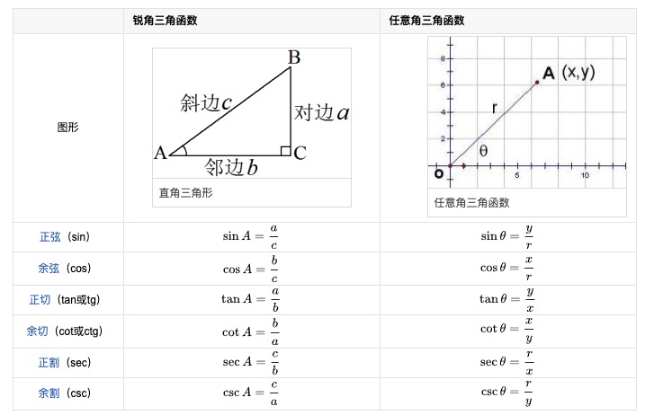
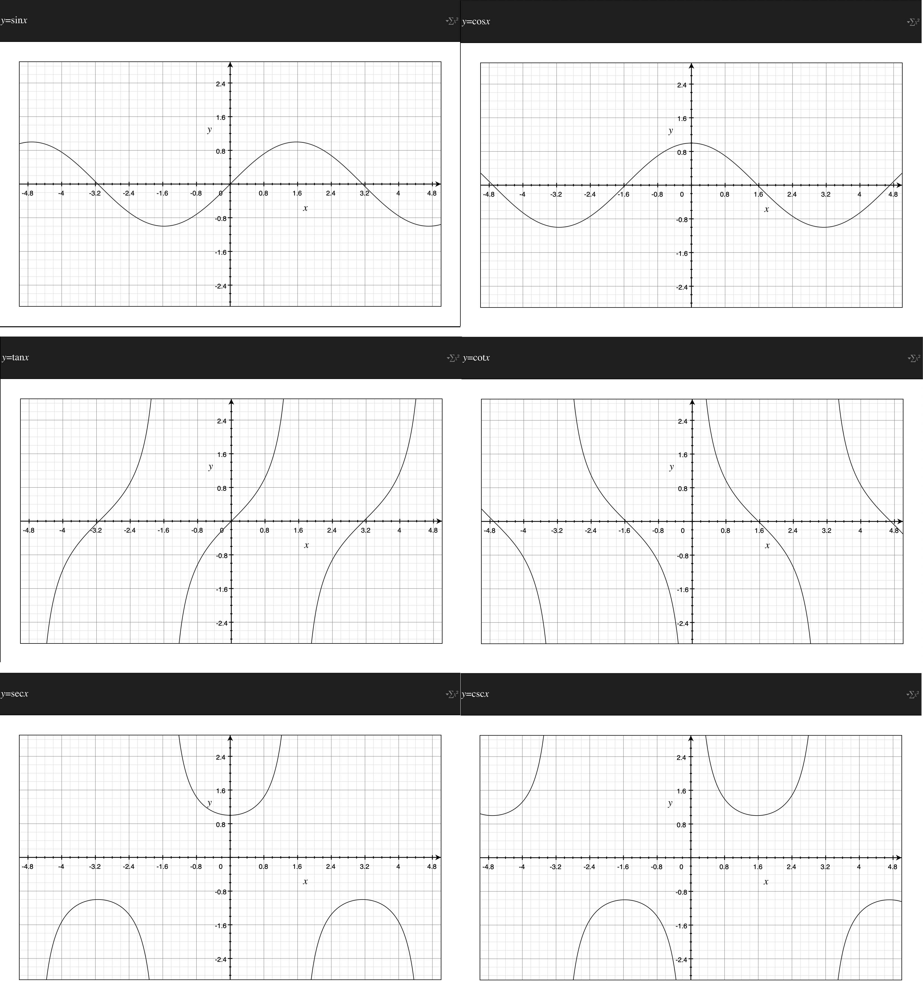

### 反函数

1 ) **概念**
- 一般地，如果x与y关于某种对应关系f(x)相对应，y = f(x)，则y = f(x)的反函数为 x = f(y) 或者 $y = f^{-1}(x)$ 后者为常用记发
- 存在反函数(默认为单值函数)的条件是原函数必须是一一对应的(不一定是整个数域内的)，这里的**一一对应**是定义域和值域的一一对应
- 注意：上标"−1"指的并不是幂, 代表反函数
- 最具有代表性的反函数就是对数函数与指数函数，再比如: $y = x^3$ 和 $y = \sqrt[3]{x}$

2 ) **性质**

- 函数f(x)与它的反函数$y = f^{-1}(x)$图象关于直线y = x对称
- 函数存在反函数的充要条件是，函数的定义域与值域是一一映射；
- 一个函数与它的反函数在相应区间上单调性一致；
- 大部分偶函数不存在反函数（当函数y = f(x)， 定义域是{0} 且 f(x) = C （其中C是常数），则函数f(x)是偶函数且有反函数，其反函数的定义域是{C}，值域为{0} ）。
- 奇函数不一定存在反函数，被与y轴垂直的直线截时能过2个及以上点即没有反函数。若一个奇函数存在反函数，则它的反函数也是奇函数。
- 备注：奇函数关于原点对称，偶函数关于y轴对称
- 一段连续的函数的单调性在对应区间内具有一致性
- 严增（减）的函数一定有严格增（减）的反函数
- 反函数是相互的且具有唯一性
- 定义域、值域相反对应法则互逆（三反）

### 六个基本初等函数

1 ) **分类**

- 基本初等函数包括**幂函数**、**指数函数**、**对数函数**、**三角函数**、**反三角函数**和**常数函数**

2 ） **幂函数**

- 一般地, 形如$y=x^a$(a为有理数)的函数，即以底数为自变量，幂为因变量，指数为常数的函数称为幂函数
- 其中，a可为任何常数，但中学阶段仅研究a为有理数的情形
- a为无理数时取其近似的有理数, 例如函数 $y = x^0 、y = x^1、y = x^2、y = x^{-1}$
- 注：$y=x^{-1} = \frac{1}{x}$ ; $y=x^0$时, x≠0 等都是幂函数

3 ） **指数函数**

- 一般地，函数$y=a^x$(a为常数且以a>0，a≠1)叫做指数函数，函数的定义域是R。对于一切指数函数来讲，值域为(0， +∞)。
- 即：$y = a^x \ \ (a > 0 且 a \neq 1) \ \  x \in R \ \ \  y \in (0, +\infty)$
- 指数函数中, 前面的系数为1。 如 : $y=10^x 、 y=\pi^x$ 都是指数函数； 而 $y = 2*3^x$ 不是指数函数

**指数函数的4个运算法则**

- $a^{m+n} = a^m * a^n$
- $a^{mn} = (a^m)^n$
- $a^{\frac{1}{n}} = \sqrt[n]{a}$
- $a^{m-n} = \frac{a^m}{a^n}$

4 ） **对数函数**

- 对数函数是指数函数的反函数
- $y = log_a x$ ，$x \in (0, + \infty)$, $y \in R$，其中a为底数，a > 0 且 a ≠ 1，等价于 $a^y = x$
- 当 a > 1时，递增；当 0 < a < 1时，递减

**常用对数运算**

- $log_a {MN} = log_a M + log_a N$

- $log_a {\frac{M}{N}} = log_a M - log_a N$

- $log_a a^b = b$

- $a^{log_a N} = N$

- $log_10 b = lg b$

- $log_e b = ln b$

- $log_a b = \frac{log_c b}{log_c a}$ 换底公式

- $log_{a^n} b^m = \frac{m}{n} log_a b$ 指系公式

- $log_a b = \frac{ln b}{ln a} = \frac{1}{\frac{ln a}{ln b}} = \frac{1}{log_b a}$ 倒数公式

- $log_a b * log_c d = \frac{ln b}{ln d} * \frac{ln d}{ln c} = \frac{ln b}{ln c} = log_c b$ 链式公式

5 ） **三角函数**

- 三角函数是基本初等函数之一
- 是以角度（数学上最常用弧度制，下同）为自变量，角度对应任意角终边与单位圆交点坐标或其比值为因变量的函数。
- 也可以等价地用与单位圆有关的各种线段的长度来定义。三角函数在研究三角形和圆等几何形状的性质时有重要作用，也是研究周期性现象的基础数学工具。
- 在数学分析中，三角函数也被定义为无穷级数或特定微分方程的解，允许它们的取值扩展到任意实数值，甚至是复数值。
- 常见的三角函数包括正弦函数、余弦函数和正切函数。
- 在航海学、测绘学、工程学等其他学科中，还会用到如余切函数、正割函数、余割函数、正矢函数、余矢函数、半正矢函数、半余矢函数等其他的三角函数。
- 不同的三角函数之间的关系可以通过几何直观或者计算得出，称为三角恒等式。
- 在直角三角形ABC中，角A为90度，设角B为$\theta$, 边BC记为a, 边AC记为b, 边AB记为c 
- 勾股定理：直角三角形中 $a^2 = b^2 + c^2$
- $sin \theta = \frac{b}{a} < 1$ 正弦函数
- $cos \theta = \frac{c}{a} < 1$ 余弦函数
- $tan \theta = \frac{b}{c}$ 正切函数
- $cot \theta = \frac{c}{b}$ 余切函数
- $sec \theta = \frac{a}{c}$ 正割函数
- $csc \theta = \frac{a}{b}$ 余割函数
- 一般我们可以将三角形放入直角坐标系中来处理

    
     
    
备注：图片托管于github，请确保网络的可访问性

     

上图和我们的假设条件不一致，仅作为参考

以下为六种函数图像，均为周期函数，只展示一部分, 画图软件为Mac平台的Grapher

    
     
    
备注：图片托管于github，请确保网络的可访问性

     

相关公式非常之多，不再这里赘述

6 ） **反三角函数**

- 反三角函数是一种基本初等函数。
- 它是反正弦arcsin x，反余弦arccos x，反正切arctan x，反余切arccot x，反正割arcsec x，反余割arccsc x这些函数的统称
- 各自表示其反正弦、反余弦、反正切、反余切 ，反正割，反余割为x的角。
- 三角函数的反函数是个多值函数，因为它并不满足一个自变量对应一个函数值的要求，其图像与其原函数关于函数 y=x 对称。
- 欧拉提出反三角函数的概念，并且首先使用了“arc+函数名”的形式表示反三角函数。
- 如果一个三角函数是：$y = sin x$, 则其反三角函数为：$y = arc sin x$ 因为不同的x可以对应同一个y值，属于多对一的现象，原则上是不存在反函数的
- 我们在研究三角函数的反函数的时候可以设定一个区间，如[-π/2, π/2], 单调递增是有反函数的，值域范围在 [-1, 1]，即：y = sinx,  $x \in [-\frac{\pi}{2}, \frac{\pi}{2}]$ $y \in [-1, 1]$ 单调递增
- 则其反函数：y = arcsinx, $x \in [-1, 1]$, $y \in [-\frac{\pi}{2}, \frac{\pi}{2}]$

7 ） **常数函数**

- 在数学中，常数函数（也称常值函数）是指值不发生改变（即是常数）的函数。
- 例如：y = 5
- 常数函数都是偶函数