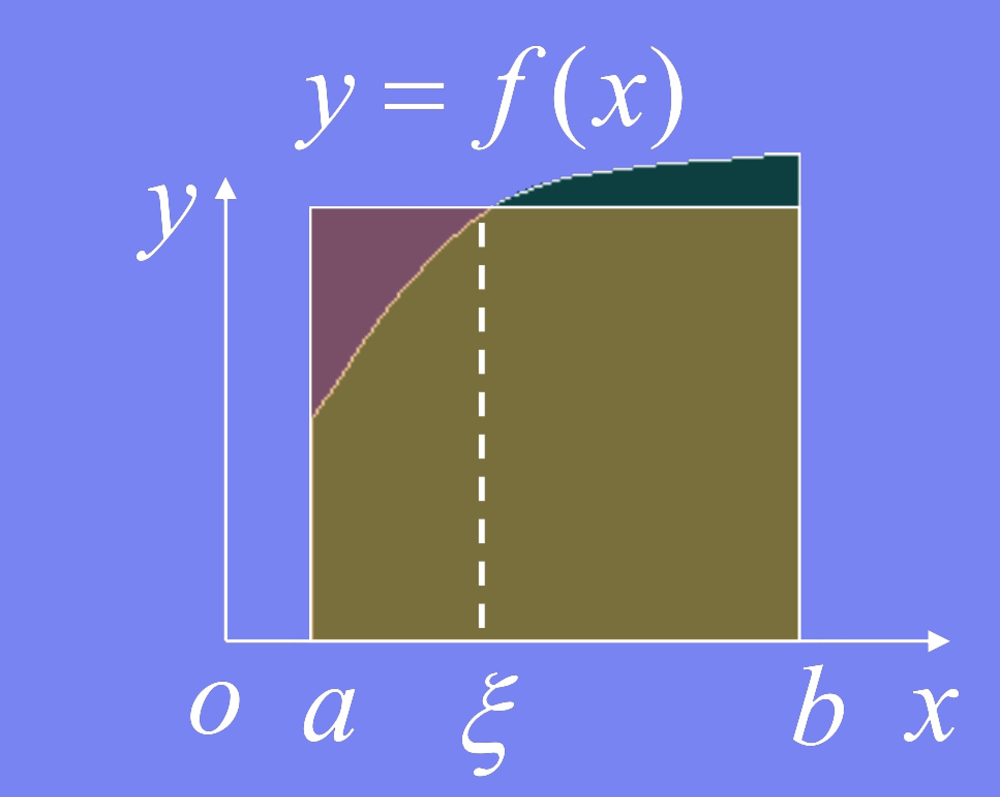
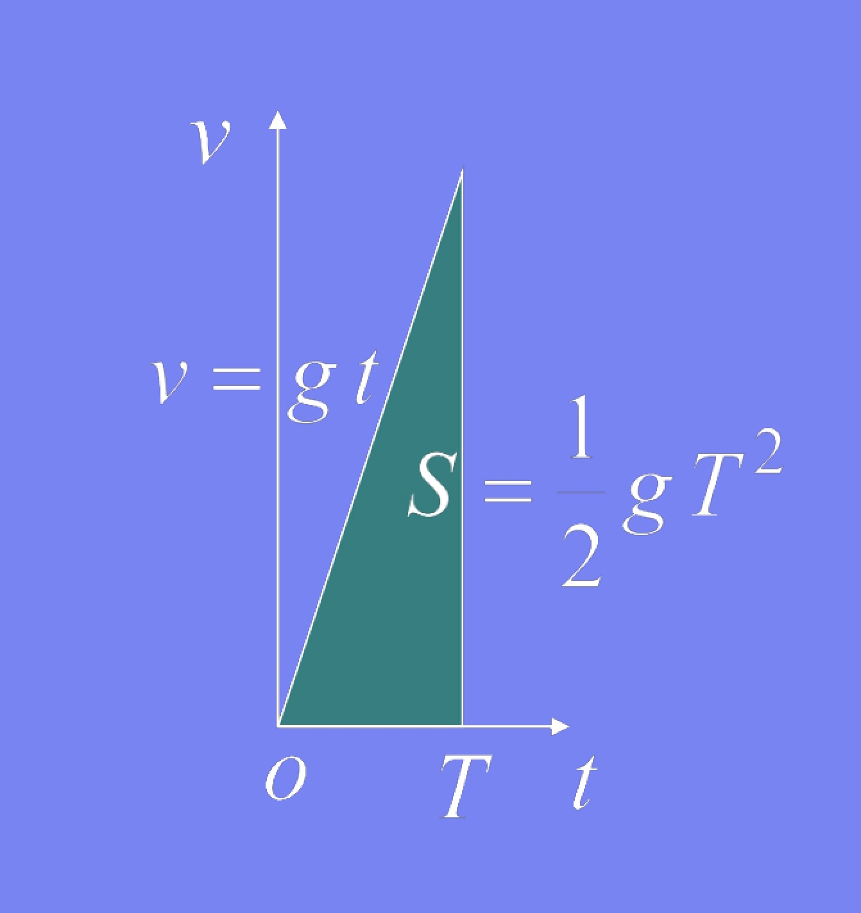

### 定积分的性质

设所列定积分都存在
(1) $\int_a^b f(x) dx = - \int_b^a f(x) dx \Rightarrow \int_a^a f(x)dx = 0$

(2) $\int_a^b dx = b - a$

(3) $\int_a^b k f(x) dx = k \int_a^b f(x) dx$ (k为常数)

(4) $\int_a^b [f(x) \pm g(x)]dx = \int_a^b f(x) dx \pm \int_a^b g(x)dx$

- 证明：左边 = $\lim_{\lambda \to 0} \sum_{i=1}^n [f(\xi_i) \pm g(\xi_i)] \triangle x_i = \lim_{\lambda \to 0} \sum_{i=1}^n f(\xi_i) \triangle x_i \pm \lim_{\lambda \to 0} \sum_{i=1}^n g(\xi_i) \triangle x_i =$ 右边

(5) $\int_a^b f(x)dx = \int_a^c f(x)dx + \int_c^b f(x) dx$

    
     
    
备注：图片托管于github，请确保网络的可访问性

     

- 证明：当a < c < b 时，因f(x)在[a,b]上可积，所以在分割区间时，可以永远取c为分点
- 于是 $\sum_{[a,b]} f(\xi_i) \triangle x_i = \sum_{[a,c]} f(\xi_i) \triangle x_i + \sum_{[c,b]} f(\xi_i) \triangle x_i$
- 令 $\lambda \to 0 \Rightarrow \int_a^b f(x)dx = \int_a^c f(x)dx + \int_c^b f(x) dx$
- 当a,b,c的相对位置任意时，例如：a < b < c, 则有

    
     
    
备注：图片托管于github，请确保网络的可访问性

     

- 因为, $\int_a^c f(x) dx = \int_a^b f(x)dx + \int_b^c f(x)dx$
- 所以, $\int_a^b f(x)dx = \int_a^c f(x)dx - \int_b^c f(x)dx = \int_a^c f(x)dx + \int_c^b f(x)dx$

(6) 若在[a,b]上$f(x) \geq 0, 则 \int_a^b f(x) dx \geq 0$

- 证明：因为 $\sum_{i=1}^n f(\xi_i) \triangle x_i \geq 0$
- 所以, $\int_a^b f(x) dx = \lim_{\lambda \to 0} \sum_{i=1}^n f(\xi_i) \triangle x_i \geq 0$
- 推论1: 若在[a,b]上 $f(x) \leq g(x)$, 则 $\int_a^b f(x) dx \leq \int_a^b g(x)dx$
- 推论2: $|\int_a^b f(x)dx| \leq \int_a^b |f(x)|dx \ \ \ (a < b)$
    * 证明：因为 $-|f(x)| \leq f(x) \leq |f(x)|$
    * 所以, $- \int_a^b |f(x)| dx \leq \int_a^b f(x) dx \leq \int_a^b |f(x)| dx$
    * 即：$|\int_a^b f(x) dx| \leq \int_a^b |f(x)|dx$

(7) 设$M = max_{[a,b]} f(x), m = min_{[a,b]} f(x)$, 则 $m(b-a) \leq \int_a^b f(x) dx \leq M(b-a) \ \ \ (a < b)$

- 例：试证 $1 \leq \int_0^{\frac{\pi}{2}} \frac{sinx}{x} dx \leq \frac{\pi}{2}$
    * 证明：设$f(x) = \frac{sin x}{x}$, 则在$(0, \frac{\pi}{2})$上，有
    * $f'(x) = \frac{xcosx - sinx}{x^2} = \frac{cos x}{x^2} (x-tanx) < 0$
    * 所以, $f(\frac{\pi}{2}^-) < f(x) < f(0^+)$
    * 即：$\frac{2}{\pi} < f(x) < 1, x \in (0, \frac{\pi}{2})$
    * 故：$\int_0^{\frac{\pi}{2}} \frac{2}{\pi} dx \leq \int_0^{\frac{\pi}{2}} f(x)dx \leq \int_0^{\frac{\pi}{2}} 1 dx$
    * 即：$1 \leq \int_0^{\frac{\pi}{2}} \frac{sin x}{x} dx \leq \frac{\pi}{2}$

(8) 积分中值定理

- 若$f(x) \in C[a,b]$, 则至少存在一点 $\xi \in [a,b]$, 使$\int_a^b f(x) dx = f(\xi)(b - a)$
- 证明
    * 设f(x)在[a,b]上的最小值与最大值分别为m,M, 则由性质7可得 $m \leq \frac{1}{b-a} \int_a^b f(x)dx \leq M$
    * 根据闭区间上连续函数介值定理，在[a,b]上至少存在一点$\xi \in [a,b]$, 使得 $f(\xi) = \frac{1}{b - a} \int_a^b f(x)dx$
    * 因此定理成立
- 说明
    * 积分中值定理对 a < b 或 a > b都成立
    * 可把$\frac{\int_a^b f(x)dx}{b-a} = f(\xi)$ 理解为f(x)在[a,b]上的平均值.
    * 因$\frac{\int_a^b f(x)dx}{b-a} = \frac{1}{b-a} \lim_{n \to \infty} \sum_{i=1}^n f(\xi_i) \frac{b-a}{n} = \lim_{n \to \infty} \frac{1}{n} \sum_{i=1}^n f(\xi_i)$
    * 故它是有限个数的平均值概念的推广

    
     
    
备注：图片托管于github，请确保网络的可访问性

     

- 例：计算从0秒到T秒这段时间内自由落体的平均速度
- 分析
    * 已知自由落体速度为：$v=gt$ , 故所求平均速度为：
    * $\bar{v} = \frac{1}{T-0} \int_0^T gt dt = \frac{1}{T} · \frac{1}{2} gT^2 = \frac{gT}{2}$

    
     
    
备注：图片托管于github，请确保网络的可访问性

     

