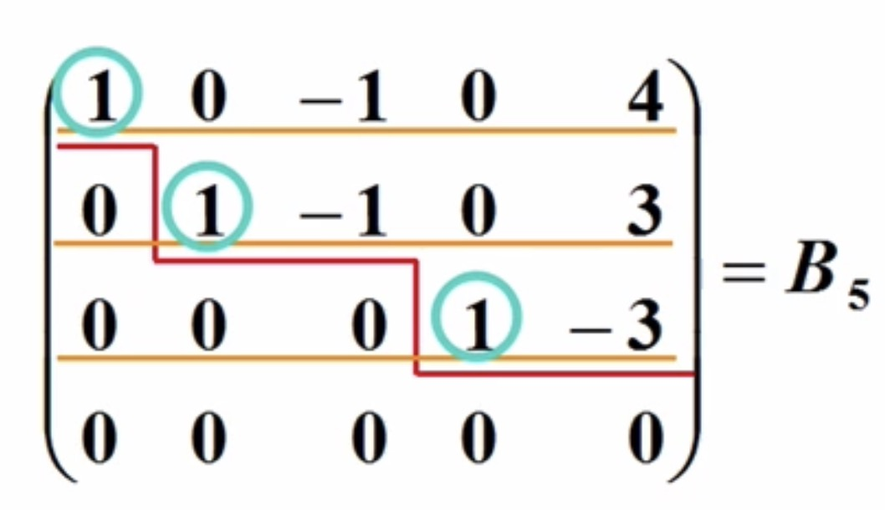
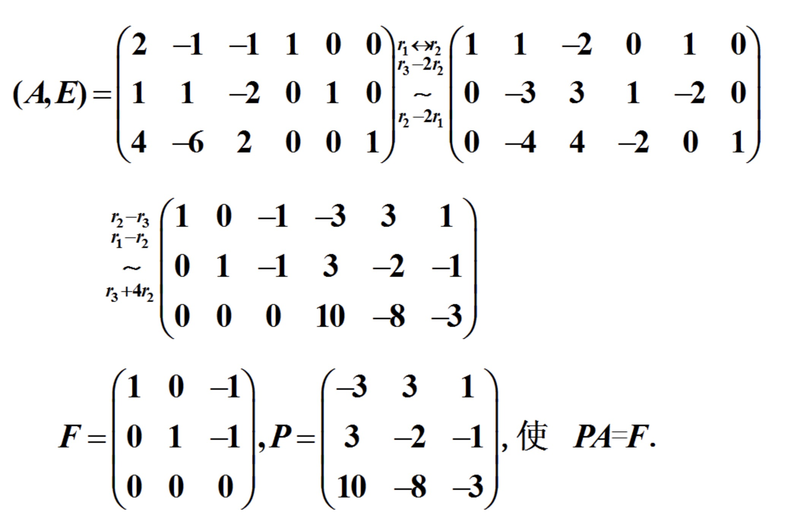
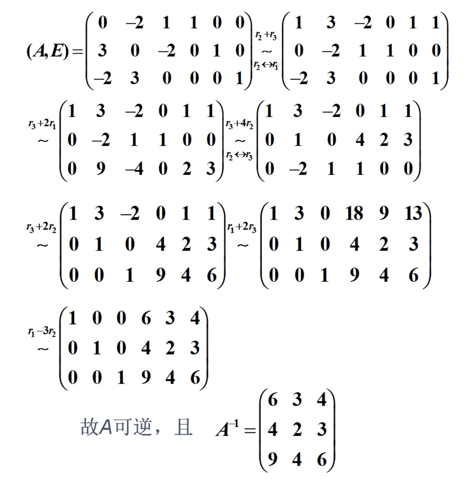

### 概述

- 用伴随矩阵和行列式求可逆矩阵非常复杂麻烦，尤其是随着n的增大，复杂度让人担忧
- 应对n这个变量，可以使用矩阵的初等变换来求解矩阵的可逆矩阵

### 矩阵的初等变换

1） **消元法解线性方程组**

- 先来看下这个例子，从$x_1 \sim x_4$ 和 4个方程，求解线性方程组
- 有这样一个方程组
    * $\left \{\begin{array}{cccc}2x_1 - x_2 - x_3 + x_4 = 2 & ① \\x_1 + x_2 - 2x_3 + x_4 = 4 & ② \\4x_1 - 6x_2 + 2x_3 - 2x_4 = 4 & ③ \\3x_1 + 6x_2 - 9x_3 + 7x_4 = 9 & ④ \end{array} \right.$
- 将①、②式互换位置，③式除以2得
    * $\left \{\begin{array}{cccc}x_1 + x_2 - 2x_3 + x_4 = 4 & ① \\2x_1 - x_2 - x_3 + x_4 = 2 & ② \\2x_1 - 3x_2 + x_3 - x_4 = 4 & ③ \\3x_1 + 6x_2 - 9x_3 + 7x_4 = 9 & ④ \end{array} \right.$
- 再进行 ② - ③、③ - 2①、④ - 3① 运算
    * $\left \{\begin{array}{cccc}x_1 + x_2 - 2x_3 + x_4 = 4 & ① \\2x_2 - 2x_3 + 2x_4 = 0 & ② \\-5x_2 + 5x_3 - 3x_4 = -6 & ③ \\3x_2 - 3x_3 + 4x_4 = -3 & ④ \end{array} \right.$
- 进而 ② × $\frac{1}{2}$、③ + 5②、④ - 3②
    * $\left \{\begin{array}{cccc}x_1 + x_2 - 2x_3 + x_4 = 4 & ① \\x_2 - x_3 + x_4 = 0 & ② \\2x_4 = -6 & ③ \\x_4 = -3 & ④ \end{array} \right.$
- 然后 ③、④互换位置，④ - 2③ 运算
    * $\left \{\begin{array}{cccc}x_1 + x_2 - 2x_3 + x_4 = 4 & ① \\x_2 - x_3 + x_4 = 0 & ② \\x_4 = -3 & ③ \\0 = 0 & ④ \end{array} \right.$
- 最后通过回代的方式求出相关解
    * $\left \{\begin{array}{cccc}x_1 = x_3 + 4 \\ x_2 = x_3 + 3 \\ x_4 = -3\end{array} \right \}$
    * 其中$x_3$为任意取值
    * 或令$x_3 = c$, 方程组的解可记为：
    * $x = \left (\begin{array}{cccc}x_1 \\x_2 \\x_3 \\x_4\end{array} \right ) =\left (\begin{array}{cccc}c + 4 \\c + 3 \\c \\-3\end{array} \right )$
    * 即：$x = c \left (\begin{array}{cccc}1 \\1 \\1 \\0\end{array} \right ) +\left (\begin{array}{cccc}4 \\3 \\0 \\-3\end{array} \right )$
    * 其中c为任意常数
- 简单总结一下
    * 上述阶方程组的方法称为消元法
    * 始终把方程组看成一个整体变形，用到如下三种变换
        * 交换两个方程次序
        * 以不等于0的数乘某个方程
        * 一个方程的k倍加到另一个方程上
    * 上述三种变换都是可逆的，所以变换前的方程组与变换后的方程组是同解的
    * 故这三种变换是同解变换

2 ) **从求解多元方程组到增广矩阵**

- 因为在上述变换过程中，仅对方程组系数与常数进行运算，未知量并未参与运算
- 原方程组：$\left \{\begin{array}{cccc}2x_1 - x_2 - x_3 + x_4 = 2 \\x_1 + x_2 - 2x_3 + x_4 = 4 \\ 4x_1 - 6x_2 + 2x_3 - 2x_4 = 4 \\3x_1 + 6x_2 - 9x_3 + 7x_4 = 9 \end{array} \right.$
- 若记：$B = (A,b) =\left (\begin{array}{cccc}2 & -1 & -1 & 1 & 2 \\1 & 1 & -2 & 1 & 4 \\4 & -6 & 2 & -2 & 4 \\3 & 6 & -9 & 7 & 9 \\\end{array} \right )$
- 则对方程组的变换完全可以转换为对矩阵B的变换，B称为原方程组的**增广矩阵**

3 ) **矩阵初等变换的定义**

- **矩阵的初等行变换**
    * 下面三种变换称为矩阵的初等行变换
    * (1) 对调两行(对调i,j两行，记为：$r_i \leftrightarrow r_j$)
    * (2) 以数$k \neq 0$ 乘以某一行的所有元素，第i行乘k,记为$r_i × k$
    * (3) 把某一行所有元素的k倍加到另一行对应的元素上去(第 j 行的 k 倍加到第 i 行上，记为：$r_i + k r_j$)
- 同理，可定义矩阵的**初等列变换**(所有记号是把 r 换成 c)
- 矩阵的初等列变换和初等行变换统称为**初等变换**
- 初等变换的逆变换仍为初等变换，且变换类型相同
    * $r_i \leftrightarrow r_j$ 逆变换 $r_j \leftrightarrow r_i$
    * $r_i × k$ 逆变换 $r_i × (\frac{1}{k})$ 或 $r_i \div k$
    * $r_i + k r_j$ 逆变换 $r_i + (-k) r_j$ 或 $r_i - k r_j$
- 如果 矩阵A 经有限次初等变换变成 矩阵B，就称矩阵A与B等价，记为：$A \sim B$
- 等价关系的性质
    * (1) 自反性：$A \sim A$
    * (2) 对称性：若$A \sim B$, 则 $B \sim A$
    * (3) 传递性：若$A \sim B$, 且 $B \sim C$, 则 $A \sim C$
    * 具有上述三条性质的关系称为等价
- 对于线性方程组也一样：如果两个线性方程组同解，那么这两个线性方程组等价

4 ） **用矩阵的初等行变换解方程组**

- 方程组：$\left \{\begin{array}{cccc}2x_1 - x_2 - x_3 + x_4 = 2 \\x_1 + x_2 - 2x_3 + x_4 = 4 \\ 4x_1 - 6x_2 + 2x_3 - 2x_4 = 4 \\3x_1 + 6x_2 - 9x_3 + 7x_4 = 9 \end{array} \right.$
- 转化为矩阵：$B =\left (\begin{array}{cccc}2 & -1 & -1 & 1 & 2 \\1 & 1 & -2 & 1 & 4 \\4 & -6 & 2 & -2 & 4 \\3 & 6 & -9 & 7 & 9 \\\end{array} \right )$
- 经过$r_i \leftrightarrow r_2, r_3 \div 2$ 得到变形
    * $B_1 = \left (\begin{array}{cccc}1 & 1 & -2 & 1 & 4 \\2 & -1 & -1 & 1 & 2 \\2 & -3 & 1 & -1 & 2 \\3 & 6 & -9 & 7 & 9\end{array} \right )$
- 经过$r_2 - r_3, r_3 - 2r_1, r_4 - 3r_1$ 继续变形
    * $B_2 = \left (\begin{array}{cccc}1 & 1 & -2 & 1 & 4 \\0 & 2 & -2 & 2 & 0 \\0 & -5 & 5 & -3 & -6 \\0 & 3 & -3 & 4 & -3\end{array} \right )$
- 经过$r_2 \div 2, r_3 + 5 r_2, r_4 - 3r_2$ 继续变形
    * $B_3 = \left (\begin{array}{cccc}1 & 1 & -2 & 1 & 4 \\0 & 1 & -1 & 1 & 0 \\0 & 0 & 0 & 2 & -6 \\0 & 0 & 0 & 1 & -3\end{array} \right )$
- 经过$r_3 \leftrightarrow r_4, r_4 - 2r_3$ 继续变形
    * $B_4 = \left (\begin{array}{cccc}1 & 1 & -2 & 1 & 4 \\0 & 1 & -1 & 1 & 0 \\0 & 0 & 0 & 1 & -3 \\0 & 0 & 0 & 0 & 0\end{array} \right )$
- 经过$r_1 - r_2, r_2 - r_3$ 继续变形
    * $B_5 = \left (\begin{array}{cccc}1 & 0 & -1 & 0 & 4 \\0 & 1 & -1 & 0 & 3 \\0 & 0 & 0 & 1 & -3 \\0 & 0 & 0 & 0 & 0\end{array} \right )$
- $B_5$ 对应的方程组为
    * $\left \{ \begin{array}{cccc}x_1 = x_3 + 4 \\x_2 = x_3 + 3 \\x_4 = -3\end{array} \right.$
    * 或令$x_3 = c$，方程组的解可记为：
    * $x = \left (\begin{array}{cccc}x_1 \\ x_2 \\ x_3 \\ x_4 \end{array} \right ) =\left (\begin{array}{cccc}c + 4 \\ c + 3 \\ c \\ -3 \end{array} \right ) =c \left (\begin{array}{cccc}1 \\ 1 \\ 1 \\ 0\end{array} \right ) +\left (\begin{array}{cccc}4 \\ 3 \\ 0 \\ -3 \end{array} \right )$
    * 其中c为任意常数
- 矩阵$B_4, B_5$都称为行阶梯型矩阵
    * 特点:
      * (1) 可画出一条阶梯线, 线的下方全为零
      * (2) 每个台阶只有一行
      * 台阶数即是非零行的行数
      * 阶梯线的竖线后面的第一个元素为非零元，即非零行的第一个元素

    
     
    
备注：图片托管于github，请确保网络的可访问性

     

- **行最简形矩阵**：行阶梯形矩阵$B_5$还称为行最简形矩阵，即非零行的第一个非零元为1，且这些非零元所在的列的其他元素都为零
    * 对于任何矩阵$A_{m×n}$, 总可经过有限次初等行变换把它变为行阶梯形和行最简形
    * 注意：行最简形矩阵是由方程组唯一确定的，行阶梯形矩阵的行数也是由方程组唯一确定的(行阶梯形矩阵并不一定是唯一的)
    * 行最简形矩阵再经过初等列变换，可化成标准形，例如
    * $B_5 = \left (\begin{array}{cccc}1 & 0 & -1 & 0 & 4 \\0 & 1 & -1 & 0 & 3 \\0 & 0 & 0 & 1 & -3 \\0 & 0 & 0 & 0 & 0\end{array} \right )$
    * 经过 $c_3 \leftrightarrow c_4, c_4 + c_1 + c_2, c_5 - 4c_1 - 3c_2 + 3c_3$ 得到
    * $F = \left (\begin{array}{cccc}1 & 0 & 0 & 0 & 0 \\0 & 1 & 0 & 0 & 0 \\0 & 0 & 1 & 0 & 0 \\0 & 0 & 0 & 0 & 0 \end{array} \right )$
    * 矩阵F称为矩阵B的标准形

5 ）**标准形矩阵**

- F的左上角是一个单位矩阵，其余元素全为零. m×n矩阵A总经过初等变换化为标准形 $F = \left (\begin{array}{cccc}E_r & O  \\O & O\end{array} \right )_{m×n}$
- 此标准形由m,n,r三个数唯一确定，其中r就是行阶梯形矩阵中非零行的个数
- 所有与矩阵A等价的矩阵组成的一个集合，称为一个等价类，标准形F是这个等价类中最简单的矩阵

**等价标准形定理**

- 用初等变换必能将任何一个矩阵化为如下等价标准形，等价标准形是唯一的
    * $\left [\begin{array}{cccc}E_r & O  \\O & O\end{array} \right ]$

**矩阵初等变换定理**

- 设A与B为m×n矩阵，那么：
    * (1) $A \overset{\text{r}}{\sim} B$ (表示A经过有限次初等行变换)的充分必要条件是存在m阶可逆矩阵P, 使 PA = B (左乘)
    * (2) $A \overset{\text{c}}{\sim} B$ (表示A经过有限次初等列变换)的充分必要条件是存在n阶可逆矩阵Q，使 AQ = B (右乘)
    * (3) $A \sim B$的充分必要条件是存在m阶可逆矩阵P及n阶可逆矩阵Q, 使 PAQ = B
- 推论：方阵A可逆的充分必要条件是 $A \overset{\text{r}}{\sim} E$
- 扩展：在定理(1)中，$A \overset{\text{r}}{\sim} B$，即A经一些列初等行变换变为B, 则有可逆矩阵P, 使得 PA = B，那如何求P呢?
    * 由于 $PA = B \Leftrightarrow \left \{\begin{array}{cccc}PA = B \\PE = P\end{array} \right. \Leftrightarrow P(A,E) = (B,P) \Leftrightarrow (A,E) \sim (B,P)$
    * 说明：
        * 这里(A,E)表示两个矩阵写在一起，表示成一个新的矩阵
        * $P(A,E) = (B,P)$ 这里不用多做解释
        * $P(A,E) = (B,P) \Leftrightarrow (A,E) \sim (B,P)$, 表示(A,E)经过有限次的初等行变换变成了(B,P)
        * 也就是说，分开来看，A经过有限次的初等行变换变成了B；单位矩阵E经过同样的变换变成了P, 这样P就可以求得了
- 例1：设 $A = \left (\begin{array}{cccc}2 & -1 & -1 \\1 & 1 & -2 \\4 & -6 & 2\end{array} \right )$ 的行最简形矩阵为F, 求可逆矩阵P, 使得 PA = F
    * 分析，把A用初等行变换化为行最简形F, 同时求P, 对(A,E)做初等行变换A化成行最简形F,同时E就化成了P

    
     
    
备注：图片托管于github，请确保网络的可访问性

     

- 例2：设 $A = \left (\begin{array}{cccc}0 & -2 & 1 \\3 & 0 & -2 \\-2 & 3 & 0\end{array} \right )$, 证明A可逆，求$A^{-1}$
    * 分析，对(A,E)作初等行变换化成(F,P), F为A的行最简形，如果F=E，则A可逆，且 $P = A^{-1}$，运算如下图所示
    * 注：本例给出了一种利用行初等变换求逆矩阵的方法，对高阶矩阵更实用

    
     
    
备注：图片托管于github，请确保网络的可访问性

     

