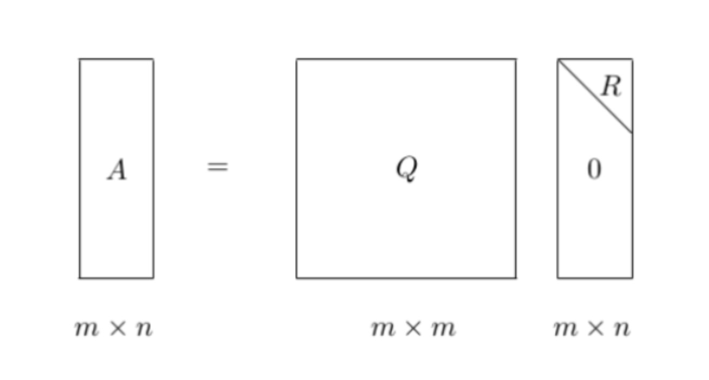

### 正交矩阵

- 若n阶方阵A满足$A^TA = E$, 则称A为正交矩阵, 简称正交阵 (复数域上称为酉矩阵)
    * A是正交阵的充要条件：A的列(行)向量都是单位向量，且两两正交。
- 若A为正交矩阵，x为向量，则Ax称为正交变换
    * 正交变换不改变向量的长度 $y=Ax, y^Ty = (Ax)^TAx = x^TA^TAx = x^TEx = x^Tx$
- 正交矩阵的性质
    * 若A为正交矩阵，则逆矩阵$A^{-1}$也为正交矩阵
    * 若P、Q为正交矩阵，那么$P*Q$也为正交矩阵

### QR分解(正交三角分解)

- 对于m*n的列满秩矩阵A, 必有, $A_{m*n} = Q_{m*m} · R_{m*n}$
- 其中Q为正交矩阵，R为非奇异上三角矩阵，当要求R的对角线元素为正的时候，该分解唯一。
- 该分解叫做QR分解，常用语求解A的特征值、A的逆，最小二乘等问题
- QR分解是将矩阵分解为一个正交矩阵与上三角矩阵的乘积

    
     
    
备注：图片托管于github，请确保网络的可访问性

     

- 这其中，Q为正交矩阵，$Q^TQ = l$, R为上三角矩阵
- 实际中，QR分解经常被用来解线性最小二乘问题。

### 施密特正交化过程

- 把一组线性无关向量组化为规范正交向量组，继而得到正交阵
- $\eta_1 = \frac{\beta_1}{||\beta_1||}, \eta_2 = \frac{\beta_2}{||\beta_2}, \cdots, \eta_r = \frac{\beta_r}{||\beta_r||}$ 是与$\alpha_1, \alpha_2, ..., \alpha_r$等价的规范(标准)正交组。
- 设$\alpha_1, \alpha_2, ..., \alpha_r$ 线性无关, 令 $\beta_1 = \alpha_1, \beta_2 = \alpha_2 - \frac{[\beta_1, \alpha_2]}{[\beta_1, \beta_1]} \beta_1, \beta_3 = \alpha_3 - \frac{[\beta_1, \alpha_3]}{\beta_1, \beta_2} \beta_1 - \frac{[\beta_2, \alpha_3]}{[\beta_2, \beta_2]} \beta_2 \cdots \cdots$
- $\beta_r = \alpha_r - \frac{[\beta_1, \alpha_r]}{[\beta_1, \beta_1]}\beta_1 - \frac{[\beta_2, \alpha_r]}{[\beta_2, \beta_2]} \beta_2 - \cdots - \frac{[\beta_{r-1} \alpha_r]}{[\beta_{r-1}, \beta_{r-1}]} \beta_{r-1}$
- 则$\beta_1, \beta_2, \cdots, \beta_r$ 两两正交，且与 $\alpha_1, \alpha_2, \cdots, \alpha_r$等价

**例1**

- 求矩阵$A=\left (\begin{array}{cccc}1 & 1 & -1 \\1 & 0 & 0 \\0 & 1 & 0 \\0 & 0 & 1\end{array} \right )$的QR(正交三角)分解
- 分析
    * 容易判断出$A \in C_3^{4×3}$ 即A是一个列满秩矩阵
    * 将$A = [\alpha_1, \alpha_2, \alpha_3]$的三个列向量施密特正交化先得到一个规范正交向量组
    * $\beta_1 = \alpha_1 = [1 \ \  1 \ \  0 \ \ 0]^T$
    * $\beta_2 = \alpha_2 - \frac{(\alpha_2, \beta_1)}{\beta_1, \beta_1} \beta_1 = \alpha_2 - \frac{1}{2} \beta_1 = [\frac{1}{2} \ \  \frac{-1}{2} \ \ 1 \ \ 0]^T$
    * $\beta_3 = \alpha_3 - \frac{(\alpha_3, \beta_1)}{\beta_1, \beta_1} \beta_1 - \frac{(\alpha_3, \beta_2)}{\beta_2, \beta_2} \beta_2 = \alpha_3 + \frac{1}{2} \beta_1 + \frac{1}{3} \beta_2 = [\frac{-1}{3} \ \ \frac{1}{3} \ \ \frac{1}{3} \ \ 1]^T$
    * 再将其单位化，得到一组标准正交向量组
        * $\eta_1 = \frac{1}{||\beta_1||} \beta_1 = [\frac{\sqrt{2}}{2} \ \ \frac{\sqrt{2}}{2} \ \ 0 \ \ 0]^T$
        * $\eta_2 = \frac{1}{||\beta_2||} \beta_2 = [\frac{\sqrt{6}}{6} \ \ -\frac{\sqrt{6}}{3} \ \ \frac{\sqrt{6}}{3} \ \ 0]^T$
        * $\eta_3 = \frac{1}{||\beta_3||} \beta_3 = [-\frac{\sqrt{3}}{6} \ \ \frac{\sqrt{3}}{6} \ \ \frac{\sqrt{3}}{6} \ \ \frac{\sqrt{3}}{2}]^T$
    * $\Rightarrow Q(\eta_1, \eta_2, \eta_3) = \left [\begin{array}{cccc}\frac{\sqrt{2}}{2} & \frac{\sqrt{6}}{6} & -\frac{\sqrt{3}}{6} \\\frac{\sqrt{2}}{2} & -\frac{\sqrt{6}}{6} & \frac{\sqrt{3}}{6} \\0 & \frac{\sqrt{6}}{3} & \frac{\sqrt{3}}{6} \\0 & 0 & \frac{\sqrt{3}}{2}\end{array} \right ]$
    * $\beta_1 = \alpha_1 = [1 \ \ 1 \ \ 0 \ \ 0]^T$
    * $\beta_2 = \alpha_2 - \frac{(\alpha_2, \beta_1)}{(\beta_1, \beta_1)} \beta_1 = \alpha_2 - \frac{1}{2} \beta_1 = [\frac{1}{2} \ \ \frac{-1}{2} \ \ 1 \ \ 0]^T$
    * $\beta_3 = \alpha_3 - \frac{(\alpha_3, \beta_1)}{\beta_1, \beta_1}\beta_1 - \frac{(\alpha_3, \beta_2)}{\beta_2, \beta_2} \beta_2 = \alpha_3 + \frac{1}{2}\beta_1 + \frac{1}{3}\beta_2 = [\frac{-1}{3} \ \ \frac{1}{3} \ \ \frac{1}{3} \ \ 1]^T$
    * $\Rightarrow$
        * $\alpha_1 = \beta_1$
        * $\alpha_2 = \frac{1}{2}\beta_1 + \beta_2$
        * $\alpha_3 = -\frac{1}{2}\beta_1 - \frac{1}{3}\beta_2 + \beta_3$
    * 再将其单位化，得到一组标准正交向量组
        * 由 $\left.\begin{array}{cccc}\beta_1 = ||\beta_1|| \eta_1 \\ \beta_2 = ||\beta_2|| \eta_2 \\ \beta_3 = ||\beta_3|| \eta_3\end{array} \right.$ 和 $\left. \begin{array}{cccc} \alpha_1 = \beta_1 \\ \alpha_2 = \frac{1}{2}\beta_1 + \beta_2 \\ \alpha_3 = -\frac{1}{2}\beta_1 - \frac{1}{3}\beta_2 + \beta_3 \end{array} \right.$
        * $\Rightarrow \left.\begin{array}{cccc}\alpha_1 = \sqrt{2} \eta_1 \\\alpha_2 = \frac{\sqrt{6}}{2} \eta_2 + \frac{\sqrt{2}}{2} \eta_1 \\\alpha_3 = \frac{2\sqrt{3}}{3} \eta_3 - \frac{\sqrt{6}}{6} \eta_2 - \frac{\sqrt{2}}{2} \eta_1 \\ \end{array} \right. \Rightarrow R = \left [ \begin{array}{cccc} \sqrt{2} & \frac{\sqrt{2}}{2} & -\frac{\sqrt{2}}{2} \\ 0 & \frac{\sqrt{6}}{2} & \frac{\sqrt{6}}{6} \\ 0 & 0 & \frac{2\sqrt{3}}{3} \end{array} \right ]$
        * 故得到A矩阵的QR分解如下:
        * $A = (\alpha_1 \ \  \alpha_2 \ \  \alpha_3) = QR =\left [\begin{array}{cccc}\frac{\sqrt{2}}{2} & \frac{\sqrt{6}}{6} & -\frac{\sqrt{3}}{6} \\\frac{\sqrt{2}}{2} & -\frac{\sqrt{6}}{6} &\frac{\sqrt{3}}{6} \\ 0 & \frac{\sqrt{6}}{3} & \frac{\sqrt{3}}{6} \\ 0 & 0 & \frac{\sqrt{3}}{2} \end{array}  \right ] \left [ \begin{array}{cccc} \sqrt{2} & \frac{\sqrt{2}}{2} & -\frac{\sqrt{2}}{2} \\ 0 & \frac{\sqrt{6}}{2} & \frac{\sqrt{6}}{6} \\ 0 & \frac{\sqrt{6}}{3} & \frac{\sqrt{3}}{6} \\ 0 & 0 & \frac{2\sqrt{3}}{3} \end{array}  \right ]$
        * 简写为：$A_{4×3} = QR = Q_{4×3} R_{3×3}$