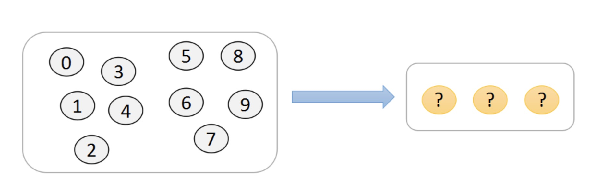
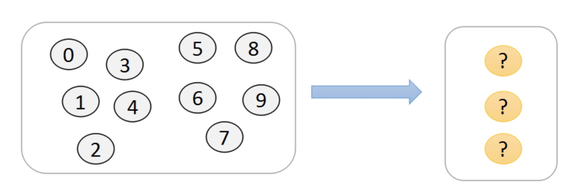
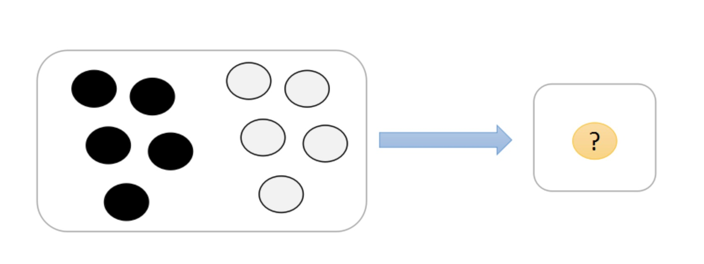
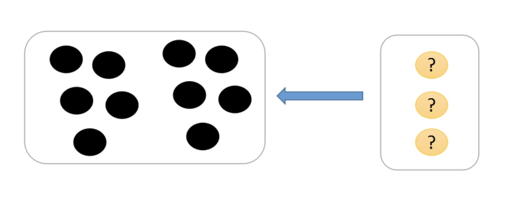
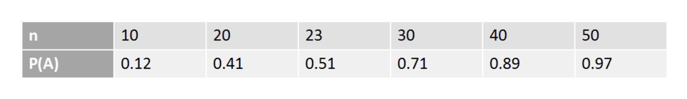

### 向量的导数

- A为$m*n$的矩阵，x为$n*1$的列向量，则Ax为$m*1$的列向量，记为：$\vec{y} = A·\vec{x}$
    * $A =\left (\begin{array}{cccc}a_{11} & a_{12} & \cdots & a_{1n} \\a_{21} & a_{22} & \cdots & a_{2n} \\\cdots & \cdots & \cdots & \cdots \\a_{m1} & a_{m2} & \cdots & a_{mn}\end{array} \right )$
    * $\vec{x} =\left (\begin{array}{cccc}x_1 \\x_2 \\\cdots \\x_n\end{array} \right )$
    * $\vec{y} =\left (\begin{array}{cccc}a_{11}x_1 + a_{12}x_2 + \cdots + a_{1n}x_n \\a_{21}x_1 + a_{22}x_2 + \cdots + a_{2n}x_n \\\cdots \\a_{m1}x_1 + a_{m2}x_2 + \cdots + a_{mn}x_n\end{array} \right )$
- $\frac{\partial \vec{y}}{\partial \vec{x}} = \frac{\partial A \vec{x}}{\partial \vec{x}} = \left (\begin{array}{cccc}a_{11} & a_{21} & \cdots & a_{m1} \\a_{12} & a_{22} & \cdots & a_{m2} \\\cdots & \cdots & \cdots & \cdots \\a_{1n} & a_{2n} & \cdots & a_{mn}\end{array} \right ) = A^T$

### 向量的导数

- 向量的偏导公式
    * $\frac{\partial A \vec{x}}{\partial \vec{x}} = A^T$
    * $\frac{\partial A \vec{x}}{\partial \vec{x}^T} = A$
    * $\frac{\partial(\vec{x}^TA)}{\partial \vec{x}} = A$

### 标量对向量的导数

- $A = \left (\begin{array}{cccc}a_{11} & a_{12} & \cdots & a_{1n} \\a_{21} & a_{22} & \cdots & a_{2n} \\\cdots & \cdots & \cdots & \cdots \\a_{m1} & a_{m2} & \cdots & a_{mn}\end{array} \right )$
- $\vec{x} =\left (\begin{array}{cccc}x_1 \\x_2 \\\cdots \\x_n\end{array} \right )$
- $\vec{x}^T · A · \vec{x} = (x_1, x_2 ... x_n)(\sum_{j=1}^n a_{1j} x_j, \sum_{j=1}^n a_{2j}x_j, ..., \sum_{j=1}^n a_{nj}x_j)^T = \sum_{i=1}^n \sum_{j=1}^n a_{ij} x_i x_j$
- 则 $\frac{\partial (\vec{x}^T · A · \vec{x})}{\partial \vec{x}} = (\sum_{j=1}^n a_{ij} x_j) + (\sum_{j=1}^n a_{ji}x_j) = \sum_{j=1}^n (a_{ij} + a_{ji}) x_j$

### 标量对方阵的导数

- A为$n*n$的矩阵，$|A|$为A的行列式，计算$\frac{\partial |A|}{\partial A}$
- 分析
    * $\forall 1 \leq i \leq n, |A| = \sum_{j=1}^n a_{ij} · (-1)^{i+j} M_{ij}$
    * $\frac{\partial |A|}{\partial a_{ij}} = \frac{\partial (\sum_{j=1}^n a_{ij}) · (-1)^{i+j}M_{ij}}{\partial a_{ij}} = (-1)^{i+j}M_{ij} = A^*_{ji}$
    * $\frac{\partial |A|}{\partial A} = (A^*)^T = |A|·(A^{-1})^T$

### 概率论

1) **排列数**

- 从m个不同元素中取出n(n \leq m)个元素(被取出的元素各不相同)，并按照一定的顺序排成一列(一般顺序是抽取出来的顺序)，叫做从m个不同元素中取出n个元素的一个排列。记为：$A(m,n)$
    * $A(m,n) = A_m^n = \frac{m!}{(m-n)!}$

**案例**

- 在一个盒子中有是个完全相同的球，其中每个球上编有一个编号，球的编号从0到9，求随机抽取3个球，可能出现的数字序列共有多少种？(备注：考虑数字的顺序，认为1、2、3和3、2、1是不一样的)

    
     
    
备注：图片托管于github，请确保网络的可访问性

     

- 分析
    * $A_{10}^3= \frac{10!}{(10-3)!} = 720$
    * 总共10个球，抽取3个球的排列数：
      * 步骤1, 从10个球中，获取一个球，有10种选择方式
      * 步骤2，从剩下的9个球中，获取一个球，有9种选择方式
      * 步骤3，从剩下的8个球中，获取一个球，有8种选择方式
      * 合并这3步，就共有$10*9*8$种选择方式，即 $A_10^3 = 10*9*8 = \frac{10!}{(10 - 3)!} = 720$

2 ) **组合数**

- 从m个不同元素中取出n $(n \leq m)$个元素的所有组合的个数，叫做从m个不同元素中取出n个元素的组合数，记为：$C(m,n)$
    * $C(m,n) = C_m^n = \frac{m!}{(m-n)! · n!}$

**案例**

- 在一个盒子中有是个完全相同的球，其中每个球上编有一个编号，球的编号从0到9，求随机抽取3个球，可能出现的数字组合共有多少? (备注：不考虑数字的顺序，认为1、2、3和3、2、1是一样的)

    
     
    
备注：图片托管于github，请确保网络的可访问性

     

- 分析
    * $C_10^3 = \frac{10!}{(10-3)!3!} = 120$
    * 总共10个球，抽取3个球的组合数
        * 抽取3个求的排列数为A(10,3)
        * 对于任意排列(a_1, a_2, a_3)都有3*2*1种相同元素的排列存在
        * 对于组合就是在排列的基础上去掉相同元素后剩下的数量
        * 即 $C_10^3 = \frac{A_10^3}{A_3^3} = \frac{\frac{10!}{(10-3)!}}{\frac{3!}{(3-3)!}} = \frac{10!}{(10-3)!3!} = 120$

### 古典概率

- 概率是以假设为基础的，即假定随机现象所发生的事件是有限的、互不相容的，而且每个基本事件发生的可能性相等。
- 一般来讲，如果在全部可能出现的基本事件范围内构成事件A的基本事件有a个，不构成事件A的有b个，那么事件A出现的概率为：$P(A) = \frac{a}{a+b}$
- 概率体现的是随机事件A发生可能的大小度量(数值)

**案例1**

- 在一个盒子中有是个完全相同的球，其中五个黑球，五个白球，求事件A={从盒子中获取一个球，颜色是黑色的概率}

    
     
    
备注：图片托管于github，请确保网络的可访问性

     

- 分析
    * $P(A) = \frac{5}{10} = \frac{1}{2}$
    * 基本事件总数为：10
    * 抽取一个球是黑球的事件数：5

    
     
    
备注：图片托管于github，请确保网络的可访问性

     

**案例2**

- 袋中有a只白球，b只黑球. 从中将球取出一次排成一列，问第k次去除的球是黑球的概率
- 分析：
    * 设A="第k次取出的球是黑球"
    * 从a+b个球中将球取出依次排成一列共有(a+b)!种排法(样本点总数)
    * 第k次取出黑球，有取法b(a+b-1)!种,因此事件A所含样本点数为：$b(a+b-1)!$
    * 所以, $P(A) = \frac{b·(a+b-1)!}{(a+b)!} = \frac{b}{a+b}$

**案例3**

- 假设有n个人，每个人都等可能地被分配到N个房间中的任意一间去住$(n \leq N)$, 求事件A={恰好有n个房间，其中各住一个人}的概率

    
     
    
备注：图片托管于github，请确保网络的可访问性

     

- 分析：
    * $P(A) = \frac{N!}{N^n(N-n)!}$
    * (1)每个人有N个房间可供选择，所以n个人住的方式共有$N^n$种
    * (2)恰好有n个房间表示这n个房间其实是从N个房间中任意抽取出来的，也就是从N个房间中抽取n个方法的组合总共有C(N,n)种
    * (3)对于n个房间来讲，n个人平均分配，那么总共有A(n,n)种入住方式
    * $P(A) = \frac{C_N^n A_n^n}{N^n} = \frac{\frac{N!}{(N-n)!n!} n!}{N^n} = \frac{N!}{N^n(N-n)!}$

**案例4**

- 生日问题，某个班级有n个学生$n \neq 365$, 问至少有两个人的生日在同一天的概率有多大?

    
     
    
备注：图片托管于github，请确保网络的可访问性

     

- $P(A) = 1 - \frac{N!}{N^n (N-n)!} \ \ \ N = 365$

**案例5**

- 某厂家称一批数量为100件的产品的次品率为$5\%$. 现从该批产品中有放回地抽取了30件，经检验发现有次品5件，问该厂家是否谎报了次品率?
- 分析
    * 假设这批产品的次品率为5%，那么1000件产品中有次品为50件。这时有放回地抽取30件，次品有5件的概率为 $p=C_30^5(\frac{50}{1000})^5 (1 - \frac{50}{1000})^{25} \approx 0.014$
    * 人们在长期的时间中总结得到"概率很小的事件在一次试验中几乎是不发生的"(称之为实际推断原理)
    * 现在概率很小的事件在一次试验中竟然发生了，从而推断该厂家谎报了次品率