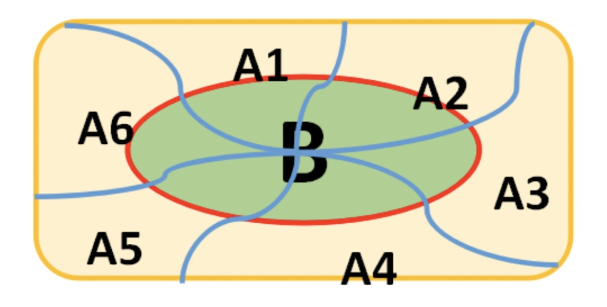

### 联合概率

- 表示两个事件共同发生的概率，事件A和事件B的共同概率记为：$P(AB)、P(A,B)$ 或者$P(A \cap B)$, 记为**事件A和事件B同时发生的概率**

    
     
    
备注：图片托管于github，请确保网络的可访问性

     

### 条件概率

- 事件A在另外一个事件B已经发生的条件下的发生概率叫做条件概率，表示为$P(A|B)$, 读作："在B条件下A发生的概率"
- 一般情况下$P(A|B) \neq P(A)$, 而且条件概率具有三个特征
    * 非负性
    * 可列性
    * 可加性
- $P(A|B) = \frac{P(AB)}{P(B)}$

**案例1**

- 两台车床加工同一种零件共100个，结果如下：

<table>
    <tr>
        <td>
        </td>
        <td>合格品数
        </td>
        <td>次品数
        </td>
        <td>总计
        </td>
    </tr>
    <tr>
        <td>第一台车床加工数
        </td>
        <td>30
        </td>
        <td>5
        </td>
        <td>35
        </td>
    </tr>
    <tr>
        <td>第二台车床加工数
        </td>
        <td>50
        </td>
        <td>15
        </td>
        <td>65
        </td>
    </tr>
    <tr>
        <td>总计
        </td>
        <td>80
        </td>
        <td>20
        </td>
        <td>100
        </td>
    </tr>
</table>

- 设A={从100个零件中任取一个是合格品} B={从100个零件中任取一个是第一台车床加工的}, 求$P(A), P(B), P(AB), P(A|B)$
- 分析：
    * $P(A) = \frac{80}{100}$
    * $P(B) = \frac{35}{100}$
    * $P(AB) = \frac{30}{100}$
    * $P(A|B) = \frac{P(AB)}{P(B)} = \frac{30}{100} * \frac{100}{35} = \frac{30}{35} \neq P(A)$

**案例2**

- 已知某家庭有3个小孩，且至少有一个是女孩，求该家庭至少有一个男孩的概率
- 分析
    * 设A={3个小孩至少有一个女孩}
    * 设B={3个小孩至少有一个男孩}
    * 所求概率为：$P(B|A) = \frac{P(AB)}{P(A)}$
    * 而 $P(A) = 1 - P(\bar{A}) = 1 - \frac{1}{8} = \frac{7}{8}$
    * $P(AB) = \frac{6}{8}$
    * 所以，$P(B|A) = \frac{\frac{6}{8}}{\frac{7}{8}} = \frac{6}{7}$

### 条件概率

- 将条件概率公式由两个事件推广到任意有穷多个事件时，可以得到如下公式，假设$A_1, A_2, ..., A_n$为n个任意事件$n \leq 2$, 而且$P(A_1A_2...A_n) > 0$, 则：
    * $P(A_1A_2...A_n) = P(A_1)P(A_2 | A_1) ... P(A_n | A_1A_2...A_{n-1})$

**例1**

- 袋中有一个白球与一个黑球，现每次从中取出一球，若取出白球，则除把白球放回外再加进一个白球，直至取出黑球为止.求取出了n次都未取出黑球的概率
- 分析：
    * 设B={取了n次都未取出黑球}，$A_i =$ {第i次取出白球}  (i = 1, 2, ..., n), 则 $B = A_1A_2...A_n$, 由乘法公式：
    * $P(B) = P(A_1A_2...A_n) = P(A_1)P(A_2 | A_1) P(A_3 | A_1A_2) ... P(A_n | A_1A_2...A_{n-1}) = \frac{1}{2} · \frac{2}{3} · \frac{3}{4} ····· \frac{n}{n+1} = \frac{1}{n+1}$

**例2**

- 设某光学仪器厂制造的透镜，第一次落下时打破的概率为$\frac{1}{2}$, 若第一次落下未打破，第二次落下打破的概率为：$\frac{7}{10}$, 若前两次落下未打破，第三次落下打破的概率为：$\frac{9}{10}$, 求透镜落下三次而未打破的概率
- 分析
    * 以$A_i (i=1,2,3)$ 表示事件"透镜第i次落下打破"，以B表示事件"透镜落下三次而未打破"
    * 有：$P(B) = P(\bar{A_1} \bar{A_2} \bar{A_3}) = P(\bar{A_1}) P(\bar{A_2} | \bar{A_1}) P(\bar{A_3} | \bar{A_1} \bar{A_2}) = (1 - \frac{1}{2})(1  - \frac{7}{10})(1 - \frac{9}{10}) = \frac{3}{200}$

### 全概率公式

- 样本空间$\Omega$有一组事件$A_1、A_2...A_n$，如果事件组满足下列两个条件，那么事件组称为样本空间的一个划分。 
    * $\forall \ \  i \neq j \in \{ 1,2,..,n \}, A_iA_j = \phi$
    * $A_1 \cup A_2 ... \cup A_n = \Omega$

    
     
    
备注：图片托管于github，请确保网络的可访问性

     

- 设事件$A_j$是样本空间$\Omega$的一个划分，且$P(A_i) > 0$, 那么对于任意事件B, 全概率公式为：$P(B) = \sum_{i=1}^n P(A_i)P(B | A_i)$

**例1**

- 某小组有20名射手，其中一、二、三、四级射手分别为：2、6、9、3名. 又若选一、二、三、四级射手参加比赛，则在比赛中射中目标的概率分别为：0.85, 0.64, 0.45, 0.32, 今随机选一人参加比赛，试求该小组在比赛中射中目标的概率
- 分析：
    * 设B={该小组在比赛中射中目标}
    * $A_i =$ {选i级射手参加比赛} (i=1,2,3,4)
    * 由全概率公式，有：$P(B) = \sum_{i=1}^4 P(A_i)P(B | A_i) = \frac{2}{20} × 0.85 + \frac{6}{20} × 0.64 + \frac{9}{20} × 0.45 + \frac{3}{20} × 0.32 = 0.5275$