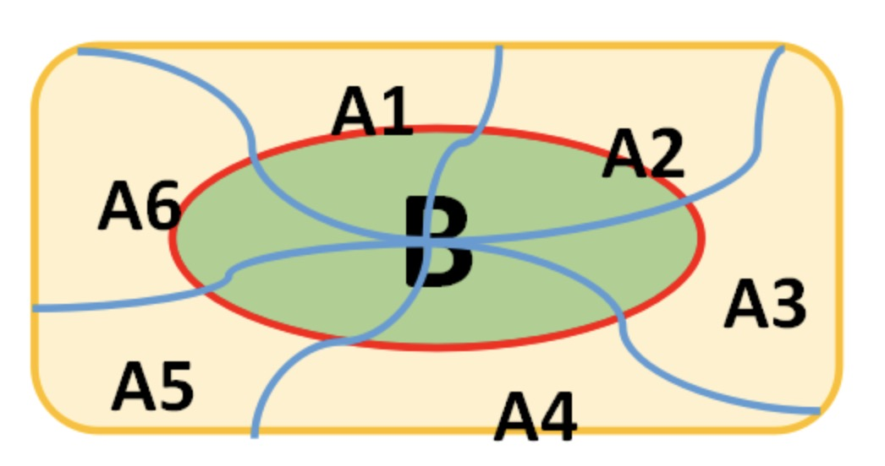
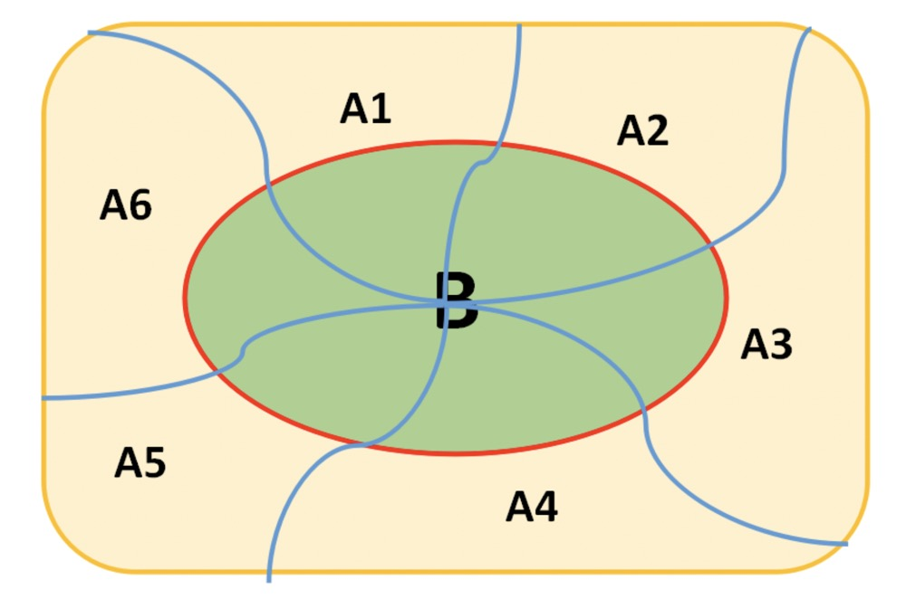

### 贝叶斯公式

- 贝叶斯公式：$P(A|B) = \frac{P(B|A)P(A)}{P(B)}$
    * P(A): 在没有数据支持下，A发生的概率：先验概率或边缘概率
    * P(A|B): 在已知B发生后A的条件概率，也就是由于得自B的取值而被称为A的后验概率
    * P(B|A): 在已知A发生的情况下的概率分布，似然函数
- 设$A_1、A_2...A_n$是样本空间$\Omega$的一个划分，如果对任意事件B而言，有$P(B) > 0$, 那么
- $P(A_i | B) = \frac{P(B, A_i)}{P(B)} = \frac{P(A_i)·P(B | A_i)}{\sum_{j=1}^n P(A_j)·P(B|A_j)}$

    
     
    
备注：图片托管于github，请确保网络的可访问性

     

**例1**

- 一座房子在过去20年里一共发生过2次被盗案，房子的主人养了一条狗，狗平均每周晚上叫3次，在盗贼入侵时狗叫的概率估计为0.9，求：在狗叫的时候发生入侵的概率是多少？
- 分析：
    * 设A={狗叫} B={盗贼入侵}

**例2**

- 用某种方法普查肝癌，设：A={用此方法判断被检查者患有肝癌}，D={被检查者确实患有肝癌}，已知 $P(A|D) = 0.95, P(\bar{A} | \bar{D}) = 0.90$, 而且已知：$P(D) = 0.0004$
- 现有一人用此方法检验患有肝癌，求此人真正患有肝癌的概率
- 分析：
    * 已知，$P(A|D) = 0.95， P(\bar{A}|\bar{D}) = 0.90, P(D) = 0.0004$
    * 所以，由Bayes公式，得 $P(D|A) = \frac{P(DA)}{P(A)} = \frac{P(D)P(A|D)}{P(D)P(A|D) + P(\bar{D})P(A|\bar{D})} = \frac{0.0004 × 0.95}{0.0004 × 0.95 + 0.9996 × 0.10} = 0.0038$

### 概率公式

- $P(A|B) = \frac{P(AB)}{P(B)}$
- $P(B) = \sum_{i=1}^nP(A_i)P(B|A_i)$
- $P(A_i | B) = \frac{P(B|A_i)P(A_i)}{\sum_{j=1}^n P(A_j)P(B|A_j)}$

    
     
    
备注：图片托管于github，请确保网络的可访问性

     

### 事件的独立性

- 给定A、B两个事件，如果概率存在$P(A,B) = P(A)P(B)$ (A、B事件的联合分布概率等于事件各自分布概率的积)，则事件A和B相互独立
- 如果事件A、B相互独立，互不影响，那么存在$P(A|B) = P(A), P(B|A) = P(B)$

**例1**

- 袋中有a只黑球，b只白球. 每次从中取出一球，令：
    * A={第一次取出白球}，
    * B={第二次取出白球}，
- 分有放回和不放回情形讨论 $P(A), P(B), P(B|A)$
- 分析
    * (1)有放回情形
        * $P(A) = \frac{b}{a+b}$
        * $P(AB) = \frac{b^2}{(a+b)^2}$, 同理 $P(\bar{A}B) = \frac{ab}{(a+b)^2}$
        * 所以，由 $B = AB \cup \bar{A}B$
        * 得：$P(B) = P(AB) + P(\bar{A}B) = \frac{b^2}{(a+b)^2} + \frac{ab}{(a+b)^2} = \frac{b}{a+b}$,
        * 而，$P(B|A) = \frac{P(AB)}{P(A)} = \frac{\frac{b^2}{(a+b)^2}}{\frac{b}{a+b}} = \frac{b}{a+b}$
    * (2) 不放回情形
        * $P(A) = \frac{b}{a+b}$
        * $P(AB) = \frac{b(b-1)}{(a+b)(a+b-1)}$, 同理 $P(\bar{A}B) = \frac{ab}{(a+b)(a+b-1)}$
        * 所以，$P(B) = P(AB) + P(\bar{A}B) = \frac{b(b-1)}{(a+b)(a+b-1)} + \frac{ab}{(a+b)(a+b-1)} = \frac{b}{a+b}$
        * 而，$P(B|A) = \frac{P(AB)}{P(A)} = \frac{\frac{b(b-1)}{(a+b)(a+b-1)}}{\frac{b}{a+b}} = \frac{b-1}{a+b-1}$

**例2**

- 袋中装有4个外形相同的球，其中三个球分别涂有红、白、黑色，另一个球涂有红、白、黑三种颜色. 现从袋中任意取出一球，令：
    * A={取出的球涂有红色}
    * B={取出的球涂有白色}
    * C={取出的球涂有黑色}
- 则：$P(A) = P(B) = P(C) = \frac{1}{2}, \ \ \ P(AB) = P(BC) = P(AC) = \frac{1}{4}, \ \ \  P(ABC) = \frac{1}{4}$
- 由此，$P(AB) = P(A)P(B), \ \ \ P(BC) = P(B)P(C), \ \ \ P(AC) = P(A)P(C)$
- 但是$P(ABC) = \frac{1}{4} \neq \frac{1}{8} = P(A)P(B)P(C)$
- 这表明，A、B、C 这三个事件是两两独立的，但不是相互独立的. (三个事件相互独立, 指任何两个两两独立，三个也独立)