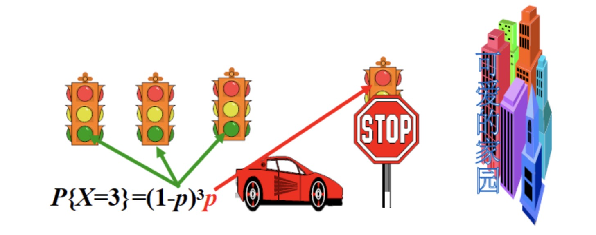

### 随机变量及其分布

**案例1**

- 袋中有3只黑球，2只白球，从中任意去除3只球. 我们将3只黑球分别记为：1, 2, 3号, 2只白球分别记为4,5号, 则该实验的样本空间为 $S = \left \{\begin{array}{cccc} (1,2,3) & (1,2,4) & (1,2,5) \\ (1,3,4) & (1,3,5) & (1,4,5) \\ (2,3,4) & (2,3,5) & (2,4,5) \\ (3,4,5) \end{array}  \right \}$
- 考察取出的3只球中的黑球的个数
- 我们记取出的黑球数为X, 则X的可能取值为：1，2，3. 
- 因此，X是一个变量. 但是, X取什么值依赖于实验结果, 即X的取值带有随机性, 所以, 我们称X为**随机变量**. X的取值情况可由下表给出

<table>
<tr>
    <th>
        样本点
    </th>
    <th>
        黑球数X
    </th>
    <th>
        样本点
    </th>
    <th>
        黑球数X
    </th>
</tr>
<tr>
    <td>(1,2,3)</td>
    <td>3</td>
    <td>(1,4,5)</td>
    <td>1</td>
</tr>
<tr>
    <td>(1,2,4)</td>
    <td>2</td>
    <td>(2,3,4)</td>
    <td>2</td>
</tr>
<tr>
    <td>(1,2,5)</td>
    <td>2</td>
    <td>(2,3,5)</td>
    <td>2</td>
</tr>
<tr>
    <td>(1,3,4)</td>
    <td>2</td>
    <td>(2,4,5)</td>
    <td>1</td>
</tr>
<tr>
    <td>(1,3,5)</td>
    <td>2</td>
    <td>(3,4,5)</td>
    <td>1</td>
</tr>
</table>

- 由上表可以看出，该随机试验的每一个结果都对应着变量X的一个确定的取值, 因此变量X是样本空间S上的函数：$X=X(e) \ \ \ (e \in S)$
- 我们定义了随机变量后，就可以用随机变量的取值情况来刻画随机事件，例如：${e： X(e) = 2} = {X=2}$
- 表示取出2个黑球这一事件：$\{X \geq 2\}$ 表示至少取出2个黑球这一事件，等等
- 通常，随机变量用大写英文字母 $X、Y、Z、...$ 或希腊字母 $\xi, \eta, \varsigma, ...等来表示$

**案例2**

- 掷一颗骰子，令 X: 出现的点数. 则X就是一个随机变量.它的取值为：1, 2, 3, 4, 5, 6. 
- $\{ X \leq 4 \}$ 表示掷出的点数不超过4这一随机事件
- ${X取偶数}$ 表示掷出的点数为偶数这一随机事件

**案例3**

- 上午8:00~9:00在某路口观察，令：Y:该事件间隔内通过的汽车数. 则Y就是一个随机变量. 它的取值为：0,1,... 
    * ${Y < 100}$ 表示通过的汽车数小于100辆这一随机事件
    * ${50 < Y \leq 100}$ 表示通过的汽车数大于50辆但不超过100辆这一随机事件
    * 这里Y的取值可以有无数个

**案例4**

- 观察某电子元件的寿命(单位：小时)，令Z: 该电子元件的寿命. 则Z就是一个随机变量. 它的取值为所有非负实数. 
    * ${Z \leq 500}$ 表示该电子元件的寿命不超过500小时这一随机事件
    * ${Z \geq 1000}$ 表示该电子元件的寿命大于1000小时这一随机事件
    * 这里，Z的取值不可列无数个，必须取整数!

**案例5**

- 掷一枚硬币，令：$X = \left \{\begin{array}{cccc}1 & \text{投掷硬币出现正面} \\0 & \text{投掷硬币出现反面}\end{array} \right.$
- 则X是一个随机变量
- 说明：在同一个样本空间上可以定义不同的随机变量

**案例6**

- 投掷一枚骰子，在案例2中定义了随机变量X表示出现的点数. 我们还可以定义其他的随机变量. 例如我们可以定义
    * $Y =\left \{\begin{array}{cccc}1 & \text{出现偶数} \\0 & \text{出现奇数}\end{array} \right.$
    * $Z =\left \{\begin{array}{cccc}1 & \text{点数为6} \\0 & \text{点数不为6}\end{array} \right.$
    * 等等

### 离散型随机变量及其分布律

1) **离散型随机变量的定义**

- 如果随机变量X的取值是有限个或可列无穷个,则称X为离散型随机变量

2) **离散型随机变量的分布律**

- 设离散型随机变量X的所有可能取值为：$x_1, x_2, ..., x_n, ...$
- 并设$P\{ X=x_n \} = p_n \ \ \ (n=1,2,...)$, 则称此式或下表
    * $\text{X: } x_1, x_2, ..., x_n, ...$
    * $\text{P: } p_1, p_2, ..., p_n, ...$
- 为离散型随机变量X的分布律

3) **离散型随机变量分布律的性质**

- 对任意的自然数n, 有 $p_n \geq 0$
- $\sum_n p_n = 1$

**例1**

- 从1~10这10个数字中随机取出5个数字，令X: 取出的5个数字中的最大值. 试求X的分布律.
- 分析
    * X的可能取值为：5, 6, ..., 10
    * $P\{ X=k \} = \frac{C_{k-1}^4}{C_{10}^5} \ \ \ k = 5,6,...,10$
    * 具体写出，即可得X的分布律：(求分布律一定要说明k的取值范围!)
    * $\text{X :} 5, 6, 7, 8, 9, 10$
    * $\text{P :} \frac{1}{252}, \frac{5}{252}, \frac{15}{252}, \frac{35}{252}, \frac{70}{252}, \frac{126}{252}$

**例2**

- 将1枚硬币投掷3次，令X: 出现的正面次数与反面次数之差. 试求：(1) X的分布律 (2) $P(0.5 \leq X \leq 3)$
- 分析
    * X的可能取值为：-3, -1, 1, 3, 并且分布率为：
    * $X: -3, -1, 1, 3$
    * $P_k: \frac{1}{8}, \frac{3}{8}, \frac{3}{8}, \frac{1}{8}$
    * $P\{ 0.5 \leq X < 3 \} = P\{ X = 1 \} = \frac{3}{8}$

**例3**

- 设一汽车在开往目的地的道路上需经过四盏信号灯, 每盏信号灯以概率p禁止汽车通过. 以X表示汽车首次停下时，它已通过的信号灯的盏数，求X的分布律.(信号灯的工作是相互独立的).

    
     
    
备注：图片托管于github，请确保网络的可访问性

     

- 分析
    * 以p表示每盏信号灯禁止汽车通过的概率，则X的分布律为：
    * $X: 0, 1, 2, 3, 4$
    * $p_k: p, (1-p)p, (1-p)^2p, (1-p)^3p, (1-p)^4$
    * 或写成 $P\{X=k\} = (1-p)^kp$, k=0,1,2,3
    * $P\{X=4\} = (1-p)^4$
    * 以 $p=\frac{1}{2}$代入得：
    * $X: 0, 1, 2, 3, 4$
    * $p_k: 0.5, 0.25, 0.125, 0.0625, 0.0625$

### 一些常用的离散型随机变量

1 ) **Bernoulli分布**

- 如果随机变量X的分布律为：$P\{X=k\} = p^k(1-p)^{1-k}, k = 0,1$，或
- $X: 0, 1$
- $P: 1-p, p$
- 则称随机变量X服从参数为p的Bernoulli分布，记为：$X \sim B(1, p)$ (其中 $0 \leq p \leq 1$ 为参数)
- Bernoulli分布也称为0-1分布或二点分布

**Bernoulli分布的概率背景**

- 进行一次Bernoulli试验, A是随机事件。设：$P(A) = p, P(\bar{A}) = 1 - p = q$
- 设X表示这次Bernoulli试验中事件A发生的次数, 或者设 $\left \{ \begin{array}{cccc} 1 & \text{若事件A发生} \\ 0 & \text{若事件A不发生} \end{array}  \right.$
- 则：$X \sim B(1,p)$

2 ) **二项分布**

- 如果随机变量X的分布律为：$P\{X=k\} = C_n^kp^k(1-p)^{n-k}, \ \ \ (k=0,1,...,n)$
- 则称随机变量X服从参数为(n,p)的二项分布, 记为：$X \sim B(n, p)$ (其中n为自然数，$0 \leq p \leq 1$为参数)
- 说明
    * 显然，当n=1时， $X \sim B(1,p)$, 此时，X服从Bernoulli分布
    * Bernoulli分布是二项分布的一个特例

**二项分布的概率背景**

- 进行n重Bernoulli试验, A是随机事件。设在每次试验中 $P(A) = p, P(\bar{A}) = 1 - p = q$
- 令X表示这n次Bernoulli试验中事件A发生的次数. 则 $X \sim B(n, p)$
- 说明
    * 设$A_i =$ {第i次试验A出现}, 则 $\{X=k\}=A_1...A_k\bar{A}_{k+1}...\bar{A}_n \cup \bar{A}_1A_2...A_{k+1}\bar{A}_{k+2} ... \bar{A}_n \cup ...\cup ...\cup \bar{A}_1\bar{A}_2...\bar{A}_{n-k}A_{n-k+1} ... A_n$
    * 在n次试验中，指定k次出现A(成功), 其余n-k次出现$\bar{A}$(失败)，这种指定的方法共有$C_n^k$种，所以
    * $P\{X=k\} = C_n^k p^k q^{n-k} \ \ \ (q=1-p) \ \ \ (k=0,1,2,...,n)$

**例子**

- 一大批产品的次品率为0.1, 现从中取出15件. 试求下列事件的概率：
    * B={取出的15件产品中恰好有2件次品}
    * C={取出的15件产品中至少有2件次品}
- 分析
    * 由于从一大批产品中取15件产品，故可近似看做是一15重Bernoulli试验
    * A={取出一件产品为次品}, 则 $P(A) = 0.1$
    * 所以, $P(B) = C_{15}^2 × 0.1^2 × 0.9^{13}$
    * $P(C) = 1 - P(\bar{C}) = 1 - C_{15}^0 × 0.1^0 × 0.9^{15} - C_{15}^1 × 0.1 × 0.9^{14}$

**二项分布的分布形态**

- 若$X \sim B(n,p)$, 则 $\frac{P\{X=k\}}{P\{X=k-1\}} = 1 + \frac{(n+1)p - k}{kq} \ \ \ (q=1-p)$
    * 推导如下：
    * $\frac{P\{X=k\}}{P\{X=k-1\}} = \frac{C_n^kp^kq^{n-k}}{C_n^{k-1}p^{k-1}q^{n-k+1}}$
    * = $\frac{C_n^k}{C_n^{k-1}} × \frac{p}{q}$
    * = $\frac{n!}{(n-k)!k!} × \frac{(n-k+1)!(k-1)!}{n!} × \frac{p}{q}$
    * = $\frac{n-k+1}{k} × \frac{p}{q}$
    * = $\frac{(n+1)p - k(1-q)}{kq}$
    * = $\frac{kq -k + (n-1)q}{kq}$
    * = $1 + \frac{(n+1)p - k}{kq}$
- 由此可知, 二项分布的分布率为：$P\{X=k\}$
- 先是随着k的增大而增大，达到其最大值后再随着k的增大而减少. 
- 这个使得 $P\{ X=k \}$, 达到其最大值的$k_0$称为该二项分布的最可能次数
- 可以证明
    * 如果$(n+1)p$不是整数，则$k_0 = [(n+1)p]$
    * 如果$(n+1)p$是整数，则$k_0 = (n+1)p$ 或 $(n+1)p - 1$

**例子**

- 对同一目标进行300次独立射击，设每次射击的命中率均为0.44，试求300次射击最可能命中几次? 其相应的概率是多少?
- 分析
    * 对目标进行300次设计相当于做300次重复Bernoulli试验, 令：
    * X 表示 300次射击中命中目标的次数
    * 则由题意，$X \sim B(300, 0.44)$
    * 由于$(300+1)×0.44 = 132.44$, 它不是整数
    * 对应的概率是$P = C_{300}^{132} * 0.44^{132}*(1-0.44)^{(300-132)}$
    * $= \frac{\lambda_n^k}{k!}(1 - \frac{1}{n})(1 - \frac{2}{n}) ... (1 - \frac{k-1}{n})(1 - \frac{\lambda_n}{n})^{n-k}$
    * 对于固定的k，有$\lambda_{n \to \infty} (1 - \frac{\lambda_n}{n})^{n-k} = e^{-\lambda}$
    * 所以，$\lim_{n \to \infty} C_n^k p_n^k (1 - p_n)^{n-k}$
    * $\frac{1}{k!} \lim_{n \to \infty} \lambda_n^k · \lim_{n \to \infty} (1-\frac{1}{n})(1-\frac{2}{n})...(1-\frac{k-1}{n})·\lim_{n \to \infty} (1 - \frac{\lambda_n}{n})^{n-k}$
    * $= \frac{\lambda^k}{k!} e^{-\lambda}$

### Poisson定理的应用

- 由Poisson定理，可知，若随机变量$X \sim B(n,p)$, 则当n比较大，p比较小时，令：$\lambda = np$
- 则有$P\{ X=k \} = C_n^kp^k(1-p)^{n-k} \approx \frac{\lambda^k}{k!} e^{-\lambda}$

**例1**

- 设每次射击命中目标的概率为0.012，现射击600次，求至少命中3次目标的概率(用Poisson分布近似计算)
- 分析
    * 设X为600次射击命中目标的次数，则$X \sim B(600, 0.012)$, 取 $\lambda = 600 × 0.012 = 7.2$
    * $P\{ X \geq 3 \} = 1 - P\{ X < 3 \}$
    * $1 - P\{ X=0 \} - P\{ X = 1 \} - P\{ X = 2 \} = 1 - e^{-7.2} - 7.2e^{-7.2} - \frac{7.2^2}{2} e^{-7.2} = 0.9745$

**例2**

- 保险公式售出某种寿险(一年)保单2500份，每单交保费100元, 当被保人一年内死亡时，家属可从保险公司获得2万元的赔款.若此类被保人一年内死亡的概率为0.001， 求
    * (1)保险公司亏本的概率
    * (2)保险公司获利不少于10万元的概率
- 分析
    * 此类被保人一年内死亡的人数为X, 则 $X \sim b(2500, 0.001)$
    * (1)P(保险公司亏本)
        * $= P(25 - 2X < 0) = 1 - P(X \leq 12) = 1 - \sum_{k=0}^{12}C_{2500}^k · (0.001)^k · (0.999)^{2500 - k}$
        * $\approx 1 - \sum_{k=0}^{12} \frac{2.5^k}{k!} e^{-2.5} = 0.000002$
    * (2)P(保险公司获利不少于10万元)
        * $= P(25 - 2X \geq 10) = P(x \leq 7) \approx \sum_{k=0}^7 \frac{2.5^k}{k!} e^{-2.5} = 0.995753$

### 几何分布

- 若随机变量X的分布律为：$P\{ X=k \} = q^{k-1}p \ \ \ (k = 1,2, ...)$ 其中，($p \geq 0, q \geq 0, p + q = 1$), 则称随机变量X服从参数为p的几何分布
- 几何分布是指在n次伯努利试验中，试验k次才得到第一次成功的几率, 其中前k-1次试验均失败，第k次试验成功
- 如果事件发生的概率为p, 不发生的概率为q, 则第k次事件成功的概率为：$P(\xi = k) = q^{k-1} * p$

**几何分布的概率背景**

- 在Bernoulli试验中，$P(A) = p, P(\bar{A}) = q = 1 - p$ 试验进行到A首次出现为止
- 令：X表示所需试验次数. 则X服从参数为p的几何分布，即：$P\{ X=k \} = q^{k-1} p$ (k = 1,2,...)

**超几何分布**

- 如果随机变量X的分布律为：$P\{ X=k \} = \frac{C_M^k C_{N-M}^{n-k}}{C_N^n}$ (k=0,1,...,min(M,n)) 其中N,M,n均为自然数
- 则称随机变量X服从参数为(N, M, n)的超几何分布.

**超几何分布的概率背景**

- 一批产品有N件，其中有M件次品，其余N-M件为正品. 现从中取出n件.
- 令X: 取出n件产品中的次品数. 则X的分布律为：$P\{ X=k \} = \frac{C_M^k C_{N-M}^{n-k}}{C_N^n}$ (k=0,1,...,min(M,n))
- 此时，随机变量X服从参数为：(N,M,n)的超几何分布