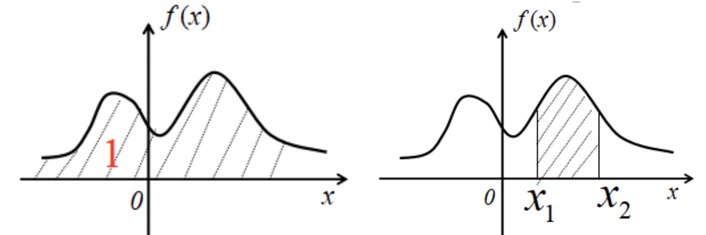
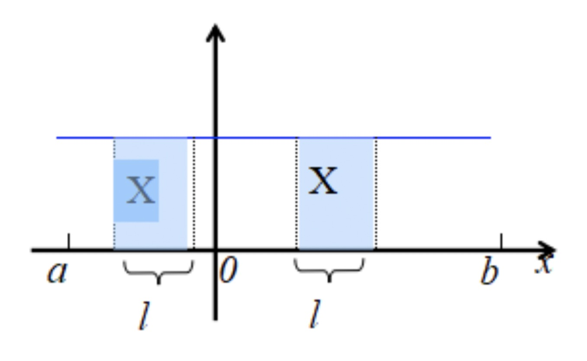
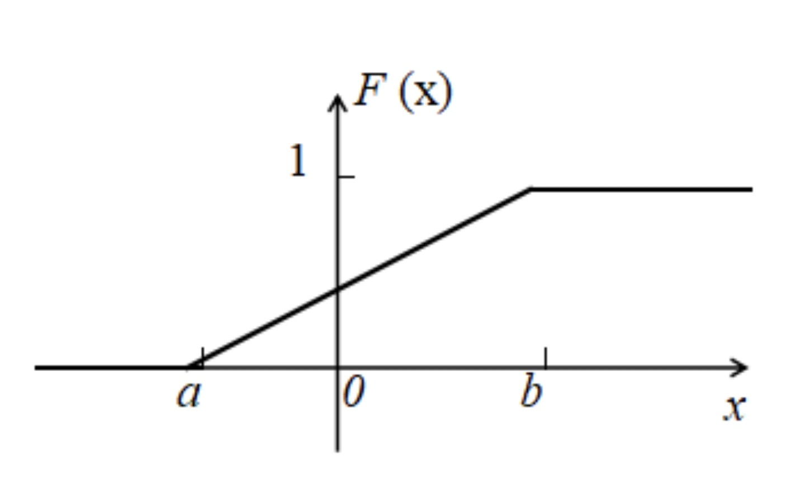
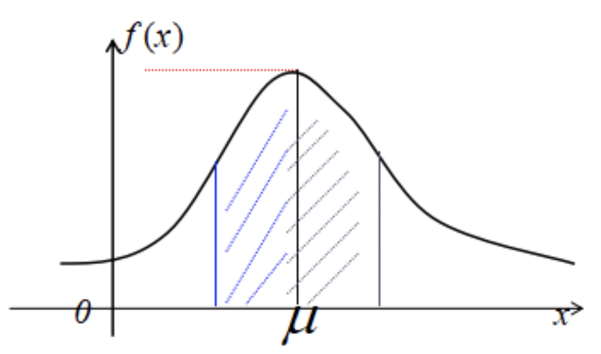
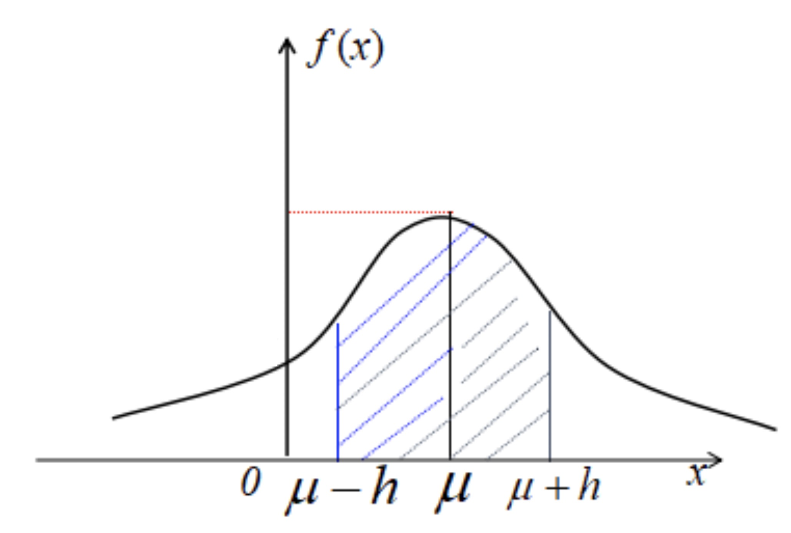
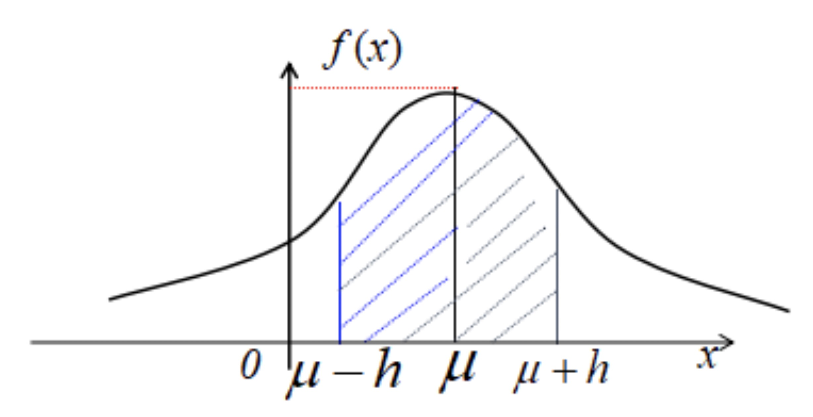
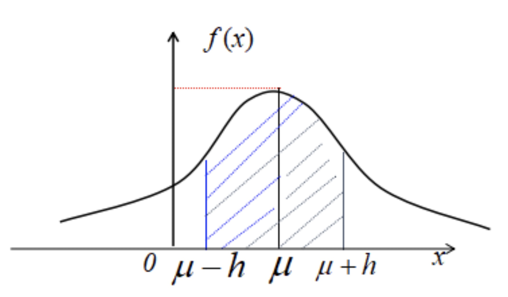
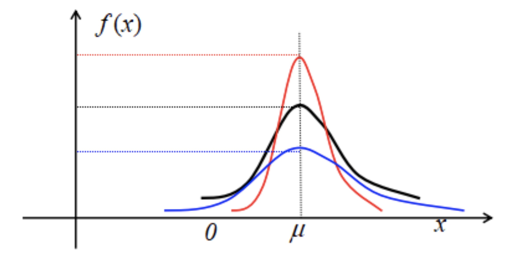
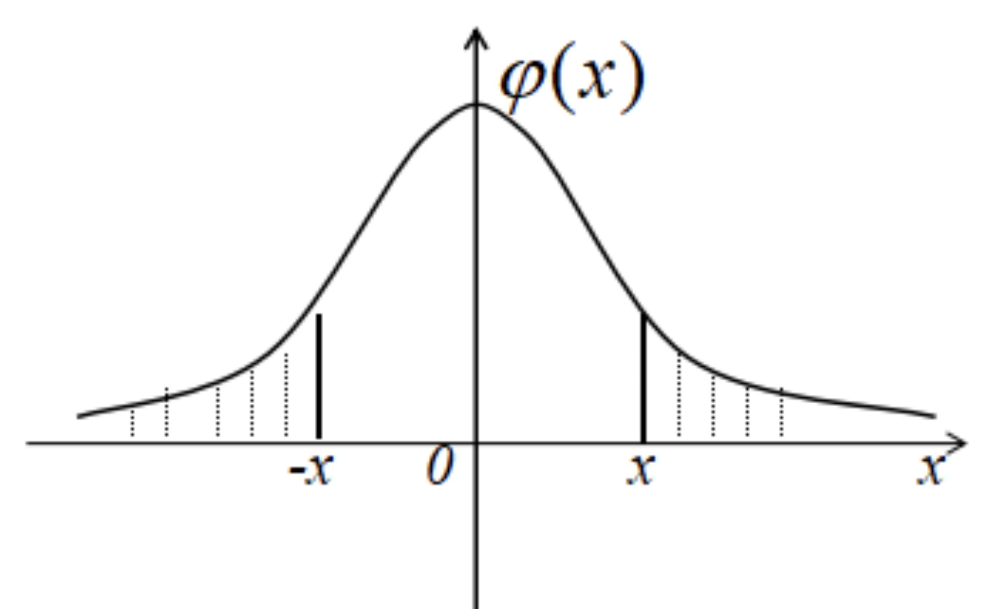

### 连续型随机变量及其概率密度

1 ) **连续型随机变量的概念与性质**

- 如果对于随机变量X的分布函数F(x)，存在非函数f(x), 使得对于任意实数x, 有$F(x) = \int_{-\infty}^x f(t)dt$,
- 则称X为连续型随机变量, 其中函数f(x)称为X的概率密度函数，简称概率密度

2 ) **关于不定积分的补充**

- f(x) 在区间I上的原函数全体称为f(x)在I上的不定积分, 记为：$\int f(x) dx$, 其中
    * $\int$ 是积分号
    * f(x) 被积函数
    * x 积分变量
    * f(x)dx 被积表达式
- 若$F'(x) = f(x)$, 则 $\int f(x)dx = F(x) + C$ (C为任意常数，C称为积分常数，不可丢!)
    * $\int e^x dx = e^x + C$
    * $\int x^2 dx = \frac{1}{3}x^3 + C$
    * $\int sin x dx = -cos x + C$

**不定积分的性质**

- (1)设函数f(x)以及g(x)的原函数存在, 则 $\int [f(x) \pm g(x)] dx = \int f(x)dx \pm \int g(x)dx$
- (2)设函数f(x)原函数存在，k为非零常数, 则 $\int kf(x)dx = k \int f(x) dx \ \ \ (k \neq 0)$ 
- 推论：若 $f(x) = \sum_{i=1}^n k_i f_i(x)$, 则 $\int f(x)dx = \sum_{i=1}^n k_i \int f_i(x)dx$
- 从不定积分定义可知：
    * $\frac{d}{dx}[\int f(x)dx] = f(x)$ 或 $d[\int f(x)dx] = f(x)dx$
    * $\int F'(x)dx = F(x) + C$ 或 $\int dF(x) = F(x) + C$
- 基本积分表
    * $\int kdx = kx + C$ (k为常数)
    * $\int x^\mu dx = \frac{1}{\mu + 1}x^{\mu + 1} + C$ ($\mu \neq -1$)
    * $\int \frac{dx}{x} = ln|x| + C$ 其中，$(ln|x|)' = \frac{1}{x}$
    * $\int \frac{dx}{1+x^2} = arctanx + C$ 或 $-arccot x + C$
    * $\int \frac{dx}{\sqrt{1-x^2}} = arcsin x + C$ 或 $-arccosx + C$
    * $\int cosxdx = sinx + C$
    * $\int sinxdx = -cosx + C$
    * $\int \frac{dx}{cos^2x} = \int sec^2xdx = tanx + C$
    * $\int \frac{dx}{sin^2 x} = \int csc^2 xdx = -cotx + C$
    * $\int secxtanxdx = secx + C$
    * $\int cscxcotxdx = -cscx + C$
    * $\int e^xdx = e^x + C$
    * $\int a^xdx = \frac{a^x}{ln a} + C$
    * $\int \frac{1}{x^2}dx = - \frac{1}{x} + C$
    * $\int \frac{1}{\sqrt{x}}dx = 2\sqrt{x} + C$

**关于定积分**

参考原来的文章章节

**牛顿-莱布尼茨公式**

- 定理：设F(x)是连续函数f(x)在[a,b]上的一个原函数，则$\int_a^b f(x)dx = F(b) - F(a)$

**例1**

- 求$\int_{-2}^{-1} \frac{1}{x} dx$
- 分析
    * 当 x < 0 时，$\frac{1}{x}$的一个原函数是$ln |x|$, $\int_{-2}^{-1} \frac{1}{x} dx = [ln |x|]_{-2}^{-1} = ln 1 - ln 2 = -ln 2$

**例2**

- 求$\int_0^{\frac{\pi}{2}} (2cos x + sin x -1)dx$
- 分析
    * 原式：$=[2sinx - cosx - x]_0^{\frac{\pi}{0}} = 3 - \frac{\pi}{2}$
    * 由定义可知，概率密度f(x)具有以下性质：
        * $f(x) \geq 0$
        * $\int_{-\infty}^\infty f(x)dx = 1$
        * $P\{ x_1 \leq X \leq x_2 \} = F(x_2) - F(x_1) = \int_{x_1}^{x_2} f(x)dx. (x_1 \leq x_2)$
        * 若f(x)在点x处连续，则有 $F'(x) = f(x). \ \ \ F(x) = \int_{-\infty}^x f(t)dt$
        * 即：$f(x) = \lim_{\triangle x \to 0^+} \frac{F(x + \triangle x) - F(x)}{\triangle x} = \lim_{\triangle x \to 0^+} \frac{P\{ x < X \leq x + \triangle x \}}{\triangle x}$
        * 若不计高阶无穷小，则有：$P\{ x < X \leq x + \triangle x \} \approx f(x)\triangle x$

    
     
    
备注：图片托管于github，请确保网络的可访问性

     

**注意**

- 连续型随机变量密度函数的性质与离散型随机变量分布律的性质非常相似，但是，密度函数不是概率！
- 我们不能认为：$P\{X = a\} = f(a)$
- 连续型随机变量的一个重要特点
    * 设X是连续型随机变量，则对任意的实数a, 有$P\{ X = a \} = 0$

**说明**

- 由上述性质可知，对于连续型随机变量，我们关心它在某一点取值的问题没有太大的意义，我们所关心的是它在某一区间内取值的问题
- 若已知连续型随机变量X的密度函数为f(x),则X在任意区间G(G可以是开区间，也可以是闭区间，或半开半闭区间，可以是有限区间，也可以是无穷区间)上取值的概率为：
    * $P\{ X \in G \} = \int_G f(x)dx$

**例3**

- 设X是连续型随机变量，其密度函数为：$f(x) =\left \{ \begin{array}{cccc}c(4x-2x^2) & 0 < x < 2 \\0 & \text{其他}\end{array} \right.$
- 求：
    * (1) 常数c
    * (2) $P\{ X > 1 \}$
- 分析
    * (1)由密度函数的性质 $\int_{-\infty}^{+\infty} f(x)dx = 1$
    * 得 $1=\int_{-\infty}^{+\infty}f(x)dx = \int_0^2 c(4x - 2x^2)dx = c(2x^2 - \frac{2}{3}x^3)|_0^2 = \frac{8}{3}c$
    * 所以 $c=\frac{3}{8}$
    * (2) $P\{ X \in G \} = \int_G f(x)dx$
    * $P\{X > 1\} = \int_1^{+\infty} f(x)dx = \int_1^2 \frac{3}{8}(4x - 2x^2)dx = \frac{3}{8}(2x^2 - \frac{2}{3}x^3)|_1^2 = \frac{1}{2}$

### 一些常见的连续型随机变量

1 ） **均匀分布**

- 若随机变量X的密度函数为 $f(x) = \left \{ \begin{array}{cccc} \frac{1}{b-a} & a \leq x \leq b \\ 0 & \text{其他} \end{array}  \right.$ 则称随机变量X服从区间[a,b]上的均匀分布，记为：$X \sim U[a, b]$

**均匀分布的概率背景**

- 若随机变量X服从区间[a,b]上的均匀分布，则随机变量X在区间[a,b]上的任意一个子区间上取值的概率与该子区间的长度成正比, 而与该子区间的位置无关
- 这时，可以认为随机变量X在区间[a,b]上取值是等可能的. $P\{ c < X \leq c + l \} = \int_c^{c+l} f(x)dx = \int_c^{c+l} \frac{1}{b-a} dx = \frac{l}{b - a}$

    
     
    
备注：图片托管于github，请确保网络的可访问性

     

**均匀分布的分布函数**

- 若随机变量X服从区间[a,b]上的均匀分布, 则X的分布函数为：$F(x) =\left \{ \begin{array}{cccc}0 & x < a \\\frac{x-a}{b - a} & a \leq x \leq b \\1 & b < x\end{array} \right.$

    
     
    
备注：图片托管于github，请确保网络的可访问性

     

**例1**

- 设公交汽车站从上午7时起每隔15分钟来一班车，如果某乘客到达此站的时间是7:00~7:30之间的均匀随机变量.试求该乘客候车时间不超过5分钟的概率
- 分析
    * 设该乘客7时X分到达此站, 则X服从区间[0,30]上的均匀分布. 其密度函数为：
    * $f(x) =\left \{\begin{array}{cccc}\frac{1}{30} & 0 \leq x \leq 30 \\0 & \text{其它}\end{array} \right.$
    * 令：B={候车时间不超过5分钟}，则
    * $P(B) = P\{ 10 \leq X \leq 15 \} + P\{ 25 \leq X \leq 30 \}$
    * $= \int_{10}^{15} \frac{1}{30}dx + \int_{25}^{30} \frac{1}{30} dx = \frac{1}{3}$

2 ) **指数分布**

- 如果随机变量X的密度函数为: $f(x) =\left \{\begin{array}{cccc}\lambda e^{-\lambda x} & x > 0 \\0 & x \leq 0\end{array} \right.$
- 其中$\lambda > 0$为常数, 则称随机变量服从参数为$\lambda$的指数分布.

**指数分布的分布函数**

- 若随机变量X服从参数$\lambda$指数分布，则X的分布函数为：$F(x) = \left \{ \begin{array}{cccc} 0 & x \leq 0 \\ 1 - e^{-\lambda x} & x > 0 \end{array}  \right.$

**例1**

- 设打一次电话所用时间X(单位：分钟) 是以$\lambda = \frac{1}{10}$为参数的指数随机变量.如果某人刚好在你前面走进公用电话间, 求你需等待10分钟到20分钟之间的概率
- 分析
    * X的密度函数为：$f(x) = \left \{ \begin{array}{cccc}\frac{1}{10} e^{-\frac{x}{10}} & x > 0 \\0 & x \leq 0\end{array} \right.$
    * 令：B={等待时间为10~20分钟}
    * 则 $P(B) = P\{ 10 \leq X \leq 20 \}$
    * $= \int_{10}^{20} \frac{1}{10} e^{-\frac{x}{10}} dx$
    * $= -e^{-\frac{x}{10}}|_{10}^{20}$
    * $=e^{-1} - e^{-2} = 0.2325$

3 ) **正态分布**

- 如果连续型随机变量X的密度函数为：$f(x) = \frac{1}{\sqrt{2\pi}\sigma} e^{-\frac{(x-u)^2}{2\sigma^2}} \ \ \ (-\infty < x < -\infty)$ , 其中$-\infty < \mu < +\infty, \sigma > 0$ 为参数，则称随机变量X服从参数为：$(\mu, \sigma^2)$的正态分布. 记为：$X \sim N(\mu, \sigma^2)$

    
     
    
备注：图片托管于github，请确保网络的可访问性

     

**标准正态分布**

- 若$\mu = 0, \sigma = 1$, 我们称N(0,1)为标准正态分布. 标准正态分布的密度函数为：$\varphi(x) = \frac{1}{\sqrt{2\pi}} e^{-\frac{x^2}{2}} \ \ \ (-\infty < x < + \infty)$

**整条分布密度函数的图形性质**

- 对于正态分布的密度函数，$f(x) = \frac{1}{\sqrt{2\pi} \sigma} e^{\frac{(x-u)^2}{2\sigma^2}} \ \ \ (-\infty < x < + \infty)$
- 该曲线关于直线$x = \mu$ 对称, 这表明：对于任意的h>0, 有$P\{ u-h < X \leq \mu \} = P\{ \mu < X \leq \mu + h \}$

    
     
    
备注：图片托管于github，请确保网络的可访问性

     

- 当$x=\mu$时，f(x)取到最大值$f(\mu) = \frac{1}{\sqrt{2\pi} \sigma}$, x离$\mu$越远, f(x)的值越小. 这表明, 对于同样长度区间, 当区间离$\mu$越远时，随机变量X落在该区间中的概率就越小.

    
     
    
备注：图片托管于github，请确保网络的可访问性

     

- 曲线y=f(x)在$x = \mu \pm \sigma$处有拐点，曲线y=f(x)以Ox轴为渐近线.
- 若$\sigma$固定, 而改变$\mu$的值, 则f(x)的图形沿x轴平行移动,但不改变其形状，因此y=f(x)图形的位置完全由参数$\mu$所确定

    
     
    
备注：图片托管于github，请确保网络的可访问性

     

- 若$\mu$固定，而改变$\sigma$的值，由于f(x)的最大值为：$f(\mu) = \frac{1}{\sqrt{2\pi} \sigma}$, 可知，当$\sigma$越小时，y=f(x)图形越陡, 因而X落在$\mu$附近的概率越大，反之，当$\sigma$越大时，y=f(x)的图形越平坦，这表明X的取值越分散.

    
     
    
备注：图片托管于github，请确保网络的可访问性

     

**正态分布的重要性**

- 正态分布是概率论中最重要的分布，这可以由一下情形加以说明
    * 正态分布是自然界及工程技术中最常见的分布之一，大量的随机现象都服从或近似服从正态分布，可以证明，如果一个随机指标收到诸多因素的影响，但其中任何一个因素都不起决定性作用，则该随机指标一定服从或近似服从正态分布.可以证明，如果一个随机指标受诸多因素的影响，但其中任何一个因素都不起决定性作用，则该随机指标一定服从或近似服从正态分布
    * 正态分布有许多良好的性质，这些性质是其他许多分布所不具备的
    * 正态分布可以作为许多分布的近似分布

**标准正态分布的计算**

- 如果随机变量$X \sim N(0, 1)$, 则其密度函数为：$\varphi(x) = \frac{1}{\sqrt{2\pi}} e^{-\frac{x^2}{2}} \ \ \ (-\infty, +\infty)$
- 其分布函数为：$\Phi(x) = \int_{-\infty}^x \varphi(t)dt = \frac{1}{\sqrt{2\pi}} \int_{-\infty}^x e^{-\frac{t^2}{2}}dt (-\infty < x < +\infty)$
- 查阅相关标准正态分布表, 可得$\Phi(x)$值
- 对于$x \geq 0$，我们可直接查表求出$\Phi(x) = P\{ X \leq x \}$, 如果 x < 0, 我们可由公式 $\Phi(-x) = \int_{-\infty}^{-x} \varphi(t)dt = \frac{1}{\sqrt{2\pi}} \int_{-\infty}^{-x} e^{-\frac{t^2}{2}}dt$ 作变换t=-u, dt=-du, 得 $\Phi(-x) = -\frac{1}{\sqrt{2\pi}} \int_{+\infty}^x e^{-\frac{u^2}{2}} du = \frac{1}{\sqrt{2\pi}} \int_x^{+\infty} e^{-\frac{u^2}{2}} du = 1 - \frac{1}{\sqrt{2\pi}} \int_{-\infty}^x e^{-\frac{u^2}{2}}du = 1 - \Phi(x)$

    
     
    
备注：图片托管于github，请确保网络的可访问性

     

**一般正态分布的计算**

- 设$X \sim N(\mu, \sigma^2)$，则$Y = \frac{X - \mu}{\sigma} \sim N(0,1)$, $F_Y(y) = P\{ Y \leq y \} = P\{ \frac{X - \mu}{\sigma} \leq y \} = P\{ X \leq \mu + \sigma y \} = \frac{1}{\sqrt{2\pi} \sigma} \int_{-\infty}^{\mu + \sigma y} e^{-\frac{(t - \mu)^2}{2\sigma^2}}dt$
- 作变换$u = \frac{t - \mu}{\sigma}$, 则$du = \frac{dt}{\sigma}$, 代入上式，得 $F_Y(y) = \frac{1}{\sqrt{2\pi}} \int_{-\infty}^y e^{-\frac{u^2}{2}} du = \Phi(y)$
- 所以，$F_X(x) = P\{ X \leq x \} = P\{ \frac{X - \mu}{\sigma} \leq \frac{x - \mu}{\sigma} \} = \Phi(\frac{x - \mu}{\sigma})$
- 其中，$\Phi(x)$是标准正态分布的
- 所以，$F_X(x) = \Phi(\frac{x - \mu}{\sigma}$
- 故对任意的a < b, 有 $P\{ a < X < b \} = \Phi(\frac{b-\mu}{\sigma}) - \Phi(\frac{a-\mu}{\sigma})$ 

**例1**

- 设随机变量 $X \sim N(0, 1)$, 试求：
    * (1) $P\{ 1 \leq X < 2 \}$
    * (2) $P\{ -1 < X < 2 \}$
- 分析
    * (1) $P\{ 1 \leq X < 2 \} = \Phi(2) - \Phi(1) = 0.97725 - 0.84134 = 0.13591$
    * (2) $P\{ -1 \leq X < 2 \} = \Phi(2) - \Phi(-1) = \Phi(2) - [1 - \Phi(1)] = 0.97725 -1 + 0.84134 = 0.81859$

4 ) **$\Gamma -$ 分布**

- 如果连续型随机变量X的密度函数为：$f(x) = \left \{ \begin{array}{cccc}\frac{\lambda^r}{\Gamma(r)} x^{r-1}e^{-\lambda x} & x > 0 \\0 & x \leq 0\end{array} \right.$ 其中 $r > 0, \lambda > 0$ 为参数
- 则称随机变量X服从参数为 $r, \lambda$ 的 $\Gamma -$分布， 记为：$X \sim \Gamma(r, \lambda)$

**$\Gamma -$函数**

- $\Gamma -$函数的定义：$\Gamma(r) = \int_0^{+\infty} x^{r-1} e^{-x}dx$
- $\Gamma -$函数的定义域：$(0, +\infty)$
- $\Gamma -$函数的性质：
    * $\Gamma(r+1) = r\Gamma(r)$
    * $\Gamma(1) = 1$
    * $\Gamma(\frac{1}{2}) = \sqrt{\pi}$
    * 如果n是自然数，则$\Gamma(n) = (n-1)!$
- 说明
    * 如果r=1,则由$\Gamma(1) = 1$, 得 $f(x) =\left \{ \begin{array}{cccc} \lambda e^{-\lambda x} & x > 0 \\ 0 & x \leq 0 \end{array} \right.$
    * 这正是参数为$\lambda$的指数分布
    * 这说明指数分布是$\Gamma -$分布的一个特例
    * 如果r = n, 由$\Gamma(n) = (n-1)!$, 得
    * $f(x) = \left \{ \begin{array}{cccc}\frac{\lambda^n}{(n-1)!} x^{n-1} e^{-\lambda x} & x > 0 \\0 & x \leq 0\end{array} \right.$
    * 我们称此分布为Erlang分布，它是排队论中重要的分布之一
    * 如果$r = \frac{n}{2}, \lambda = \frac{1}{2}$, 其中n为自然数，则有 $f(x) = \left \{ \begin{array}{cccc} \frac{1}{2^{\frac{n}{2}} \Gamma(\frac{n}{2})} x^{\frac{n}{2} - 1} e^{-\frac{x}{2}} & x > 0 \\ 0 & x \leq 0 \end{array}  \right.$ 我们称此分布为自由度为n的$\chi^2 -$分布，记为：$\chi^(n)$. 它是数理统计学中重要的分布之一.