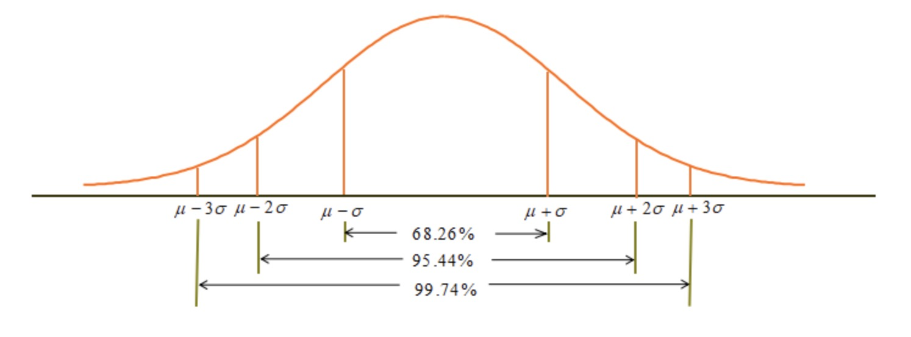
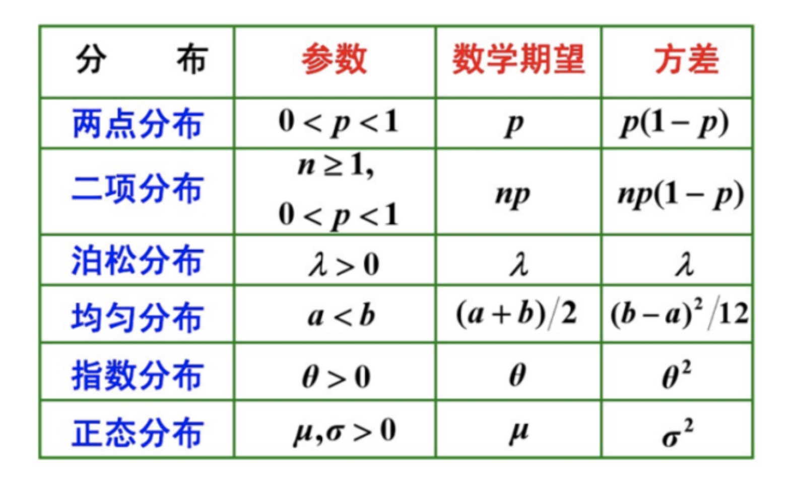

### 关于$3\sigma$法则

    
     
    
备注：图片托管于github，请确保网络的可访问性

     

- $3\sigma$法则：$3\sigma$之外的数据可认为异常数据

### 期望

- 期望(mean): 也就是均值, 是概率加权下的"平均值"，是每次可能结果的概率乘以其结果的总和, 反映的是随机变量平均取值大小, 常用符号$\mu$表示
- 连续型：$E(X) = \int_{-\infty}^{\infty} xf(x) dx$
- 离散型：$E(X) = \sum_i x_i p_i$

**计算期望**

- 每次数据为X,相关发生概率为P(x)，数据如下：
    * X: 2， 4， 6， 8， 10
    * P(x): 0.2, 0.2, 0.2, 0.2, 0.2
    * 则 $E(X) = \sum_i x_i p_i = 2*0.2 + 4*0.2 + 6*0.2 + 8*0.2 + 10*0.2 = 6$

**期望性质**

- 假设C为一个常数，X和Y是两个随机变量，那么期望有如下性质
    * E(C) = C
    * E(CX) = CE(X)
    * E(X+Y) = E(X) + E(Y)
    * 如果X和Y相互独立，那么E(XY) = E(X)E(Y)
    * 如果E(XY) = E(X)E(Y), 那么X和Y不相关

**例1**

- 甲乙两人赌博，假设两人获胜的概率相等，比赛规则是先胜三局者为赢家，可以获得100元的奖励。当比赛进行三局的时候，其中甲剩了2局，乙生了一句，这时候由于一些原因终止了比赛，请问如何分配这100元才比较公平?
- 分析
    * $P(甲) = P(乙) = \frac{1}{2}$
    * $P(甲赢) = P(赢4) + P(赢5，输4) = \frac{1}{2} + \frac{1}{2} * (1-\frac{1}{2}) = \frac{3}{4}$
    * $P(乙赢) = P(赢5, 赢4) = \frac{1}{2} * \frac{1}{2} = \frac{1}{4}$
    * $E(甲) = 100 * P(甲赢) = 100 * \frac{3}{4} = 75$
    * $E(乙) = 100 * P(乙赢) = 100 * \frac{1}{4} = 25$

**例2**

- 某城市有10万个家庭，没有孩子的家庭有1000个, 有一个孩子的有9万个，有两个孩子的家庭有6000个, 有三个孩子的家庭有3000个, 问次城市一个家庭平均有小孩多少个?
- 分析
    * X: 0, 1, 2, 3
    * P: 0.01, 0.9, 0.06, 0.03
    * $E(X) = \sum_{i=0}^3 x_i p(x_i) = 0 * 0.01 + 1 * 0.9 + 2 * 0.06 + 3 * 0.03 = 1.11$ 

**例3**

- 甲乙两人射击，他们的射击水平由下表给出
- X:甲击中的环数，Y：乙击中的环数
- 甲：
    * X: 8, 9, 10
    * P: 0.1, 0.3, 0.6
- 乙：
    * X: 8, 9, 10
    * P: 0.2, 0.5, 0.3
- 试问哪个人射击的水平较高?
- 分析
    * 甲乙的平均环数为：
        * $EX = 8*0.1 + 9*0.3 + 10*0.6 = 9.5$
        * $EY = 8*0.2 + 9*0.5 + 10*0.3 = 9.1$
    * 所以，从平均环数上看，甲的射击水平要比乙的好

### 方差

- 方差(variance)是衡量随机变量或一组数据时离散程度的度量，是用来度量随机变量和其数学期望之间的偏离程度。即方差是衡量数据源数据和期望均值相差的度量值。
- $Var(X) = D(X) = \sigma^2 = \frac{\sum (X - \mu)^2}{N}$
- $D(X) = \sum_{i=1}^n p_i · (x_i - u)^2$
- $D(X) = \int_a^b (x - \mu)^2 f(x) dx$
- $D(X) = E((X-E(x))^2) = E(X^2) - (E(X))^2$

**计算一组数据的方差**

- X: 2， 4， 6， 8， 10
- P(x): 0.2, 0.2, 0.2, 0.2
- 分析
    * $E(X) = 6$
    * $E(X^2) = 44$
    * $D(X) = E(X^2) - (E(X))^2 = 44 - 6^2 = 8$

**例1**

- 甲乙两人射击，他们的射击水平由下表给出：
- X: 甲击中的环数，Y: 乙击中的环数
- 甲
    * X: 8, 9, 10
    * P: 0.3, 0.2, 0.5
- 乙
    * X: 8, 9, 10
    * P: 0.2, 0.4, 0.4
- 试问哪个人的射击水平较高?
- 分析
    * 比较两个人的平均环数
    * 甲的平均环数：EX = 8*0.3 + 9*0.2 + 10*0.5 = 9.2
    * 乙的平均环数：EY = 8*0.2 + 9*0.4 + 10*0.4 = 9.2
    * 因此，从平均环数来看，甲乙两人的射击水平是一样的，但两人射击环数的方差分别为：
        * $DX = (8-9.2)^2 * 0.3 + (9-9.2)^2 * 0.2 + (10-9.2)^2 * 0.5 = 0.76$
        * $DY = (8-9.2)^2 * 0.2 + (9-9.2)^2 * 0.4 + (10-9.2)^2 * 0.4 = 0.624$
    * 由于DY < DX，表明乙的射击水平比甲稳定

**方差性质**

- 假设C为一个常数，X和Y两个随机变量，那么方差有以下性质
    * $D(C) = 0$
    * $D(CX) = C^2D(X)$
    * $D(C+X) = D(X)$
    * $D(X \pm Y) = D(X) + D(Y) \pm 2Cov(X,Y)$
    * 协方差$Cov(X,Y) = E\{ (X - E(X)) · (Y - E(Y)) \}$
    * 如果X和Y不相关, 那么$D(X\pmY) = D(X) + D(Y)$

**常见分布**

    
     
    
备注：图片托管于github，请确保网络的可访问性

     

