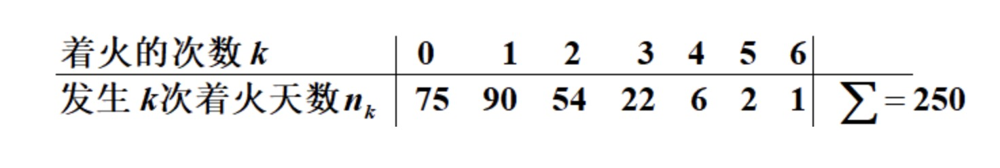

### 切比雪夫不等式(切比雪夫定理)

- 设随机变量X的期望为$\mu$, 方差为：$\sigma^2$, 对于任意的正数$\varepsilon$, 有
    * $P\{ |X - \mu| \geq \varepsilon \} \leq \frac{\sigma^2}{\varepsilon^2}$
- 切比雪夫不等式的含义：DX(方差)越小，时间$\{ X - \mu \} < \varepsilon$ 发生的概率就越大
    * 即：X取的值基本上集中在期望$\mu$附近

### 大数定律

- 设随机变量$X_1, X_2, ..., X_n$是一列相互独立的随机变量(或两两不相关)，并且分别存在期望$E(X_k)$和方差D(X_k), 对于任意小的正数$\varepsilon$, 有：
    * $\lim_{n \to \infty} P\{ |\frac{1}{n} \sum_{k=1}^n X_k - \frac{1}{n} \sum_{k=1}^n E(X_k)| < \varepsilon \} = 1$
- 当具有相同期望$\mu$和方差为$\sigma^2$的时候，对随机变量的均值：$Y_n = \frac{1}{n} \sum_{i=1}^n X_i$，则有
    * $\lim_{n \to \infty} P\{ |Y_n - \mu| < \varepsilon \} = 1$
- 大数定律的意义：随着样本容量n的增加，样本平均数将接近于总体平均数(期望$\mu$),所以在统计推断中，一般都会使用样本平均数估计总体平均数的值
    * 也就是我们互使用一部分样本的平均这来代替整体样本的期望/均值, 出现偏差的可能是存在的
    * 但当n足够大的时候，偏差的可能性是非常小的，当n无限大的时候，这种可能性的概率基本为0
- 大数定律的主要作用就是为使用频率来估计概率提供了理论支持

### 中心极限定理

- 中心极限定理的意义：设从均值为：$\mu$、方差为$\sigma^2$有限的任意一个总体中抽取样本量为n的样本，当n充分大时，样本均值的抽样分布近似服从均值为：$\mu/n$、方差为$\sigma^2/n$的正态分布
- 中心极限定理就是一般在同分布的情况下，抽样样本值的和在总体数量趋于无穷时的极限分布近似与正态分布。

### 参数估计

1 ) **点估计**

- 设总体X的分布函数$F(x;\theta)$的形式为已知，$\theta$是待估参数. $X_1, ..., X_n$是样本X的一个样本，$x_1, ..., x_n$是相应的样本值。
- 构造一个适当的统计量$\hat{\theta}(X_1, ..., X_n)$, 用它的观察值$\hat{\theta}(x_1, ..., x_n)$来估计未知参数$\theta$。我们称$\hat{\theta}(x_1, ..., x_n)$为$\theta$的估计值
- 这种对未知参数进行定值估计的问题就是点估计问题
- 注意：
    * 估计量与估计值有着本质的不同：估计量是统计量，因而它是随机变量(一维或多维)，而估计值则是一维或多维数组
    * 在不引起混淆的情况下，我们统称估计量与估计值为未知参数$\theta$的估计

2 ) **矩估计**

- 设X为连续型随机变量，其概率密度为：$f(x;\theta_1, ..., \theta_k)$, 其中$\theta_1, ..., \theta_k$是待估参数，$X_1, ..., X_n$为来自X的样本.
- 设$EX^l = \mu_l$ 存在，$l = 1,2,..,k$, 则$\mu_l = \mu_l(\theta_1, ..., \theta_k) \ \ \ l = 1,2,...,k.$
- 令 $A_l = \mu_l, l = 1,..,k$, 其中 $A_l = \frac{1}{n} \sum_{i=1}^n X_i^l$
- 这是包含k个未知参数$\theta_1, .., \theta_k$的联立方程组，$\left \{\begin{array}{cccc}A_1 = \mu_1(\theta_1, \theta_2, ..., \theta_k) \\A_2 = \mu_2(\theta_1, \theta_2, ..., \theta_k) \\\cdots \\A_k = \mu_k(\theta_1, \theta_2, ..., \theta_k)\end{array} \right.$, 从中解出方程组的解，记为：$\hat{\theta_1}, ..., \hat{\theta_k}$, 即：$\left \{\begin{array}{cccc}\hat{\theta}_1 = \hat{\theta}_1(X_1, X_2, \cdots, X_n) \\\hat{\theta}_2 = \hat{\theta}_2(X_1, X_2, \cdots, X_n) \\\cdots \\\hat{\theta}_k = \hat{\theta}_k(X_1, X_2, \cdots, X_n) \\\end{array} \right.$
- 用$\hat{\theta}_1, ..., \hat{\theta}_k$分别作为$\theta_1, ..., \theta_k$的估计量，这种求估计量的方法称为**矩估计法**
- 这种估计量称为**矩估计量**，矩估计量的观察值称为**矩估计值**

**矩法原理**

- 由辛钦大数定律知, $A_l = \frac{1}{n} \sum_{i=1}^n X_i^l \overset{P}{\to} \mu_l, l = 1,2,...,k.$
- 我们令 $A_l = \mu_l, l = 1, ..., k$ 用$A_l$估计$\mu_l$

**矩法求估计量的步骤**

- 求$\mu_1 = EX(\mu_2 EX^2)$
- 令$A_1 = \mu_1 (A_2 = \mu_2)$
- 解上式方程组，得
    * $\hat{\theta}_1 = \hat{\theta}_1 (X_1, ..., X_n)$
    * $\hat{\theta}_2 = \hat{\theta}_2 (X_1, ..., X_n)$

**例1**

- 设某炸药厂一天中发生着火现象的次数X服从参数为$\lambda$的柏松分布，$\lambda$未知，有以下样本值，试估计参数$\lambda$(用矩法)

    
     
    
备注：图片托管于github，请确保网络的可访问性

     

- 分析
    * $A_1 = \mu_1 = \frac{1}{n} \sum_{i=1}^n x_i = \frac{0*75 + 1*90 + ... + 6*1}{250} = 1.22$
    * $A_2 = \frac{1}{n} \sum_{i=1}^n x_i^2$ 这里用不到
    * $\mu_1 = \lambda = E(X)$ 柏松分布
    * $\hat{\lambda} = A_1 = 1.22$

**例2**

- 设总体$X \sim U[a,b]$, a,b未知，$X_1, ..., X_n$是一个样本，求：a,b的矩估计量
- 分析
    * $\mu_1 = EX = \frac{a+b}{2}$
    * $\mu_2 = EX^2 = DX + (EX)^2 = \frac{(b - a)^2}{12} + \frac{(a+b)^2}{4}$
    * 令$\frac{a+b}{2} = A_1$, 即：$a+b=2A_1$
    * $\frac{(b-a)^2}{12} + \frac{(a+b)^2}{4} = A_2$
    * $b - a = \sqrt{12(A_2 - A_1^2)}$
    * 即：$a + b = 2A_1, b - a = \sqrt{12(A_2 - A_1^2)}$
    * 解得
        * $\hat{a} = A_1 - \sqrt{3(A_2 - A_1^2)} = \bar{X} - \sqrt{\frac{3}{n} \sum_{i=1}^n (X_i - \bar{X})^2}$
        * $\hat{b} = A_1 + \sqrt{3(A_2 - A_1^2)} = \bar{X} + \sqrt{\frac{3}{n}} \sum_{i=1}^n(X_i - \bar{X})^2$
        * $A_2 - A_1^2 = \frac{1}{n} \sum_{i=1}^n X_i^2 - \bar{X}^2 = \frac{1}{n}(\sum_{i=1}^n X_i^2 - n \bar{X}^2) = \frac{1}{n} \sum_{i=1}^n(X_i - \bar{X})^2$

**例3**

- 设总体X的均值$\mu$, 方差$\sigma^2$都存在，且$\sigma^2 > 0$, 但$\mu, \sigma^2$未知，又设$X_1, ..., X_n$是一个样本，求$\mu, \sigma^2$的矩估计量
- 分析
    * $\mu_1 = EX = \mu$
    * $\mu_2 = EX^2 = DX + (EX)^2 = \sigma^2 + \mu^2$
    * 令 $\mu_1 = A_1, \mu_2 = A_2$
    * 即 $\mu = A_1, \sigma^2 + \mu^2 = A_2$
    * 所以，$\hat{\mu} = A_1 = \bar{X}, \hat{\sigma}^2 = A_2 - A_1^2 = \frac{1}{n} \sum_{i=1}^n X_i^2 - \bar{X}^2 = \frac{1}{n}\sum_{i=1}^n(X_i - \bar{X})^2$
    * 特别地，若$X \sim N(\mu, \sigma^2)$, $\mu, \sigma^2$未知，则$\hat{\mu} = \bar{X}, \hat{\sigma}^2 = \frac{1}{n} \sum_{i=1}^n (X_i - \bar{X})^2$

**例4**

- 设总体X服从参数为$\lambda$的指数分布，其中$\lambda > 0$未知，$X_1, X_2,...X_n$是从该总体中抽取的一个样本，试求参数$\lambda$的矩估计
- 分析
    * 总体X的密度函数为：$f(x) =\left \{\begin{array}{cccc}\lambda e^{-\lambda x}, & x > 0 \\0, & x \leq 0\end{array} \right.$
    * 所以，$EX = \int_{-\infty}^{+\infty} xf(x)dx = \int_0^{+\infty} x · \lambda e^{-\lambda x}dx = \frac{1}{\lambda}$
    * 令：$\bar{X} = \frac{1}{\lambda}$ 得参数$\lambda$的矩估计量为：$\hat{\lambda} = \frac{1}{\bar{X}}$

**例5**

- 设总体X的密度函数为：$f(x) =\left \{\begin{array}{cccc}(\alpha + 1) x^\alpha, & 0 < x < 1 \\0 & \text{其它}\end{array} \right.$
- 其中，$\alpha > 0$为未知参数，试求参数$\alpha$的矩估计
- 分析
    * $EX = \int_{-\infty}^{+\infty} xf(x)dx = \int_0^1 · (\alpha + 1) x^\alpha dx = \frac{\alpha + 1}{\alpha + 2}$
    * 令 $\bar{X} = \frac{\alpha + 1}{\alpha + 2}$
    * 由此得$\alpha$的矩估计量为：$\hat{\alpha} = \frac{2\bar{X} - 1}{1 - \bar{X}}$

**例6**

- 设总体X服从$\Gamma -$分布, 其密度函数为：$f(x) =\left (\begin{array}{cccc}\frac{\beta^\alpha}{\Gamma(\alpha)} x^{\alpha - 1} e^{-\beta x} & x > 0 \\0 & x \leq 0\end{array} \right.$, 其中，$\alpha > 0, \beta > 0$ 为未知数，试求参数$\alpha$与$\beta$的矩估计
- 分析
    * $EX = \int_{-\infty}^{+\infty} x f(x) dx = \int_0^{+\infty} x · \frac{\beta^\alpha}{\Gamma(\alpha)} x^{\alpha - 1} e^{-\beta x} dx$
    * $= \frac{\Gamma(\alpha + 1)}{\beta \Gamma(\alpha)} \int_0^{+\infty} \frac{\beta^{\alpha + 1}}{\Gamma (\alpha + 1)} x^{(\alpha + 1)-1} e^{-\beta x} dx$
    * $= \frac{\Gamma(\alpha + 1)}{\beta \Gamma(\alpha)} = \frac{\alpha \Gamma(\alpha)}{\beta \Gamma(\alpha)} = \frac{\alpha}{\beta}$
    * $EX^2 = \int_{-\infty}^{+\infty} x^2 f(x) dx = \int_0^{+\infty} x^2 · \frac{\beta^\alpha}{\Gamma(\alpha)} x^{\alpha - 1} e^{-\beta x} dx$
    * $= \frac{\Gamma(\alpha + 2)}{\beta^2 \Gamma(\alpha)} \int_0^{+\infty} \frac{\beta^{\alpha + 2}}{\Gamma(\alpha + 2)} x^{(\alpha + 2) - 1} e^{-\beta x}dx$
    * $= \frac{\Gamma(\alpha + 2)}{\beta^2 \Gamma(\alpha)} = \frac{\alpha(\alpha+1)\Gamma(\alpha)}{\beta^2 \Gamma(\alpha)} = \frac{\alpha(\alpha+1)}{\beta^2}$
    * 因此有：$\left \{\begin{array}{cccc}EX = \frac{\alpha}{\beta} \\EX^2 = \frac{\alpha(\alpha+1)}{\beta^2}\end{array} \right.$ 
    * 令：$\left \{ \begin{array}{cccc} A_1 = \frac{\alpha}{\beta} \\ A_2 = \frac{\alpha(\alpha+1)}{\beta^2} \end{array}  \right.$
    * 解此方程组，得
    * $\left \{\begin{array}{cccc}\hat{\alpha} = \frac{A_1^2}{A_2 - A_1^2} \\\hat{\beta} = \frac{A_1}{A_2 - A_1^2}\end{array} \right.$ 即：$\left \{\begin{array}{cccc}\hat{\alpha} = \frac{\bar{X}^2}{B_2} \\\hat{\beta} = \frac{\bar{X}}{B_2}\end{array} \right.$
    * 其中，$B_2 = \frac{1}{n} \sum_{i=1}^n(X_i - \bar{X})^2$为样本的二阶中心矩