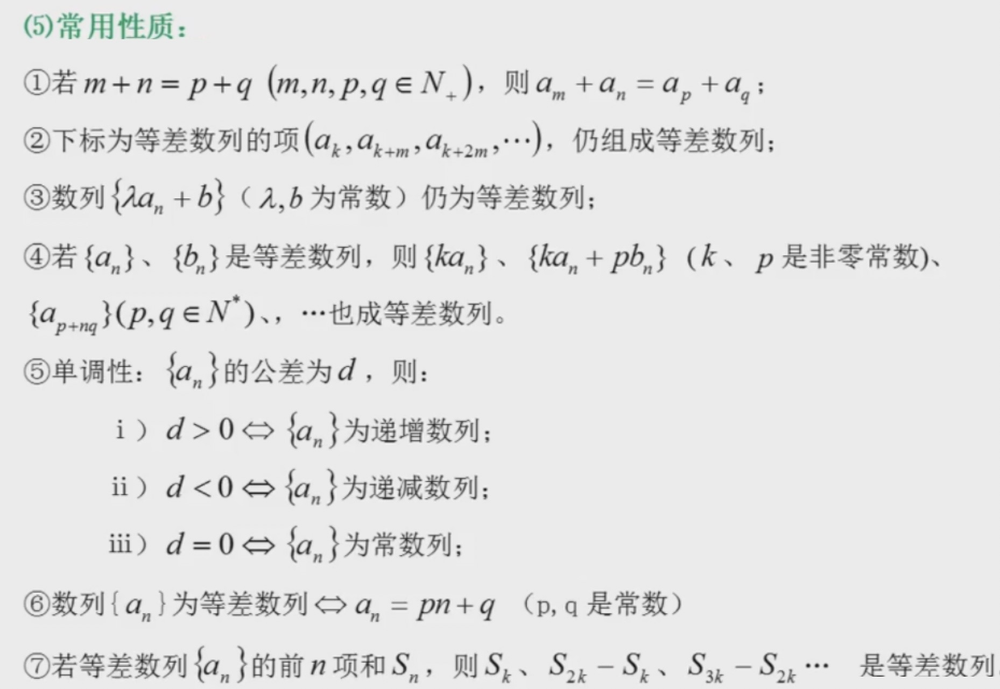
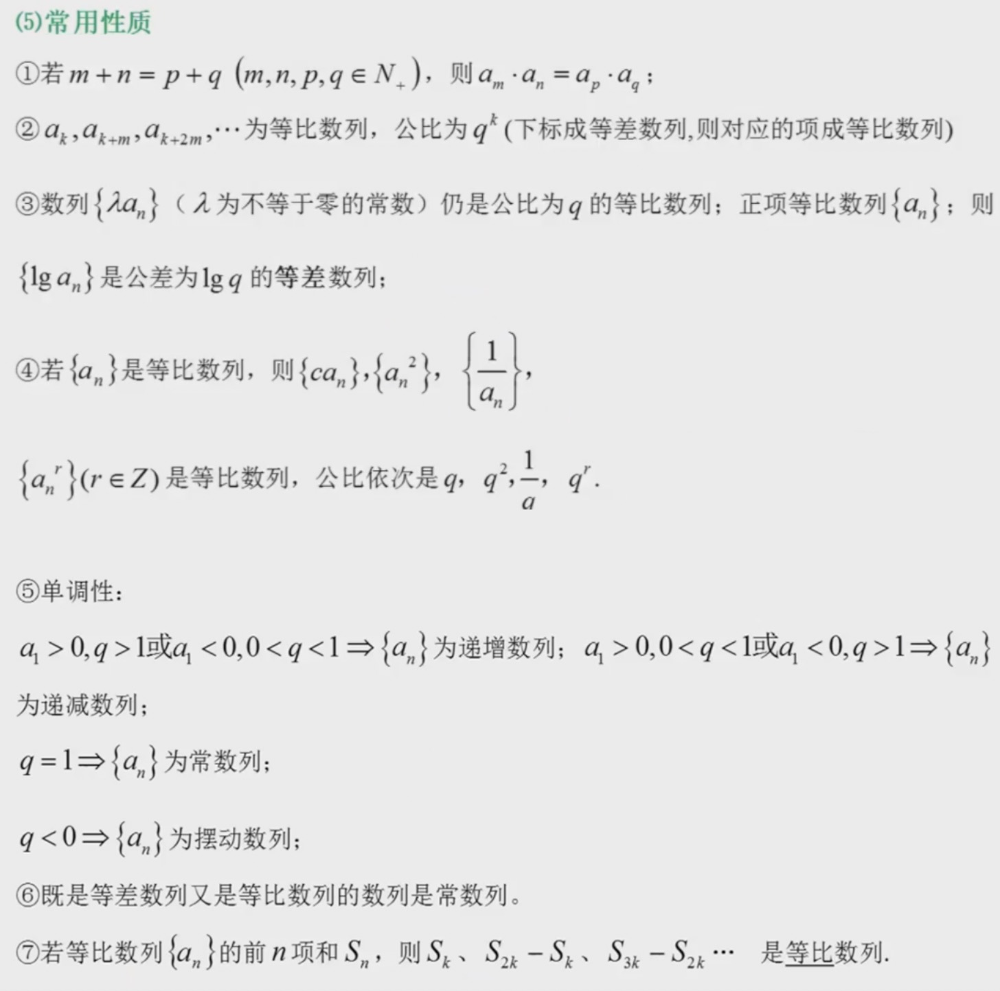
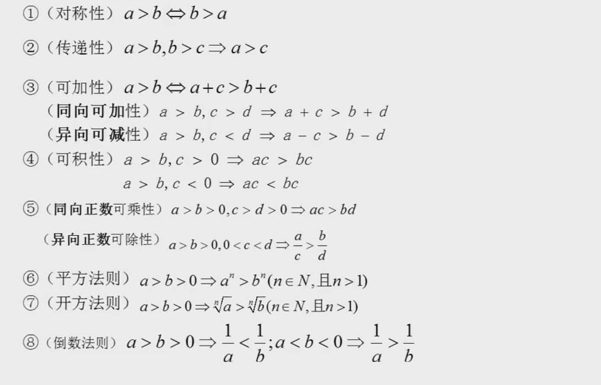
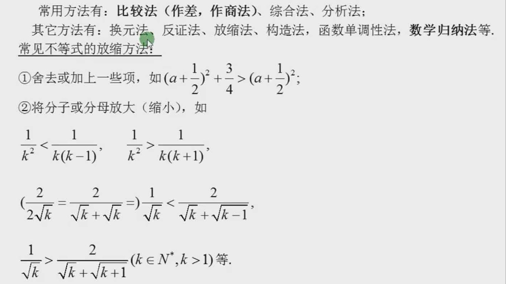

### 数列

1 ) **等差数列**

**概念**

- 等差数列是指从第二项起，每一项与它的前一项的差等于同一个常数的一种数列。这个常数叫做等差数列的公差，公差常用字母d表示。

**公式**

- 通项公式：$a_n = a_1 + (n - 1)d$， 变形：$a_n = a_m + (n-m)d$
- 前n项和公式：$S_n = na_1 + \frac{n(n-1)}{2}d = na_1 + \frac{n(n-1)}{2}\frac{a_n - a_1}{n - 1} = \frac{n(a_1 + a_n)}{2}$, $n \in N^+$

**性质**

    
     
    
备注：图片托管于github，请确保网络的可访问性

     

2 ) **等比数列**

**概念**

等比数列是指从第二项起，每一项与它的前一项的比值等于同一个常数的一种数列。这个常数叫做等比数列的公比，公比通常用字母q表示(q≠0)，等比数列a1≠ 0。其中{an}中的每一项均不为0。注：q=1 时，an为常数列。

**公式**

- 通项公式：$a_n = a_1 * q^{n-1}$
- 前n项和公式：$S_n = \frac{a_1(1 - q^n)}{1 - q} = \frac{a_1 - a_1q^n}{1 - q} = \frac{a_1 - qa_n}{1 - q}$

**性质**

    
     
    
备注：图片托管于github，请确保网络的可访问性

     

### 不等关系与不等式

**不等式的基本性质**

    
     
    
备注：图片托管于github，请确保网络的可访问性

     

**不等式证明的几种常用方法**

    
     
    
备注：图片托管于github，请确保网络的可访问性

     

